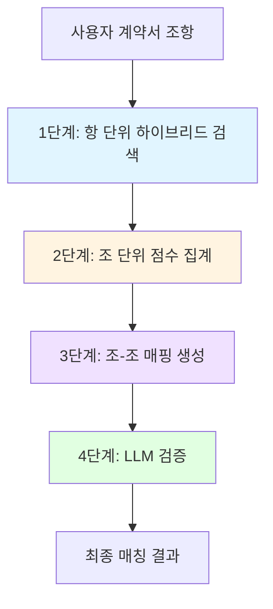
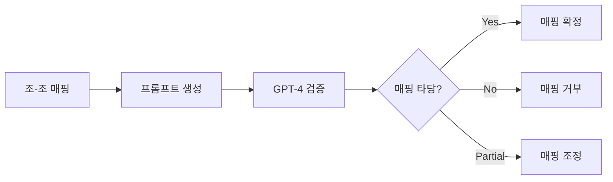
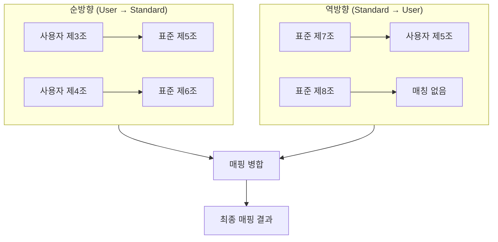

# A1 Node 하이브리드 검색 아키텍처

## 개요

A1 Node의 핵심 기능인 **하이브리드 검색 기반 조항 매칭** 시스템의 상세 아키텍처입니다.

사용자 계약서의 각 조항을 표준계약서의 조항과 매칭하기 위해, **항(item) 단위로 검색**하고 **조(article) 단위로 집계**하는 2단계 프로세스를 사용합니다.

---

## 전체 플로우



---

## 1단계: 항 단위 하이브리드 검색

### 목적
사용자 계약서의 각 항(item)에 대해 표준계약서에서 의미적으로 가장 유사한 항들을 찾습니다.

### 검색 방식

#### Semantic Search (FAISS)
- **입력**: 사용자 항의 텍스트 임베딩
- **검색 대상**: 표준계약서 항 임베딩 벡터
- **출력**: Top-K 유사 항 (코사인 유사도 점수)

#### Keyword Search (Whoosh)
- **입력**: 사용자 항의 키워드 (형태소 분석)
- **검색 대상**: 표준계약서 항 텍스트 인덱스
- **출력**: Top-K 관련 항 (BM25 점수)

### 점수 결합

```
최종 항 점수 = α × Semantic_Score + (1-α) × Keyword_Score
```

- **α (알파)**: 0.7 (기본값, 의미 검색 가중치)
- **결과**: 각 사용자 항마다 Top-5 표준 항 리스트

### 예시

```
사용자 계약서 제3조 제1항:
"개인정보처리자는 개인정보를 수집하는 경우 그 목적에 필요한 최소한의 개인정보를 수집하여야 한다."

↓ 하이브리드 검색 결과

표준계약서 매칭 항:
1. 제5조 제2항 (점수: 0.89) - "개인정보 최소 수집 원칙"
2. 제5조 제1항 (점수: 0.82) - "개인정보 수집 목적 명시"
3. 제3조 제3항 (점수: 0.76) - "필요 최소한 정보 수집"
4. 제6조 제1항 (점수: 0.71) - "수집 항목 제한"
5. 제5조 제4항 (점수: 0.68) - "과도한 수집 금지"
```

---

## 2단계: 조 단위 점수 집계

### 목적
항 단위 검색 결과를 조(article) 단위로 그룹화하여, 어느 조가 전체적으로 가장 유사한지 판단합니다.

### 집계 방식

#### 조별 점수 합산
각 표준계약서 조에 대해, 해당 조에 속한 항들의 점수를 합산합니다.

```python
# 의사코드
article_scores = {}

for user_item in user_article.items:
    for matched_std_item in user_item.top_matches:
        std_article_id = matched_std_item.article_id
        article_scores[std_article_id] += matched_std_item.score

# 정규화
for article_id in article_scores:
    article_scores[article_id] /= len(user_article.items)
```

#### 정규화
- 사용자 조의 항 개수로 나누어 평균 점수 계산
- 항이 많은 조가 유리하지 않도록 보정

### 예시

```
사용자 계약서 제3조 (3개 항)

항 단위 검색 결과:
- 제1항 → 표준 제5조 항들 (점수: 0.89, 0.82, 0.76)
- 제2항 → 표준 제5조 항들 (점수: 0.85, 0.79)
- 제3항 → 표준 제6조 항들 (점수: 0.91, 0.88)

↓ 조 단위 집계

표준계약서 조별 점수:
- 제5조: (0.89 + 0.82 + 0.76 + 0.85 + 0.79) / 3 = 1.37
- 제6조: (0.91 + 0.88) / 3 = 0.60
- 제3조: (0.76) / 3 = 0.25

최종 순위:
1. 제5조 (점수: 1.37) ← 최고 매칭
2. 제6조 (점수: 0.60)
3. 제3조 (점수: 0.25)
```

---

## 3단계: 조-조 매핑 생성

### 목적
사용자 계약서의 각 조를 표준계약서의 조와 1:1 매핑합니다.

### 매핑 규칙

#### 기본 매핑
- 각 사용자 조는 점수가 가장 높은 표준 조와 매핑
- 임계값 이상의 점수를 가진 경우만 매핑 (예: 0.5 이상)

#### 충돌 해결
여러 사용자 조가 동일한 표준 조에 매핑되는 경우:
1. 점수가 더 높은 매핑 우선
2. 나머지는 차순위 표준 조와 매핑
3. 또는 "복합 매핑"으로 표시

### 매핑 결과 구조

```json
{
  "mappings": [
    {
      "user_article_id": "제3조",
      "user_article_title": "개인정보의 수집",
      "matched_std_article_id": "제5조",
      "matched_std_article_title": "개인정보의 수집 및 이용",
      "confidence_score": 0.87,
      "matching_items": [
        {
          "user_item_id": "제3조 제1항",
          "matched_std_item_id": "제5조 제2항",
          "item_score": 0.89
        },
        {
          "user_item_id": "제3조 제2항",
          "matched_std_item_id": "제5조 제1항",
          "item_score": 0.85
        }
      ]
    }
  ]
}
```

---

## 4단계: LLM 검증

### 목적
하이브리드 검색으로 생성된 매핑이 실제로 의미적으로 타당한지 LLM으로 최종 검증합니다.

### 검증 프로세스



### 프롬프트 구조

```
당신은 계약서 조항 매칭 전문가입니다.

사용자 계약서 조항:
제3조 (개인정보의 수집)
제1항: 개인정보처리자는 개인정보를 수집하는 경우...
제2항: 수집하는 개인정보의 항목은...

표준계약서 매칭 후보:
제5조 (개인정보의 수집 및 이용)
제1항: 개인정보처리자는 다음의 목적으로...
제2항: 최소한의 개인정보만 수집한다...

질문: 위 두 조항이 동일한 내용을 다루고 있습니까?
답변 형식: {"is_match": true/false, "confidence": 0.0-1.0, "reason": "..."}
```

### 검증 결과 활용

- **is_match = true, confidence ≥ 0.8**: 매핑 확정
- **is_match = true, confidence < 0.8**: 낮은 신뢰도로 매핑 (사용자 검토 필요)
- **is_match = false**: 매핑 거부, 차순위 후보로 재검증

---

## 양방향 검색 (Bidirectional Search)

### 개념
사용자 → 표준 방향뿐만 아니라, 표준 → 사용자 방향으로도 검색하여 누락된 매핑을 찾습니다.

### 프로세스



### 역방향 검색의 목적

1. **누락 방지**: 사용자 계약서에 없는 표준 조항 발견
2. **완전성 검증**: 표준계약서의 필수 조항이 모두 커버되는지 확인
3. **A2 Node 트리거**: 누락된 필수 조항은 체크리스트 검증으로 전달

### 병합 규칙

- 순방향과 역방향 매핑이 일치하면 신뢰도 증가
- 역방향에서만 발견된 매핑은 낮은 신뢰도로 표시
- 양방향 모두 매칭 없는 표준 조항은 "누락"으로 분류

---

## 성능 최적화

### 인덱스 캐싱
- FAISS 인덱스: 메모리에 로드 (약 500MB)
- Whoosh 인덱스: 디스크 기반, 필요시 로드

### 배치 처리
- 사용자 계약서의 모든 항을 한 번에 임베딩
- FAISS 배치 검색으로 처리 시간 단축

### 병렬 처리
- 여러 사용자 조를 병렬로 처리
- LLM 검증은 순차 처리 (API 제한)

---

## 예시: 전체 플로우

### 입력
```
사용자 계약서:
- 제3조 (개인정보의 수집) - 3개 항
- 제4조 (개인정보의 이용) - 2개 항
- 제5조 (개인정보의 제공) - 4개 항
```

### 1단계: 항 단위 검색
```
제3조 제1항 → 표준 제5조 제2항 (0.89), 제5조 제1항 (0.82), ...
제3조 제2항 → 표준 제5조 제1항 (0.85), 제5조 제3항 (0.79), ...
제3조 제3항 → 표준 제6조 제1항 (0.91), 제6조 제2항 (0.88), ...
...
```

### 2단계: 조 단위 집계
```
사용자 제3조:
  - 표준 제5조: 1.37점
  - 표준 제6조: 0.60점
  
사용자 제4조:
  - 표준 제6조: 1.52점
  - 표준 제7조: 0.45점
```

### 3단계: 매핑 생성
```
사용자 제3조 → 표준 제5조 (신뢰도: 0.87)
사용자 제4조 → 표준 제6조 (신뢰도: 0.91)
사용자 제5조 → 표준 제7조 (신뢰도: 0.78)
```

### 4단계: LLM 검증
```
제3조 → 제5조: ✓ 확정 (LLM 신뢰도: 0.92)
제4조 → 제6조: ✓ 확정 (LLM 신뢰도: 0.88)
제5조 → 제7조: ⚠ 낮은 신뢰도 (LLM 신뢰도: 0.65)
```

### 최종 출력
```json
{
  "article_mappings": [
    {
      "user_article": "제3조",
      "std_article": "제5조",
      "confidence": 0.87,
      "llm_verified": true,
      "status": "confirmed"
    },
    {
      "user_article": "제4조",
      "std_article": "제6조",
      "confidence": 0.91,
      "llm_verified": true,
      "status": "confirmed"
    },
    {
      "user_article": "제5조",
      "std_article": "제7조",
      "confidence": 0.78,
      "llm_verified": false,
      "status": "needs_review"
    }
  ],
  "unmapped_std_articles": ["제8조", "제9조"],
  "trigger_a2": true
}
```

---

## 핵심 특징

### 1. 세밀한 매칭
- 항 단위 검색으로 조 내부의 세부 내용까지 비교
- 단순 조 제목 비교보다 정확도 높음

### 2. 유연한 구조 대응
- 사용자 계약서와 표준계약서의 조 구조가 달라도 매칭 가능
- 예: 사용자 1개 조 = 표준 2개 조 분산

### 3. 신뢰도 기반 판단
- 점수 기반으로 매칭 품질 평가
- 낮은 신뢰도는 사용자 검토 요청

### 4. 완전성 보장
- 양방향 검색으로 누락 방지
- 표준계약서의 필수 조항 커버리지 확인

---

## 다음 단계 연계

### A2 Node 트리거
- 매핑되지 않은 표준 조항 → 체크리스트 검증
- 필수 조항 누락 여부 확인

### A3 Node 트리거
- 매핑된 조항 쌍 → 내용 상세 비교
- 의미적 차이 및 규정 준수 검증

---

## 기술 스택

- **FAISS**: 벡터 유사도 검색
- **Whoosh**: 키워드 기반 검색
- **Azure OpenAI**: 임베딩 생성 및 LLM 검증
- **Python**: 점수 집계 및 매핑 로직
