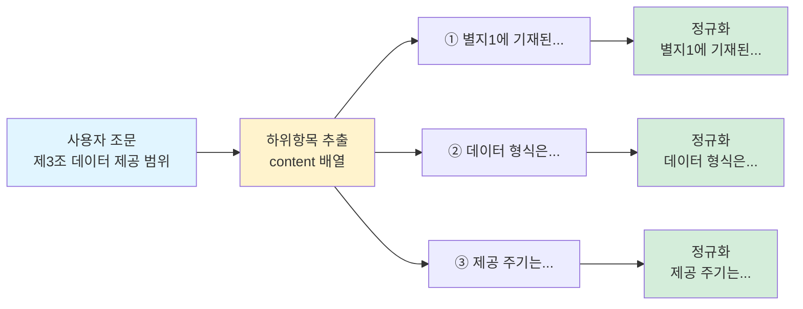
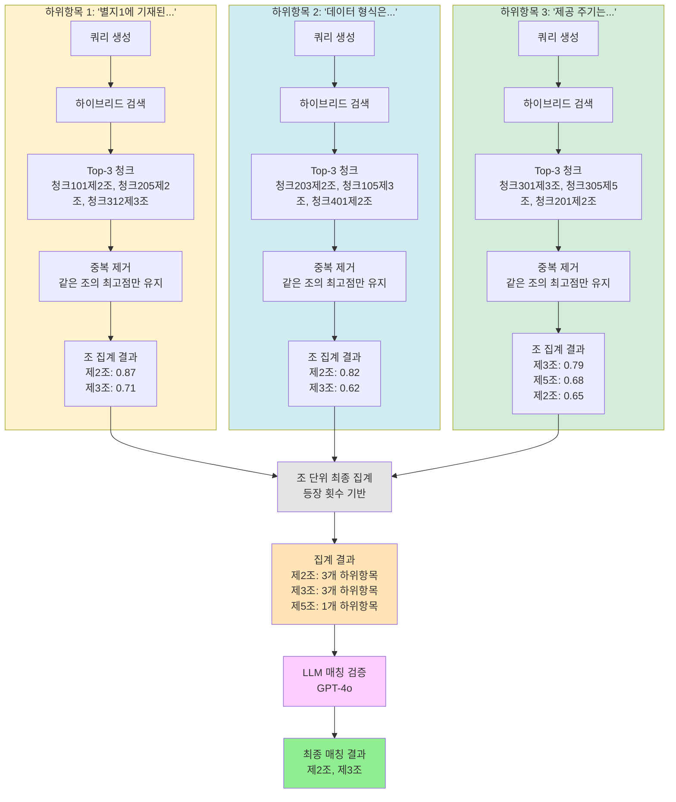
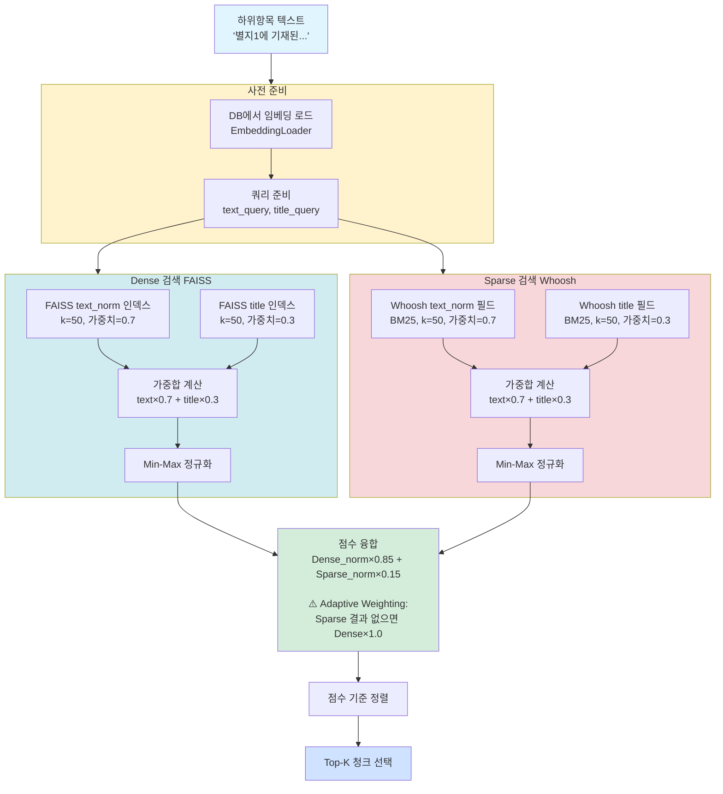
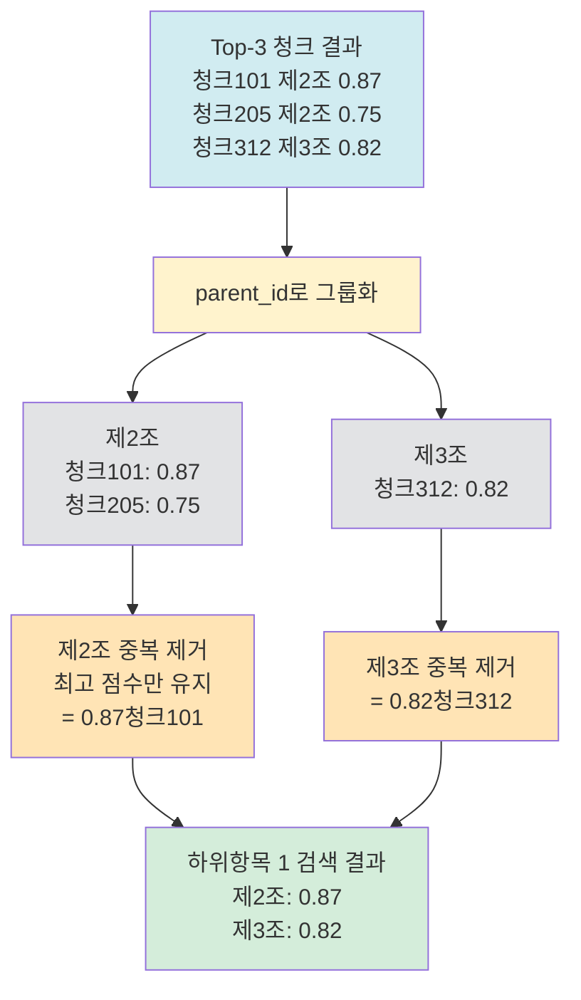
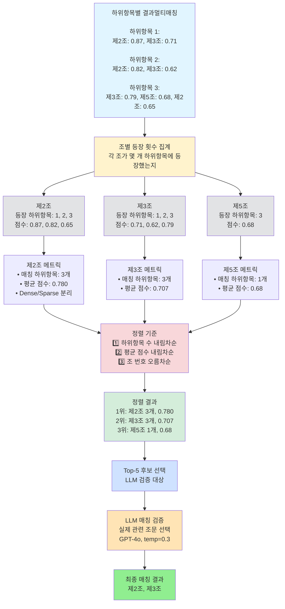
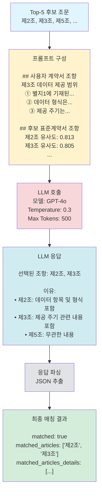

# A1 노드: 하이브리드 검색 및 매칭 플로우

## 개요

이 문서는 A1 노드(완전성 검증)에서 사용하는 **하위항목 기반 하이브리드 검색 및 매칭 로직**의 상세 흐름을 설명합니다.

핵심 포인트:
- **쿼리 단위**: 사용자 계약서 조문의 **하위항목(sub-item)** 각각
- **인덱스 구성**: 표준계약서 조문의 **하위항목을 청크(chunk) 단위**로 인덱싱
- **하이브리드 검색**: **FAISS(Dense) + Whoosh(Sparse)** 가중합
- **멀티필드**: **title**과 **text_norm** 필드에 대한 가중합
- **집계 전략**: 청크 단위 결과를 **부모 조(parent) 단위**로 집계
- **LLM 검증**: 검색 결과를 LLM으로 최종 검증

---

## 전체 플로우 다이어그램

```mermaid
graph TB
    Start([사용자 계약서 조문])

    subgraph PrepareQuery["1️⃣ 쿼리 준비 단계"]
        ExtractSubItems[하위항목 추출<br/>content 배열]
        NormalizeText[각 하위항목 정규화<br/>번호 제거 ①, 1., 가 등]
        ExtractSubItems --> NormalizeText
    end

    subgraph MultiVectorSearch["2️⃣ 멀티벡터 검색<br/>(각 하위항목별)"]
        direction TB
        SubItem1[하위항목 1]
        SubItem2[하위항목 2]
        SubItem3[하위항목 n]

        SubItem1 --> HybridSearch1[하이브리드 검색]
        SubItem2 --> HybridSearch2[하이브리드 검색]
        SubItem3 --> HybridSearch3[하이브리드 검색]

        HybridSearch1 --> ChunkResults1[Top-K 청크]
        HybridSearch2 --> ChunkResults2[Top-K 청크]
        HybridSearch3 --> ChunkResults3[Top-K 청크]
    end

    subgraph HybridSearchDetail["3️⃣ 하이브리드 검색 상세<br/>(각 하위항목마다 실행)"]
        direction TB

        PrepareEmbedding[임베딩 로드<br/>DB에서 사전 생성된 임베딩]

        subgraph DenseSearch["Dense 검색 FAISS 0.85"]
            TextIndex[text_norm 인덱스 검색<br/>Top-50<br/>가중치: 0.7]
            TitleIndex[title 인덱스 검색<br/>Top-50<br/>가중치: 0.3]
            TextIndex --> DenseScore[Dense Score<br/>= text×0.7 + title×0.3]
            TitleIndex --> DenseScore
        end

        subgraph SparseSearch["Sparse 검색 Whoosh 0.15"]
            TextBM25[text_norm 필드 BM25<br/>Top-50<br/>가중치: 0.7]
            TitleBM25[title 필드 BM25<br/>Top-50<br/>가중치: 0.3]
            TextBM25 --> SparseScore[Sparse Score<br/>= text×0.7 + title×0.3]
            TitleBM25 --> SparseScore
        end

        PrepareEmbedding --> DenseSearch
        PrepareEmbedding --> SparseSearch

        DenseScore --> Normalize[Min-Max 정규화]
        SparseScore --> Normalize

        Normalize --> FinalScore[최종 점수 융합<br/>Dense×0.85 + Sparse×0.15<br/>Adaptive Weighting]
        FinalScore --> TopKChunks[Top-K 청크 반환]
    end

    subgraph ChunkToArticle["4️⃣ 청크→조 집계<br/>(각 하위항목별)"]
        direction TB
        GroupByParent[parent_id로 그룹화]
        SelectBest[각 조의 최고 점수만 유지<br/>중복 제거]
        ReturnAll[모든 조 반환<br/>최대 K개]
        GroupByParent --> SelectBest
        SelectBest --> ReturnAll
    end

    subgraph AggregateResults["5️⃣ 조 단위 최종 집계"]
        direction TB
        MergeArticles[조별 등장 횟수 집계<br/>각 조가 몇 개 하위항목에 등장했는지]
        CalcMetrics[조별 메트릭 계산<br/>• 평균 점수<br/>• 매칭 하위항목 수<br/>• Dense/Sparse 점수]
        SortArticles[정렬<br/>1 하위항목 수 내림차순<br/>2 평균 점수 내림차순<br/>3 조 번호 오름차순]
        SelectTop5[Top-5 후보 선택]

        MergeArticles --> CalcMetrics
        CalcMetrics --> SortArticles
        SortArticles --> SelectTop5
    end

    subgraph LLMVerification["6️⃣ LLM 매칭 검증"]
        direction TB
        PreparePrompt[프롬프트 구성<br/>사용자 조문 + Top-5 후보]
        LLMCall[LLM 호출<br/>GPT-4o, temp=0.3]
        ParseResult[응답 파싱<br/>실제 매칭된 조문 선택]

        PreparePrompt --> LLMCall
        LLMCall --> ParseResult
    end

    FinalOutput([최종 매칭 결과<br/>matched_articles])

    Start --> PrepareQuery
    PrepareQuery --> MultiVectorSearch
    MultiVectorSearch --> HybridSearchDetail
    HybridSearchDetail --> ChunkToArticle
    ChunkToArticle --> AggregateResults
    AggregateResults --> LLMVerification
    LLMVerification --> FinalOutput

    style Start fill:#e1f5ff
    style FinalOutput fill:#d4edda
    style PrepareQuery fill:#fff3cd
    style MultiVectorSearch fill:#f8d7da
    style HybridSearchDetail fill:#d1ecf1
    style ChunkToArticle fill:#d4edda
    style AggregateResults fill:#e2e3e5
    style LLMVerification fill:#cfe2ff
```



---

## 상세 단계별 설명

### 1️⃣ 쿼리 준비 단계

사용자 계약서 조문에서 하위항목을 추출하고 정규화합니다.



**정규화 작업**:
- 하위항목 앞의 번호 제거: `①`, `1.`, `(가)`, `가.` 등
- 순수 텍스트 내용만 추출

---

### 2️⃣ 멀티벡터 검색 (각 하위항목별)

각 하위항목을 독립적인 쿼리로 하이브리드 검색을 수행합니다.



**핵심**:
- **n개의 하위항목** → **n번의 독립적인 검색**
- 각 검색마다 **Top-K 청크** → 조별 중복 제거 → **최대 K개 조** 반환
- 하나의 하위항목이 여러 조에 매칭될 수 있음 (멀티매칭)

---

### 3️⃣ 하이브리드 검색 상세

각 하위항목마다 실행되는 하이브리드 검색의 내부 구조입니다.



**가중치 구조**:

```
최종 점수 = Dense_norm × 0.85 + Sparse_norm × 0.15

Dense Score = FAISS_text × 0.7 + FAISS_title × 0.3
Sparse Score = Whoosh_text × 0.7 + Whoosh_title × 0.3

FAISS 유사도 = 1 / (1 + L2_distance)
```

**인덱스 구성**:
- **표준계약서 조문의 하위항목**이 **청크(chunk) 단위**로 인덱싱됨
- 각 청크는 `parent_id`로 부모 조문(제N조) 정보를 가짐
- 예: 제2조의 하위항목 3개 → 3개 청크

---

### 4️⃣ 청크→조 집계 (각 하위항목별)

하이브리드 검색으로 얻은 Top-K 청크를 조(article) 단위로 중복 제거합니다.



**전략**:
- 같은 조의 여러 청크 중 **최고 점수(max)만 유지** (중복 제거)
- 이유: 가장 유사한 청크가 해당 조의 관련성을 대표
- **모든 조를 반환** (최대 K개)

---

### 5️⃣ 조 단위 최종 집계

모든 하위항목의 검색 결과를 조 단위로 통합하고 정렬합니다. (멀티매칭 방식)



**정렬 로직 상세**:

```python
정렬 우선순위:
1. 매칭 하위항목 개수 (많을수록 좋음)
   → 여러 하위항목이 같은 조를 선택 = 강한 매칭 신호

2. 평균 점수 (높을수록 좋음)
   → 매칭 하위항목 수가 같으면 점수로 비교

3. 조 번호 (낮을수록 우선)
   → 동점이면 앞선 조 우선
```

**예시 (멀티매칭)**:
- 사용자 조문: 3개 하위항목
- 하위항목 1: 제2조(0.87), 제3조(0.71) 매칭
- 하위항목 2: 제2조(0.82), 제3조(0.62) 매칭
- 하위항목 3: 제3조(0.79), 제5조(0.68), 제2조(0.65) 매칭
- 집계 결과:
  - 제2조: 3개 하위항목에 등장 (평균 0.780)
  - 제3조: 3개 하위항목에 등장 (평균 0.707)
  - 제5조: 1개 하위항목에 등장 (평균 0.68)
- → 제2조가 1위 (하위항목 개수 동일, 평균 점수 우선)

---

### 6️⃣ LLM 매칭 검증

검색 결과를 LLM으로 최종 검증하여 실제 관련있는 조문만 선택합니다.



**LLM 역할**:
- 검색 엔진의 유사도 점수만으로는 부족한 **의미론적 관련성 판단**
- 여러 후보 중 **실제로 관련있는 조문만 선택**
- **여러 개 선택 가능** (1:N 매칭 지원)

---

## 실질적 포인트: 데이터 흐름 예시

### 입력 데이터

**사용자 계약서 조문**:
```json
{
  "number": 3,
  "title": "데이터 제공 범위",
  "content": [
    "① 별지1에 기재된 데이터 항목을 제공한다",
    "② 데이터 형식은 JSON 또는 CSV로 한다",
    "③ 제공 주기는 월 1회로 하되, 필요시 협의하여 변경할 수 있다"
  ]
}
```

**표준계약서 인덱스 구성** (하위항목이 청크 단위):
```
제2조 (데이터 제공 범위 및 방식)
├─ 청크 201: "갑은 별지에 기재된 데이터 항목을 제공한다" (parent_id: 제2조)
├─ 청크 202: "데이터 형식은 JSON, XML, CSV 중 선택" (parent_id: 제2조)
└─ 청크 203: "데이터 품질은 별도 기준에 따른다" (parent_id: 제2조)

제3조 (데이터 제공 주기)
├─ 청크 301: "데이터 제공 주기는 월 1회로 한다" (parent_id: 제3조)
└─ 청크 302: "주기 변경은 서면 합의로 한다" (parent_id: 제3조)

제5조 (데이터 보안)
├─ 청크 501: "데이터 암호화는 AES-256 사용" (parent_id: 제5조)
└─ 청크 502: "전송은 TLS 1.3 이상 사용" (parent_id: 제5조)
```

---

### 단계별 처리 과정

#### 1단계: 하위항목별 검색

**하위항목 1**: "별지1에 기재된 데이터 항목을 제공한다"

```
하이브리드 검색 결과 (Top-3 청크):
1. 청크 201 (제2조): 0.89 (Dense: 0.92, Sparse: 0.75)
2. 청크 301 (제3조): 0.71 (Dense: 0.73, Sparse: 0.62)
3. 청크 202 (제2조): 0.68 (Dense: 0.70, Sparse: 0.60)

parent_id로 그룹화 및 중복 제거:
- 제2조: [0.89, 0.68] → max = 0.89 (청크 201만 유지)
- 제3조: [0.71] → 0.71 (청크 301 유지)

하위항목 1 결과 (멀티매칭):
- 제2조: 0.89 ✓
- 제3조: 0.71 ✓
```

**하위항목 2**: "데이터 형식은 JSON 또는 CSV로 한다"

```
하이브리드 검색 결과 (Top-3 청크):
1. 청크 202 (제2조): 0.82 (Dense: 0.85, Sparse: 0.70)
2. 청크 301 (제3조): 0.62 (Dense: 0.65, Sparse: 0.51)
3. 청크 201 (제2조): 0.61 (Dense: 0.64, Sparse: 0.50)

parent_id로 그룹화 및 중복 제거:
- 제2조: [0.82, 0.61] → max = 0.82 (청크 202만 유지)
- 제3조: [0.62] → 0.62 (청크 301 유지)

하위항목 2 결과 (멀티매칭):
- 제2조: 0.82 ✓
- 제3조: 0.62 ✓
```

**하위항목 3**: "제공 주기는 월 1회로 하되, 필요시 협의하여 변경할 수 있다"

```
하이브리드 검색 결과 (Top-3 청크):
1. 청크 301 (제3조): 0.79 (Dense: 0.82, Sparse: 0.68)
2. 청크 501 (제5조): 0.68 (Dense: 0.71, Sparse: 0.57)
3. 청크 201 (제2조): 0.65 (Dense: 0.68, Sparse: 0.54)

parent_id로 그룹화 및 중복 제거:
- 제3조: [0.79] → 0.79 (청크 301 유지)
- 제5조: [0.68] → 0.68 (청크 501 유지)
- 제2조: [0.65] → 0.65 (청크 201 유지)

하위항목 3 결과 (멀티매칭):
- 제3조: 0.79 ✓
- 제5조: 0.68 ✓
- 제2조: 0.65 ✓
```

---

#### 2단계: 조 단위 최종 집계 (멀티매칭)

```
하위항목별 결과 통합:

제2조:
  - 하위항목 1: 0.89
  - 하위항목 2: 0.82
  - 하위항목 3: 0.65
  → 등장 하위항목: 3개
  → 평균 점수: (0.89 + 0.82 + 0.65) / 3 = 0.787

제3조:
  - 하위항목 1: 0.71
  - 하위항목 2: 0.62
  - 하위항목 3: 0.79
  → 등장 하위항목: 3개
  → 평균 점수: (0.71 + 0.62 + 0.79) / 3 = 0.707

제5조:
  - 하위항목 3: 0.68
  → 등장 하위항목: 1개
  → 평균 점수: 0.68

정렬 (하위항목 수로 1차, 평균 점수로 2차):
1위: 제2조 (3개, 0.787) ✓
2위: 제3조 (3개, 0.707) ✓
3위: 제5조 (1개, 0.68)
```

---

#### 3단계: LLM 검증

**프롬프트**:
```
## 사용자 계약서 조항
제3조 (데이터 제공 범위)
① 별지1에 기재된 데이터 항목을 제공한다
② 데이터 형식은 JSON 또는 CSV로 한다
③ 제공 주기는 월 1회로 하되, 필요시 협의하여 변경할 수 있다

## 후보 표준계약서 조항들

**후보 1: 제2조 (데이터 제공 범위 및 방식)** [유사도: 0.787, 하위항목: 3개]
- 갑은 별지에 기재된 데이터 항목을 제공한다
- 데이터 형식은 JSON, XML, CSV 중 선택
- 데이터 품질은 별도 기준에 따른다

**후보 2: 제3조 (데이터 제공 주기)** [유사도: 0.707, 하위항목: 3개]
- 데이터 제공 주기는 월 1회로 한다
- 주기 변경은 서면 합의로 한다

**후보 3: 제5조 (데이터 보안)** [유사도: 0.68, 하위항목: 1개]
- 데이터 암호화는 AES-256 사용
- 전송은 TLS 1.3 이상 사용

**과제**: 실제로 관련있는 표준계약서 조항을 모두 선택하세요.
```

**LLM 응답**:
```
선택된 조항: 제2조, 제3조

이유:
- 제2조: 사용자 조문의 ①②항(데이터 항목, 형식)과 직접 대응
- 제3조: 사용자 조문의 ③항(제공 주기)과 직접 대응
- 제5조: 보안 내용으로 사용자 조문과 무관
```

---

#### 최종 출력

```json
{
  "user_article_no": 3,
  "user_article_title": "데이터 제공 범위",
  "matched": true,
  "matched_articles": ["제2조", "제3조"],
  "matched_articles_details": [
    {
      "parent_id": "제2조",
      "title": "데이터 제공 범위 및 방식",
      "combined_score": 0.787,
      "num_sub_items": 3,
      "matched_sub_items": [1, 2, 3],
      "avg_dense_score": 0.83,
      "avg_sparse_score": 0.65,
      "sub_items_scores": [
        {"sub_item": 1, "score": 0.89, "dense": 0.92, "sparse": 0.75},
        {"sub_item": 2, "score": 0.82, "dense": 0.85, "sparse": 0.70},
        {"sub_item": 3, "score": 0.65, "dense": 0.68, "sparse": 0.54}
      ]
    },
    {
      "parent_id": "제3조",
      "title": "데이터 제공 주기",
      "combined_score": 0.707,
      "num_sub_items": 3,
      "matched_sub_items": [1, 2, 3],
      "avg_dense_score": 0.73,
      "avg_sparse_score": 0.60,
      "sub_items_scores": [
        {"sub_item": 1, "score": 0.71, "dense": 0.73, "sparse": 0.62},
        {"sub_item": 2, "score": 0.62, "dense": 0.65, "sparse": 0.51},
        {"sub_item": 3, "score": 0.79, "dense": 0.82, "sparse": 0.68}
      ]
    }
  ]
}
```

---

## 핵심 알고리즘 요약

### 멀티벡터 검색 (멀티매칭)

```python
def find_matching_article(user_article):
    sub_items = user_article["content"]  # n개 하위항목
    sub_item_results = []

    for sub_item in sub_items:
        # 각 하위항목별로 독립 검색
        normalized_text = remove_numbering(sub_item)

        # 하이브리드 검색 (Top-K 청크)
        chunks = hybrid_search(
            text_query=normalized_text,
            title_query=user_article["title"],
            top_k=3
        )

        # 청크를 조 단위로 중복 제거 (parent_id 기준)
        articles = deduplicate_by_parent_id(chunks)  # 조별 최고 점수만 유지

        # 모든 조 반환 (최대 K개)
        sub_item_results.append({
            'sub_item_index': idx,
            'matched_articles': articles  # List[Dict] - 여러 조
        })

    # 조 단위 최종 집계 (등장 횟수 기반)
    aggregated = aggregate_by_article(sub_item_results)

    # 정렬: 1) 하위항목 수, 2) 평균 점수, 3) 조 번호
    sorted_articles = sort(aggregated)

    # Top-5 선택 → LLM 검증
    top5 = sorted_articles[:5]
    final_result = llm_verify(user_article, top5)

    return final_result
```

### 하이브리드 검색 점수

```python
def hybrid_search(text_query, title_query, top_k):
    # Dense 검색 (FAISS)
    text_dense = faiss_search(text_query, index="text_norm", k=50)
    title_dense = faiss_search(title_query, index="title", k=50)
    dense_scores = merge_scores(text_dense * 0.7, title_dense * 0.3)

    # Sparse 검색 (Whoosh)
    text_sparse = whoosh_search(text_query, field="text_norm", k=50)
    title_sparse = whoosh_search(title_query, field="title", k=50)
    sparse_scores = merge_scores(text_sparse * 0.7, title_sparse * 0.3)

    # 정규화
    dense_norm = min_max_normalize(dense_scores)
    sparse_norm = min_max_normalize(sparse_scores)

    # 융합 (Adaptive Weighting)
    if sparse_scores is empty:
        final_scores = dense_norm * 1.0
    else:
        final_scores = dense_norm * 0.85 + sparse_norm * 0.15

    # Top-K 선택
    return top_k_chunks(final_scores, k=top_k)
```

### 조 단위 집계 (멀티매칭)

```python
def aggregate_by_article(sub_item_results):
    # 조별로 그룹화: {parent_id: {'sub_items': set(), 'scores': []}}
    articles = defaultdict(lambda: {
        'sub_items': set(),
        'scores': []
    })

    # 모든 하위항목의 매칭 결과를 순회
    for sub_item_result in sub_item_results:
        sub_item_index = sub_item_result['sub_item_index']
        matched_articles = sub_item_result['matched_articles']  # List[Dict]

        # 각 하위항목에서 매칭된 조들을 순회
        for article in matched_articles:
            parent_id = article['parent_id']
            score = article['score']

            # 해당 조에 이 하위항목 추가 (중복 없이)
            articles[parent_id]['sub_items'].add(sub_item_index)
            articles[parent_id]['scores'].append(score)

    # 조별 메트릭 계산
    aggregated = []
    for parent_id, data in articles.items():
        aggregated.append({
            "parent_id": parent_id,
            "num_sub_items": len(data['sub_items']),  # 등장한 하위항목 개수
            "avg_score": mean(data['scores']),
            "max_score": max(data['scores']),
            "min_score": min(data['scores'])
        })

    # 정렬: 1) 하위항목 수, 2) 평균 점수, 3) 조 번호
    sorted_articles = sorted(
        aggregated,
        key=lambda x: (
            -x["num_sub_items"],  # 많은 순
            -x["avg_score"],      # 높은 순
            extract_number(x["parent_id"])  # 낮은 순
        )
    )

    return sorted_articles
```

---

## 시스템 설계 포인트

### 1. 왜 하위항목을 쿼리 단위로?

**장점**:
- 조문 전체를 하나의 쿼리로 사용하면 **세밀한 매칭 어려움**
- 하위항목별로 검색하면 **다양한 표준 조문과 부분 매칭** 가능
- 예: 사용자 조문 하나가 표준 조문 2~3개에 걸쳐 있는 경우 포착

**예시**:
```
사용자 제3조:
  ① 데이터 제공 범위  → 표준 제2조 매칭
  ② 데이터 형식      → 표준 제2조 매칭
  ③ 제공 주기        → 표준 제3조 매칭

→ 최종: 제3조 = 제2조 + 제3조 조합
```

### 2. 왜 청크를 조 단위로 집계?

**이유**:
- 최종 매칭 단위는 **조(article)** 수준
- 청크 단위 결과는 너무 세밀 → **부모 조로 롤업**
- 같은 조의 여러 청크가 매칭되면 **강한 신호**

**집계 방식 (멀티매칭)**:
- 하위항목별로 조 단위로 중복 제거 (조별 최고 점수만 유지)
- 모든 조를 반환하여 멀티매칭 지원
- 최종 집계 시 각 조가 몇 개의 하위항목에 등장했는지 카운트

### 3. 왜 정렬 시 하위항목 개수 우선?

**논리**:
- **여러 하위항목이 같은 조를 선택** = 강한 매칭 증거
- 점수만으로 판단하면 1개 하위항목의 높은 점수가 과대평가될 수 있음

**예시**:
```
제2조: 3개 하위항목, 평균 0.75
제5조: 1개 하위항목, 평균 0.90

→ 제2조가 더 신뢰할 수 있는 매칭
```

### 4. 왜 LLM 검증?

**한계**:
- 유사도 점수만으로는 **의미론적 관련성 완벽 판단 불가**
- 같은 단어 사용해도 **맥락이 다르면 무관**

**LLM 역할**:
- Top-5 후보 중 **실제로 관련있는 조문만 선택**
- **여러 개 선택 가능** (1:N 매칭)
- 잘못된 매칭 필터링

---

## 성능 최적화

### 1. 임베딩 재사용

```
사용자 계약서 업로드 시:
  → 파싱 단계에서 임베딩 생성
  → DB에 저장

A1 검색 시:
  → DB에서 임베딩 로드
  → API 호출 0회 (토큰 비용 절감)
```

### 2. 인덱스 캐싱

```
KnowledgeBaseLoader:
  → 계약 유형별 FAISS/Whoosh 인덱스 메모리 캐싱
  → 같은 유형 여러 조문 검색 시 재사용
```

### 3. Adaptive Weighting

```
Sparse 결과 없을 때:
  → Dense 가중치 1.0으로 자동 조정
  → 0.85 상한 문제 해결
```

---

## 주요 파라미터

| 파라미터 | 기본값 | 설명 |
|---------|-------|------|
| `dense_weight` | 0.85 | FAISS 가중치 |
| `sparse_weight` | 0.15 | Whoosh 가중치 |
| `text_weight` | 0.7 | 본문 가중치 |
| `title_weight` | 0.3 | 제목 가중치 |
| `top_k` | 5 | 청크 레벨 검색 결과 수 |
| `dense_top_k` | 50 | Dense 중간 결과 수 |
| `sparse_top_k` | 50 | Sparse 중간 결과 수 |
| `top_k_verify` | 5 | LLM 검증 대상 후보 수 |

---

## 관련 파일

- [backend/consistency_agent/a1_node/article_matcher.py](../backend/consistency_agent/a1_node/article_matcher.py)
- [backend/consistency_agent/hybrid_searcher.py](../backend/consistency_agent/hybrid_searcher.py)
- [backend/consistency_agent/a1_node/matching_verifier.py](../backend/consistency_agent/a1_node/matching_verifier.py)
- [backend/shared/services/knowledge_base_loader.py](../backend/shared/services/knowledge_base_loader.py)

## 관련 문서

- [A1_SEARCH_MATCHING_FLOW.md](./A1_SEARCH_MATCHING_FLOW.md): 전체 검색 흐름 상세
- [HYBRID_SEARCH_LOGIC.md](./HYBRID_SEARCH_LOGIC.md): 하이브리드 검색 로직
- [SYSTEM_ARCHITECTURE.md](./SYSTEM_ARCHITECTURE.md): 전체 시스템 아키텍처

---

**작성일**: 2025-11-04
**버전**: 1.0
