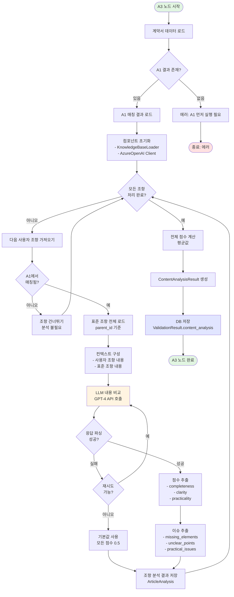
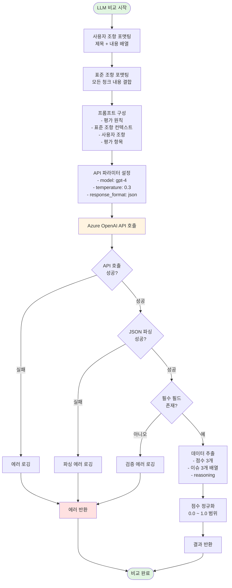
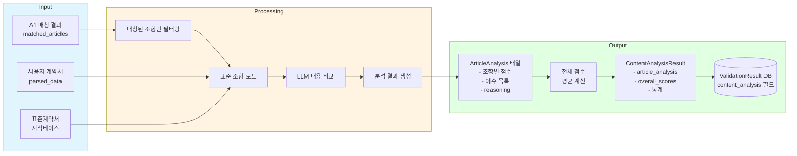
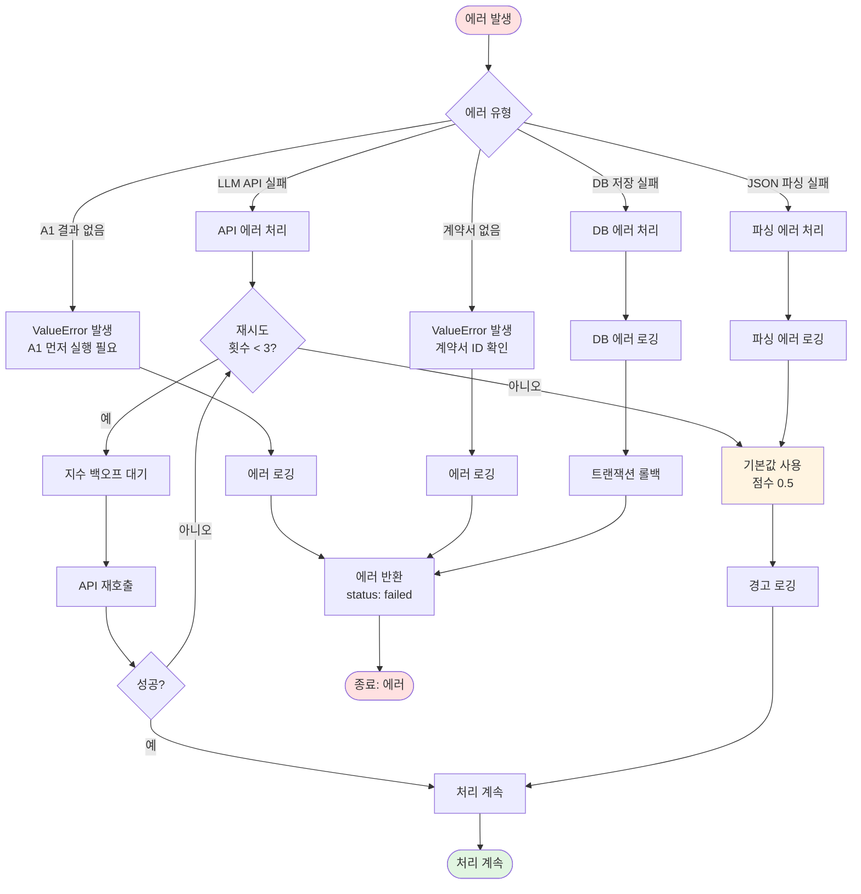
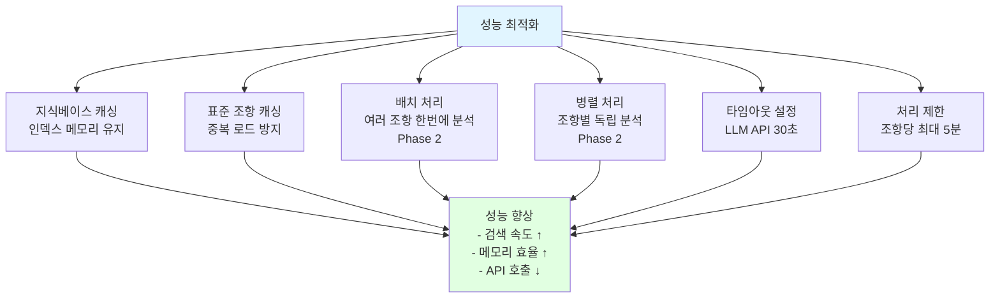
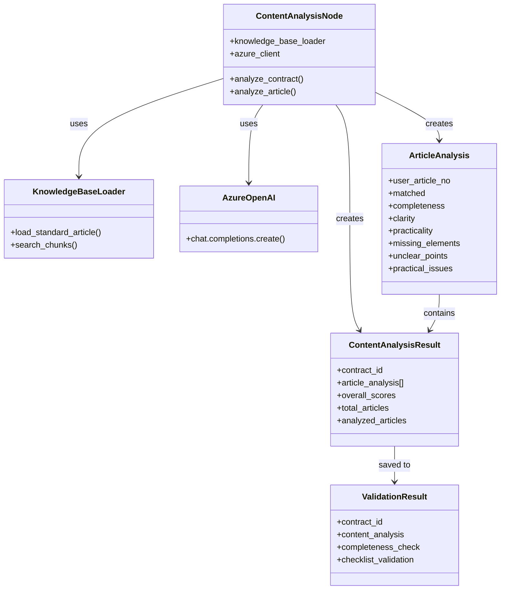
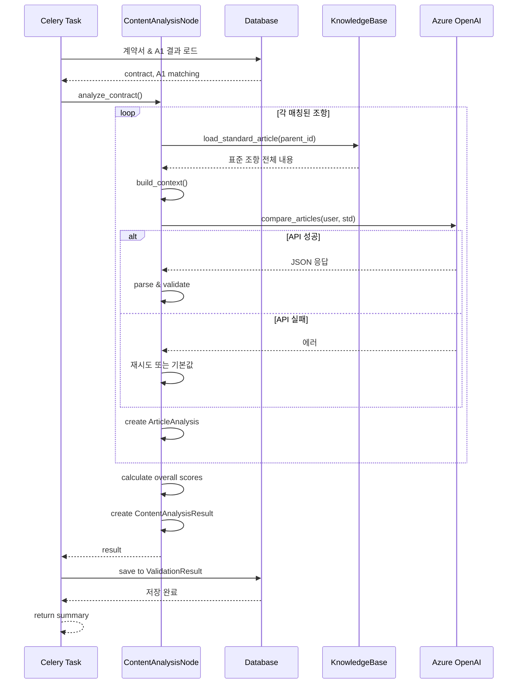

# A3 노드 (Content Analysis) Flow Diagram

## 전체 프로세스 흐름



## LLM 내용 비교 상세 흐름



## 프롬프트 구조

```mermaid
graph TD
    Prompt[LLM 프롬프트] --> Section1[1. 역할 정의<br/>데이터 계약서 검증 전문가]
    
    Prompt --> Section2[2. 평가 원칙<br/>- 실질적 내용 평가<br/>- 의미 유사성 인정<br/>- 맥락 기반 유연성<br/>- 표준은 권장사항<br/>- 추가 내용 긍정 평가]
    
    Prompt --> Section3[3. 표준 조항 컨텍스트<br/>매칭된 표준 조항 전체 내용]
    
    Prompt --> Section4[4. 사용자 조항<br/>평가 대상 조항]
    
    Prompt --> Section5[5. 평가 항목<br/>- 완전성 0~1<br/>- 명확성 0~1<br/>- 실무성 0~1]
    
    Prompt --> Section6[6. 출력 형식<br/>JSON 스키마 정의]
    
    Section1 --> Output[LLM 응답]
    Section2 --> Output
    Section3 --> Output
    Section4 --> Output
    Section5 --> Output
    Section6 --> Output
    
    Output --> JSON{JSON 형식<br/>- completeness<br/>- clarity<br/>- practicality<br/>- missing_elements[]<br/>- unclear_points[]<br/>- practical_issues[]<br/>- reasoning}
    
    style Prompt fill:#e1f5ff
    style Output fill:#fff4e1
    style JSON fill:#e1ffe1
```

## 데이터 흐름



## 에러 처리 흐름



## 성능 최적화 포인트



## 주요 컴포넌트 관계



## 실행 시퀀스


