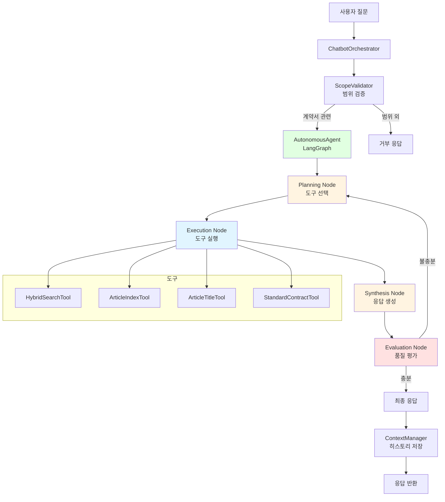
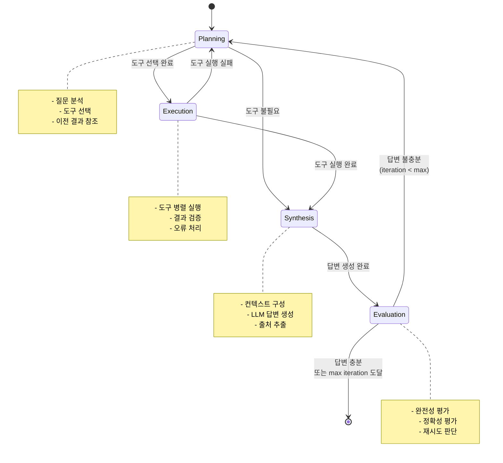

# Chatbot Agent

## 개요

Chatbot Agent는 사용자 계약서 내용에 대한 자연어 질의응답을 제공하는 AI 에이전트. LangGraph 기반 자율 에이전트로 구현되어 있으며, Function Calling을 통해 다양한 도구를 활용하여 정확한 답변 제공.

### 주요 기능

- **LangGraph 기반 자율 에이전트**: 반복적 추론 및 도구 선택
- **Function Calling**: LLM이 필요한 도구를 자동 선택 및 호출
- **하이브리드 검색**: FAISS 벡터 검색 + Whoosh 키워드 검색
- **대화 컨텍스트 관리**: 이전 대화 참조 및 히스토리 저장
- **범위 검증**: 계약서 관련 질문만 처리
- **스트리밍 응답**: 실시간 토큰 단위 응답 생성

### 입력 및 출력

**입력**:
- 사용자 질문 (자연어)
- 계약서 ID
- 세션 ID (선택적)

**출력**:
- 답변 텍스트
- 출처 정보 (참조한 조항)
- 세션 ID

## 아키텍처




### 컴포넌트 구조

| 컴포넌트 | 파일 | 역할 |
|---------|------|------|
| ChatbotOrchestrator | agent.py | 메인 오케스트레이터, 전체 흐름 관리 |
| AutonomousAgent | autonomous_agent.py | LangGraph 기반 자율 에이전트 |
| ScopeValidator | validators/scope_validator.py | 질문 범위 검증 |
| ContextManager | context_manager.py | 대화 히스토리 관리 |
| SessionManager | session_manager.py | 세션 및 체크포인트 관리 |
| ToolRegistry | tools/__init__.py | 도구 등록 및 실행 |
| HybridSearchTool | tools/hybrid_search_tool.py | 하이브리드 검색 |
| ArticleIndexTool | tools/article_index_tool.py | 조 번호 검색 |
| ArticleTitleTool | tools/article_title_tool.py | 조 제목 검색 |
| StandardContractTool | tools/standard_contract_tool.py | 표준계약서 검색 |

## LangGraph 아키텍처

### 노드 구조

Chatbot Agent는 LangGraph를 사용하여 4개의 노드로 구성된 자율 에이전트 구현:

1. **Planning Node (계획)**: 사용자 질문 분석 및 필요한 도구 선택
2. **Execution Node (실행)**: 선택된 도구 실행 및 결과 수집
3. **Synthesis Node (합성)**: 도구 결과를 바탕으로 답변 생성
4. **Evaluation Node (평가)**: 답변 품질 평가 및 재시도 판단

### 노드 간 전환 조건




## 상태 관리

### AgentState 구조

```python
class AgentState(TypedDict):
    # 입력
    contract_id: str
    user_message: str
    session_id: str
    
    # 대화 컨텍스트
    conversation_history: List[Dict[str, str]]
    previous_turn: List[Dict[str, str]]
    need_previous_context: bool
    
    # 도구 실행
    selected_tools: List[Dict[str, Any]]
    tool_results: List[ToolResult]
    explored_articles: List[str]
    
    # 응답 생성
    synthesized_response: str
    sources: List[Dict[str, Any]]
    
    # 평가 및 제어
    evaluation_result: Dict[str, Any]
    iteration_count: int
    max_iterations: int
    final_response: str
```

### 대화 히스토리 저장

ContextManager가 대화 히스토리를 DB에 저장:

- **테이블**: `ChatbotSession`
- **저장 시점**: 각 턴 완료 후
- **저장 내용**: 사용자 메시지, 어시스턴트 응답, 도구 호출 정보
- **토큰 제한**: 최근 10개 메시지만 유지 (자동 축소)

## 대화 컨텍스트 관리

### 이전 대화 참조

ScopeValidator가 이전 대화 참조 여부 판단:

```python
# 예시: "그 조항의 내용은?" → need_previous_context = True
scope_result = scope_validator.validate(user_message, previous_turn)
if scope_result.need_previous_context:
    # 이전 대화 컨텍스트를 Planning Node에 전달
    pass
```

### 참조 해결 메커니즘

1. **대명사 감지**: "그것", "그 조항", "이전에 말한" 등
2. **이전 턴 분석**: 최근 2개 메시지 (user + assistant) 참조
3. **컨텍스트 통합**: Planning Node에서 이전 결과 재사용

## 에러 처리

### 재시도 로직

- **도구 실행 실패**: Planning Node로 복귀, 다른 도구 선택
- **답변 불충분**: Evaluation Node에서 감지, Planning Node로 복귀
- **최대 반복 횟수**: 3회 (무한 루프 방지)

### 폴백 메커니즘

- **범위 외 질문**: 정중한 거부 메시지
- **도구 실행 실패**: "관련 정보를 찾을 수 없습니다" 메시지
- **LLM 오류**: "처리 중 오류가 발생했습니다" 메시지

## 스트리밍 응답

### 스트리밍 이벤트

```python
{
    "type": "token",      # 응답 토큰
    "content": "안녕"
}

{
    "type": "thinking",   # 사고 과정
    "content": "도구 선택 중..."
}

{
    "type": "sources",    # 출처 정보
    "content": [...]
}

{
    "type": "error",      # 오류
    "content": "..."
}
```

### 사용 예시

```python
async for event in orchestrator.process_message_stream(
    contract_id="contract_123",
    user_message="제5조의 내용은?"
):
    if event["type"] == "token":
        print(event["content"], end="", flush=True)
    elif event["type"] == "sources":
        print(f"\n\n출처: {event['content']}")
```

## 참고 사항

### LangGraph vs 레거시 모드

- **LangGraph 모드** (기본): 자율 에이전트, 반복적 추론
- **레거시 모드**: 단순 Function Calling (더 이상 지원되지 않음)

### 성능 최적화

- **도구 병렬 실행**: 여러 도구를 동시에 실행
- **대화 히스토리 축소**: 최근 10개 메시지만 유지
- **캐싱**: 표준계약서 청크 캐싱

### 확장 가능성

- 새로운 도구 추가 (ToolRegistry에 등록)
- 커스텀 평가 기준 (Evaluation Node 수정)
- 다국어 지원 (프롬프트 번역)

