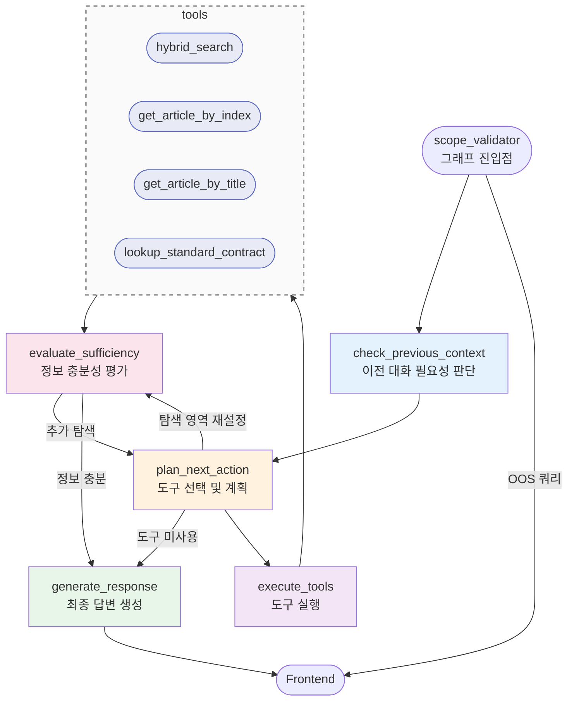

# 챗봇 에이전트 LangGraph 워크플로우

## 전체 플로우 다이어그램



## 노드별 상세 설명

### 1. check_previous_context (이전 대화 필요성 판단)
- **목적**: 현재 질문이 이전 대화를 참조하는지 LLM으로 판단
- **입력**: 
  - `user_message`: 현재 사용자 질문
  - `messages`: 대화 히스토리
- **출력**: 
  - `need_previous_context`: true/false
- **로직**:
  - 이전 대화가 없으면 즉시 false 반환
  - 참조어("그럼", "그것은", "아까" 등) 감지
  - 이전 답변에 대한 추가 질문 감지
- **다음 노드**: 항상 `planner`

### 2. planner (도구 선택 및 계획)
- **목적**: Function Calling으로 필요한 도구 선택
- **입력**:
  - `user_message`: 사용자 질문
  - `tool_history`: 이미 실행한 도구 이력
  - `collected_info`: 수집된 정보
  - `explored_articles`: 탐색한 조항
  - `unexplored_articles`: 미탐색 조항
  - `missing_info`: evaluator가 제안한 부족한 정보
- **출력**:
  - `next_tools`: 실행할 도구 리스트
  - `all_tools_skipped`: 중복으로 모든 도구가 스킵되었는지 여부
- **로직**:
  1. 최초 1회는 규칙 기반 도구 제안 (LightweightClassifier)
  2. Function Calling으로 여러 도구 동시 선택 가능
  3. 중복 검사: 이미 실행한 도구는 스킵
  4. 도구가 필요 없으면 빈 리스트 반환
- **다음 노드**: 조건부 분기 (`should_execute_tools`)

### 3. planner 분기 로직
- **목적**: 도구 실행 방식 결정
- **분기 조건**:
  - `no_tools`: 도구 없음 (의도적) → `respond`
  - `skip_to_evaluator`: 중복으로 스킵 → `evaluator`
  - `execute_parallel`: 병렬 실행 가능 → `parallel_executor`
  - `execute_sequential`: 순차 실행 → `executor`

### 4. executor (도구 순차 실행)
- **목적**: 선택된 도구들을 순차적으로 실행
- **입력**: `next_tools`
- **출력**:
  - `tool_history`: 도구 실행 이력 업데이트
  - `collected_info`: 수집된 정보 추가
  - `explored_articles`: 탐색한 조항 업데이트
- **사용 도구**:
  - `hybrid_search`: 하이브리드 검색 (FAISS + Whoosh)
  - `get_article_by_index`: 조 번호로 조회
  - `get_article_by_title`: 조 제목으로 조회
  - `lookup_standard_contract`: 표준계약서 참조
- **다음 노드**: 항상 `evaluator`

### 5. parallel_executor (도구 병렬 실행)
- **목적**: 독립적인 도구들을 병렬로 실행 (성능 최적화)
- **입력**: `next_tools`
- **출력**: `executor`와 동일
- **로직**: ThreadPoolExecutor로 병렬 실행
- **다음 노드**: 항상 `evaluator`

### 6. evaluator (정보 충분성 평가)
- **목적**: 수집된 정보가 질문에 답변하기 충분한지 LLM으로 평가
- **입력**:
  - `user_message`: 사용자 질문
  - `collected_info`: 수집된 정보
  - `explored_articles`: 탐색한 조항
  - `unexplored_articles`: 미탐색 조항
  - `iteration_count`: 현재 반복 횟수
- **출력**:
  - `decision_log`: 평가 결과 기록
  - `missing_info`: 부족한 정보 (다음 planner에 전달)
- **평가 기준**:
  1. 질문에 직접 답변할 수 있는가?
  2. 추가 탐색이 필요한가?
  3. 최대 반복 횟수 도달 여부
- **다음 노드**: 조건부 분기 (`should_continue`)

### 7. evaluator 분기 로직
- **목적**: 반복 계속 여부 결정
- **분기 조건**:
  - `continue`: 정보 부족 → `planner` (재탐색)
  - `finish`: 정보 충분 또는 최대 반복 도달 → `respond`

### 8. respond (최종 답변 생성)
- **목적**: 수집된 정보를 기반으로 최종 답변 생성
- **입력**:
  - `user_message`: 사용자 질문
  - `collected_info`: 수집된 모든 정보
  - `need_previous_context`: 이전 대화 포함 여부
- **출력**:
  - `final_response`: 최종 답변 (스트리밍)
  - `sources`: 출처 정보
- **로직**:
  - 수집된 정보를 구조화된 컨텍스트로 변환
  - LLM 스트리밍 호출 (gpt-4o 또는 o1)
  - 사용자 계약서와 표준계약서 구분
- **다음 노드**: `END`

## 주요 특징

### 1. 반복적 사고-행동-평가 루프
```
check_previous_context → planner → executor → evaluator
                            ↑                      ↓
                            └──────── continue ────┘
```

### 2. 중복 방지 메커니즘
- `tool_history`로 이미 실행한 도구 추적
- 동일한 도구+인자 조합은 재실행 안 함
- 모든 도구가 중복이면 `evaluator`로 직행

### 3. 조건부 종료
- 도구가 필요 없으면 즉시 답변 생성
- 정보가 충분하면 반복 종료
- 최대 반복 횟수 도달 시 강제 종료

### 4. 컨텍스트 관리
- 이전 대화 필요 시 자동 포함
- 탐색 상태 추적 (explored/unexplored articles)
- 수집된 정보 중복 제거 및 통합

### 5. 스트리밍 지원
- `run_stream()` 메서드로 실시간 응답
- 사고 과정 이벤트 전송:
  - `planning`: 탐색 계획 수립
  - `tool_selected`: 도구 선택 완료
  - `evaluation_result`: 충분성 평가 결과
  - `generating`: 답변 생성 시작
  - `token`: 응답 토큰
  - `sources`: 출처 정보

## 설정 파라미터

- `max_iterations`: 최대 반복 횟수 (기본: 4)
- `enable_cache`: LLM 캐시 활성화 (기본: true)
- `persistence_mode`: 체크포인트 저장 방식 (기본: "memory")
- `checkpoint_db_path`: 체크포인트 DB 경로 (선택)

## 사용 예시

```python
# 에이전트 초기화
agent = AutonomousAgent(
    openai_client=openai_client,
    tool_registry=tool_registry,
    max_iterations=4,
    enable_cache=True
)

# 스트리밍 실행
for event in agent.run_stream(
    contract_id="contract_123",
    user_message="제5조 내용이 뭐야?",
    session_id="session_456",
    previous_turn=[
        {"role": "user", "content": "계약 기간은?"},
        {"role": "assistant", "content": "계약 기간은 1년입니다."}
    ]
):
    if event["type"] == "token":
        print(event["content"], end="")
    elif event["type"] == "thinking":
        print(f"[{event['step']}] {event['content']}")
    elif event["type"] == "sources":
        print(f"출처: {event['content']}")
```
