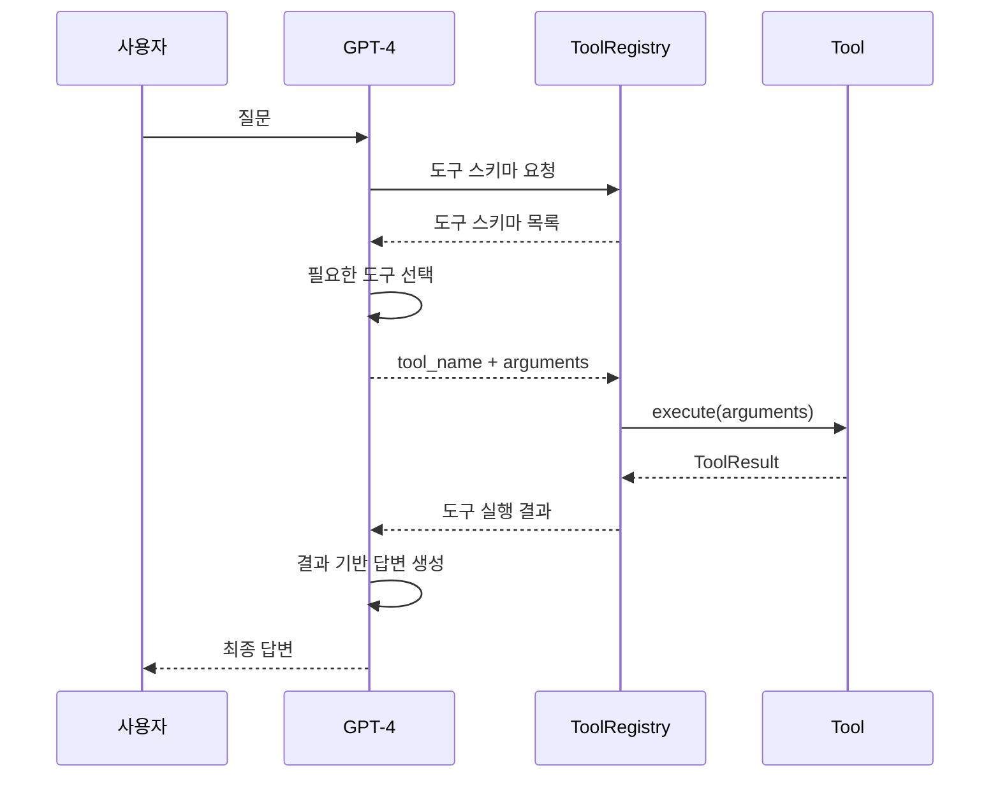

# Chatbot Tools

## 개요

Chatbot Agent가 사용하는 Function Calling 도구 모음. LLM이 사용자 질문에 답변하기 위해 필요한 도구를 자동으로 선택하고 호출.

### 도구 목록

| 도구 | 파일 | 용도 |
|-----|------|------|
| HybridSearchTool | hybrid_search_tool.py | 내용 기반 하이브리드 검색 (FAISS + Whoosh) |
| ArticleIndexTool | article_index_tool.py | 조 번호로 직접 조회 |
| ArticleTitleTool | article_title_tool.py | 조 제목으로 검색 |
| StandardContractTool | standard_contract_tool.py | 표준계약서 조회 |

## Function Calling 메커니즘

### 도구 선택 프로세스



### 도구 스키마 구조

```python
{
    "name": "hybrid_search",
    "description": "사용자 계약서에서 관련 조항을 검색합니다...",
    "parameters": {
        "type": "object",
        "properties": {
            "topics": {
                "type": "array",
                "description": "검색할 주제 목록",
                "items": {...}
            }
        },
        "required": ["topics"]
    }
}
```

## 도구 상세

### 1. HybridSearchTool

**용도**: 내용 기반 조항 검색

**사용 시기**:
- 사용자가 조 번호나 제목을 명시하지 않은 경우
- "데이터 제공 범위는?", "손해배상 조건은?" 등

**입력**:
```python
{
    "topics": [
        {
            "topic_name": "데이터 제공 범위",
            "queries": [
                "데이터 제공 범위",
                "제공 대상 데이터"
            ]
        }
    ]
}
```

**출력**:
```python
{
    "results": {
        "데이터 제공 범위": [
            {
                "article_no": 5,
                "title": "데이터 제공",
                "content": ["...", "..."]
            }
        ]
    }
}
```

**특징**:
- FAISS (벡터) + Whoosh (키워드) 하이브리드 검색
- RRF (Reciprocal Rank Fusion) 점수 융합
- LLM 기반 관련성 필터링
- 조 단위 반환

### 2. ArticleIndexTool

**용도**: 조 번호로 직접 조회

**사용 시기**:
- 사용자가 "제5조", "2조", "별지1" 등 명시한 경우

**입력**:
```python
{
    "article_numbers": [5, 10],
    "exhibit_numbers": [1]
}
```

**출력**:
```python
{
    "matched_articles": [
        {
            "article_no": 5,
            "title": "데이터 제공",
            "content": ["...", "..."]
        },
        {
            "article_no": -1,  # 별지는 음수
            "title": "별지1 데이터 목록",
            "content": ["...", "..."]
        }
    ]
}
```

### 3. ArticleTitleTool

**용도**: 조 제목으로 검색

**사용 시기**:
- 사용자가 "데이터 제공 조항", "손해배상 조항" 등 제목으로 언급한 경우

**입력**:
```python
{
    "title_queries": ["데이터 제공", "손해배상"]
}
```

**출력**: ArticleIndexTool과 동일

### 4. StandardContractTool

**용도**: 표준계약서 조회

**사용 시기**:
- 사용자가 "표준계약서에는?", "일반적으로는?" 등 표준계약서 내용을 물어본 경우

**입력**:
```python
{
    "contract_type": "provide",
    "queries": ["데이터 제공 범위"]
}
```

**출력**: 표준계약서 조항 내용

## 도구 체이닝

### 복합 질문 처리

**예시**: "제5조와 손해배상 조항을 비교해줘"

1. **Planning Node**: 2개 도구 선택
   - ArticleIndexTool: article_numbers=[5]
   - ArticleTitleTool: title_queries=["손해배상"]

2. **Execution Node**: 병렬 실행
   - 도구 1 결과: 제5조 내용
   - 도구 2 결과: 제10조 (손해배상) 내용

3. **Synthesis Node**: 통합 답변 생성
   - "제5조는 데이터 제공에 관한 내용이고, 제10조는 손해배상에 관한 내용입니다..."

## 에러 처리

### 재시도 로직

ToolRegistry가 도구 실행 실패 시 자동 재시도:
- 최대 3회 재시도
- 지수 백오프 (1초, 2초, 4초)
- 재시도 실패 시 에러 반환

### 결과 검증

각 도구는 `validate_result()` 메서드로 결과 검증:
- 빈 결과 감지
- 데이터 형식 검증
- 필수 필드 확인

## 참고 사항

### 도구 추가 방법

1. `BaseTool` 상속
2. `name`, `description`, `get_schema()` 구현
3. `execute()` 메서드 구현
4. `ToolRegistry`에 등록

### 성능 최적화

- 인덱스 캐싱 (계약서별)
- 도구 병렬 실행
- LLM 필터링 (Top-5만)

