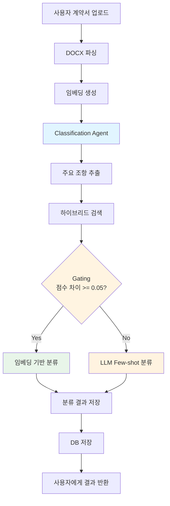
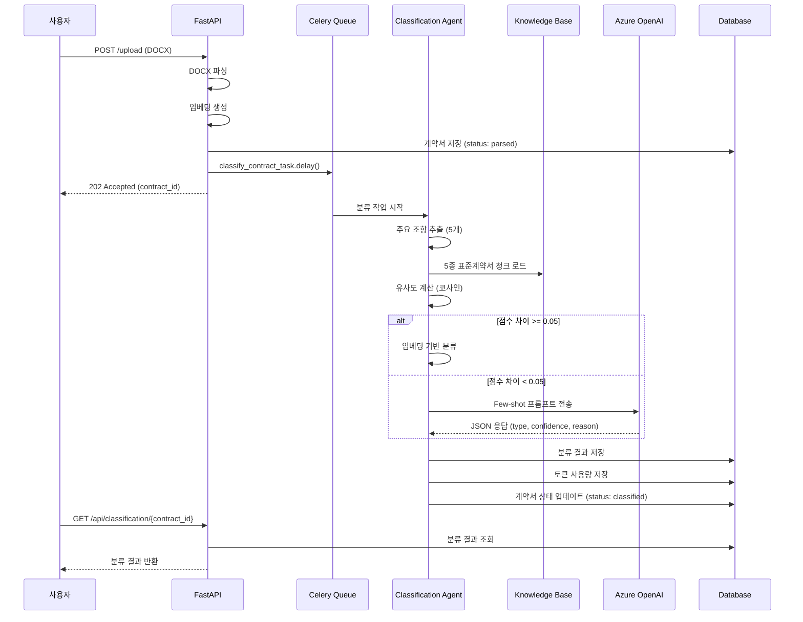
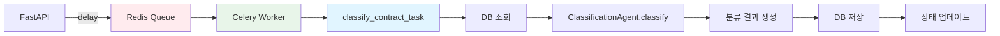

# Classification Agent

## 개요

Classification Agent는 사용자가 업로드한 계약서를 5종 표준계약서 중 하나로 자동 분류하는 AI 에이전트. RAG(Retrieval-Augmented Generation) 기반 하이브리드 검색과 LLM Few-shot 분류를 결합하여 높은 정확도의 분류 수행.

### 지원 계약 유형

1. **provide**: 데이터 제공 계약
2. **create**: 데이터 생성 계약
3. **process**: 데이터 가공 계약
4. **brokerage_provider**: 데이터 중개 계약 (제공자용)
5. **brokerage_user**: 데이터 중개 계약 (이용자용)

### 핵심 특징

- **하이브리드 검색**: FAISS 벡터 검색 + Whoosh 키워드 검색 결합
- **Gating 메커니즘**: 유사도 점수 차이 기반 LLM 호출 최적화
- **Few-shot 분류**: 명확하지 않은 경우 LLM으로 정밀 분류
- **비동기 처리**: Celery + Redis 기반 백그라운드 작업
- **토큰 사용량 추적**: API 호출별 토큰 사용량 모니터링

## 아키텍처



### 컴포넌트 구조

```
backend/classification_agent/
├── agent.py                    # ClassificationAgent 클래스 및 Celery Task
└── __init__.py

backend/shared/
├── services/
│   ├── embedding_loader.py     # 임베딩 로드
│   └── knowledge_base_loader.py # 지식베이스 로드
└── database.py                 # ClassificationResult 모델
```

## 분류 프로세스

### 1. 주요 조항 추출

사용자 계약서에서 처음 5개 조항 추출 (목적, 정의, 데이터 범위 등 핵심 내용 포함).

```python
def _extract_key_articles(self, parsed_data: Dict[str, Any]) -> List[Dict[str, str]]:
    """주요 조항 추출 (처음 5개 조항)"""
    articles = parsed_data.get("articles", [])
    
    key_articles = []
    for article in articles[:5]:
        key_articles.append({
            "number": article.get("number"),
            "title": article.get("title", ""),
            "text": article.get("text", ""),
            "content": " ".join(article.get("content", [])),
            "full_text": f"{article.get('text', '')} {' '.join(article.get('content', []))}"
        })
    
    return key_articles
```

**추출 대상**:
- 조 번호 (number)
- 조 제목 (title)
- 조문 텍스트 (text)
- 하위 항목 내용 (content)

### 2. 하이브리드 검색

FAISS 벡터 검색과 Whoosh 키워드 검색을 결합하여 5종 표준계약서와의 유사도 계산.

#### 2.1 쿼리 임베딩 생성

```python
def _build_query_embedding(
    self,
    key_articles: List[Dict[str, str]],
    parsed_data: Optional[Dict[str, Any]],
    contract_id: Optional[str],
) -> Optional[List[float]]:
    """쿼리 임베딩 생성 (저장된 임베딩 우선 사용)"""
    # 1. 저장된 임베딩 로드 시도
    stored_embeddings = self._get_stored_embeddings(contract_id, parsed_data)
    
    if stored_embeddings:
        # 조항별 임베딩 결합
        combined = self._combine_article_embeddings(stored_embeddings, key_articles)
        if combined:
            return combined
    
    # 2. 실시간 임베딩 생성 (폴백)
    query_text = " ".join([art.get("full_text", "") for art in key_articles])
    return self._get_embedding(query_text, contract_id)
```

**임베딩 전략**:
- 저장된 조항별 임베딩 우선 사용 (성능 최적화)
- 제목 임베딩 + 하위 항목 임베딩 평균
- 실시간 생성은 폴백으로만 사용

#### 2.2 유사도 계산

```python
def _calculate_similarity_scores(
    self,
    key_articles: List[Dict[str, str]],
    knowledge_base_loader,
    contract_id: str = None,
    parsed_data: Optional[Dict[str, Any]] = None
) -> Dict[str, float]:
    """5종 표준계약서와의 유사도 계산"""
    scores: Dict[str, float] = {}
    
    query_embedding = self._build_query_embedding(
        key_articles=key_articles,
        parsed_data=parsed_data,
        contract_id=contract_id
    )
    
    for contract_type in self.CONTRACT_TYPES.keys():
        chunks = knowledge_base_loader.load_chunks(contract_type)
        
        # 상위 20개 청크와 유사도 계산
        similarities = []
        for chunk in chunks[:20]:
            chunk_embedding = chunk.get("embedding")
            if chunk_embedding:
                sim = self._cosine_similarity(query_embedding, chunk_embedding)
                similarities.append(sim)
        
        # 평균 유사도
        avg_similarity = sum(similarities) / len(similarities) if similarities else 0.0
        scores[contract_type] = avg_similarity
    
    return scores
```

**유사도 계산 방식**:
- 코사인 유사도 사용
- 각 표준계약서의 상위 20개 청크와 비교
- 평균 유사도를 해당 유형의 점수로 사용

### 3. Gating 메커니즘

1위와 2위 유사도 점수 차이를 기반으로 LLM 호출 여부 결정.

```python
def _classify_with_gating(
    self,
    key_articles: List[Dict[str, str]],
    similarity_scores: Dict[str, float],
    contract_id: str,
    filename: str = None
) -> Dict[str, Any]:
    """Hybrid Gating을 통한 분류"""
    # 1위와 2위 점수 차이 계산
    sorted_scores = sorted(similarity_scores.items(), key=lambda x: x[1], reverse=True)
    top1_type, top1_score = sorted_scores[0]
    top2_type, top2_score = sorted_scores[1] if len(sorted_scores) > 1 else (None, 0.0)
    
    score_gap = top1_score - top2_score
    
    # Gating 임계값 확인
    if score_gap >= self.SCORE_GAP_THRESHOLD:  # 0.05
        # 명확함 → 임베딩 결과 사용 (LLM 호출 없음)
        return {
            "contract_id": contract_id,
            "predicted_type": top1_type,
            "confidence": top1_score,
            "scores": similarity_scores,
            "reasoning": f"임베딩 유사도 차이가 충분함 (gap={score_gap:.3f})",
            "classification_method": "embedding",
            "score_gap": score_gap
        }
    else:
        # 애매함 → LLM Few-shot 호출
        predicted_type, confidence, reasoning = self._llm_classify_with_fewshot(
            key_articles,
            similarity_scores,
            contract_id,
            filename
        )
        return {
            "contract_id": contract_id,
            "predicted_type": predicted_type,
            "confidence": confidence,
            "scores": similarity_scores,
            "reasoning": reasoning,
            "classification_method": "llm_fewshot",
            "score_gap": score_gap
        }
```

**Gating 임계값**: 0.05
- **score_gap >= 0.05**: 임베딩 기반 분류 (LLM 스킵)
- **score_gap < 0.05**: LLM Few-shot 분류 수행

**효과**:
- LLM 호출 최소화로 비용 절감
- 명확한 경우 빠른 응답
- 애매한 경우만 정밀 분석

### 4. LLM Few-shot 분류

유사도 점수 차이가 작은 경우 LLM으로 정밀 분류 수행.

```python
def _llm_classify_with_fewshot(
    self,
    key_articles: List[Dict[str, str]],
    similarity_scores: Dict[str, float],
    contract_id: str,
    filename: str = None
) -> Tuple[str, float, str]:
    """Few-shot 프롬프트를 사용한 LLM 분류"""
    # 조항 텍스트 구성
    articles_text = ""
    for i, art in enumerate(key_articles, 1):
        articles_text += f"[조항 {i}] 제목: {art.get('title', '')}\n"
        articles_text += f"  조문: {art.get('text', '')}\n"
        articles_text += f"  내용: {art.get('content', '')[:200]}...\n\n"
    
    # Few-shot 프롬프트 구성
    prompt = f"""당신은 데이터 계약서 분류 전문가입니다.

다음은 5가지 데이터 계약 유형의 특징과 출력 예시입니다:

{self.FEWSHOT_EXAMPLES}

---

이제 사용자가 업로드한 계약서의 주요 내용을 분석해주세요:

{articles_text}

임베딩 유사도 점수 (참고용):
{scores_text}

**분석 지침**:
1. 역할 구조 파악 (누가 누구에게 무엇을 제공/위탁/중개하는가)
2. 핵심 패턴 찾기 (제공, 생성, 가공, 중개 관련 키워드)
3. 데이터 흐름 확인 (단방향/양방향, 창출 여부)

**출력 형식** (반드시 JSON만 출력):
{{
  "type": "[provide|create|process|brokerage_provider|brokerage_user]",
  "confidence": [0.0-1.0 사이의 숫자],
  "reason": "[역할 구조와 핵심 패턴 기반 판단 근거]"
}}
"""
    
    # LLM 호출 (JSON 모드)
    response = self.client.chat.completions.create(
        model=self.chat_model,
        messages=[
            {"role": "system", "content": "당신은 데이터 계약서 분류 전문가입니다."},
            {"role": "user", "content": prompt}
        ],
        temperature=0.2,
        max_tokens=600,
        response_format={"type": "json_object"}
    )
    
    # 응답 파싱
    answer = response.choices[0].message.content.strip()
    result = json.loads(answer)
    
    return result.get("type"), float(result.get("confidence", 0.5)), result.get("reason", "")
```

**Few-shot 예시 구조**:
- 각 계약 유형별 역할 구조, 핵심 패턴, 추상 요약 제공
- JSON 출력 형식 명시
- 5개 예시 포함 (provide, create, process, brokerage_provider, brokerage_user)

**LLM 설정**:
- 모델: GPT-4o
- Temperature: 0.2 (일관성 중시)
- Max Tokens: 600
- Response Format: JSON 강제

## 데이터 흐름



### 데이터 모델

#### ContractDocument

```python
class ContractDocument(Base):
    __tablename__ = "contract_documents"
    
    id = Column(Integer, primary_key=True, index=True)
    contract_id = Column(String, unique=True, index=True)
    filename = Column(String)
    file_path = Column(String)
    parsed_data = Column(JSON)  # 파싱된 계약서 데이터 + 임베딩
    parsed_metadata = Column(JSON)
    status = Column(String)  # parsed, classifying, classified, classified_confirmed
    created_at = Column(DateTime, default=datetime.utcnow)
```

#### ClassificationResult

```python
class ClassificationResult(Base):
    __tablename__ = "classification_results"
    
    id = Column(Integer, primary_key=True, index=True)
    contract_id = Column(String, ForeignKey("contract_documents.contract_id"))
    predicted_type = Column(String)  # 예측된 유형
    confidence = Column(Float)  # 신뢰도 (0.0-1.0)
    scores = Column(JSON)  # 5종 유사도 점수
    reasoning = Column(Text)  # 판단 근거
    confirmed_type = Column(String)  # 사용자 확인 유형
    user_override = Column(String)  # 사용자 수정 유형
    created_at = Column(DateTime, default=datetime.utcnow)
```

## API 스키마

### POST /upload

사용자 계약서 업로드 및 파싱.

**Request**:
```http
POST /upload
Content-Type: multipart/form-data

file: [DOCX 파일]
```

**Response**:
```json
{
  "success": true,
  "filename": "user_contract.docx",
  "contract_id": "contract_a1b2c3d4e5f6",
  "structured_data": {
    "title": "데이터 제공 계약서",
    "parties": [...],
    "articles": [...]
  },
  "parsed_metadata": {
    "total_articles": 15,
    "total_paragraphs": 45
  },
  "message": "파싱 완료. 분류 작업이 백그라운드에서 진행 중입니다."
}
```

### GET /api/classification/{contract_id}

분류 결과 조회.

**Request**:
```http
GET /api/classification/contract_a1b2c3d4e5f6
```

**Response**:
```json
{
  "contract_id": "contract_a1b2c3d4e5f6",
  "predicted_type": "provide",
  "confidence": 0.87,
  "scores": {
    "provide": 0.87,
    "create": 0.65,
    "process": 0.54,
    "brokerage_provider": 0.42,
    "brokerage_user": 0.38
  },
  "confirmed_type": "provide",
  "user_override": null
}
```

### POST /api/classification/{contract_id}/confirm

사용자가 분류 유형 확인/수정.

**Request**:
```http
POST /api/classification/contract_a1b2c3d4e5f6/confirm
Content-Type: application/json

{
  "confirmed_type": "provide"
}
```

**Response**:
```json
{
  "success": true,
  "contract_id": "contract_a1b2c3d4e5f6",
  "confirmed_type": "provide"
}
```

## Celery 작업 흐름



### Celery Task 정의

```python
@celery_app.task(name="classification.classify_contract", queue="classification")
def classify_contract_task(contract_id: str):
    """Celery Task: 계약서 분류"""
    db = SessionLocal()
    try:
        # DB에서 계약서 조회
        contract = db.query(ContractDocument).filter(
            ContractDocument.contract_id == contract_id
        ).first()
        
        if not contract or not contract.parsed_data:
            raise ValueError(f"계약서 또는 파싱 데이터 없음: {contract_id}")
        
        # Classification Agent 실행
        agent = ClassificationAgent()
        kb_loader = get_knowledge_base_loader()
        
        result = agent.classify(
            contract_id=contract_id,
            parsed_data=contract.parsed_data,
            knowledge_base_loader=kb_loader,
            filename=contract.filename
        )
        
        # 분류 결과 DB 저장
        classification = ClassificationResult(
            contract_id=contract_id,
            predicted_type=result["predicted_type"],
            confidence=result["confidence"],
            scores=result["scores"],
            reasoning=result["reasoning"],
            confirmed_type=result["predicted_type"]
        )
        db.add(classification)
        
        # 계약서 상태 업데이트
        contract.status = "classified"
        db.commit()
        
        return {
            "success": True,
            "contract_id": contract_id,
            "predicted_type": result["predicted_type"],
            "confidence": result["confidence"]
        }
    
    except Exception as e:
        logger.error(f"분류 실패: {contract_id} - {e}")
        db.rollback()
        raise
    finally:
        db.close()
```

### Celery 설정

```python
# backend/shared/core/celery_app.py
celery_app = Celery(
    'data_contract_validation',
    broker='redis://localhost:6379',
    backend='redis://localhost:6379',
    include=['backend.classification_agent.agent']
)

celery_app.conf.update(
    task_serializer='json',
    accept_content=['json'],
    result_serializer='json',
    timezone='Asia/Seoul',
    enable_utc=True,
    task_track_started=True,
    task_time_limit=30 * 60,  # 30분
    task_soft_time_limit=25 * 60  # 25분
)
```

**큐 구성**:
- Queue: `classification`
- Broker: Redis
- Backend: Redis
- Serializer: JSON

## 에러 처리

### 1. 파싱 실패

```python
if not result["success"]:
    raise HTTPException(
        status_code=500, 
        detail=f"파싱 실패: {result.get('error', 'Unknown error')}"
    )
```

### 2. 임베딩 생성 실패

```python
try:
    embeddings = generator.generate_embeddings(contract_id, parsed_data)
except Exception as embed_err:
    logger.error(f"Embedding generation failed: {contract_id}, {embed_err}")
    # 계속 진행 (임베딩 없이도 분류 가능)
```

### 3. LLM 호출 실패

```python
try:
    response = self.client.chat.completions.create(...)
except Exception as e:
    logger.error(f"LLM 호출 실패: {e}")
    # Fallback: 유사도 기반 분류
    predicted_type = max(similarity_scores.items(), key=lambda x: x[1])[0]
    confidence = max(similarity_scores.values())
    reasoning = "LLM 호출 실패. 유사도 기반 분류."
    return predicted_type, confidence, reasoning
```

### 4. JSON 파싱 실패

```python
try:
    result = json.loads(answer)
    predicted_type = result.get("type")
except (json.JSONDecodeError, ValueError, KeyError) as parse_error:
    logger.warning(f"JSON 파싱 실패, 텍스트 파싱 폴백: {parse_error}")
    # 텍스트 파싱 시도
    for line in answer.split("\n"):
        if "type" in line.lower() and ":" in line:
            type_text = line.split(":", 1)[1].strip()
            # ...
```

### 5. DB 잠금 처리

```python
max_retries = 3
retry_delay = 0.1

for attempt in range(max_retries):
    try:
        db.add(token_usage)
        db.commit()
        return
    except OperationalError as exc:
        if "database is locked" in str(exc) and attempt < max_retries - 1:
            logger.warning(f"DB 잠금 감지, 재시도 {attempt + 1}/{max_retries}")
            time.sleep(retry_delay * (attempt + 1))
            db.rollback()
        else:
            raise
```

## 토큰 사용량 추적

### 토큰 로깅

```python
def _log_token_usage(
    self,
    contract_id: str,
    api_type: str,
    model: str,
    prompt_tokens: int,
    completion_tokens: int,
    total_tokens: int,
    extra_info: dict = None
):
    """토큰 사용량을 DB에 저장"""
    db = SessionLocal()
    try:
        token_usage = TokenUsage(
            contract_id=contract_id,
            component="classification_agent",
            api_type=api_type,
            model=model,
            prompt_tokens=prompt_tokens,
            completion_tokens=completion_tokens,
            total_tokens=total_tokens,
            extra_info=extra_info
        )
        db.add(token_usage)
        db.commit()
    except Exception as e:
        logger.error(f"토큰 사용량 로깅 실패: {e}")
        db.rollback()
    finally:
        db.close()
```

### 토큰 사용량 조회 API

```http
GET /api/token-usage/contract_a1b2c3d4e5f6
```

**Response**:
```json
{
  "contract_id": "contract_a1b2c3d4e5f6",
  "total_tokens": 1250,
  "by_component": {
    "classification_agent": {
      "total_tokens": 1250,
      "prompt_tokens": 950,
      "completion_tokens": 300,
      "count": 1
    }
  },
  "by_api_type": {
    "chat_completion": {
      "total_tokens": 1250,
      "prompt_tokens": 950,
      "completion_tokens": 300,
      "count": 1
    }
  },
  "details": [
    {
      "id": 1,
      "component": "classification_agent",
      "api_type": "chat_completion",
      "model": "gpt-4o",
      "prompt_tokens": 950,
      "completion_tokens": 300,
      "total_tokens": 1250,
      "created_at": "2024-01-15T10:30:00",
      "extra_info": {
        "purpose": "classification_fewshot"
      }
    }
  ]
}
```

## 코드 예시

### 전체 분류 흐름

```python
from backend.classification_agent.agent import ClassificationAgent
from backend.shared.services import get_knowledge_base_loader

# Agent 초기화
agent = ClassificationAgent()
kb_loader = get_knowledge_base_loader()

# 분류 실행
result = agent.classify(
    contract_id="contract_abc123",
    parsed_data={
        "title": "데이터 제공 계약서",
        "articles": [
            {
                "number": 1,
                "title": "목적",
                "text": "제1조(목적)",
                "content": ["이 계약은 데이터 제공에 관한 사항을 정함"]
            },
            # ...
        ]
    },
    knowledge_base_loader=kb_loader,
    filename="user_contract.docx"
)

print(f"분류 결과: {result['predicted_type']}")
print(f"신뢰도: {result['confidence']:.2%}")
print(f"방법: {result['classification_method']}")
print(f"근거: {result['reasoning']}")
```

### Celery Task 실행

```python
from backend.classification_agent.agent import classify_contract_task

# 비동기 작업 큐에 전송
task = classify_contract_task.delay("contract_abc123")

# Task ID 확인
print(f"Task ID: {task.id}")

# 결과 대기 (선택)
result = task.get(timeout=300)  # 5분 타임아웃
print(f"분류 완료: {result}")
```

### 분류 결과 조회

```python
from backend.shared.database import SessionLocal, ClassificationResult

db = SessionLocal()
classification = db.query(ClassificationResult).filter(
    ClassificationResult.contract_id == "contract_abc123"
).first()

if classification:
    print(f"예측 유형: {classification.predicted_type}")
    print(f"신뢰도: {classification.confidence:.2%}")
    print(f"유사도 점수: {classification.scores}")
    print(f"확인 유형: {classification.confirmed_type}")
```
