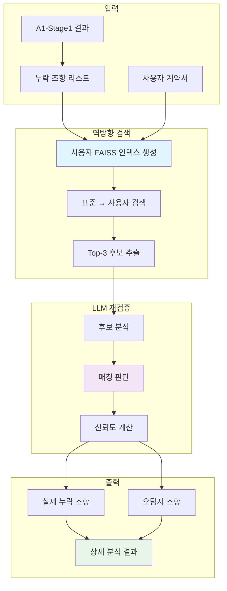
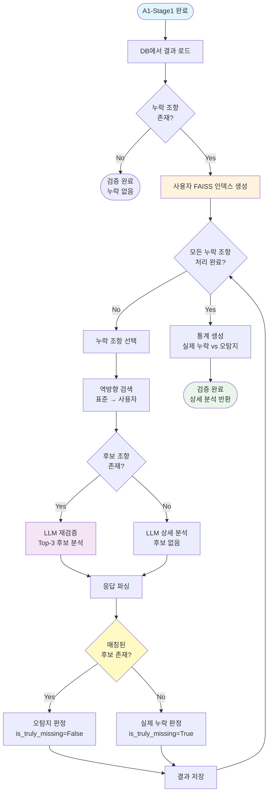
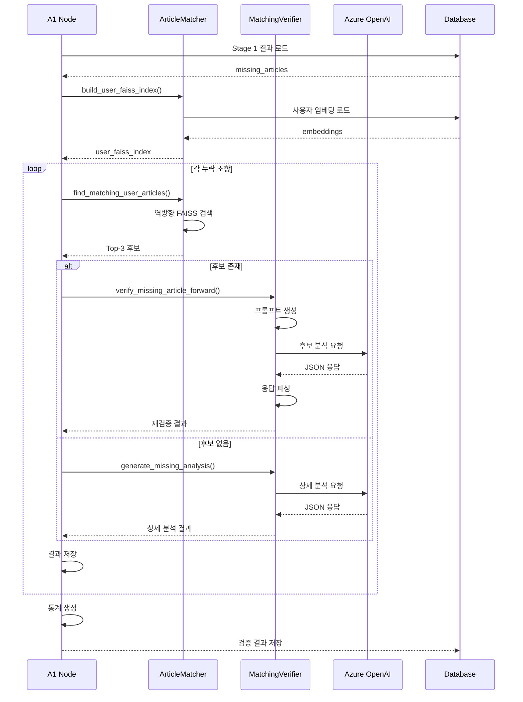

# A1 누락 검증

## 개요

A1 Node의 누락 검증(Missing Verification)은 정방향 매칭에서 누락된 것으로 식별된 표준계약서 조항이 실제로 사용자 계약서에 없는지 재확인하는 프로세스. 역방향 검색과 LLM 기반 맥락 판단을 통해 오탐지(False Positive)를 제거하고 실제 누락 조항만 식별.

### 핵심 특징

- **역방향 검색**: 표준 조항 → 사용자 조항 방향으로 재검색
- **LLM 재검증**: 맥락 기반 판단으로 부분 일치 및 표현 차이 감지
- **오탐지 제거**: 정방향 매칭 실패를 재검증하여 실제 누락만 보고
- **상세 분석**: 누락 조항별 위험도 평가 및 권고사항 제공
- **병렬 실행**: A2, A3와 동시 실행 (A1-Stage2)

### 검증 파이프라인

```
정방향 매칭 실패 → 역방향 검색 → LLM 재검증 → 실제 누락 판단 → 상세 분석
```

## 아키텍처

### 전체 구조



### 컴포넌트 구성

```
backend/consistency_agent/a1_node/
├── a1_node.py                  # CompletenessCheckNode 클래스
│   ├── check_missing_articles()      # Stage 2 진입점
│   └── _verify_missing_articles()    # 누락 조문 재검증
├── article_matcher.py          # ArticleMatcher 클래스
│   ├── build_user_faiss_index()      # 사용자 FAISS 인덱스 생성
│   └── find_matching_user_articles() # 역방향 검색
└── matching_verifier.py        # MatchingVerifier 클래스
    ├── verify_missing_article_forward()  # LLM 재검증
    └── _generate_missing_analysis_without_candidates()  # 후보 없을 때 분석
```

## 누락 검증 프로세스

### 1. Stage 1 결과 로드

A1-Stage1에서 생성된 매칭 결과를 DB에서 로드.

```python
def check_missing_articles(
    self,
    contract_id: str,
    contract_type: str,
    text_weight: float = 0.7,
    title_weight: float = 0.3,
    dense_weight: float = 0.85
) -> Dict[str, Any]:
    """
    계약서 완전성 검증 - Stage 2: 누락 조문 재검증
    
    DB에서 Stage 1 결과를 로드하여 누락 조문만 재검증
    이 메서드는 A2, A3와 병렬로 실행
    """
    from backend.shared.database import SessionLocal, ValidationResult, ContractDocument
    
    db = SessionLocal()
    try:
        # DB에서 Stage 1 결과 로드
        validation_result = db.query(ValidationResult).filter(
            ValidationResult.contract_id == contract_id
        ).first()
        
        if not validation_result or not validation_result.completeness_check:
            raise ValueError(f"A1-Stage1 결과를 찾을 수 없습니다: {contract_id}")
        
        completeness_check = validation_result.completeness_check
        missing_articles = completeness_check.get('missing_standard_articles', [])
        
        if not missing_articles:
            logger.info(f"[A1-S2] 누락 조문이 없습니다")
            return {
                "missing_article_analysis": [],
                "processing_time": 0.0
            }
        
        # 사용자 계약서 로드
        contract = db.query(ContractDocument).filter(
            ContractDocument.contract_id == contract_id
        ).first()
        
        user_articles = contract.parsed_data.get('articles', [])
        
        # 누락 조문 재검증
        missing_article_analysis = self._verify_missing_articles(
            missing_articles,
            user_articles,
            contract_type,
            contract_id,
            text_weight,
            title_weight,
            dense_weight
        )
        
        return {
            "missing_article_analysis": missing_article_analysis,
            "processing_time": time.time() - start_time
        }
    
    finally:
        db.close()
```

**Stage 1 결과 구조**:
```json
{
  "missing_standard_articles": [
    {
      "parent_id": "제5조",
      "title": "데이터 제공 범위 및 방식",
      "chunks": [...]
    }
  ]
}
```

### 2. 역방향 검색 메커니즘

표준 조항으로 사용자 계약서를 검색하여 유사한 조항 후보 추출.

#### 2.1 사용자 FAISS 인덱스 생성

```python
def build_user_faiss_index(
    self,
    user_articles: List[Dict[str, Any]],
    contract_id: str
) -> tuple:
    """
    사용자 조문으로 FAISS 인덱스 생성 (역방향 검색용)
    
    Returns:
        (faiss_index, embedding_map)
        - faiss_index: FAISS 인덱스
        - embedding_map: 인덱스 → (조문, 하위항목) 매핑
    """
    import numpy as np
    import faiss
    
    # 모든 하위항목 임베딩 수집
    embeddings_list = []
    embedding_map = []
    
    for user_article in user_articles:
        user_no = user_article.get('number')
        user_content = user_article.get('content', [])
        
        # 임베딩 로드 (DB에서)
        stored_embedding = self.embedding_loader.load_article_embedding(
            contract_id, user_no
        )
        
        if not stored_embedding:
            continue
        
        # 각 하위항목 임베딩 추가
        for idx, sub_item in enumerate(user_content, 1):
            sub_embedding = self._get_sub_item_embedding(stored_embedding, idx)
            if sub_embedding is not None:
                embeddings_list.append(sub_embedding)
                embedding_map.append({
                    'user_article': user_article,
                    'sub_item_index': idx,
                    'sub_item_text': sub_item
                })
    
    # FAISS 인덱스 생성
    embeddings_array = np.array(embeddings_list, dtype=np.float32)
    dimension = embeddings_array.shape[1]
    faiss_index = faiss.IndexFlatL2(dimension)
    faiss_index.add(embeddings_array)
    
    return faiss_index, embedding_map
```

**특징**:
- 사용자 계약서의 모든 하위항목을 FAISS 인덱스로 구성
- DB에 저장된 임베딩 재사용 (API 호출 불필요)
- 하위항목 단위로 검색 가능

#### 2.2 역방향 검색 수행

```python
def find_matching_user_articles(
    self,
    standard_article: Dict[str, Any],
    user_faiss_index,
    embedding_map: List[Dict],
    contract_type: str,
    top_k: int = 3
) -> List[Dict[str, Any]]:
    """
    역방향 검색: 표준 조문으로 사용자 계약서 조문 검색
    
    Args:
        standard_article: 표준 조문 정보
        user_faiss_index: 사용자 조문 FAISS 인덱스
        embedding_map: 인덱스 → 조문 매핑
        contract_type: 계약 유형
        top_k: 반환할 최대 결과 개수 (조 단위)
    
    Returns:
        매칭된 사용자 조문 리스트 (유사도 순 정렬, 조 단위)
    """
    import numpy as np
    
    chunks = standard_article.get('chunks', [])
    
    # 표준 계약서 FAISS 인덱스 로드
    standard_faiss_indexes = self.kb_loader.load_faiss_indexes(contract_type)
    standard_chunks = self.kb_loader.load_chunks(contract_type)
    
    standard_faiss_text, _ = standard_faiss_indexes
    
    # 청크 ID → 인덱스 매핑
    chunk_id_to_index = {
        chunk['id']: idx 
        for idx, chunk in enumerate(standard_chunks)
    }
    
    # 사용자 조문별 점수 집계
    user_article_scores = defaultdict(lambda: {
        'scores': [],
        'matched_chunks': [],
        'user_article': None
    })
    
    # 각 표준 청크로 FAISS 검색
    for chunk in chunks:
        chunk_id = chunk.get('id')
        chunk_index = chunk_id_to_index.get(chunk_id)
        
        if chunk_index is None:
            continue
        
        # FAISS 인덱스에서 임베딩 추출
        chunk_embedding = standard_faiss_text.reconstruct(chunk_index)
        
        # FAISS 검색 (Top-10 하위항목)
        query_vector = np.array([chunk_embedding], dtype=np.float32)
        distances, indices = user_faiss_index.search(query_vector, k=10)
        
        # 검색 결과 처리
        for idx, distance in zip(indices[0], distances[0]):
            if idx >= len(embedding_map):
                continue
            
            match_info = embedding_map[idx]
            user_article = match_info['user_article']
            user_no = user_article.get('number')
            
            # 유사도 계산
            similarity = 1.0 / (1.0 + float(distance))
            
            # 조문별 점수 집계
            user_article_scores[user_no]['scores'].append(similarity)
            user_article_scores[user_no]['user_article'] = user_article
            user_article_scores[user_no]['matched_chunks'].append({
                'standard_chunk_id': chunk_id,
                'user_sub_item_index': match_info['sub_item_index'],
                'similarity': similarity
            })
    
    # 조문별 평균 점수 계산 및 정렬
    candidates = []
    for user_no, data in user_article_scores.items():
        avg_similarity = sum(data['scores']) / len(data['scores'])
        
        candidates.append({
            'user_article': data['user_article'],
            'similarity': avg_similarity,
            'matched_chunks': data['matched_chunks']
        })
    
    # 유사도 순 정렬
    candidates.sort(key=lambda x: x['similarity'], reverse=True)
    
    # Top-K 반환
    return candidates[:top_k]
```

**검색 전략**:
1. 표준 조항의 각 청크로 사용자 인덱스 검색
2. 하위항목 단위로 유사도 계산
3. 조 단위로 점수 집계 (평균)
4. Top-3 후보 반환

### 3. LLM 재검증 로직

역방향 검색으로 추출된 후보 조항들을 LLM으로 분석하여 실제 매칭 여부 판단.

#### 3.1 재검증 프롬프트

```python
def verify_missing_article_forward(
    self,
    standard_article: Dict[str, Any],
    user_candidates: List[Dict[str, Any]],
    contract_type: str
) -> Dict[str, Any]:
    """
    누락 조문 역방향 검증 (표준 → 사용자)
    
    누락된 것으로 식별된 표준 조문이 실제로 사용자 계약서에 없는지 재확인
    """
    
    # 표준 조문 포맷팅
    standard_text = self._format_standard_article(standard_article)
    
    # 후보 조문들 포맷팅
    candidates_text = ""
    for i, candidate in enumerate(user_candidates, 1):
        user_article = candidate['user_article']
        similarity = candidate['similarity']
        user_no = user_article.get('number')
        user_title = user_article.get('title', '')
        user_text = self._format_user_article(user_article)
        
        candidates_text += f"**후보 {i}: 제{user_no}조 ({user_title})** (유사도: {similarity:.2f})\n"
        candidates_text += user_text
        candidates_text += "\n\n"
    
    # LLM 프롬프트 생성
    prompt = self._build_forward_verification_prompt(
        parent_id=standard_article['parent_id'],
        title=standard_article['title'],
        standard_text=standard_text,
        candidates_text=candidates_text,
        contract_type=contract_type
    )
    
    # LLM 호출
    response = self.azure_client.chat.completions.create(
        model=self.model,
        messages=[
            {
                "role": "system",
                "content": "당신은 계약서 조항을 정확하게 비교 분석하는 법률 전문가입니다. JSON 형식으로만 응답하세요."
            },
            {
                "role": "user",
                "content": prompt
            }
        ],
        temperature=0.1,
        max_tokens=1500,
        response_format={"type": "json_object"}
    )
    
    # 응답 파싱
    result = self._parse_forward_verification_response(
        response.choices[0].message.content,
        user_candidates,
        standard_article
    )
    
    return result
```

#### 3.2 프롬프트 구조

```
당신은 계약서 조항 분석 및 리스크 평가 전문가입니다.

**분석 대상**
표준 계약서의 "제N조 (제목)" 조항이 사용자 계약서에서 누락되었습니다.
해당 조항과 가장 유사한 사용자 계약서 조항 Top-3를 찾았습니다.
각 후보가 표준 조항의 내용을 포함하고 있는지 분석해주세요.

**표준 조항 (제N조):**
[표준 조항 내용]

**사용자 계약서 후보 조항 (Top-3):**
[후보 1, 2, 3 내용]

---

### 판단 지침
1. **부분 일치(표현 차이)**: 핵심 내용은 같으나 표현·조건·절차가 다름
2. **무관**: 내용적으로 관련없음
3. 반드시 Top-3 후보 모두에 대해 판단
4. confidence: 0.0~1.0 (0.6 이상 = 내용 유사, 0.3~0.6 = 부분 유사, 0.3 미만 = 무관)

---

### **분석 요청**
각 후보 조항을 표준 조항과 비교하여 자연스러운 문단 형식으로 분석해주세요.

**작성 가이드:**
1. **근거(reasoning)**: 
   - 반드시 후보 조항의 실제 내용을 직접 인용하여 비교
   - 표준 조항의 핵심 요소를 파악하고, 각 후보가 이를 얼마나 포함하는지 서술
   - 누락된 부분이 있다면 구체적으로 명시 (2-3문장)

2. **위험(risk)**: 
   - "해당 조항이 없으면.." 형식의 시나리오로 작성
   - 계약 체결·이행·분쟁 시 발생할 수 있는 구체적인 문제 상황 서술 (1-2문장)

3. **종합 분석(summary)**: 
   - Top-3 후보를 종합적으로 검토한 결과를 문단으로 작성
   - 각 후보의 핵심 내용을 간략히 인용하면서 비교
   - 최종적으로 표준 조항이 누락으로 판단되었는지 서술 (3-5문장)

4. **전체 위험(overall_risk)**: 
   - "해당 조항이 없으면.." 형식으로 시작
   - 계약의 전체 관점에서 발생할 수 있는 법적·운영상 위험을 시나리오 형식으로 서술 (2-3문장)

5. **권고(recommendation)**: 
   - "~를 추가할 것을 권장합니다" 형식으로 작성 (1-2문장)

다음 JSON 형식으로 응답하세요(Top-3 후보 모두 포함):
{
    "candidates": [
        {
            "candidate_id": "후보 조항 ID",
            "is_match": true/false,
            "confidence": 0.0~1.0,
            "match_type": "부분 일치(표현 차이)" | "무관",
            "reasoning": "후보 조항의 실제 내용을 직접 인용하며 비교 (2-3문장)",
            "risk": "해당 조항이 없으면.. 시나리오 (1-2문장)",
            "recommendation": "~를 추가할 것을 권장합니다 (1-2문장)"
        },
        ...
    ],
    "summary": "Top-3 후보 종합 비교 (3-5문장)",
    "overall_risk": "전체 위험 시나리오 (2-3문장)"
}
```

**프롬프트 특징**:
- 후보 조항의 실제 내용 인용 요구
- 부분 일치 및 표현 차이 감지
- 위험도 평가 및 권고사항 생성
- JSON 형식 응답으로 파싱 용이

#### 3.3 응답 파싱 및 판단

```python
def _parse_forward_verification_response(
    self,
    response_text: str,
    user_candidates: List[Dict[str, Any]],
    standard_article: Dict[str, Any]
) -> Dict[str, Any]:
    """역방향 검증 응답 파싱"""
    import json
    
    data = json.loads(response_text)
    
    # 후보별 분석 결과
    candidates_analysis = data.get('candidates', [])
    
    # 매칭된 후보 찾기 (is_match=True이고 confidence가 가장 높은 것)
    matched_candidate = None
    matched_user_article = None
    max_confidence = 0.0
    
    for i, candidate_data in enumerate(candidates_analysis):
        if candidate_data.get('is_match', False):
            confidence = float(candidate_data.get('confidence', 0.0))
            if confidence > max_confidence:
                max_confidence = confidence
                matched_candidate = candidate_data
                if i < len(user_candidates):
                    matched_user_article = user_candidates[i]['user_article']
    
    # 실제 누락 여부 판단
    is_truly_missing = matched_candidate is None
    
    # 종합 분석에서 정보 추출
    summary = data.get('summary', '')
    overall_risk = data.get('overall_risk', '')
    
    # 권고사항
    if matched_candidate:
        recommendation = matched_candidate.get('recommendation', '')
        reasoning = matched_candidate.get('reasoning', '')
    elif candidates_analysis:
        recommendation = candidates_analysis[0].get('recommendation', '')
        reasoning = summary
    else:
        recommendation = f"'{standard_article.get('title')}' 조항을 추가할 것을 권장합니다."
        reasoning = "후보 조문 분석 결과 없음"
    
    return {
        "is_truly_missing": is_truly_missing,
        "confidence": max_confidence if matched_candidate else 1.0,
        "matched_user_article": matched_user_article,
        "reasoning": reasoning,
        "recommendation": recommendation,
        "evidence": summary,
        "risk_assessment": overall_risk,
        "candidates_analysis": candidates_analysis
    }
```

**판단 로직**:
1. 후보 중 `is_match=True`인 것 찾기
2. 여러 개면 `confidence`가 가장 높은 것 선택
3. 매칭된 후보가 없으면 `is_truly_missing=True`
4. 매칭된 후보가 있으면 `is_truly_missing=False` (오탐지)

### 4. 재매칭 조건

LLM 재검증 결과에 따라 누락 조항이 실제로는 매칭되는 것으로 판단될 수 있음.

#### 4.1 재매칭 시나리오

**시나리오 1: 표현 차이**
```
표준: "제공자는 데이터를 별지 1에 기재된 방식으로 제공한다"
사용자: "데이터 제공 방법은 당사자 간 별도 합의에 따른다"

→ LLM 판단: 부분 일치 (표현 차이)
→ is_truly_missing = False
→ matched_user_article = 제N조
```

**시나리오 2: 부분 포함**
```
표준: "제5조 (데이터 제공 범위 및 방식)"
사용자: "제3조 (데이터 제공)" - 범위만 명시, 방식 누락

→ LLM 판단: 부분 일치 (일부 내용 누락)
→ is_truly_missing = False (범위는 포함)
→ confidence = 0.6 (중간 신뢰도)
→ recommendation = "제공 방식 추가 권장"
```

**시나리오 3: 실제 누락**
```
표준: "제7조 (데이터 품질 보증)"
사용자: 해당 내용 없음

→ LLM 판단: 무관 (모든 후보)
→ is_truly_missing = True
→ confidence = 1.0
→ recommendation = "데이터 품질 보증 조항 추가 필수"
```

#### 4.2 신뢰도 기준

```
confidence >= 0.6: 내용 유사 (매칭으로 판단)
0.3 <= confidence < 0.6: 부분 유사 (표현 차이, 일부 누락)
confidence < 0.3: 무관 (실제 누락)
```

**신뢰도 활용**:
- 높은 신뢰도: 오탐지 가능성 높음, 재매칭 권장
- 중간 신뢰도: 부분 일치, 보완 필요
- 낮은 신뢰도: 실제 누락, 추가 필수

### 5. 후보 없을 때 처리

역방향 검색에서 유사한 조항을 전혀 찾지 못한 경우 LLM으로 상세 분석 생성.

```python
def _generate_missing_analysis_without_candidates(
    self,
    standard_article: Dict[str, Any],
    contract_type: str
) -> Dict[str, Any]:
    """후보 조문이 없을 때 LLM으로 상세한 누락 분석 생성"""
    
    parent_id = standard_article.get('parent_id')
    title = standard_article.get('title', '')
    standard_text = self._format_standard_article(standard_article)
    
    prompt = f"""
당신은 계약서 조항 분석 및 리스크 평가 전문가입니다.

**분석 대상**
{contract_type}의 표준계약서 조항 "{parent_id} ({title})"이 사용자 계약서에서 완전히 누락되었습니다.
역방향 검색에서도 유사한 조문을 전혀 찾을 수 없었습니다.

**표준 조항 ({parent_id}):**
{standard_text}

---

**과제**: 이 조항이 누락되었을 때의 영향을 상세히 분석해주세요.

**작성 가이드:**
1. **조항의 핵심 목적**: 이 조항이 계약서에서 수행하는 핵심 역할 (2-3문장)
2. **누락으로 인한 위험**: "해당 조항이 없으면..." 형식의 시나리오 (3-4문장)
3. **법적·운영상 영향**: 계약 전체에 미치는 영향 (2-3문장)
4. **권고사항**: 구체적인 권고 (2-3문장)

다음 JSON 형식으로 응답하세요:
{{
    "purpose": "조항의 핵심 목적 (2-3문장)",
    "risk_scenario": "해당 조항이 없으면.. 시나리오 (3-4문장)",
    "legal_impact": "법적·운영상 영향 분석 (2-3문장)",
    "recommendation": "~를 추가할 것을 권장합니다 (2-3문장)"
}}
"""
    
    response = self.azure_client.chat.completions.create(
        model=self.model,
        messages=[
            {"role": "system", "content": "당신은 계약서 조항을 정확하게 분석하는 법률 전문가입니다."},
            {"role": "user", "content": prompt}
        ],
        temperature=0.1,
        max_tokens=1000,
        response_format={"type": "json_object"}
    )
    
    data = json.loads(response.choices[0].message.content)
    
    return {
        "is_truly_missing": True,
        "confidence": 1.0,
        "matched_user_article": None,
        "reasoning": data.get('purpose', ''),
        "recommendation": data.get('recommendation', ''),
        "evidence": data.get('risk_scenario', ''),
        "risk_assessment": data.get('legal_impact', ''),
        "candidates_analysis": []
    }
```

**특징**:
- 후보가 없어도 상세한 분석 제공
- 조항의 목적과 누락 위험 설명
- 법적·운영상 영향 평가
- 구체적인 권고사항 생성

## 누락 검증 플로우차트

### 전체 검증 흐름



### LLM 재검증 시퀀스



## 출력 스키마

### 누락 검증 결과 구조

```json
{
  "missing_article_analysis": [
    {
      "standard_article_id": "urn:std:provide:art:005",
      "standard_article_title": "데이터 제공 범위 및 방식",
      "is_truly_missing": false,
      "confidence": 0.75,
      "matched_user_article": {
        "number": 3,
        "title": "데이터 제공",
        "text": "제공자는 데이터를 이용자에게 제공한다.",
        "content": [...]
      },
      "reasoning": "후보 조항은 '데이터 제공 범위는 별도 합의'라고 명시하고 있어, 표준의 '별지1에 기재' 방식과 유사하나 표현이 다름. 제공 방식에 대한 구체적 절차는 누락되어 있음.",
      "recommendation": "데이터 제공 방식에 대한 구체적 절차를 추가할 것을 권장합니다.",
      "evidence": "Top-3 후보 중 제3조가 데이터 제공 범위를 다루고 있으나, 제공 방식에 대한 상세 절차는 명시되지 않음. 표준 조항의 핵심 내용 중 일부만 포함.",
      "risk_assessment": "해당 조항이 명확하지 않으면 데이터 제공 방식에 대한 분쟁이 발생할 수 있습니다. 제공 시기, 형식, 절차 등이 불명확하여 계약 이행에 어려움이 있을 수 있습니다.",
      "top_candidates": [
        {
          "user_article": {...},
          "similarity": 0.82,
          "matched_chunks": [...]
        }
      ],
      "candidates_analysis": [
        {
          "candidate_id": "제3조",
          "is_match": true,
          "confidence": 0.75,
          "match_type": "부분 일치(표현 차이)",
          "reasoning": "후보는 '데이터 제공 범위는 별도 합의'라고 명시...",
          "risk": "제공 방식이 불명확하면 분쟁 발생 가능...",
          "recommendation": "제공 방식 절차 추가 권장..."
        }
      ]
    },
    {
      "standard_article_id": "urn:std:provide:art:007",
      "standard_article_title": "데이터 품질 보증",
      "is_truly_missing": true,
      "confidence": 1.0,
      "matched_user_article": null,
      "reasoning": "데이터 품질 보증은 제공자의 핵심 의무로, 데이터의 정확성, 완전성, 최신성을 보장하는 조항입니다.",
      "recommendation": "데이터 품질 보증 조항을 추가할 것을 권장합니다. 품질 기준, 검증 방법, 하자 발생 시 조치 등을 명시해야 합니다.",
      "evidence": "해당 조항이 없으면 제공되는 데이터의 품질에 대한 기준이 없어, 품질 문제 발생 시 책임 소재가 불명확합니다. 이용자는 부정확한 데이터로 인한 손해를 입을 수 있으며, 제공자는 과도한 책임을 질 수 있습니다.",
      "risk_assessment": "품질 보증 조항 부재로 인해 데이터 품질 분쟁이 발생할 가능성이 높습니다. 법적 분쟁 시 손해배상 범위가 불명확하여 양 당사자 모두에게 불리할 수 있습니다.",
      "top_candidates": [],
      "candidates_analysis": []
    }
  ],
  "processing_time": 15.3
}
```

### 필드 설명

| 필드 | 타입 | 설명 |
|------|------|------|
| `standard_article_id` | string | 표준 조항 global_id (예: "urn:std:provide:art:005") |
| `standard_article_title` | string | 표준 조항 제목 |
| `is_truly_missing` | boolean | 실제 누락 여부 (true: 실제 누락, false: 오탐지) |
| `confidence` | float | 신뢰도 (0.0~1.0) |
| `matched_user_article` | object \| null | 매칭된 사용자 조항 (오탐지인 경우) |
| `reasoning` | string | 판단 근거 (2-3문장) |
| `recommendation` | string | 권고사항 (1-2문장) |
| `evidence` | string | 상세 증거 (종합 분석) |
| `risk_assessment` | string | 위험도 평가 (2-3문장) |
| `top_candidates` | array | 역방향 검색 Top-3 후보 |
| `candidates_analysis` | array | 후보별 LLM 분석 결과 |

### matched, missing, extra 구조

A1 Node의 최종 출력은 세 가지 카테고리로 구성:

```json
{
  "contract_id": "contract_123",
  "contract_type": "provide",
  "total_user_articles": 15,
  "matched_user_articles": 12,
  "total_standard_articles": 20,
  "matched_standard_articles": 15,
  
  "matching_details": [
    {
      "user_article_no": 3,
      "user_article_title": "데이터 제공",
      "matched": true,
      "matched_articles": ["제3조", "제5조"],
      "verification_details": [...]
    }
  ],
  
  "missing_standard_articles": [
    {
      "parent_id": "제7조",
      "title": "데이터 품질 보증",
      "chunks": [...]
    }
  ],
  
  "missing_article_analysis": [
    {
      "standard_article_id": "urn:std:provide:art:007",
      "is_truly_missing": true,
      "confidence": 1.0,
      ...
    }
  ],
  
  "unmatched_user_articles": [
    {
      "user_article_no": 14,
      "user_article_title": "특수 보안 요구사항",
      "category": "additional",
      "confidence": 0.85,
      "reasoning": "표준에 없는 추가 조항...",
      "recommendation": "유지 권장...",
      "risk_level": "low"
    }
  ]
}
```

**카테고리 설명**:
- **matched**: 사용자 조항 ↔ 표준 조항 매칭 성공
- **missing**: 표준 조항이 사용자 계약서에 누락 (재검증 완료)
- **extra (unmatched)**: 사용자 조항이 표준에 없음 (추가/변형/불필요)

## JSON 예시

### 예시 1: 오탐지 (표현 차이)

```json
{
  "standard_article_id": "urn:std:provide:art:005",
  "standard_article_title": "데이터 제공 범위 및 방식",
  "is_truly_missing": false,
  "confidence": 0.75,
  "matched_user_article": {
    "number": 3,
    "title": "데이터 제공",
    "text": "제공자는 데이터를 이용자에게 제공한다.",
    "content": [
      "① 제공 범위는 당사자 간 별도 합의에 따른다.",
      "② 제공 방법은 전자적 방식으로 한다."
    ]
  },
  "reasoning": "후보 조항은 '제공 범위는 별도 합의'라고 명시하고 있어, 표준의 '별지1에 기재' 방식과 유사하나 표현이 다름. 제공 방식은 '전자적 방식'으로 명시되어 있어 표준의 핵심 내용을 포함.",
  "recommendation": "현재 조항을 유지하되, 제공 범위를 별지로 구체화할 것을 권장합니다.",
  "evidence": "제3조가 데이터 제공 범위와 방식을 모두 다루고 있으나, 표준과 표현 방식이 다름. 핵심 내용은 포함되어 있어 누락으로 보기 어려움.",
  "risk_assessment": "현재 조항으로도 계약 이행에 큰 문제는 없으나, 제공 범위를 별지로 구체화하면 분쟁 예방에 도움이 됨.",
  "top_candidates": [
    {
      "user_article": {
        "number": 3,
        "title": "데이터 제공",
        "content": [...]
      },
      "similarity": 0.82,
      "matched_chunks": [...]
    }
  ],
  "candidates_analysis": [
    {
      "candidate_id": "제3조",
      "is_match": true,
      "confidence": 0.75,
      "match_type": "부분 일치(표현 차이)",
      "reasoning": "후보는 '제공 범위는 별도 합의'라고 명시하여 표준의 '별지1에 기재'와 유사. 제공 방식도 '전자적 방식'으로 명시되어 표준의 핵심 내용 포함.",
      "risk": "제공 범위가 별지로 구체화되지 않으면 범위 해석에 대한 분쟁이 발생할 수 있습니다.",
      "recommendation": "제공 범위를 별지로 구체화할 것을 권장합니다."
    }
  ]
}
```

### 예시 2: 실제 누락

```json
{
  "standard_article_id": "urn:std:provide:art:007",
  "standard_article_title": "데이터 품질 보증",
  "is_truly_missing": true,
  "confidence": 1.0,
  "matched_user_article": null,
  "reasoning": "데이터 품질 보증은 제공자의 핵심 의무로, 데이터의 정확성, 완전성, 최신성을 보장하는 조항입니다. 이 조항은 데이터 제공 계약의 필수 요소로, 품질 기준과 하자 발생 시 조치를 명시합니다.",
  "recommendation": "데이터 품질 보증 조항을 추가할 것을 권장합니다. 품질 기준(정확성, 완전성, 최신성), 검증 방법, 하자 발생 시 조치(수정, 재제공, 손해배상) 등을 명시해야 합니다.",
  "evidence": "해당 조항이 없으면 제공되는 데이터의 품질에 대한 기준이 없어, 품질 문제 발생 시 책임 소재가 불명확합니다. 이용자는 부정확한 데이터로 인한 손해를 입을 수 있으며, 제공자는 과도한 책임을 질 수 있습니다. 데이터 품질 분쟁은 계약 이행의 핵심 쟁점이 될 수 있습니다.",
  "risk_assessment": "품질 보증 조항 부재로 인해 데이터 품질 분쟁이 발생할 가능성이 높습니다. 법적 분쟁 시 손해배상 범위가 불명확하여 양 당사자 모두에게 불리할 수 있습니다. 특히 데이터 기반 의사결정에서 부정확한 데이터로 인한 손해는 예측하기 어렵습니다.",
  "top_candidates": [],
  "candidates_analysis": []
}
```

### 예시 3: 부분 일치 (일부 누락)

```json
{
  "standard_article_id": "urn:std:provide:art:010",
  "standard_article_title": "개인정보 보호",
  "is_truly_missing": false,
  "confidence": 0.55,
  "matched_user_article": {
    "number": 8,
    "title": "개인정보 처리",
    "text": "제공자는 개인정보를 적법하게 처리한다.",
    "content": [
      "① 개인정보 처리는 관련 법령을 준수한다.",
      "② 개인정보 유출 시 즉시 통지한다."
    ]
  },
  "reasoning": "후보 조항은 개인정보 처리의 적법성과 유출 시 통지 의무를 명시하고 있으나, 표준 조항의 '개인정보 보호 조치', '제3자 제공 제한', '파기 절차' 등의 내용은 누락되어 있음. 핵심 내용 중 일부만 포함.",
  "recommendation": "개인정보 보호 조치(암호화, 접근 제한), 제3자 제공 제한, 보유 기간 및 파기 절차를 추가할 것을 권장합니다.",
  "evidence": "제8조가 개인정보 처리를 다루고 있으나, 표준 조항의 핵심 내용 중 일부만 포함. 특히 보호 조치와 파기 절차가 누락되어 있어 개인정보 보호법 준수에 미흡할 수 있음.",
  "risk_assessment": "개인정보 보호 조치가 명시되지 않으면 개인정보 유출 시 법적 책임이 가중될 수 있습니다. 파기 절차 부재로 인해 불필요한 개인정보 보유로 인한 위험이 있습니다.",
  "top_candidates": [
    {
      "user_article": {
        "number": 8,
        "title": "개인정보 처리",
        "content": [...]
      },
      "similarity": 0.68,
      "matched_chunks": [...]
    }
  ],
  "candidates_analysis": [
    {
      "candidate_id": "제8조",
      "is_match": true,
      "confidence": 0.55,
      "match_type": "부분 일치(표현 차이)",
      "reasoning": "후보는 '적법한 처리'와 '유출 시 통지'를 명시하고 있으나, 표준의 '보호 조치', '제3자 제공 제한', '파기 절차'는 누락. 핵심 내용 중 약 40%만 포함.",
      "risk": "보호 조치 미명시로 인해 개인정보 유출 시 법적 책임이 가중될 수 있습니다. 파기 절차 부재로 불필요한 보유 위험이 있습니다.",
      "recommendation": "보호 조치, 제3자 제공 제한, 파기 절차를 추가할 것을 권장합니다."
    }
  ]
}
```

## 코드 예시

### 기본 사용법

```python
from backend.consistency_agent.a1_node.a1_node import CompletenessCheckNode
from backend.shared.services import get_knowledge_base_loader
from openai import AzureOpenAI

# 초기화
kb_loader = get_knowledge_base_loader()
azure_client = AzureOpenAI(...)

completeness_node = CompletenessCheckNode(
    knowledge_base_loader=kb_loader,
    azure_client=azure_client,
    matching_threshold=0.7
)

# Stage 2: 누락 조문 재검증 (A2, A3와 병렬 실행)
missing_result = completeness_node.check_missing_articles(
    contract_id="contract_123",
    contract_type="provide",
    text_weight=0.7,
    title_weight=0.3,
    dense_weight=0.85
)

# 결과 확인
analysis = missing_result['missing_article_analysis']
truly_missing = [a for a in analysis if a['is_truly_missing']]
false_positives = [a for a in analysis if not a['is_truly_missing']]

print(f"실제 누락: {len(truly_missing)}개")
print(f"오탐지: {len(false_positives)}개")

for item in truly_missing:
    print(f"  - {item['standard_article_title']}: {item['recommendation']}")
```

### 역방향 검색 직접 사용

```python
from backend.consistency_agent.a1_node.article_matcher import ArticleMatcher

# ArticleMatcher 초기화
article_matcher = ArticleMatcher(
    knowledge_base_loader=kb_loader,
    azure_client=azure_client
)

# 사용자 FAISS 인덱스 생성
user_articles = [...]  # 사용자 계약서 조항 리스트
user_faiss_index, embedding_map = article_matcher.build_user_faiss_index(
    user_articles=user_articles,
    contract_id="contract_123"
)

# 역방향 검색
standard_article = {
    "parent_id": "제7조",
    "title": "데이터 품질 보증",
    "chunks": [...]
}

candidates = article_matcher.find_matching_user_articles(
    standard_article=standard_article,
    user_faiss_index=user_faiss_index,
    embedding_map=embedding_map,
    contract_type="provide",
    top_k=3
)

# 후보 확인
for i, candidate in enumerate(candidates, 1):
    user_article = candidate['user_article']
    similarity = candidate['similarity']
    print(f"{i}. 제{user_article['number']}조: {similarity:.2f}")
```

### LLM 재검증 직접 사용

```python
from backend.consistency_agent.a1_node.matching_verifier import MatchingVerifier

# MatchingVerifier 초기화
verifier = MatchingVerifier(
    azure_client=azure_client,
    model="gpt-4o",
    knowledge_base_loader=kb_loader
)

# LLM 재검증
verification_result = verifier.verify_missing_article_forward(
    standard_article=standard_article,
    user_candidates=candidates,
    contract_type="provide"
)

# 결과 확인
if verification_result['is_truly_missing']:
    print(f"실제 누락: {verification_result['recommendation']}")
else:
    matched = verification_result['matched_user_article']
    print(f"오탐지: 제{matched['number']}조에 포함")
    print(f"신뢰도: {verification_result['confidence']:.2f}")
```

## 관련 문서

- [Consistency Agent](CONSISTENCY_AGENT.md): 전체 아키텍처 및 노드 개요
- [A1 하이브리드 검색](CONSISTENCY_A1_HYBRID_SEARCH.md): 정방향 매칭 로직
- [A2 Node](CONSISTENCY_A2_NODE.md): 체크리스트 검증
- [A3 Node](CONSISTENCY_A3_NODE.md): 내용 분석
- [출력 스키마](CONSISTENCY_OUTPUT_SCHEMAS.md): A1/A2/A3 출력 구조
