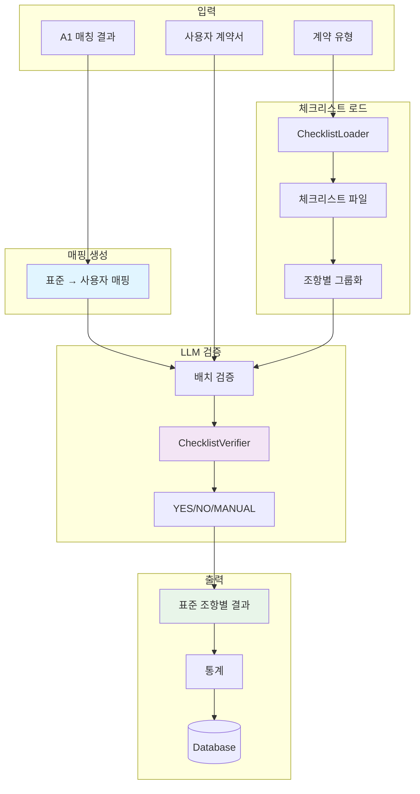
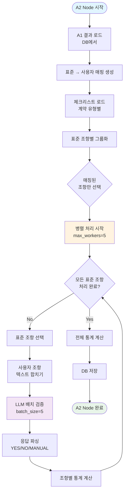
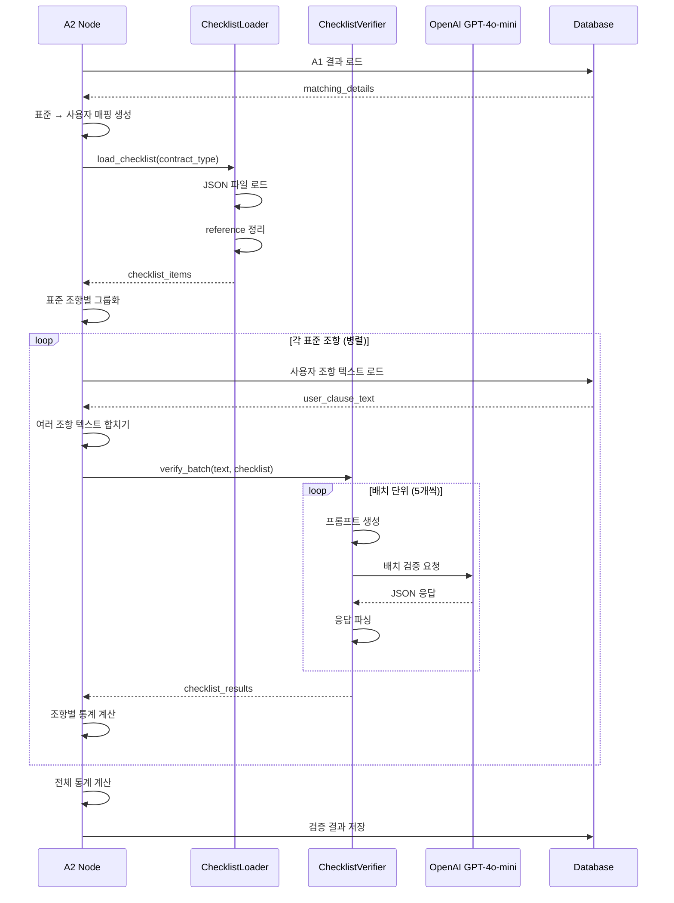

# A2 Node - 체크리스트 검증

## 개요

A2 Node는 사용자 계약서의 각 조항이 활용안내서 기반 체크리스트 요구사항을 충족하는지 검증하는 프로세스. A1 Node에서 매칭된 조항들을 대상으로 LLM 기반 검증을 수행하여 계약서의 법적 완전성과 실무 준수 여부 평가.

### 핵심 특징

- **표준 조항 기준 검증**: 표준 조항별로 체크리스트 그룹화 및 검증
- **A1 매칭 결과 활용**: matched 조항만 처리 (missing/extra 제외)
- **LLM 배치 검증**: 여러 체크리스트 항목을 한 번에 검증하여 효율성 향상
- **3단계 판단**: YES/NO/MANUAL_CHECK_REQUIRED 결과 제공
- **병렬 처리**: 표준 조항별 독립 검증으로 성능 최적화
- **상세 분석**: NO 판단 시 위험도 평가 및 개선 권장사항 제공

### 검증 파이프라인

```
A1 결과 로드 → 표준 조항 매핑 → 체크리스트 로드 → LLM 배치 검증 → 통계 계산 → DB 저장
```

## 아키텍처

### 전체 구조



### 컴포넌트 구성

```
backend/consistency_agent/a2_node/
├── a2_node.py                  # ChecklistCheckNode 클래스
│   ├── check_checklist()             # 메인 검증 함수
│   ├── _load_a1_results()            # A1 결과 로드
│   ├── _build_std_to_user_mapping()  # 표준 → 사용자 매핑
│   └── _save_to_db()                 # DB 저장
├── checklist_loader.py         # ChecklistLoader 클래스
│   ├── load_checklist()              # 체크리스트 로드
│   ├── filter_by_global_ids()        # global_id 필터링
│   └── _clean_references()           # reference 정리
└── checklist_verifier.py       # ChecklistVerifier 클래스
    ├── verify_batch()                # 배치 검증
    ├── verify_single()               # 단일 검증
    └── _verify_batch_llm()           # LLM 호출
```

## 체크리스트 검증 프로세스

### 1. A1 매칭 결과 로드

DB에서 A1 Node의 매칭 결과와 계약 유형 로드.

```python
def _load_a1_results(self, contract_id: str) -> Dict[str, Any]:
    """A1 매칭 결과 및 계약 유형 로드"""
    
    # ValidationResult에서 A1 결과 조회
    validation_result = self.db.query(ValidationResult).filter(
        ValidationResult.contract_id == contract_id
    ).first()
    
    if not validation_result or not validation_result.completeness_check:
        raise ValueError("A1 매칭 결과가 없습니다")
    
    completeness_check = validation_result.completeness_check
    
    # ClassificationResult에서 계약 유형 조회
    classification = self.db.query(ClassificationResult).filter(
        ClassificationResult.contract_id == contract_id
    ).first()
    
    contract_type = classification.confirmed_type
    
    return {
        **completeness_check,
        "contract_type": contract_type
    }
```

**A1 결과 구조**:
```json
{
  "matching_details": [
    {
      "user_article_no": 3,
      "user_article_id": "user_article_003",
      "user_article_title": "데이터 제공",
      "matched": true,
      "matched_articles_global_ids": [
        "urn:std:provide:art:003",
        "urn:std:provide:art:005"
      ]
    }
  ],
  "contract_type": "provide"
}
```

### 2. 표준 조항 → 사용자 조항 매핑 생성

A1의 사용자 조항 기준 매칭을 표준 조항 기준으로 재조립.

```python
def _build_std_to_user_mapping(
    self,
    matching_details: List[Dict[str, Any]]
) -> Dict[str, List[Dict[str, Any]]]:
    """표준 조항 → 사용자 조항 매핑 생성"""
    
    std_to_user_map = {}
    
    for detail in matching_details:
        if not detail.get('matched', False):
            continue
        
        # 사용자 조항 정보
        user_info = {
            'user_article_no': detail['user_article_no'],
            'user_article_id': detail['user_article_id'],
            'user_article_title': detail['user_article_title']
        }
        
        # 매칭된 표준 조항들
        matched_global_ids = detail.get('matched_articles_global_ids', [])
        
        for std_global_id in matched_global_ids:
            if std_global_id not in std_to_user_map:
                std_to_user_map[std_global_id] = []
            
            # 중복 방지
            if user_info not in std_to_user_map[std_global_id]:
                std_to_user_map[std_global_id].append(user_info)
    
    return std_to_user_map
```

**매핑 결과 예시**:
```json
{
  "urn:std:provide:art:003": [
    {
      "user_article_no": 3,
      "user_article_id": "user_article_003",
      "user_article_title": "데이터 제공"
    },
    {
      "user_article_no": 5,
      "user_article_id": "user_article_005",
      "user_article_title": "제공 범위"
    }
  ]
}
```

**설계 근거**:
- 표준 조항 하나에 여러 사용자 조항이 매칭될 수 있음
- 체크리스트는 표준 조항 기준으로 작성되어 있음
- 매칭된 모든 사용자 조항을 합쳐서 검증

### 3. 체크리스트 로드 및 필터링

활용안내서 기반 체크리스트 JSON 파일 로드 및 표준 조항별 그룹화.

```python
# ChecklistLoader 사용
checklist_loader = ChecklistLoader()

# 전체 체크리스트 로드 (preamble 제외)
all_checklists = checklist_loader.load_checklist(
    contract_type="provide",
    has_preamble=False
)

# 표준 조항별로 그룹화
checklist_by_std = {}
for item in all_checklists:
    std_id = item['global_id']
    if std_id not in checklist_by_std:
        checklist_by_std[std_id] = []
    checklist_by_std[std_id].append(item)
```

**체크리스트 파일 경로**:
```
data/chunked_documents/guidebook_chunked_documents/checklist_documents/
├── provide_gud_contract_check_chunks_flat.json
├── create_gud_contract_check_chunks_flat.json
├── process_gud_contract_check_chunks_flat.json
├── brokerage_provider_gud_contract_check_chunks_flat.json
└── brokerage_user_gud_contract_check_chunks_flat.json
```

**체크리스트 항목 구조**:
```json
{
  "check_text": "당사자가 개인인지 법인인지 명시되어 있는가?",
  "reference": "제1조",
  "global_id": "urn:std:provide:art:001"
}
```

**Reference 정리 규칙**:
- 페이지 번호 제거: "제1조 (106쪽)" → "제1조"
- 부가 설명 제거: "제1조 및 서명 날인" → "제1조"
- "서문 또는 제1조" → "제1조" (서문은 별도 처리)

### 4. matched 조항만 처리하는 로직

A1에서 매칭된 조항만 체크리스트 검증 대상으로 선정.

```python
# 검증 대상 필터링 (매칭된 조항만)
items_to_verify = [
    (std_global_id, checklist_items)
    for std_global_id, checklist_items in checklist_by_std.items()
    if std_to_user_map.get(std_global_id)  # 매칭된 조항만
]
```

**처리 대상**:
- ✅ matched: 사용자 조항과 매칭된 표준 조항 → 체크리스트 검증
- ❌ missing: 누락된 표준 조항 → A1에서 이미 처리
- ❌ extra: 표준에 없는 사용자 조항 → A1에서 이미 처리

**설계 근거**:
- 체크리스트는 표준 조항의 세부 요구사항
- 누락된 조항은 체크리스트 검증 불필요 (이미 누락으로 판정)
- 매칭된 조항만 세부 요구사항 충족 여부 확인

### 5. LLM 검증 프로세스

#### 5.1 사용자 조항 텍스트 합치기

표준 조항에 매칭된 여러 사용자 조항을 하나의 텍스트로 결합.

```python
def _combine_user_article_texts(
    self,
    contract_id: str,
    matched_users: List[Dict[str, Any]]
) -> str:
    """여러 사용자 조항 텍스트를 합침"""
    
    texts = []
    
    for user in matched_users:
        article_no = user['user_article_no']
        article_title = user['user_article_title']
        article_text = self._get_user_clause_text(
            contract_id,
            user['user_article_id']
        )
        
        if article_text:
            texts.append(
                f"[사용자 제{article_no}조: {article_title}]\n{article_text}"
            )
    
    return "\n\n".join(texts)
```

**합쳐진 텍스트 예시**:
```
[사용자 제3조: 데이터 제공]
제공자는 데이터를 이용자에게 제공한다.
① 제공 범위는 별지 1과 같다.
② 제공 방법은 전자적 방식으로 한다.

[사용자 제5조: 제공 범위]
데이터 제공 범위는 다음과 같다.
① 개인정보를 제외한 모든 데이터
② 2024년 1월 1일 이후 생성된 데이터
```

#### 5.2 배치 검증

여러 체크리스트 항목을 한 번에 LLM으로 검증.

```python
# ChecklistVerifier 사용
verifier = ChecklistVerifier(llm_client, model="gpt-4o-mini")

# 배치 검증 (기본 5개씩)
checklist_results = verifier.verify_batch(
    combined_text,
    checklist_items,
    batch_size=5
)
```

**배치 검증 장점**:
- LLM API 호출 횟수 감소 (비용 절감)
- 전체 처리 시간 단축
- 체크리스트 항목 간 일관성 향상

### 6. 프롬프트 구조

#### 6.1 배치 검증 프롬프트

```
다음 계약서 조항이 아래 체크리스트 요구사항들을 충족하는지 검증해주세요.

[계약서 조항]
{user_clause_text}

[체크리스트]
1. 당사자가 개인인지 법인인지 명시되어 있는가?
2. 당사자의 주소가 기재되어 있는가?
3. 사업자등록번호가 기재되어 있는가?

각 항목에 대해 다음 형식으로 답변해주세요:
1. 결과: YES, NO, 또는 MANUAL_CHECK_REQUIRED
2. 근거: 판단 근거 (YES인 경우 계약서의 해당 부분 인용)
3. 신뢰도: 0.0~1.0 사이의 값

**판단 기준:**
- YES: 요구사항이 계약서에 명시되어 있음
- NO: 요구사항이 계약서에 명시되지 않음 (내용 자체가 없음)
- MANUAL_CHECK_REQUIRED: 계약서에 내용은 있으나 외부 확인이 필요함

**MANUAL_CHECK_REQUIRED 판단 기준:**
1. 계약서에 해당 내용이 이미 기재되어 있어야 함
2. 그 내용이 정확한지 외부 문서/정보와 대조가 필요함

예시:
- 계약서: "사업자등록번호 123-45-67890"
  → 질문: "등기부등본과 일치하는가?"
  → MANUAL_CHECK_REQUIRED (내용 있음 + 외부 확인 필요)

- 계약서: 사업자등록번호 없음
  → 질문: "사업자등록번호가 기재되어 있는가?"
  → NO (내용 자체가 없음)

**NO 판단 시 추가 정보:**
- missing_explanation: 왜 불충분한지 상세 설명
- risk_level: "high" | "medium" | "low"
- risk_description: 누락 시 위험
- recommendation: 개선 권장사항 (반드시 "제n조에..." 형식)

JSON 배열 형식으로 답변:
{
  "results": [
    {
      "item_number": 1,
      "result": "YES" or "NO" or "MANUAL_CHECK_REQUIRED",
      "evidence": "근거 텍스트" or null,
      "confidence": 0.95,
      "manual_check_reason": "..." (MANUAL_CHECK_REQUIRED인 경우만),
      "user_action": "..." (MANUAL_CHECK_REQUIRED인 경우만),
      "missing_explanation": "..." (NO인 경우만),
      "risk_level": "high" (NO인 경우만),
      "risk_description": "..." (NO인 경우만),
      "recommendation": "제1조에 ..." (NO인 경우만)
    }
  ]
}
```

**프롬프트 특징**:
- 3단계 판단 (YES/NO/MANUAL_CHECK_REQUIRED)
- 외부 확인 필요 항목 명시적 구분
- NO 판단 시 상세한 위험도 평가
- 개선 권장사항 제공

#### 6.2 응답 파싱

```python
# LLM 응답 파싱
llm_data = json.loads(response_text)
llm_results = llm_data.get('results', [])

# 결과 매핑
for idx, item in enumerate(checklist_items):
    llm_result = llm_results[idx]
    
    result_data = {
        "check_text": item.get('check_text', ''),
        "reference": item.get('reference', ''),
        "std_global_id": item.get('global_id', ''),
        "result": llm_result.get('result', 'NO'),
        "evidence": llm_result.get('evidence'),
        "confidence": float(llm_result.get('confidence', 0.5))
    }
    
    # MANUAL_CHECK_REQUIRED인 경우 추가 정보
    if llm_result.get('result') == 'MANUAL_CHECK_REQUIRED':
        result_data['manual_check_reason'] = llm_result.get('manual_check_reason', '')
        result_data['user_action'] = llm_result.get('user_action', '')
    
    # NO인 경우 추가 정보
    elif llm_result.get('result') == 'NO':
        result_data['missing_explanation'] = llm_result.get('missing_explanation', '')
        result_data['risk_level'] = llm_result.get('risk_level', 'medium')
        result_data['risk_description'] = llm_result.get('risk_description', '')
        result_data['recommendation'] = llm_result.get('recommendation', '')
```

### 7. 병렬 처리

표준 조항별로 독립적으로 검증하여 성능 최적화.

```python
from concurrent.futures import ThreadPoolExecutor, as_completed

# 병렬 실행 (max_workers=5)
with ThreadPoolExecutor(max_workers=5) as executor:
    future_to_item = {
        executor.submit(process_single_std_article, item): item
        for item in items_to_verify
    }
    
    for future in as_completed(future_to_item):
        result = future.result()
        if result:
            std_article_results.append(result)
```

**병렬 처리 효과**:
- 표준 조항 20개 기준 약 60% 시간 단축
- 각 조항의 체크리스트 검증은 독립적
- LLM API 호출 병렬화

## A2 Node 플로우차트



## LLM 검증 시퀀스



## 출력 스키마

### YES/NO/MANUAL_CHECK_REQUIRED 결과 구조

```json
{
  "std_article_results": [
    {
      "std_article_id": "urn:std:provide:art:001",
      "std_article_title": "제1조",
      "std_article_number": "제1조",
      "matched_user_articles": [
        {
          "user_article_no": 1,
          "user_article_id": "user_article_001",
          "user_article_title": "목적"
        }
      ],
      "checklist_results": [
        {
          "check_text": "당사자가 개인인지 법인인지 명시되어 있는가?",
          "reference": "제1조",
          "std_global_id": "urn:std:provide:art:001",
          "result": "YES",
          "evidence": "제1조(목적) 서문에서 '갑: 케이텔레콤 주식회사, 을: 베타AI 주식회사'로 명시되어 있음.",
          "confidence": 0.95
        },
        {
          "check_text": "등기부등본과 일치하는가?",
          "reference": "제1조",
          "std_global_id": "urn:std:provide:art:001",
          "result": "MANUAL_CHECK_REQUIRED",
          "evidence": null,
          "confidence": 0.8,
          "manual_check_reason": "서문에는 '케이텔레콤 주식회사', '서울시 강남구 테헤란로 123', '사업자등록번호 123-45-67890'으로 기재되어 있습니다. 이 정보가 등기부등본과 정확히 일치하는지 AI가 직접 확인할 수 없습니다.",
          "user_action": "등기부등본과 대조하여 회사명, 주소, 사업자등록번호 확인"
        },
        {
          "check_text": "수행계획서 작성 및 제출 절차가 명시되어 있는가?",
          "reference": "제1조",
          "std_global_id": "urn:std:provide:art:001",
          "result": "NO",
          "evidence": null,
          "confidence": 0.9,
          "missing_explanation": "계약서 제3조에 '일정 협의' 조항이 있으나, 표준계약서에서 요구하는 '수행계획서 작성 및 제출 절차'가 명시되지 않았습니다. 현재는 단순히 일정을 협의한다는 내용만 있어, 구체적인 수행 계획의 작성 주체, 제출 시기, 승인 절차 등이 불명확합니다.",
          "risk_level": "high",
          "risk_description": "수행계획서 미작성 시 용역 범위 분쟁 가능성",
          "recommendation": "제1조에 수행계획서 작성 및 제출 절차 추가"
        }
      ],
      "statistics": {
        "total_items": 10,
        "passed_items": 7,
        "failed_items": 2,
        "unclear_items": 0,
        "manual_check_items": 1,
        "pass_rate": 0.7
      }
    }
  ],
  "statistics": {
    "matched_std_articles": 15,
    "total_checklist_items": 150,
    "passed_items": 120,
    "failed_items": 20,
    "unclear_items": 0,
    "manual_check_items": 10,
    "overall_pass_rate": 0.8
  },
  "processing_time": 45.3,
  "verification_date": "2024-01-15T10:30:00"
}
```

### 필드 설명

| 필드 | 타입 | 설명 |
|------|------|------|
| `std_article_id` | string | 표준 조항 global_id |
| `std_article_title` | string | 표준 조항 제목 |
| `matched_user_articles` | array | 매칭된 사용자 조항 목록 |
| `checklist_results` | array | 체크리스트 검증 결과 |
| `result` | string | YES, NO, MANUAL_CHECK_REQUIRED |
| `evidence` | string \| null | 판단 근거 (YES인 경우) |
| `confidence` | float | 신뢰도 (0.0~1.0) |
| `manual_check_reason` | string | 외부 확인 필요 이유 (MANUAL인 경우) |
| `user_action` | string | 사용자 확인 방법 (MANUAL인 경우) |
| `missing_explanation` | string | 누락 상세 설명 (NO인 경우) |
| `risk_level` | string | 위험도 (NO인 경우) |
| `risk_description` | string | 위험 설명 (NO인 경우) |
| `recommendation` | string | 개선 권장사항 (NO인 경우) |

## 코드 예시

### 기본 사용법

```python
from backend.consistency_agent.a2_node.a2_node import ChecklistCheckNode
from backend.shared.database import SessionLocal
from openai import AzureOpenAI

# 초기화
db = SessionLocal()
azure_client = AzureOpenAI(...)

a2_node = ChecklistCheckNode(
    db_session=db,
    llm_client=azure_client
)

# 체크리스트 검증
result = a2_node.check_checklist(
    contract_id="contract_123",
    matching_types=["primary"]  # primary 매칭만 처리
)

# 결과 확인
stats = result['statistics']
print(f"전체 통과율: {stats['overall_pass_rate']:.1%}")
print(f"통과: {stats['passed_items']}개")
print(f"실패: {stats['failed_items']}개")
print(f"외부 확인 필요: {stats['manual_check_items']}개")

# 표준 조항별 결과
for article_result in result['std_article_results']:
    std_id = article_result['std_article_id']
    article_stats = article_result['statistics']
    print(f"{std_id}: {article_stats['pass_rate']:.1%} 통과")
```

### ChecklistLoader 직접 사용

```python
from backend.consistency_agent.a2_node.checklist_loader import ChecklistLoader

# 초기화
loader = ChecklistLoader()

# 체크리스트 로드
checklists = loader.load_checklist(
    contract_type="provide",
    has_preamble=False
)

print(f"전체 체크리스트: {len(checklists)}개")

# global_id로 필터링
filtered = loader.filter_by_global_ids(
    checklists,
    ["urn:std:provide:art:001", "urn:std:provide:art:003"]
)

print(f"필터링 결과: {len(filtered)}개")
```

### ChecklistVerifier 직접 사용

```python
from backend.consistency_agent.a2_node.checklist_verifier import ChecklistVerifier

# 초기화
verifier = ChecklistVerifier(
    azure_client=azure_client,
    model="gpt-4o-mini"
)

# 배치 검증
user_text = """
제1조 (목적)
갑: 케이텔레콤 주식회사
을: 베타AI 주식회사
"""

checklist_items = [
    {
        "check_text": "당사자가 개인인지 법인인지 명시되어 있는가?",
        "reference": "제1조",
        "global_id": "urn:std:provide:art:001"
    }
]

results = verifier.verify_batch(
    user_text,
    checklist_items,
    batch_size=5
)

# 결과 확인
for result in results:
    print(f"질문: {result['check_text']}")
    print(f"결과: {result['result']}")
    print(f"근거: {result['evidence']}")
    print(f"신뢰도: {result['confidence']:.2f}")
```

## 관련 문서

- [Consistency Agent](CONSISTENCY_AGENT.md): 전체 아키텍처 및 노드 개요
- [A1 하이브리드 검색](CONSISTENCY_A1_HYBRID_SEARCH.md): 조항 매칭 로직
- [A1 누락 검증](CONSISTENCY_A1_MISSING_VERIFICATION.md): 누락 조항 재검증
- [A3 Node](CONSISTENCY_A3_NODE.md): 내용 분석
- [출력 스키마](CONSISTENCY_OUTPUT_SCHEMAS.md): A1/A2/A3 출력 구조
