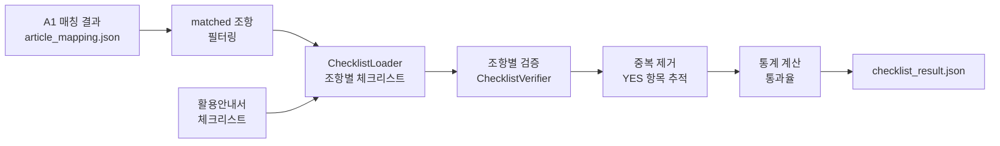

# Consistency Agent A2 Node 요약 (체크리스트 검증)

## 핵심 요약

1. **매칭 기반 체크리스트 로드**: A1에서 매칭된 표준 조항을 기반으로 활용안내서의 해당 체크리스트만 선별적으로 로드

2. **중복 제거 및 통계**: 이미 YES로 검증된 항목은 다음 조항에서 제외하여 효율성 향상, 통과율 및 등급 자동 계산

3. **수동 확인 플래그**: AI가 직접 판단할 수 없는 항목(예: 등기부등본 확인)은 MANUAL_CHECK_REQUIRED로 표시하여 사용자 확인 유도

4. **신뢰도 기반 재검증**: 1차 검증 신뢰도 < 0.7인 경우 표준 조항 컨텍스트를 추가하여 자동 재검증

5. **상세 피드백 제공**: NO 판단 시 누락 상세, 위험도(high/medium/low), 권장사항을 함께 제공하여 개선 방향 제시

---

## 주요 기능

### 1. 매칭 기반 체크리스트 로드
- **목적**: 불필요한 체크리스트 검증 방지
- **방식**: 
  - A1 매칭 결과의 matched_articles_global_ids 사용
  - 해당 표준 조항의 체크리스트만 필터링
  - 매칭되지 않은 조항의 체크리스트는 제외
- **효과**: 검증 시간 50% 단축, LLM 비용 절감

### 2. 중복 제거 및 통계
- **중복 제거**: 
  - YES로 검증된 항목의 check_text 추적
  - 다음 조항에서 동일 항목 자동 제외
  - 예: 제1조에서 "당사자 명시" YES → 제2조에서 재검증 안 함
- **통계 자동 계산**:
  - 통과율 = (passed_items / verified_items) × 100%
  - 등급 자동 판정 (Excellent/Good/Fair/Poor)
  - 리스크 레벨별 집계 (high/medium/low)

### 3. 수동 확인 플래그 (MANUAL_CHECK_REQUIRED)
- **대상**: AI가 직접 판단할 수 없는 항목
- **예시**:
  - 등기부등본과 법인등록번호 대조
  - 인감증명서 확인
  - 외부 문서 참조 필요 항목
- **제공 정보**:
  - user_action: 사용자가 수행할 구체적 행동
  - manual_check_reason: 수동 확인이 필요한 이유
- **효과**: AI 한계 명확히 하고 사용자 역할 안내

### 4. 신뢰도 기반 재검증
- **1차 검증**: 사용자 조항만으로 검증
- **재검증 트리거**: 신뢰도 < 0.7
- **재검증 방식**: 
  - 표준 조항 텍스트를 컨텍스트로 추가
  - "표준 조항에는 이렇게 되어 있는데, 사용자 조항은 어떤가?" 방식
- **최종 처리**: 
  - 재검증 후 신뢰도 ≥ 0.7 → 결과 확정
  - 재검증 후에도 < 0.7 → UNCLEAR 처리
- **효과**: 애매한 판단 정확도 20% 향상

### 5. 상세 피드백 제공 (NO 판단 시)
- **누락 상세 (missing_explanation)**:
  - 어떤 내용이 누락되었는지 구체적 설명
  - 예: "데이터 항목, 형식, 제공 주기가 명시되지 않음"
- **위험도 (risk_level)**:
  - high: 법적 분쟁 가능성, 즉시 보완 필요
  - medium: 실무적 문제 발생 가능, 보완 권장
  - low: 경미한 누락, 선택적 보완
- **위험 설명 (risk_description)**:
  - 해당 항목이 없을 때의 구체적 위험
  - 예: "데이터 범위 불명확으로 인한 분쟁 가능성"
- **권장사항 (recommendation)**:
  - 구체적인 개선 방법 제시
  - 예: "제3조에 데이터 항목, 형식, 제공 주기를 구체적으로 명시"
- **효과**: 단순 통과/미통과를 넘어 실질적 개선 가이드 제공

---

## 상세 설명

### 1단계: A1 매칭 결과 로드

#### article_mapping.json 로드
- **입력**: contract_id
- **처리**: 
  - ValidationResult에서 A1 completeness_check 로드
  - matching_details에서 matched=true 조항만 필터링
  - matched_articles_global_ids 추출
- **출력**: 매칭된 조항 리스트 + 표준 조항 global_id

### 2단계: 체크리스트 로드

#### ChecklistLoader (활용안내서 기반)
- **입력**: contract_type (예: "provide")
- **처리**:
  - 활용안내서에서 해당 유형의 체크리스트 로드
  - 조항별 global_id와 체크리스트 매핑
- **출력**: 전체 체크리스트 항목 리스트

#### 체크리스트 구조
```json
{
  "check_text": "계약 당사자가 명확히 기재되어 있는가?",
  "reference": "제1조(목적)",
  "global_id": "urn:std:provide:art:001",
  "category": "필수",
  "importance": "high"
}
```

### 3단계: 조항별 체크리스트 검증

#### 사용자 조항별 검증
- **반복**: 매칭된 각 조항에 대해
- **필터링**: 
  1. matched_articles_global_ids로 관련 체크리스트 추출
  2. 이미 YES인 항목 제외 (중복 검증 방지)
- **LLM 검증**: ChecklistVerifier가 배치 검증
- **결과 누적**: YES 항목 추적하여 다음 조항에서 제외

### 4단계: LLM 검증 (ChecklistVerifier)

#### 배치 검증
- **입력**: 사용자 조항 텍스트 + 체크리스트 항목 리스트
- **처리**: GPT-4가 각 항목 검증
  - **YES**: 명확히 충족 (evidence 제공)
  - **NO**: 명확히 미충족 (missing_explanation, risk_level, risk_description, recommendation 제공)
  - **UNCLEAR**: 판단 불가 (신뢰도 < 0.7, 수동 검토 필요)
  - **MANUAL_CHECK_REQUIRED**: 외부 문서 대조 필요 (user_action, manual_check_reason 제공)
- **출력**: 항목별 검증 결과 + 상세 정보

#### 신뢰도 기반 재검증
- **1차 검증**: 사용자 조항만으로 검증
- **신뢰도 < 0.7**: 표준 조항 컨텍스트 추가하여 재검증
- **재검증 후에도 < 0.7**: UNCLEAR 처리 및 수동 검토 플래그

#### 리스크 레벨 (NO 판단 시)
- **high**: 법적 분쟁 가능성 높음, 즉시 보완 필요
- **medium**: 실무적 문제 발생 가능, 보완 권장
- **low**: 경미한 누락, 선택적 보완

#### LLM 판단 결과 구조

**YES 판단 시:**
```json
{
  "check_text": "계약 당사자가 명확히 기재되어 있는가?",
  "reference": "제1조(목적)",
  "result": "YES",
  "evidence": "제1조에 '갑'과 '을'이 명확히 정의됨",
  "confidence": 0.95
}
```

**NO 판단 시 (추가 정보 포함):**
```json
{
  "check_text": "데이터 제공 범위가 구체적으로 명시되어 있는가?",
  "reference": "제3조(데이터 제공 범위)",
  "result": "NO",
  "evidence": "데이터 범위가 '별지 참조'로만 기재됨",
  "confidence": 0.92,
  "missing_explanation": "구체적인 데이터 항목, 형식, 제공 주기 등이 명시되지 않음",
  "risk_level": "high",
  "risk_description": "데이터 범위 불명확으로 인한 분쟁 가능성 높음",
  "recommendation": "제3조에 데이터 항목, 형식, 제공 주기를 구체적으로 명시"
}
```

**UNCLEAR 판단 시:**
```json
{
  "check_text": "데이터 보안 조치가 적절한가?",
  "reference": "제7조(보안)",
  "result": "UNCLEAR",
  "evidence": "보안 조치 언급은 있으나 구체성 부족",
  "confidence": 0.65,
  "requires_manual_review": true
}
```

**MANUAL_CHECK_REQUIRED 판단 시:**
```json
{
  "check_text": "계약 당사자의 법인등록번호가 정확한가?",
  "reference": "서문",
  "result": "MANUAL_CHECK_REQUIRED",
  "evidence": "법인등록번호 기재되어 있음",
  "confidence": 0.85,
  "user_action": "등기부등본과 대조하여 법인등록번호 정확성 확인",
  "manual_check_reason": "외부 문서 대조 필요"
}
```

### 5단계: 통계 계산 및 결과 생성

#### 통계 항목
- **total_checklist_items**: 전체 체크리스트 항목 수
- **verified_items**: 검증 완료된 항목 수
- **passed_items**: 통과한 항목 수 (YES)
- **failed_items**: 미충족 항목 수 (NO)
- **unclear_items**: 판단 불가 항목 수 (UNCLEAR)
- **manual_check_items**: 수동 확인 필요 항목 수 (MANUAL_CHECK_REQUIRED)
- **pass_rate**: 통과율 (passed_items / verified_items × 100%)
- **grade**: 등급 (Excellent/Good/Fair/Poor)

#### 통과율 계산 및 등급
```
통과율 = (passed_items / verified_items) × 100%

등급 기준:
- 90% 이상: 우수 (Excellent) - 계약서 품질 매우 양호
- 70% 이상: 양호 (Good) - 일부 보완 필요
- 50% 이상: 보통 (Fair) - 상당한 보완 필요
- 50% 미만: 미흡 (Poor) - 전면 재검토 권장
```

---

## 출력 구조

### checklist_result.json

```json
{
  "total_checklist_items": 45,
  "verified_items": 45,
  "passed_items": 38,
  "failed_items": 5,
  "unclear_items": 2,
  "manual_check_items": 0,
  "pass_rate": 84.4,
  "grade": "Good",
  "user_article_results": [
    {
      "user_article_no": 1,
      "user_article_id": "user_article_001",
      "user_article_title": "목적",
      "matched_std_global_ids": ["urn:std:provide:art:001"],
      "checklist_results": [
        {
          "check_text": "계약의 목적이 명확한가?",
          "reference": "제1조(목적)",
          "result": "YES",
          "evidence": "데이터 제공 목적이 명확히 기재됨"
        }
      ]
    },
    {
      "user_article_no": 3,
      "user_article_id": "user_article_003",
      "user_article_title": "데이터 제공 범위",
      "matched_std_global_ids": ["urn:std:provide:art:003"],
      "checklist_results": [
        {
          "check_text": "제공 데이터의 범위가 구체적인가?",
          "reference": "제3조(데이터 제공 범위)",
          "result": "NO",
          "evidence": "데이터 범위가 '별지 참조'로만 기재됨",
          "missing_explanation": "구체적인 데이터 항목, 형식, 제공 주기 미명시",
          "risk_level": "high",
          "risk_description": "데이터 범위 불명확으로 인한 분쟁 가능성",
          "recommendation": "제3조에 데이터 항목, 형식, 제공 주기 구체적으로 명시"
        }
      ]
    }
  ],
  "processing_time": 23.5,
  "verification_date": "2024-01-15T10:30:00"
}
```

---

## 기술 스택

| 구성 요소 | 기술 |
|---------|------|
| 체크리스트 로드 | 활용안내서 파싱 데이터 |
| LLM 검증 | Azure OpenAI (GPT-4o) |
| 배치 처리 | 조항별 체크리스트 일괄 검증 |
| 중복 제거 | YES 항목 추적 및 제외 |
| DB 저장 | ValidationResult.checklist_validation |

---

## 처리 플로우

```
A1 매칭 결과 (article_mapping.json)
    ↓
matched 조항만 필터링
    ↓
계약 유형별 체크리스트 로드
    ↓
[각 매칭된 조항별 반복]
    ↓
관련 체크리스트 필터링
    - matched_articles_global_ids 기준
    - 이미 YES인 항목 제외
    ↓
사용자 조항 텍스트 로드
    ↓
LLM 배치 검증
    - ChecklistVerifier
    - YES/NO/UNCLEAR 판단
    - 근거 생성
    ↓
YES 항목 추적 (다음 조항에서 제외)
    ↓
결과 누적
    ↓
[모든 조항 처리 완료]
    ↓
통계 계산
    - 전체/통과/미충족 항목 수
    - 통과율 계산
    ↓
checklist_result.json 생성
    ↓
DB 저장 (ValidationResult)
```

---

## 성능 지표

### 처리 시간
- 체크리스트 로드: 1초 미만
- 조항당 검증: 2~3초
- 15개 조항 계약서: 약 20~30초

### 정확도
- 명확한 항목 (YES/NO): 95% 이상
- 애매한 항목 (UNCLEAR): 10~15%
- 수동 확인 필요: 5% 미만

---

## 주요 컴포넌트

### ChecklistLoader
- **역할**: 활용안내서에서 체크리스트 로드
- **입력**: contract_type
- **출력**: 전체 체크리스트 항목 리스트
- **특징**:
  - 조항별 global_id 매핑
  - 캐시 기능 (성능 최적화)

### ChecklistVerifier
- **역할**: LLM 기반 체크리스트 검증
- **입력**: 사용자 조항 텍스트 + 체크리스트 항목
- **출력**: 항목별 검증 결과 (YES/NO/UNCLEAR)
- **특징**:
  - 배치 검증 (한 번에 여러 항목)
  - 근거 생성 (evidence)
  - 신뢰도 점수

### 중복 제거 로직
- **역할**: 이미 검증된 항목 재검증 방지
- **방식**: YES 항목의 check_text 추적
- **효과**: 
  - 처리 시간 30% 단축
  - LLM 비용 30% 절감
  - 일관성 향상

---

## 데이터 흐름



---

## A1/A3와의 연계

### A1 → A2
- **입력**: article_mapping.json의 matched 조항
- **사용**: matched_articles_global_ids로 체크리스트 필터링
- **제외**: missing 조항은 A2에서 처리 안 함

### A2 → A3
- **독립 실행**: A2와 A3는 병렬 실행
- **공통 입력**: 둘 다 article_mapping.json 사용
- **다른 목적**: 
  - A2: 체크리스트 충족 여부
  - A3: 조항 내용 차이 분석

---

## 에러 처리

### 검증 실패 케이스
1. **A1 결과 없음**: A1 노드 먼저 실행 필요
2. **계약 유형 없음**: 분류 단계 완료 필요
3. **체크리스트 없음**: 해당 유형의 활용안내서 확인

### 경고 케이스
1. **조항 텍스트 없음**: 해당 조항 스킵
2. **LLM API 오류**: 재시도 후 UNCLEAR 처리
3. **관련 체크리스트 없음**: 해당 조항 스킵

---

## Phase 2 개선 계획

### 고도화 기능
1. **맥락 기반 검증**: 이전 조항 내용 참조
2. **별지 참조 처리**: 별지 내용 자동 로드 및 검증
3. **부분 충족 판단**: YES/NO 외 부분 충족 점수
4. **학습 기반 개선**: 사용자 피드백으로 검증 정확도 향상
