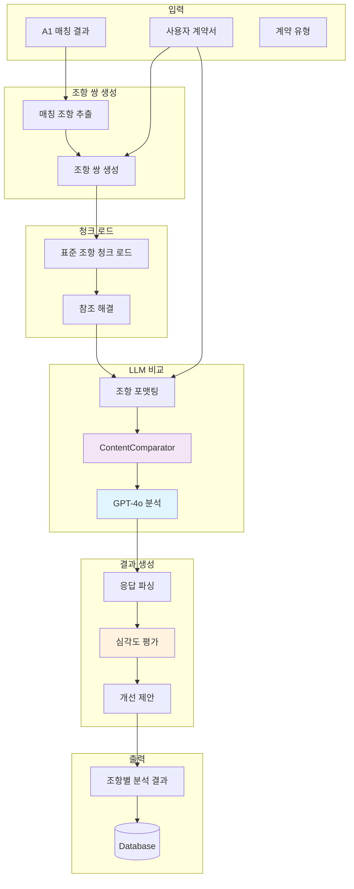
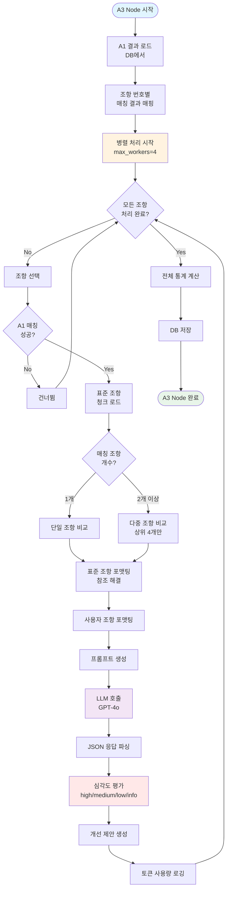
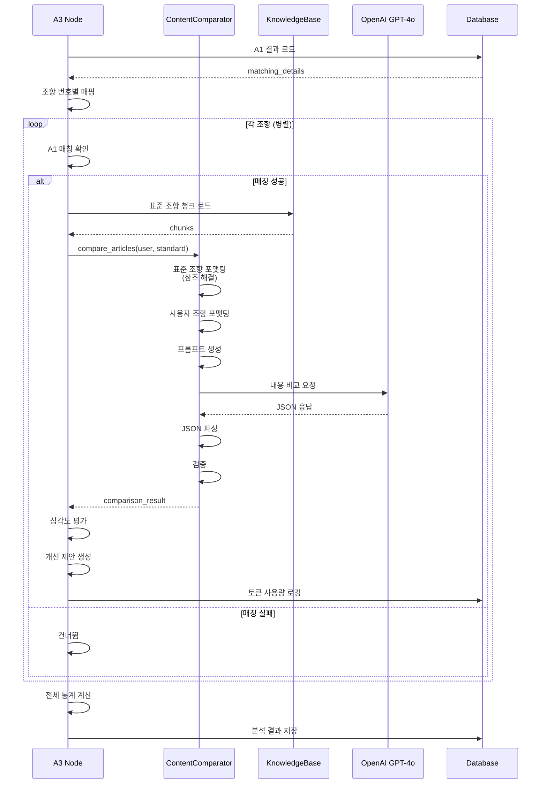

# A3 Node - 내용 분석

## 개요

A3 Node는 사용자 계약서의 각 조항이 표준계약서 조항의 내용을 얼마나 충실하게 반영했는지 분석하는 프로세스. A1 Node에서 매칭된 조항들을 대상으로 LLM 기반 내용 비교를 수행하여 누락 항목, 불충분 항목, 개선 제안 생성.

### 핵심 특징

- **A1 매칭 결과 활용**: matched 조항만 처리 (missing/extra 제외)
- **LLM 내용 비교**: GPT-4o 기반 상세 분석
- **참고 자료 활용**: 활용안내서 해설, 별지, 참조 조항 종합 분석
- **3단계 평가**: 완전성, 명확성, 실무성 기준
- **심각도 분류**: high/medium/low/info 4단계
- **병렬 처리**: 조항별 독립 분석으로 성능 최적화

### 검증 파이프라인

```
A1 결과 로드 → 조항 쌍 생성 → 표준 조항 청크 로드 → LLM 내용 비교 → 심각도 평가 → DB 저장
```

## 아키텍처

### 전체 구조



### 컴포넌트 구성

```
backend/consistency_agent/a3_node/
├── a3_node.py                  # ContentAnalysisNode 클래스
│   ├── analyze_contract()            # 전체 계약서 분석
│   ├── analyze_article()             # 단일 조항 분석
│   ├── _load_a1_matching_results()   # A1 결과 로드
│   └── _load_standard_article_chunks() # 표준 조항 청크 로드
└── content_comparator.py       # ContentComparator 클래스
    ├── compare_articles()            # 조항 비교 메인
    ├── _compare_single_article()     # 단일 조항 비교
    ├── _compare_multiple_selected_articles() # 다중 조항 비교
    ├── _format_standard_article()    # 표준 조항 포맷팅
    ├── _format_user_article()        # 사용자 조항 포맷팅
    ├── _load_referenced_exhibits()   # 별지 참조 로드
    ├── _load_referenced_articles()   # 조항 참조 로드
    └── _parse_llm_response()         # LLM 응답 파싱
```

## 내용 비교 프로세스

### 1. A1 매칭 결과 로드

DB에서 A1 Node의 매칭 결과 로드.

```python
def _load_a1_matching_results(
    self,
    contract_id: str,
    matching_types: List[str] = None
) -> List[Dict[str, Any]]:
    """A1 노드의 매칭 결과를 DB에서 로드"""
    
    if matching_types is None:
        matching_types = ["primary"]
    
    # ValidationResult에서 completeness_check 필드 로드
    validation_result = db.query(ValidationResult).filter(
        ValidationResult.contract_id == contract_id
    ).first()
    
    completeness_check = validation_result.completeness_check
    
    # matching_types에 따라 결과 수집
    all_matching_details = []
    if "primary" in matching_types:
        all_matching_details.extend(
            completeness_check.get('matching_details', [])
        )
    if "recovered" in matching_types:
        all_matching_details.extend(
            completeness_check.get('recovered_matching_details', [])
        )
    
    return all_matching_details
```

**A1 결과 구조**:
```json
{
  "user_article_no": 3,
  "user_article_id": "user_article_003",
  "user_article_title": "데이터 제공",
  "matched": true,
  "matched_articles_global_ids": [
    "urn:std:provide:art:003",
    "urn:std:provide:art:005"
  ],
  "matched_articles_details": [
    {
      "parent_id": "조문3",
      "global_id": "urn:std:provide:art:003",
      "title": "제3조(데이터의 제공)",
      "combined_score": 0.85,
      "num_sub_items": 3,
      "matched_sub_items": [0, 1, 2]
    }
  ]
}
```

### 2. 조항 쌍 생성 (user ↔ standard)

A1에서 매칭된 조항만 처리.

```python
# 조항 번호별 매칭 결과 매핑
a1_results_by_article = {
    detail['user_article_no']: detail
    for detail in a1_matching_details
}

# 각 사용자 조항 처리
for article in user_contract['articles']:
    article_no = article.get('number')
    a1_result = a1_results_by_article.get(article_no)
    
    if not a1_result or not a1_result.get('matched'):
        # 매칭되지 않은 조항은 건너뜀
        continue
    
    # 조항 분석 수행
    analysis = self.analyze_article(
        article,
        contract_type,
        contract_id,
        a1_matching_result=a1_result
    )
```

**처리 대상**:
- ✅ matched: 사용자 조항과 매칭된 표준 조항 → 내용 비교
- ❌ missing: 누락된 표준 조항 → A1에서 이미 처리
- ❌ extra: 표준에 없는 사용자 조항 → A1에서 이미 처리

**설계 근거**:
- 내용 비교는 매칭된 조항 쌍에만 의미가 있음
- 누락된 조항은 비교할 사용자 조항이 없음
- 추가 조항은 비교할 표준 조항이 없음

### 3. article_mapping 활용 (matched만 처리)

A1의 매칭 결과를 기반으로 표준 조항 청크 로드.

```python
# A1 매칭 정보
matched_article_ids = a1_result.get('matched_articles_global_ids', [])
matched_details = a1_result.get('matched_articles_details', [])

# 매칭된 조항 정보 구성
analysis.matched_articles = []

for std_article_id in matched_article_ids:
    # 해당 조의 청크 로드 (global_id 지원)
    chunks = self._load_standard_article_chunks(
        std_article_id,
        contract_type
    )
    
    if chunks:
        # A1 상세 정보에서 점수 가져오기
        detail_info = score_map.get(std_article_id, {})
        
        # 조 정보 추가
        article_info = {
            'parent_id': detail_info.get('parent_id', std_article_id),
            'global_id': std_article_id,
            'title': chunks[0].get('title', ''),
            'score': detail_info.get('combined_score', 0.0),
            'num_sub_items': detail_info.get('num_sub_items', 0),
            'matched_sub_items': detail_info.get('matched_sub_items', []),
            'matched_chunks': chunks
        }
        analysis.matched_articles.append(article_info)
```

**청크 로드 로직**:
```python
def _load_standard_article_chunks(
    self,
    article_identifier: str,
    contract_type: str
) -> List[Dict[str, Any]]:
    """
    parent_id 또는 global_id로 표준 조항 청크 로드
    """
    chunks = self.kb_loader.load_chunks(contract_type)
    
    if article_identifier.startswith("urn:"):
        # global_id로 필터링
        article_chunks = [
            chunk for chunk in chunks
            if chunk.get("global_id", "").startswith(article_identifier)
        ]
    else:
        # parent_id로 필터링
        article_chunks = [
            chunk for chunk in chunks
            if chunk.get("parent_id") == article_identifier
        ]
    
    article_chunks.sort(key=lambda x: x.get("order_index", 0))
    return article_chunks
```

### 4. LLM 내용 비교

#### 4.1 조항 포맷팅

**표준계약서 조항 포맷팅**:
```python
def _format_standard_article(self, chunks: List[Dict[str, Any]]) -> str:
    """
    표준계약서 조항 포맷팅 (참조 해결 포함)
    
    parent_id (title)
    id: text_norm
    [해설] commentary_summary
    [참조 별지] 별지 내용
    [참조 조항] 다른 조항 내용
    """
    if not chunks:
        return ""
    
    parent_id = chunks[0].get('parent_id', '')
    title = chunks[0].get('title', '')
    
    lines = [f"{parent_id} ({title})"]
    
    for chunk in chunks:
        chunk_id = chunk.get('id', '')
        text_norm = chunk.get('text_norm', '').strip()
        commentary_summary = chunk.get('commentary_summary', '').strip()
        references = chunk.get('references', [])
        
        # 1. 기본 텍스트
        lines.append(f"{chunk_id}: {text_norm}")
        
        # 2. references 처리
        if references:
            has_exhibit_ref = any(':ex:' in ref for ref in references)
            
            if has_exhibit_ref:
                # 별지 참조: text_llm만 로드
                exhibit_contents = self._load_referenced_exhibits(references)
                if exhibit_contents:
                    lines.append("\n[참조 별지]")
                    for ref_id, ref_content in exhibit_contents.items():
                        lines.append(f"  {ref_id}: {ref_content}")
            else:
                # 조항 참조: text_norm + commentary_summary 로드
                article_contents = self._load_referenced_articles(references)
                if article_contents:
                    lines.append("\n[참조 조항]")
                    for ref_id, ref_content in article_contents.items():
                        lines.append(f"  {ref_id}: {ref_content}")
        
        # 3. commentary_summary (별지 참조가 없는 경우만)
        if commentary_summary and not any(':ex:' in ref for ref in references):
            lines.append(f"\n[해설] {commentary_summary}")
    
    return "\n".join(lines)
```

**사용자 조항 포맷팅**:
```python
def _format_user_article(self, user_article: Dict[str, Any]) -> str:
    """
    사용자 조항 포맷팅
    
    text
    content[0]
    content[1]
    ...
    """
    lines = []
    
    # text (조 본문)
    text = user_article.get('text', '').strip()
    if text:
        lines.append(text)
    
    # content 배열 (하위항목들)
    content_items = user_article.get('content', [])
    for item in content_items:
        if isinstance(item, str) and item.strip():
            lines.append(item.strip())
    
    return "\n".join(lines)
```

#### 4.2 단일 vs 다중 조항 비교

**단일 조항 비교** (1개 매칭):
```python
if len(standard_chunks_list) == 1:
    return self._compare_single_article(
        user_article,
        standard_chunks_list[0],
        user_text,
        contract_type
    )
```

**다중 조항 비교** (2개 이상 매칭):
```python
else:
    # A1에서 이미 관련 조항을 선택했으므로
    # 모든 조항을 종합하여 비교
    return self._compare_multiple_selected_articles(
        user_article,
        standard_chunks_list,
        user_text,
        contract_type
    )
```

**설계 근거**:
- A1에서 이미 관련 조항을 검증했으므로 A3는 내용 분석만 수행
- 다중 매칭 시 모든 조항을 종합하여 분석
- 상위 4개 조항만 LLM에 전달 (토큰 제한)

### 5. 평가 기준 (완전성, 명확성, 실무성)

LLM 프롬프트에 명시된 평가 기준:

#### 5.1 완전성 (Completeness)

**표준계약서의 개념**:
- 표준계약서는 완성형 예시가 아닌 권장 템플릿
- 일반적이고 포괄적인 표현 사용
- 실제 계약서에서는 상황에 맞게 구체화

**검증 방향**:
- 기준: "표준계약서가 권장하는 핵심 의미가 사용자 계약서에 포함되어 있는가"
- 구체화된 내용은 "표준의 정신을 실제 상황에 맞게 반영한 합리적 구체화"로 해석
- 포괄적 의미만 담고 있어야 할 부분이 구체화되지 않았다면 문제

**누락 판정 기준**:
- 표준 조항의 핵심 요소(주체·의무·행위·조건)가 어떠한 방식으로도 나타나지 않을 때만
- 직접·유사·간접·축약 표현까지 모두 고려
- 예: "제3자 제공 금지 조항이 계약서에 전혀 없음"

**불충분 판정 기준**:
- 핵심 요소가 일부 존재하지만 범위 부족, 표현 모호, 법적 효과 불충분
- 주제는 존재하나 표준 조항의 취지와 구조를 충분히 실현하지 못함
- 예: 표준 "서면 동의" → 사용자 "동의" (서면 조건 누락)

#### 5.2 명확성 (Clarity)

**표현 형식 원칙**:
- 목록·표 형식과 서술형 표현의 차이는 중요하지 않음
- 같은 의미를 담고 있다면 표현 방식이 달라도 동일하게 간주
- 단어·순서·문체 차이는 문제로 보지 않음
- 의미 유지 여부, 내용 명확성 판단

#### 5.3 실무성 (Practicality)

**참고 자료 활용**:
1. **[해설]**: 활용안내서의 해설 내용
   - 조항의 법적 의미, 배경, 적용 사례
   - 인용 시: "활용안내서에서는 ~"

2. **[참조 별지]**: 별지의 상세 내용
   - 계약서 본문에서 참조하는 구체적 항목
   - 인용 시: "별지에서는 ~"

3. **[참조 조항]**: 다른 조항의 내용
   - 본 조항과 연관된 다른 조항의 규정
   - 인용 시: "제○조에서는 ~"

### 6. 프롬프트 구조

#### 6.1 시스템 메시지

```
당신은 데이터 계약서 전문 분석가입니다.
당신의 임무는 "표준계약서", "활용안내서", "별지" 등의 참고 자료를 종합적으로 활용하여
"사용자 계약서"의 조항을 분석하고, 사용자가 표준계약서의 핵심 취지를 얼마나 충실히 반영했는지를 평가하는 것입니다.

**표준계약서의 개념**
- 표준계약서는 특정 계약 상황을 완성형으로 제시하는 예시가 아니라, 계약서 작성 시 참고할 수 있는 권장 템플릿입니다.
- 따라서 표준계약서는 일반적이고 포괄적인 표현을 사용하며, 실제 계약서에서는 이를 각 당사자의 상황에 맞게 구체화하거나 특화하는 것이 자연스럽고 바람직합니다.
- 사용자가 표준조항을 구체화하거나 특정 사례를 명시한 경우, 이는 표준을 실질적으로 구현한 것으로, 잘못된 것이 아닙니다.

**검증의 방향**
- 비교의 기준은 "표준계약서가 권장하는 핵심 의미가 사용자 계약서에 포함되어 있는가"입니다.
- 표준보다 구체적이거나 특화된 내용은 '포괄성이 줄었다'고 보지 말고, **표준의 정신을 실제 상황에 맞게 반영한 합리적 구체화**로 해석하십시오.
- 오히려 사용자 계약의 특성에 맞추어 구체화 되어야 할 부분이 표준계약서의 그것과 동일하게 포괄적인 의미만을 담고 있다면 문제될 수 있습니다.

**참고 자료 활용 원칙**
분석 시 다음 참고 자료를 적극 활용하십시오:
1. **[해설]**: 활용안내서의 해설 내용
2. **[참조 별지]**: 별지의 상세 내용
3. **[참조 조항]**: 다른 조항의 내용

**출력 형식 준수 (매우 중요)**
- 누락/불충분 항목을 작성할 때는 반드시 "표준계약서 제X조 제Y항: [해당 항에 대한 구체적 설명]" 형식을 사용해야 합니다.
- 항 번호 없이 "표준계약서 제X조: [설명]" 형식은 절대 사용하지 마십시오.
- 여러 항이 관련된 경우 각 항을 별도 항목으로 분리하십시오.
- **각 항목은 고유한 분석을 포함해야 하며, 같은 설명을 여러 항에 복사하지 마십시오.**
```

#### 6.2 사용자 프롬프트

```
# 계약서 조항 내용 비교 분석

## 계약 유형
{contract_name}

## 표준계약서 조항들 (총 {num_articles}개)
아래 조항들은 사용자 조항과 관련있는 표준계약서 조항들입니다.

{standard_text}

## 사용자 계약서 조항
제{user_article_no}조 ({user_article_title})
{user_text}

---

위의 표준계약서 조항들을 **모두 종합**하여, 사용자 계약서 조항의 내용 충실도를 분석해주세요.

**중요**: 표준계약서에 [해설], [참조 별지], [참조 조항]이 포함되어 있다면, 이를 반드시 활용하여 분석하고, 분석 내용에서 명시적으로 인용하세요.

답변은 다음 JSON 형식을 반드시 지키시오:

```json
{
  "has_issues": true,
  "missing_items": [
    {
      "std_article": "제X조",
      "std_clause": "제Y항",
      "reason": "누락된 내용에 대한 구체적 설명"
    }
  ],
  "insufficient_items": [
    {
      "std_article": "제X조",
      "std_clause": "제Y항",
      "reason": "불충분한 내용에 대한 구체적 설명"
    }
  ],
  "analysis": "종합 분석 내용"
}
```

**JSON 형식 규칙**:
1. **반드시 유효한 JSON**으로 출력
2. **std_article**: "제X조" 형식
3. **std_clause**: 
   - 항이 있는 경우: "제Y항" 형식
   - 호가 있는 경우: "제Y호" 형식
   - **조본문만 있는 경우: "조본문"**
4. **각 항목은 고유한 reason** (같은 설명 중복 금지)
5. 누락/불충분 항목이 없으면 빈 배열 `[]`
6. JSON 외 다른 텍스트 출력 금지
```

#### 6.3 LLM 호출

```python
response = self.azure_client.chat.completions.create(
    model="gpt-4o",
    messages=[
        {
            "role": "system",
            "content": self._get_system_message(is_multiple=True)
        },
        {
            "role": "user",
            "content": prompt
        }
    ],
    temperature=0.3,
    max_tokens=2000
)

analysis_text = response.choices[0].message.content.strip()
usage = response.usage
```

**모델 설정**:
- 모델: gpt-4o (고급 분석 능력)
- Temperature: 0.3 (일관성 중시)
- Max tokens: 2000 (상세 분석)

#### 6.4 응답 파싱

```python
def _parse_llm_response(self, response_text: str) -> Dict[str, Any]:
    """LLM 응답 파싱 (JSON 형식)"""
    
    # JSON 추출 (```json ... ``` 블록 제거)
    json_text = response_text.strip()
    if '```json' in json_text:
        json_text = json_text.split('```json')[1].split('```')[0].strip()
    elif '```' in json_text:
        json_text = json_text.split('```')[1].split('```')[0].strip()
    
    # JSON 파싱
    data = json.loads(json_text)
    
    # 검증
    has_issues = data.get('has_issues', False)
    missing_items = data.get('missing_items', [])
    insufficient_items = data.get('insufficient_items', [])
    analysis = data.get('analysis', '')
    
    # 실제로 문제가 있는지 재확인
    if not missing_items and not insufficient_items:
        has_issues = False
    
    return {
        "has_issues": has_issues,
        "missing_items": missing_items,
        "insufficient_items": insufficient_items,
        "analysis": analysis
    }
```

**파싱 결과 예시**:
```json
{
  "has_issues": true,
  "missing_items": [
    {
      "std_article": "제11조",
      "std_clause": "제1항",
      "reason": "가공서비스 변경 시 상대방의 사전 동의를 받아야 한다는 내용이 누락되었습니다."
    },
    {
      "std_article": "제11조",
      "std_clause": "제2항",
      "reason": "변경으로 인한 계약기간 또는 대가 조정을 요구할 수 있는 권리가 명시되지 않았습니다."
    }
  ],
  "insufficient_items": [
    {
      "std_article": "제15조",
      "std_clause": "제2호",
      "reason": "데이터 품질 보증 기준이 구체적으로 명시되지 않았습니다."
    }
  ],
  "analysis": "사용자 계약서는 기본 절차를 포함하고 있으나 구체적인 보증 내용이 부족합니다. 활용안내서에서는 품질 보증 기준을 명확히 할 것을 권장하고 있습니다."
}
```

### 7. 심각도 평가

분석 결과를 기반으로 심각도 자동 평가.

```python
# 심각도 결정
missing_count = len(comparison_result.get('missing_items', []))
insufficient_count = len(comparison_result.get('insufficient_items', []))

# high: 누락 항목 3개 이상 또는 (누락 + 불충분) 5개 이상
# medium: 누락 항목 2개 이상 또는 불충분 항목 2개 이상
# low: 그 외
# info: 문제 없음 (긍정적 분석)

if missing_count >= 3 or (missing_count + insufficient_count) >= 5:
    severity = 'high'
elif missing_count >= 2 or insufficient_count >= 2:
    severity = 'medium'
else:
    severity = 'low'
```

**심각도 기준**:

| 심각도 | 조건 | 의미 |
|--------|------|------|
| **high** | 누락 ≥ 3개 또는 (누락 + 불충분) ≥ 5개 | 중대한 법적 리스크 |
| **medium** | 누락 ≥ 2개 또는 불충분 ≥ 2개 | 개선 필요 |
| **low** | 누락 1개 또는 불충분 1개 | 경미한 개선 권장 |
| **info** | 문제 없음 | 긍정적 평가 |

### 8. 개선 제안 생성

```python
if comparison_result.get('has_issues'):
    # 문제가 있는 경우
    suggestion = {
        'selected_standard_articles': selected_article_ids,
        'issue_type': 'content',
        'missing_items': comparison_result.get('missing_items', []),
        'insufficient_items': comparison_result.get('insufficient_items', []),
        'analysis': analysis_text,
        'severity': severity
    }
    analysis.suggestions.append(suggestion)
else:
    # 문제가 없는 경우 (긍정적 분석)
    suggestion = {
        'selected_standard_articles': selected_article_ids,
        'issue_type': 'content',
        'missing_items': [],
        'insufficient_items': [],
        'analysis': analysis_text,
        'severity': 'info'
    }
    analysis.suggestions.append(suggestion)
```

**제안 구조**:
- `selected_standard_articles`: 비교 대상 표준 조항 ID 목록
- `issue_type`: 'content' (내용 분석)
- `missing_items`: 누락 항목 목록
- `insufficient_items`: 불충분 항목 목록
- `analysis`: 종합 분석 텍스트
- `severity`: 심각도 (high/medium/low/info)

### 9. 병렬 처리

조항별로 독립적으로 분석하여 성능 최적화.

```python
from concurrent.futures import ThreadPoolExecutor, as_completed

def process_single_article(article):
    """단일 조항 분석"""
    try:
        article_no = article.get('number')
        a1_result = a1_results_by_article.get(article_no)
        
        analysis = self.analyze_article(
            article,
            contract_type,
            contract_id,
            a1_matching_result=a1_result
        )
        return analysis
    except Exception as e:
        logger.error(f"  조항 분석 실패 (제{article.get('number')}조): {e}")
        return None

# 병렬 실행 (max_workers=4)
with ThreadPoolExecutor(max_workers=4) as executor:
    future_to_article = {
        executor.submit(process_single_article, article): article
        for article in articles
    }
    
    for future in as_completed(future_to_article):
        analysis = future.result()
        
        if analysis:
            result.article_analysis.append(analysis)
            
            if analysis.matched:
                result.analyzed_articles += 1
```

**병렬 처리 효과**:
- 조항 20개 기준 약 70% 시간 단축
- 각 조항의 내용 분석은 독립적
- LLM API 호출 병렬화

## A3 Node 플로우차트



## LLM 비교 시퀀스



## 출력 스키마

### 점수, 문제점, 개선 제안 구조

```json
{
  "contract_id": "contract_123",
  "contract_type": "provide",
  "total_articles": 20,
  "analyzed_articles": 18,
  "special_articles": 0,
  "article_analysis": [
    {
      "user_article_no": 3,
      "user_article_title": "데이터 제공",
      "matched": true,
      "similarity": 0.85,
      "std_article_id": "조문3",
      "std_article_title": "제3조(데이터의 제공)",
      "is_special": false,
      "reasoning": "표준계약서 조문3와 매칭됨",
      "matched_articles": [
        {
          "parent_id": "조문3",
          "global_id": "urn:std:provide:art:003",
          "title": "제3조(데이터의 제공)",
          "score": 0.85,
          "num_sub_items": 3,
          "matched_sub_items": [0, 1, 2],
          "matched_chunks": [...]
        }
      ],
      "matched_articles_details": [
        {
          "parent_id": "조문3",
          "global_id": "urn:std:provide:art:003",
          "title": "제3조(데이터의 제공)",
          "combined_score": 0.85,
          "num_sub_items": 3,
          "matched_sub_items": [0, 1, 2]
        }
      ],
      "suggestions": [
        {
          "selected_standard_articles": ["조문3"],
          "issue_type": "content",
          "missing_items": [
            {
              "std_article": "제3조",
              "std_clause": "제1항",
              "reason": "데이터 제공 범위를 별지에 명시해야 한다는 내용이 누락되었습니다."
            },
            {
              "std_article": "제3조",
              "std_clause": "제2항",
              "reason": "데이터 제공 방법에 대한 구체적 절차가 명시되지 않았습니다."
            }
          ],
          "insufficient_items": [
            {
              "std_article": "제3조",
              "std_clause": "제3항",
              "reason": "데이터 제공 시기가 '즉시'로만 표현되어 구체적 기한이 불명확합니다."
            }
          ],
          "analysis": "사용자 계약서는 데이터 제공의 기본 구조를 포함하고 있으나, 활용안내서에서 권장하는 별지 참조 방식과 구체적 절차가 부족합니다. 별지1에 데이터 목록을 명시하고, 제공 방법을 상세히 기술할 것을 권장합니다.",
          "severity": "medium"
        }
      ],
      "analysis_timestamp": "2024-01-15T10:30:00"
    },
    {
      "user_article_no": 5,
      "user_article_title": "데이터 보안",
      "matched": true,
      "similarity": 0.92,
      "std_article_id": "조문8",
      "std_article_title": "제8조(데이터 보안)",
      "is_special": false,
      "reasoning": "표준계약서 조문8와 매칭됨",
      "matched_articles": [
        {
          "parent_id": "조문8",
          "global_id": "urn:std:provide:art:008",
          "title": "제8조(데이터 보안)",
          "score": 0.92,
          "num_sub_items": 2,
          "matched_sub_items": [0, 1],
          "matched_chunks": [...]
        }
      ],
      "suggestions": [
        {
          "selected_standard_articles": ["조문8"],
          "issue_type": "content",
          "missing_items": [],
          "insufficient_items": [],
          "analysis": "사용자 계약서는 데이터 보안에 관한 표준계약서의 핵심 내용을 충실히 반영하고 있습니다. 암호화 방식, 접근 통제, 보안 사고 대응 절차가 모두 명시되어 있으며, 활용안내서의 권장사항을 잘 따르고 있습니다.",
          "severity": "info"
        }
      ],
      "analysis_timestamp": "2024-01-15T10:30:15"
    }
  ],
  "processing_time": 52.8,
  "analysis_timestamp": "2024-01-15T10:30:00"
}
```

### 필드 설명

| 필드 | 타입 | 설명 |
|------|------|------|
| `user_article_no` | int | 사용자 조항 번호 |
| `user_article_title` | string | 사용자 조항 제목 |
| `matched` | boolean | A1 매칭 성공 여부 |
| `similarity` | float | A1 매칭 점수 (0.0~1.0) |
| `std_article_id` | string | 표준 조항 parent_id |
| `std_article_title` | string | 표준 조항 제목 |
| `matched_articles` | array | 매칭된 표준 조항 목록 (청크 포함) |
| `matched_articles_details` | array | A1 상세 매칭 정보 (프론트엔드용) |
| `suggestions` | array | 개선 제안 목록 |
| `selected_standard_articles` | array | 비교 대상 표준 조항 ID 목록 |
| `issue_type` | string | 'content' (내용 분석) |
| `missing_items` | array | 누락 항목 목록 |
| `insufficient_items` | array | 불충분 항목 목록 |
| `analysis` | string | 종합 분석 텍스트 |
| `severity` | string | high, medium, low, info |
| `std_article` | string | 표준 조항 번호 (예: "제3조") |
| `std_clause` | string | 표준 항/호 번호 (예: "제1항", "조본문") |
| `reason` | string | 누락/불충분 이유 |

## 코드 예시

### 기본 사용법

```python
from backend.consistency_agent.a3_node.a3_node import ContentAnalysisNode
from backend.shared.services import get_knowledge_base_loader
from openai import AzureOpenAI

# 초기화
kb_loader = get_knowledge_base_loader()
azure_client = AzureOpenAI(...)

a3_node = ContentAnalysisNode(
    knowledge_base_loader=kb_loader,
    azure_client=azure_client
)

# 전체 계약서 분석
result = a3_node.analyze_contract(
    contract_id="contract_123",
    user_contract=user_contract,
    contract_type="provide",
    matching_types=["primary"]  # primary 매칭만 처리
)

# 결과 확인
print(f"전체 조항: {result.total_articles}개")
print(f"분석 완료: {result.analyzed_articles}개")
print(f"처리 시간: {result.processing_time:.2f}초")

# 조항별 결과
for analysis in result.article_analysis:
    if analysis.matched:
        print(f"\n제{analysis.user_article_no}조: {analysis.user_article_title}")
        print(f"  매칭: {analysis.std_article_id} (점수: {analysis.similarity:.2f})")
        
        for suggestion in analysis.suggestions:
            severity = suggestion['severity']
            missing_count = len(suggestion['missing_items'])
            insufficient_count = len(suggestion['insufficient_items'])
            
            print(f"  심각도: {severity}")
            print(f"  누락: {missing_count}개, 불충분: {insufficient_count}개")
            print(f"  분석: {suggestion['analysis'][:100]}...")
```

### 단일 조항 분석

```python
# 단일 조항 분석
user_article = {
    "number": 3,
    "title": "데이터 제공",
    "text": "제공자는 데이터를 이용자에게 제공한다.",
    "content": [
        "① 제공 범위는 별지 1과 같다.",
        "② 제공 방법은 전자적 방식으로 한다.",
        "③ 제공 시기는 계약 체결 즉시로 한다."
    ]
}

# A1 매칭 결과 (예시)
a1_result = {
    "user_article_no": 3,
    "matched": True,
    "matched_articles_global_ids": ["urn:std:provide:art:003"],
    "matched_articles_details": [
        {
            "parent_id": "조문3",
            "global_id": "urn:std:provide:art:003",
            "title": "제3조(데이터의 제공)",
            "combined_score": 0.85,
            "num_sub_items": 3,
            "matched_sub_items": [0, 1, 2]
        }
    ]
}

# 조항 분석
analysis = a3_node.analyze_article(
    user_article=user_article,
    contract_type="provide",
    contract_id="contract_123",
    a1_matching_result=a1_result
)

# 결과 확인
print(f"매칭 성공: {analysis.matched}")
print(f"표준 조항: {analysis.std_article_id}")
print(f"점수: {analysis.similarity:.2f}")

for suggestion in analysis.suggestions:
    print(f"\n심각도: {suggestion['severity']}")
    
    if suggestion['missing_items']:
        print("누락 항목:")
        for item in suggestion['missing_items']:
            print(f"  - {item['std_article']} {item['std_clause']}: {item['reason']}")
    
    if suggestion['insufficient_items']:
        print("불충분 항목:")
        for item in suggestion['insufficient_items']:
            print(f"  - {item['std_article']} {item['std_clause']}: {item['reason']}")
    
    print(f"\n종합 분석:\n{suggestion['analysis']}")
```

### ContentComparator 직접 사용

```python
from backend.consistency_agent.a3_node.content_comparator import ContentComparator

# 초기화
comparator = ContentComparator(
    azure_client=azure_client,
    model="gpt-4o"
)

# 표준 조항 청크 로드
standard_chunks = kb_loader.load_chunks("provide")
article_chunks = [
    chunk for chunk in standard_chunks
    if chunk.get("global_id", "").startswith("urn:std:provide:art:003")
]

# 전체 청크 (참조 해결용)
all_chunks = standard_chunks

# 내용 비교
result = comparator.compare_articles(
    user_article=user_article,
    standard_chunks_list=[article_chunks],
    contract_type="provide",
    all_chunks=all_chunks
)

# 결과 확인
print(f"문제 발견: {result['has_issues']}")
print(f"누락: {len(result['missing_items'])}개")
print(f"불충분: {len(result['insufficient_items'])}개")
print(f"토큰 사용: {result['total_tokens']}")

print(f"\n종합 분석:\n{result['analysis']}")
```

### 심각도별 필터링

```python
# 심각도별 조항 필터링
high_severity = [
    analysis for analysis in result.article_analysis
    if any(s['severity'] == 'high' for s in analysis.suggestions)
]

medium_severity = [
    analysis for analysis in result.article_analysis
    if any(s['severity'] == 'medium' for s in analysis.suggestions)
]

low_severity = [
    analysis for analysis in result.article_analysis
    if any(s['severity'] == 'low' for s in analysis.suggestions)
]

info_only = [
    analysis for analysis in result.article_analysis
    if all(s['severity'] == 'info' for s in analysis.suggestions)
]

print(f"심각도 high: {len(high_severity)}개")
print(f"심각도 medium: {len(medium_severity)}개")
print(f"심각도 low: {len(low_severity)}개")
print(f"문제 없음: {len(info_only)}개")

# 심각도 high 조항 상세 출력
for analysis in high_severity:
    print(f"\n제{analysis.user_article_no}조: {analysis.user_article_title}")
    for suggestion in analysis.suggestions:
        if suggestion['severity'] == 'high':
            print(f"  누락: {len(suggestion['missing_items'])}개")
            print(f"  불충분: {len(suggestion['insufficient_items'])}개")
```

## 관련 문서

- [Consistency Agent](CONSISTENCY_AGENT.md): 전체 아키텍처 및 노드 개요
- [A1 하이브리드 검색](CONSISTENCY_A1_HYBRID_SEARCH.md): 조항 매칭 로직
- [A1 누락 검증](CONSISTENCY_A1_MISSING_VERIFICATION.md): 누락 조항 재검증
- [A2 Node](CONSISTENCY_A2_NODE.md): 체크리스트 검증
- [출력 스키마](CONSISTENCY_OUTPUT_SCHEMAS.md): A1/A2/A3 출력 구조
