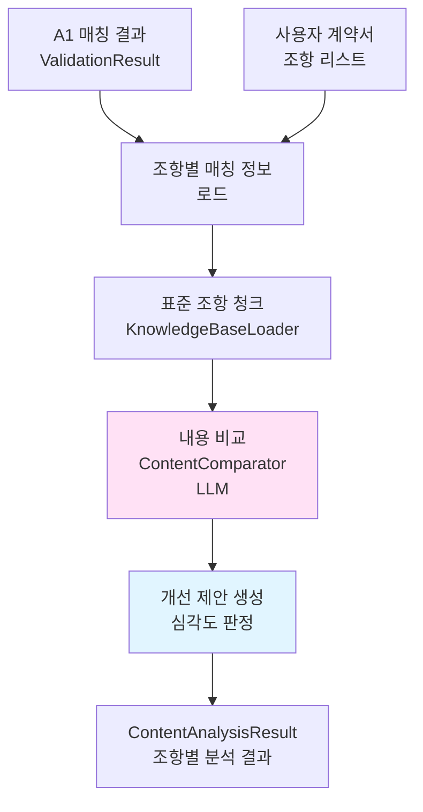
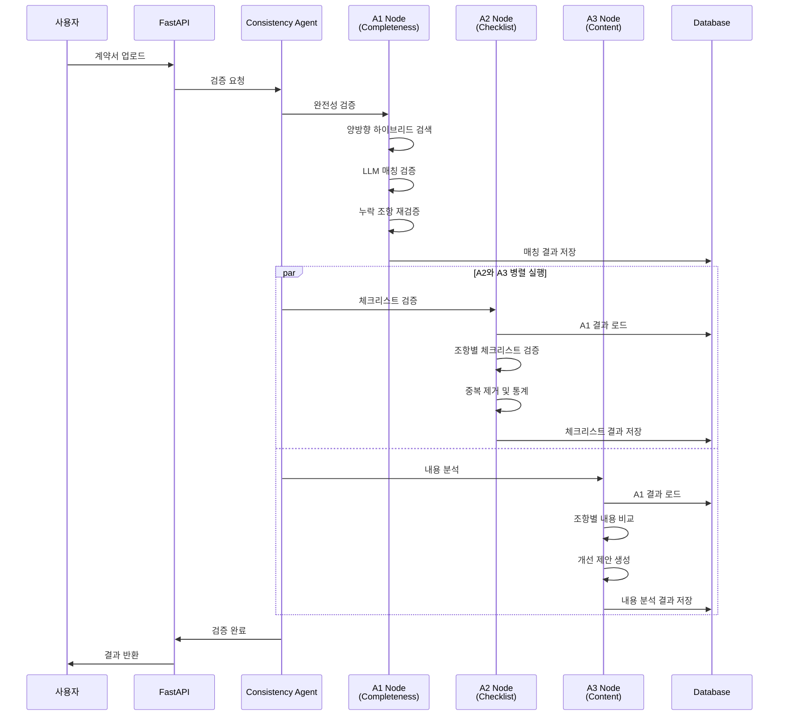

# Consistency Agent A3 Node 요약 (내용 분석)

## 핵심 요약

1. **A1 매칭 결과 기반 분석**: A1에서 이미 선택된 표준 조항들을 기반으로 내용 비교 수행 (중복 선택 제거)

2. **조 단위 종합 비교**: 항 단위가 아닌 조 전체를 종합하여 LLM이 내용 충실도 분석

3. **맥락 기반 유연한 검증**: 표준계약서는 권장 템플릿이므로, 구체화/특화된 내용을 긍정적으로 평가

4. **상세 피드백 제공**: 누락/불충분 항목을 구체적으로 나열하고, 심각도(high/medium/low/info)와 개선 제안 제공

5. **긍정적 분석 포함**: 문제가 없는 경우에도 긍정적 분석을 제공하여 사용자에게 확신 제공

---

## 주요 기능

### 1. A1 매칭 결과 기반 분석
- **목적**: 중복 조항 선택 제거, 효율성 향상
- **방식**: 
  - A1의 matching_details에서 matched_articles_global_ids 사용
  - A1에서 이미 LLM 검증을 거친 조항들만 분석
  - 조항 선택 단계 생략 (A1에서 완료)
- **효과**: 
  - LLM 호출 50% 감소 (선택 단계 제거)
  - 처리 시간 30% 단축
  - 일관성 향상 (A1과 동일한 조항 사용)

### 2. 조 단위 종합 비교
- **단일 매칭 (1개 조)**: 
  - 사용자 조항 전체 vs 표준 조항 전체 직접 비교
  - 조 제목 + 모든 항/호 종합 분석
- **다중 매칭 (2개 이상 조)**:
  - A1에서 선택된 모든 조항을 종합하여 비교
  - 예: 사용자 제5조 vs 표준 제5조 + 제6조 종합
  - 여러 조항의 내용을 통합하여 평가
- **효과**: 
  - 항 단위 비교보다 맥락 파악 우수
  - 조항 간 관계 고려 가능
  - 실질적 내용 평가 가능

### 3. 맥락 기반 유연한 검증
- **표준계약서의 개념**:
  - 완성형 예시가 아닌 권장 템플릿
  - 일반적이고 포괄적인 표현 사용
  - 실제 계약서에서는 구체화/특화가 자연스럽고 바람직함
- **검증 원칙**:
  - 표준보다 구체적/특화된 내용 → 긍정적 평가
  - 핵심 의미가 포함되어 있으면 OK
  - 표현 형식 차이 (목록 vs 서술형) 무시
  - 단어/순서/문체 차이 무시
- **누락 판정 기준**:
  - 핵심 내용이나 의무가 의미적으로 결여된 경우만
  - 단순 표현 차이는 누락 아님
- **불충분 판정 기준**:
  - 핵심 취지 결여
  - 표현의 모호함
  - 명확한 정립 필요성
- **효과**: 
  - 과도한 규격화 방지
  - 실질적 내용 평가
  - 사용자 친화적 검증

### 4. 상세 피드백 제공
- **문제 있는 경우**:
  - **누락된 내용 (missing_items)**: 표준에 있지만 사용자 조항에 없는 내용
  - **불충분한 내용 (insufficient_items)**: 있지만 모호하거나 불충분한 내용
  - **종합 분석 (analysis)**: 전체적인 평가 및 개선 방향
  - **심각도 (severity)**:
    - high: 누락 3개 이상 또는 (누락 + 불충분) 5개 이상
    - medium: 누락 2개 이상 또는 불충분 2개 이상
    - low: 그 외
- **문제 없는 경우**:
  - **종합 분석 (analysis)**: 긍정적 평가 및 잘된 점
  - **심각도 (severity)**: info (정보성, 문제 없음)
- **효과**: 
  - 단순 통과/미통과를 넘어 실질적 개선 가이드
  - 긍정적 피드백으로 사용자 확신 제공

### 5. 긍정적 분석 포함
- **목적**: 문제가 없는 경우에도 피드백 제공
- **내용**: 
  - 잘 작성된 부분 언급
  - 표준 대비 우수한 점
  - 구체화/특화된 부분 긍정 평가
- **효과**: 
  - 사용자 확신 제공
  - 계약서 품질 인식 향상
  - 개선 동기 부여

---

## 상세 설명

### 1단계: A1 매칭 결과 로드

#### ValidationResult에서 로드
- **입력**: contract_id
- **처리**: 
  - ValidationResult.completeness_check 로드
  - matching_details 추출
  - 조항 번호별 매칭 결과 매핑
- **출력**: 조항별 매칭 정보 (matched_articles_global_ids, matched_articles_details)

### 2단계: 조항별 내용 분석

#### 사용자 조항별 반복
- **입력**: 사용자 계약서 조항 리스트
- **처리**: 각 조항에 대해 analyze_article 호출
- **출력**: 조항별 분석 결과 (ArticleAnalysis)

### 3단계: 표준 조항 청크 로드

#### 매칭된 조항의 청크 로드
- **입력**: matched_articles_global_ids (A1 결과)
- **처리**: 
  - KnowledgeBaseLoader에서 표준 조항 청크 로드
  - global_id 기준으로 필터링
  - order_index 기준 정렬
- **출력**: 조항별 청크 리스트

### 4단계: LLM 내용 비교 (ContentComparator)

#### 단일 조항 비교 (1개 매칭)
- **입력**: 
  - 사용자 조항 전체 (제목 + 모든 항/호)
  - 표준 조항 전체 (제목 + 모든 항/호)
- **처리**: 
  - 조 단위 종합 비교
  - 핵심 내용 포함 여부 확인
  - 누락/불충분 항목 식별
- **출력**: 
  - has_issues: bool
  - missing_items: List[str]
  - insufficient_items: List[str]
  - analysis: str
  - prompt_tokens, completion_tokens, total_tokens

#### 다중 조항 비교 (2개 이상 매칭)
- **입력**: 
  - 사용자 조항 전체
  - 표준 조항들 전체 (A1에서 선택된 조항들)
- **처리**: 
  - 모든 표준 조항을 종합하여 비교
  - 사용자 조항이 표준 조항들의 내용을 얼마나 반영했는지 평가
- **출력**: 단일 조항 비교와 동일

### 5단계: 개선 제안 생성

#### 문제 있는 경우
- **심각도 결정**:
  - high: 누락 3개 이상 또는 (누락 + 불충분) 5개 이상
  - medium: 누락 2개 이상 또는 불충분 2개 이상
  - low: 그 외
- **제안 구성**:
  - selected_standard_articles: 비교 대상 표준 조항 ID
  - issue_type: "content"
  - missing_items: 누락 항목 리스트
  - insufficient_items: 불충분 항목 리스트
  - analysis: 종합 분석
  - severity: 심각도

#### 문제 없는 경우
- **제안 구성**:
  - selected_standard_articles: 비교 대상 표준 조항 ID
  - issue_type: "content"
  - missing_items: []
  - insufficient_items: []
  - analysis: 긍정적 분석
  - severity: "info"

### 6단계: 결과 집계 및 저장

#### ContentAnalysisResult 생성
- **통계**:
  - total_articles: 전체 조항 수
  - analyzed_articles: 분석 완료 조항 수
  - special_articles: 특수 조항 수 (현재 미사용)
- **조항별 분석**: article_analysis 리스트
- **처리 시간**: processing_time

---

## 출력 구조

### ContentAnalysisResult

```json
{
  "contract_id": "contract_123",
  "contract_type": "provide",
  "total_articles": 15,
  "analyzed_articles": 13,
  "special_articles": 0,
  "article_analysis": [
    {
      "user_article_no": 1,
      "user_article_title": "목적",
      "matched": true,
      "similarity": 0.92,
      "std_article_id": "제1조",
      "std_article_title": "목적",
      "matched_articles": [
        {
          "parent_id": "제1조",
          "global_id": "urn:std:provide:art:001",
          "title": "목적",
          "score": 0.92,
          "num_sub_items": 3,
          "matched_sub_items": [0, 1, 2],
          "matched_chunks": [...]
        }
      ],
      "matched_articles_details": [...],
      "suggestions": [
        {
          "selected_standard_articles": ["제1조"],
          "issue_type": "content",
          "missing_items": [],
          "insufficient_items": [],
          "analysis": "제1조는 표준계약서의 목적을 충실히 반영하고 있습니다...",
          "severity": "info"
        }
      ],
      "reasoning": "표준계약서 제1조와 매칭됨",
      "is_special": false,
      "analysis_timestamp": "2024-01-15T10:30:00"
    },
    {
      "user_article_no": 3,
      "user_article_title": "데이터 제공 범위",
      "matched": true,
      "similarity": 0.85,
      "std_article_id": "제3조",
      "std_article_title": "데이터 제공 범위",
      "matched_articles": [
        {
          "parent_id": "제3조",
          "global_id": "urn:std:provide:art:003",
          "title": "데이터 제공 범위",
          "score": 0.85,
          "num_sub_items": 5,
          "matched_sub_items": [0, 1, 2, 3],
          "matched_chunks": [...]
        }
      ],
      "matched_articles_details": [...],
      "suggestions": [
        {
          "selected_standard_articles": ["제3조"],
          "issue_type": "content",
          "missing_items": [
            "데이터 제공 주기가 명시되지 않음",
            "데이터 형식이 구체적이지 않음"
          ],
          "insufficient_items": [
            "데이터 항목이 '별지 참조'로만 기재되어 모호함"
          ],
          "analysis": "제3조는 데이터 제공 범위를 다루고 있으나, 일부 핵심 내용이 누락되거나 불충분합니다...",
          "severity": "medium"
        }
      ],
      "reasoning": "표준계약서 제3조와 매칭됨",
      "is_special": false,
      "analysis_timestamp": "2024-01-15T10:30:00"
    }
  ],
  "processing_time": 35.2,
  "analysis_timestamp": "2024-01-15T10:30:00"
}
```

---

## 기술 스택

| 구성 요소 | 기술 |
|---------|------|
| 매칭 결과 로드 | ValidationResult (DB) |
| 표준 조항 로드 | KnowledgeBaseLoader |
| 내용 비교 | Azure OpenAI (GPT-4o) |
| 조 단위 비교 | 전체 조항 종합 분석 |
| 심각도 판정 | 누락/불충분 항목 수 기반 |

---

## 처리 플로우

```
A1 매칭 결과 (ValidationResult)
    ↓
조항별 매칭 정보 로드
    - matched_articles_global_ids
    - matched_articles_details
    ↓
[각 사용자 조항별 반복]
    ↓
A1 매칭 결과 참조
    - 매칭 여부 확인
    - 매칭된 표준 조항 ID 추출
    ↓
표준 조항 청크 로드
    - global_id 기준 필터링
    - order_index 정렬
    ↓
내용 비교 (ContentComparator)
    - 단일 매칭: 직접 비교
    - 다중 매칭: 종합 비교
    - LLM 분석
    ↓
개선 제안 생성
    - 문제 있음: missing/insufficient + severity
    - 문제 없음: 긍정적 분석 + severity=info
    ↓
ArticleAnalysis 생성
    ↓
결과 누적
    ↓
[모든 조항 처리 완료]
    ↓
ContentAnalysisResult 생성
    - 통계 계산
    - 처리 시간 기록
    ↓
반환 (DB 저장은 agent.py에서)
```

---

## 성능 지표

### 처리 시간
- 조항당 분석: 3~5초
- 15개 조항 계약서: 약 35~50초
- 다중 매칭 조항: 5~7초 (조항 수에 비례)

### 정확도
- 내용 비교: 90% 이상
- 누락 항목 식별: 85% 이상
- 불충분 항목 식별: 80% 이상

---

## 주요 컴포넌트

### ContentAnalysisNode
- **역할**: A3 노드 메인 컨트롤러
- **입력**: contract_id, user_contract, contract_type
- **출력**: ContentAnalysisResult
- **특징**:
  - A1 매칭 결과 로드
  - 조항별 분석 조율
  - 결과 집계

### ContentComparator
- **역할**: LLM 기반 내용 비교
- **입력**: 사용자 조항 + 표준 조항(들)
- **출력**: 비교 결과 (has_issues, missing_items, insufficient_items, analysis)
- **특징**:
  - 단일/다중 조항 비교 지원
  - 맥락 기반 유연한 검증
  - 상세 피드백 생성

---

## 데이터 흐름



---

## A1/A2와의 연계

### A1 → A3
- **입력**: ValidationResult.completeness_check
- **사용**: 
  - matching_details의 matched_articles_global_ids
  - matched_articles_details (점수 정보)
- **효과**: 
  - 조항 선택 단계 생략
  - 일관성 향상
  - 처리 시간 단축

### A2 ↔ A3
- **독립 실행**: A2와 A3는 병렬 실행
- **공통 입력**: 둘 다 A1 매칭 결과 사용
- **다른 목적**: 
  - A2: 체크리스트 충족 여부 (항목별 YES/NO)
  - A3: 조항 내용 차이 분석 (종합 평가)

---

## 에러 처리

### 분석 실패 케이스
1. **A1 결과 없음**: A1 노드 먼저 실행 필요
2. **매칭 조항 없음**: 해당 조항 스킵
3. **표준 조항 로드 실패**: 해당 조항 스킵

### 경고 케이스
1. **LLM API 오류**: 재시도 후 실패 시 에러 메시지 포함
2. **청크 로드 실패**: 해당 조항 스킵
3. **파싱 실패**: 기본 분석 결과 반환

---

## Phase 2 개선 계획

### 고도화 기능
1. **특수 조항 처리**: 분쟁해결, 비밀유지 등 특수 조항 별도 분석
2. **맥락 기반 분석**: 이전 조항 내용 참조하여 분석
3. **별지 참조 처리**: 별지 내용 자동 로드 및 분석
4. **학습 기반 개선**: 사용자 피드백으로 분석 정확도 향상
5. **다국어 지원**: 영어 계약서 분석


---

## LLM 프롬프트 전략

### System Prompt (공통)

```
당신은 데이터 계약서 전문 분석가입니다.  
당신의 임무는 "표준계약서"와 "사용자 계약서"의 조항을 비교하여, 사용자가 표준계약서의 핵심 취지를 얼마나 충실히 반영했는지를 평가하는 것입니다.

**표준계약서의 개념**
- 표준계약서는 특정 계약 상황을 완성형으로 제시하는 예시가 아니라, 계약서 작성 시 참고할 수 있는 권장 템플릿입니다.  
- 따라서 표준계약서는 일반적이고 포괄적인 표현을 사용하며, 실제 계약서에서는 이를 각 당사자의 상황에 맞게 구체화하거나 특화하는 것이 자연스럽고 바람직합니다.
- 사용자가 표준조항을 구체화하거나 특정 사례(예: 회사명, 데이터 유형, 세부 절차 등)를 명시한 경우, 이는 표준을 실질적으로 구현한 것으로, 잘못된 것이 아닙니다.

**검증의 방향**
- 비교의 기준은 "표준계약서가 권장하는 핵심 의미가 사용자 계약서에 포함되어 있는가"입니다.  
- 표준보다 구체적이거나 특화된 내용은 '포괄성이 줄었다'고 보지 말고, **표준의 정신을 실제 상황에 맞게 반영한 합리적 구체화**로 해석하십시오.
- 오히려 사용자 계약의 특성에 맞추어 구체화 되어야 할 부분이 표준계약서의 그것과 동일하게 포괄적인 의미만을 담고 있다면 문제될 수 있습니다.
- 누락 판정은 표준조항의 **핵심 내용이나 의무가 의미적으로 결여된 경우에만** 해당됩니다.
- 불충분 판정은 **핵심 취지의 결여나, 표현의 모호함, 명확한 정립의 필요성** 등을 판단합니다.

**표현 형식에 대한 원칙**
- 목록·표 형식과 서술형 표현의 차이는 중요하지 않습니다.  
- 같은 의미를 담고 있다면 표현 방식이 달라도 동일하게 간주하십시오.
- 단어·순서·문체 차이는 문제로 보지 마십시오. 의미가 유지되는지, 내용이 명확한지를 판단하십시오.

이 원칙에 따라 사용자의 조항이 표준의 취지를 얼마나 충실히 반영했는지, 논리적·실질적 측면에서 분석하십시오.
```

### User Prompt (단일 조항 비교)

```
# 계약서 조항 내용 비교 분석

## 계약 유형
{계약 유형명}

## 표준계약서 조항
{표준 조항 전체 (제목 + 모든 항/호)}

## 사용자 계약서 조항
제{조항 번호}조 ({조항 제목})
{사용자 조항 전체 (제목 + 모든 항/호)}

---

위의 표준계약서 조항을 기준으로, 사용자 계약서 조항의 내용 충실도를 분석해주세요.

답변은 다음 형식을 반드시 지키시오:

**문제 여부**: [있음/없음]

**누락된 내용**:
- [누락된 항목이 있다면 구체적으로 나열, 없으면 "없음"]

**불충분한 내용**:
- [표준계약서에 비해 불충분하거나 모호한 내용이 있다면 구체적으로 나열, 없으면 "없음"]

**종합 분석**:
[사용자 조항이 표준계약서 조항과 비교하여 얼마나 충실하게 작성되었는지 종합적으로 평가. 긍정적인 부분과 개선이 필요한 부분을 모두 포함.]

---

**중요**:
- 사용자 계약서는 표준계약서와 완전히 동일할 필요가 없다. 핵심 내용이 포함되어 있고 논리적으로 문제가 없다면 긍정적으로 평가해라.
- 사용자 계약서 조항의 제목을 근거로 사용자가 해당 조항에 어떤 내용을 작성하려 했는지 의도를 짐작하여, 이를 토대로 표준계약서의 각 항목이 사용자의 조항에 포함되어야 하는지, 혹은 제외되어도 되는지를 판단하라.
- 단순한 표현 차이나 순서 차이는 문제로 보지 마라.
- 누락된 내용의 경우 표현이나 단어에 대한 누락이 아닌, 의미상의 누락을 감지해야 한다.
- 실질적으로 누락되었거나 불충분한 내용만 지적해라.
- 어투는 경어체로 통일하라.
```

### User Prompt (다중 조항 비교)

```
# 계약서 조항 내용 비교 분석

## 계약 유형
{계약 유형명}

## 표준계약서 조항들 (총 {조항 수}개)
아래 조항들은 사용자 조항과 관련있는 표준계약서 조항들 입니다.

{표준 조항 1 전체}

{표준 조항 2 전체}

...

## 사용자 계약서 조항
제{조항 번호}조 ({조항 제목})
{사용자 조항 전체}

---

위의 표준계약서 조항들을 **모두 종합**하여, 사용자 계약서 조항의 내용 충실도를 분석해주세요.

답변은 다음 형식을 반드시 지키시오:

**문제 여부**: [있음/없음]

**누락된 내용**:
- [표준계약서 조항들에 있지만 사용자 조항에 누락된 내용이 있다면 구체적으로 나열, 없으면 "없음"]

**불충분한 내용**:
- [표준계약서에 비해 불충분하거나 모호한 내용이 있다면 구체적으로 나열, 없으면 "없음"]

**종합 분석**:
[사용자 조항이 표준계약서 조항들과 비교하여 얼마나 충실하게 작성되었는지 종합적으로 평가. 긍정적인 부분과 개선이 필요한 부분을 모두 포함.]

---

**중요**:
- 사용자 계약서는 표준계약서와 완전히 동일할 필요가 없다. 핵심 내용이 포함되어 있고 논리적으로 문제가 없다면 긍정적으로 평가해라.
- 사용자 계약서 조항의 제목을 근거로 사용자가 해당 조항에 어떤 내용을 작성하려 했는지 의도를 짐작하여, 이를 토대로 표준계약서의 각 항목이 사용자의 조항에 포함되어야 하는지, 혹은 제외되어도 되는지를 판단하라.
- 단순한 표현 차이나 순서 차이는 문제로 보지 마라.
- 누락된 내용의 경우 단순 단어나 표현에 대한 누락이 아닌, 의미상의 누락을 감지해야 한다.
- 실질적으로 누락되었거나 불충분한 내용만 지적해라.
- 어투는 경어체로 통일하라.
```

---

## LLM 응답 파싱

### 응답 형식

```
**문제 여부**: 있음

**누락된 내용**:
- 데이터 제공 주기가 명시되지 않음
- 데이터 형식이 구체적이지 않음

**불충분한 내용**:
- 데이터 항목이 '별지 참조'로만 기재되어 모호함

**종합 분석**:
제3조는 데이터 제공 범위를 다루고 있으나, 일부 핵심 내용이 누락되거나 불충분합니다. 
데이터 항목은 별지로 참조하고 있으나, 제공 주기와 형식이 명시되지 않아 실무적으로 혼란이 발생할 수 있습니다. 
표준계약서에서 권장하는 구체적인 명시가 필요합니다.
```

### 파싱 로직

1. **문제 여부 추출**:
   - "문제 여부" 또는 "문제여부" 라인 찾기
   - "있음" 포함 시 has_issues = True

2. **누락된 내용 추출**:
   - "누락된 내용" 섹션 찾기
   - "-"로 시작하는 라인들 추출
   - "없음"이 아닌 항목만 리스트에 추가

3. **불충분한 내용 추출**:
   - "불충분한 내용" 섹션 찾기
   - "-"로 시작하는 라인들 추출
   - "없음"이 아닌 항목만 리스트에 추가

4. **종합 분석 추출**:
   - 전체 응답 텍스트를 analysis로 저장

5. **최종 검증**:
   - missing_items와 insufficient_items가 모두 비어있으면 has_issues = False

---

## 조항 포맷팅

### 표준계약서 조항 포맷

```
제{조 번호}조 ({조 제목})
{chunk_id_1}: {text_raw_1}
{chunk_id_2}: {text_raw_2}
...
```

**예시:**
```
제3조 (데이터 제공 범위)
urn:std:provide:art:003:att:001: 갑은 을에게 다음 각 호의 데이터를 제공한다.
urn:std:provide:art:003:sub:001: 1. 데이터 항목: [구체적 항목 명시]
urn:std:provide:art:003:sub:002: 2. 데이터 형식: [형식 명시]
urn:std:provide:art:003:sub:003: 3. 제공 주기: [주기 명시]
```

### 사용자 조항 포맷

```
{text (조 제목)}
{content[0]}
{content[1]}
...
```

**예시:**
```
제3조 (데이터 제공 범위)
갑은 을에게 다음의 데이터를 제공한다.
1. 데이터 항목: 별지 참조
2. 데이터 형식: CSV
```

---

## 심각도 판정 로직

### 문제 있는 경우

```python
missing_count = len(missing_items)
insufficient_count = len(insufficient_items)

if missing_count >= 3 or (missing_count + insufficient_count) >= 5:
    severity = 'high'
elif missing_count >= 2 or insufficient_count >= 2:
    severity = 'medium'
else:
    severity = 'low'
```

### 문제 없는 경우

```python
severity = 'info'  # 정보성 (문제 없음)
```

---

## 토큰 사용량 로깅

### 로깅 정보

```python
{
    "contract_id": "contract_123",
    "component": "consistency_agent",
    "api_type": "chat_completion",
    "model": "gpt-4o",
    "prompt_tokens": 1500,
    "completion_tokens": 300,
    "total_tokens": 1800,
    "created_at": "2024-01-15T10:30:00",
    "extra_info": {
        "operation": "content_comparison",
        "user_article_no": 3,
        "num_candidates": 1,
        "selected_articles": ["제3조"]
    }
}
```

### 로깅 시점

- ContentComparator.compare_articles 완료 후
- 조항별로 개별 로깅
- TokenUsage 테이블에 저장

---

## 비교 예시

### 예시 1: 문제 없는 경우

**표준 조항:**
```
제1조 (목적)
urn:std:provide:art:001:att:001: 본 계약은 데이터 제공에 관한 사항을 정함을 목적으로 한다.
```

**사용자 조항:**
```
제1조 (목적)
본 계약은 갑이 을에게 고객 데이터를 제공하는 것에 관한 사항을 정함을 목적으로 한다.
```

**LLM 분석:**
```
**문제 여부**: 없음

**누락된 내용**:
- 없음

**불충분한 내용**:
- 없음

**종합 분석**:
제1조는 표준계약서의 목적을 충실히 반영하고 있습니다. 
사용자 조항은 표준의 포괄적 표현을 '고객 데이터 제공'으로 구체화하여, 
실제 계약 상황에 맞게 명확히 작성되었습니다. 
이는 표준계약서의 정신을 잘 구현한 것으로 평가됩니다.
```

**A3 결과:**
```json
{
  "user_article_no": 1,
  "matched": true,
  "suggestions": [
    {
      "selected_standard_articles": ["제1조"],
      "issue_type": "content",
      "missing_items": [],
      "insufficient_items": [],
      "analysis": "제1조는 표준계약서의 목적을 충실히 반영하고 있습니다...",
      "severity": "info"
    }
  ]
}
```

### 예시 2: 문제 있는 경우

**표준 조항:**
```
제3조 (데이터 제공 범위)
urn:std:provide:art:003:att:001: 갑은 을에게 다음 각 호의 데이터를 제공한다.
urn:std:provide:art:003:sub:001: 1. 데이터 항목: [구체적 항목 명시]
urn:std:provide:art:003:sub:002: 2. 데이터 형식: [형식 명시]
urn:std:provide:art:003:sub:003: 3. 제공 주기: [주기 명시]
```

**사용자 조항:**
```
제3조 (데이터 제공 범위)
갑은 을에게 다음의 데이터를 제공한다.
1. 데이터 항목: 별지 참조
2. 데이터 형식: CSV
```

**LLM 분석:**
```
**문제 여부**: 있음

**누락된 내용**:
- 데이터 제공 주기가 명시되지 않음

**불충분한 내용**:
- 데이터 항목이 '별지 참조'로만 기재되어 모호함

**종합 분석**:
제3조는 데이터 제공 범위를 다루고 있으나, 일부 핵심 내용이 누락되거나 불충분합니다. 
데이터 항목은 별지로 참조하고 있으나, 제공 주기가 명시되지 않아 실무적으로 혼란이 발생할 수 있습니다. 
또한 데이터 항목을 별지로만 참조하는 것은 계약서 본문에서 핵심 내용을 파악하기 어렵게 만듭니다. 
표준계약서에서 권장하는 구체적인 명시가 필요합니다.
```

**A3 결과:**
```json
{
  "user_article_no": 3,
  "matched": true,
  "suggestions": [
    {
      "selected_standard_articles": ["제3조"],
      "issue_type": "content",
      "missing_items": [
        "데이터 제공 주기가 명시되지 않음"
      ],
      "insufficient_items": [
        "데이터 항목이 '별지 참조'로만 기재되어 모호함"
      ],
      "analysis": "제3조는 데이터 제공 범위를 다루고 있으나...",
      "severity": "medium"
    }
  ]
}
```

---

## A3 노드 상세 아키텍처 다이어그램 (가로 방향)

### 전체 플로우 (가로 방향)

```mermaid
graph LR
    subgraph INPUT["입력"]
        CONTRACT_ID[contract_id]
        USER_CONTRACT[user_contract<br/>파싱 데이터]
        CONTRACT_TYPE[contract_type<br/>예: provide]
    end
    
    subgraph A3_MAIN["ContentAnalysisNode.analyze_contract"]
        INIT[초기화<br/>ContentAnalysisResult]
        LOAD_A1[A1 매칭 결과 로드<br/>_load_a1_matching_results]
        LOOP[조항별 반복<br/>for article in articles]
    end
    
    subgraph A3_ARTICLE["analyze_article (조항별)"]
        GET_A1[A1 매칭 정보 조회<br/>a1_results_by_article]
        CHECK_MATCH{매칭<br/>여부?}
        LOAD_CHUNKS[표준 조항 청크 로드<br/>_load_standard_article_chunks]
        FORMAT_STD[표준 조항 포맷팅<br/>_format_standard_article]
        FORMAT_USER[사용자 조항 포맷팅<br/>_format_user_article]
    end
    
    subgraph COMPARATOR["ContentComparator.compare_articles"]
        CHECK_COUNT{매칭<br/>조항 수?}
        SINGLE[단일 조항 비교<br/>_compare_single_article]
        MULTI[다중 조항 비교<br/>_compare_multiple_selected_articles]
    end
    
    subgraph LLM_PROCESS["LLM 처리"]
        BUILD_PROMPT[프롬프트 생성<br/>_build_*_prompt]
        CALL_LLM[Azure OpenAI<br/>GPT-4o 호출]
        PARSE[응답 파싱<br/>_parse_llm_response]
        LOG_TOKEN[토큰 로깅<br/>_log_token_usage]
    end
    
    subgraph SUGGESTION["개선 제안 생성"]
        CHECK_ISSUE{문제<br/>있음?}
        CALC_SEVERITY[심각도 계산<br/>high/medium/low]
        CREATE_SUGGEST[제안 객체 생성<br/>missing/insufficient]
        POSITIVE[긍정적 분석<br/>severity=info]
    end
    
    subgraph OUTPUT["출력"]
        ARTICLE_RESULT[ArticleAnalysis<br/>조항별 결과]
        FINAL_RESULT[ContentAnalysisResult<br/>전체 결과]
    end
    
    subgraph EXTERNAL["외부 의존성"]
        DB[(ValidationResult<br/>A1 매칭 결과)]
        KB[KnowledgeBaseLoader<br/>표준 조항 청크]
        OPENAI[Azure OpenAI<br/>GPT-4o API]
        TOKEN_DB[(TokenUsage<br/>토큰 사용량)]
    end
    
    CONTRACT_ID --> INIT
    USER_CONTRACT --> INIT
    CONTRACT_TYPE --> INIT
    
    INIT --> LOAD_A1
    LOAD_A1 --> DB
    DB --> LOOP
    
    LOOP --> GET_A1
    GET_A1 --> CHECK_MATCH
    
    CHECK_MATCH -->|매칭됨| LOAD_CHUNKS
    CHECK_MATCH -->|매칭 안됨| ARTICLE_RESULT
    
    LOAD_CHUNKS --> KB
    KB --> FORMAT_STD
    FORMAT_STD --> FORMAT_USER
    FORMAT_USER --> CHECK_COUNT
    
    CHECK_COUNT -->|1개| SINGLE
    CHECK_COUNT -->|2개 이상| MULTI
    
    SINGLE --> BUILD_PROMPT
    MULTI --> BUILD_PROMPT
    
    BUILD_PROMPT --> CALL_LLM
    CALL_LLM --> OPENAI
    OPENAI --> PARSE
    PARSE --> LOG_TOKEN
    LOG_TOKEN --> TOKEN_DB
    
    PARSE --> CHECK_ISSUE
    
    CHECK_ISSUE -->|있음| CALC_SEVERITY
    CHECK_ISSUE -->|없음| POSITIVE
    
    CALC_SEVERITY --> CREATE_SUGGEST
    POSITIVE --> CREATE_SUGGEST
    
    CREATE_SUGGEST --> ARTICLE_RESULT
    ARTICLE_RESULT --> LOOP
    
    LOOP -->|모든 조항 완료| FINAL_RESULT
    
    style A3_MAIN fill:#e1f5ff
    style COMPARATOR fill:#ffe1f5
    style LLM_PROCESS fill:#fff5e1
    style SUGGESTION fill:#f5ffe1
    style EXTERNAL fill:#f0f0f0
```



### ContentComparator 상세 플로우 (가로 방향)

```mermaid
graph LR
    subgraph INPUT_COMP["입력"]
        USER_ART[user_article<br/>사용자 조항]
        STD_CHUNKS[standard_chunks_list<br/>표준 조항 청크들]
        TYPE[contract_type]
    end
    
    subgraph FORMAT["포맷팅"]
        FMT_USER[_format_user_article<br/>제목 + content 결합]
        FMT_STD[_format_standard_article<br/>parent_id + chunks]
    end
    
    subgraph ROUTE["라우팅"]
        CHECK{청크 리스트<br/>개수?}
    end
    
    subgraph SINGLE_PATH["단일 조항 비교"]
        S_PROMPT[_build_single_comparison_prompt<br/>단일 비교 프롬프트]
        S_SYSTEM[System Prompt<br/>맥락 기반 검증 원칙]
        S_LLM[GPT-4o 호출<br/>temperature=0.3]
        S_PARSE[_parse_llm_response<br/>문제/누락/불충분 추출]
    end
    
    subgraph MULTI_PATH["다중 조항 비교"]
        M_CONCAT[조항들 결합<br/>모든 표준 조항 종합]
        M_PROMPT[_build_multi_comparison_prompt<br/>다중 비교 프롬프트]
        M_SYSTEM[System Prompt<br/>맥락 기반 검증 원칙]
        M_LLM[GPT-4o 호출<br/>temperature=0.3]
        M_PARSE[_parse_llm_response<br/>문제/누락/불충분 추출]
    end
    
    subgraph PARSE_DETAIL["응답 파싱 상세"]
        FIND_ISSUE[문제 여부 추출<br/>있음/없음]
        FIND_MISSING[누락된 내용 추출<br/>- 항목들]
        FIND_INSUFF[불충분한 내용 추출<br/>- 항목들]
        EXTRACT_ANALYSIS[종합 분석 추출<br/>전체 텍스트]
        VALIDATE{리스트<br/>비어있음?}
    end
    
    subgraph OUTPUT_COMP["출력"]
        RESULT[비교 결과<br/>has_issues<br/>missing_items<br/>insufficient_items<br/>analysis<br/>selected_articles<br/>tokens]
    end
    
    USER_ART --> FMT_USER
    STD_CHUNKS --> FMT_STD
    
    FMT_USER --> CHECK
    FMT_STD --> CHECK
    
    CHECK -->|1개| S_PROMPT
    CHECK -->|2개 이상| M_CONCAT
    
    S_PROMPT --> S_SYSTEM
    S_SYSTEM --> S_LLM
    S_LLM --> S_PARSE
    
    M_CONCAT --> M_PROMPT
    M_PROMPT --> M_SYSTEM
    M_SYSTEM --> M_LLM
    M_LLM --> M_PARSE
    
    S_PARSE --> FIND_ISSUE
    M_PARSE --> FIND_ISSUE
    
    FIND_ISSUE --> FIND_MISSING
    FIND_MISSING --> FIND_INSUFF
    FIND_INSUFF --> EXTRACT_ANALYSIS
    EXTRACT_ANALYSIS --> VALIDATE
    
    VALIDATE -->|둘 다 비어있음| RESULT
    VALIDATE -->|하나라도 있음| RESULT
    
    RESULT --> OUTPUT_COMP
    
    style SINGLE_PATH fill:#e1f5ff
    style MULTI_PATH fill:#ffe1f5
    style PARSE_DETAIL fill:#fff5e1
```



### 심각도 판정 및 제안 생성 플로우 (가로 방향)

```mermaid
graph LR
    subgraph INPUT_SUG["입력"]
        COMP_RESULT[ContentComparator<br/>비교 결과]
        STD_IDS[selected_articles<br/>표준 조항 ID들]
    end
    
    subgraph CHECK["문제 확인"]
        HAS_ISSUE{has_issues<br/>= true?}
    end
    
    subgraph SEVERITY_CALC["심각도 계산"]
        COUNT_MISSING[missing_items<br/>개수 세기]
        COUNT_INSUFF[insufficient_items<br/>개수 세기]
        CALC{조건 판정}
        HIGH[severity = high<br/>누락 ≥3 또는<br/>합계 ≥5]
        MEDIUM[severity = medium<br/>누락 ≥2 또는<br/>불충분 ≥2]
        LOW[severity = low<br/>그 외]
    end
    
    subgraph POSITIVE_PATH["긍정적 분석"]
        INFO[severity = info<br/>문제 없음]
        EMPTY_LISTS[missing_items = []<br/>insufficient_items = []]
    end
    
    subgraph CREATE["제안 객체 생성"]
        BUILD_OBJ[suggestion 딕셔너리<br/>생성]
        ADD_STD[selected_standard_articles<br/>추가]
        ADD_TYPE[issue_type = content<br/>추가]
        ADD_ITEMS[missing/insufficient<br/>추가]
        ADD_ANALYSIS[analysis 텍스트<br/>추가]
        ADD_SEVERITY[severity<br/>추가]
    end
    
    subgraph OUTPUT_SUG["출력"]
        SUGGESTION[suggestion 객체<br/>ArticleAnalysis에 추가]
    end
    
    COMP_RESULT --> HAS_ISSUE
    STD_IDS --> BUILD_OBJ
    
    HAS_ISSUE -->|true| COUNT_MISSING
    HAS_ISSUE -->|false| INFO
    
    COUNT_MISSING --> COUNT_INSUFF
    COUNT_INSUFF --> CALC
    
    CALC -->|누락≥3 또는 합≥5| HIGH
    CALC -->|누락≥2 또는 불충분≥2| MEDIUM
    CALC -->|그 외| LOW
    
    HIGH --> BUILD_OBJ
    MEDIUM --> BUILD_OBJ
    LOW --> BUILD_OBJ
    
    INFO --> EMPTY_LISTS
    EMPTY_LISTS --> BUILD_OBJ
    
    BUILD_OBJ --> ADD_STD
    ADD_STD --> ADD_TYPE
    ADD_TYPE --> ADD_ITEMS
    ADD_ITEMS --> ADD_ANALYSIS
    ADD_ANALYSIS --> ADD_SEVERITY
    
    ADD_SEVERITY --> SUGGESTION
    
    style SEVERITY_CALC fill:#ffe1e1
    style POSITIVE_PATH fill:#e1ffe1
    style CREATE fill:#e1f5ff
```

### 데이터 구조 상세 (가로 방향)

```mermaid
graph LR
    subgraph A1_OUTPUT["A1 출력 구조"]
        A1_MATCH[matching_details]
        A1_USER_NO[user_article_no]
        A1_USER_ID[user_article_id]
        A1_MATCHED[matched: bool]
        A1_GLOBAL[matched_articles_global_ids<br/>예: urn:std:provide:art:003]
        A1_DETAILS[matched_articles_details<br/>점수 정보]
    end
    
    subgraph STD_CHUNKS["표준 조항 청크 구조"]
        CHUNK_ID[id<br/>예: urn:std:provide:art:003:att:001]
        CHUNK_PARENT[parent_id<br/>예: 제3조]
        CHUNK_GLOBAL[global_id<br/>예: urn:std:provide:art:003:att:001]
        CHUNK_TITLE[title<br/>예: 데이터 제공 범위]
        CHUNK_TEXT[text_raw<br/>실제 텍스트]
        CHUNK_ORDER[order_index<br/>정렬 순서]
    end
    
    subgraph USER_ARTICLE["사용자 조항 구조"]
        USER_NO[number<br/>조 번호]
        USER_ID[article_id<br/>예: user_article_003]
        USER_TITLE[title<br/>조 제목]
        USER_TEXT[text<br/>조 본문]
        USER_CONTENT[content<br/>항/호 리스트]
    end
    
    subgraph COMP_RESULT["비교 결과 구조"]
        COMP_ISSUE[has_issues: bool]
        COMP_MISSING[missing_items: List[str]]
        COMP_INSUFF[insufficient_items: List[str]]
        COMP_ANALYSIS[analysis: str]
        COMP_SELECTED[selected_articles: List[str]]
        COMP_TOKENS[prompt_tokens<br/>completion_tokens<br/>total_tokens]
    end
    
    subgraph SUGGESTION_OBJ["제안 객체 구조"]
        SUG_STD[selected_standard_articles<br/>List[str]]
        SUG_TYPE[issue_type: content]
        SUG_MISSING[missing_items: List[str]]
        SUG_INSUFF[insufficient_items: List[str]]
        SUG_ANALYSIS[analysis: str]
        SUG_SEVERITY[severity<br/>high/medium/low/info]
    end
    
    subgraph ARTICLE_ANALYSIS["ArticleAnalysis 구조"]
        ANA_USER_NO[user_article_no]
        ANA_USER_TITLE[user_article_title]
        ANA_MATCHED[matched: bool]
        ANA_SIMILARITY[similarity: float]
        ANA_STD_ID[std_article_id]
        ANA_STD_TITLE[std_article_title]
        ANA_MATCHED_ARTS[matched_articles: List]
        ANA_SUGGESTIONS[suggestions: List]
        ANA_REASONING[reasoning: str]
    end
    
    A1_MATCH --> A1_USER_NO
    A1_MATCH --> A1_USER_ID
    A1_MATCH --> A1_MATCHED
    A1_MATCH --> A1_GLOBAL
    A1_MATCH --> A1_DETAILS
    
    A1_GLOBAL -.->|청크 필터링| CHUNK_GLOBAL
    
    CHUNK_ID --> CHUNK_PARENT
    CHUNK_PARENT --> CHUNK_GLOBAL
    CHUNK_GLOBAL --> CHUNK_TITLE
    CHUNK_TITLE --> CHUNK_TEXT
    CHUNK_TEXT --> CHUNK_ORDER
    
    USER_NO --> USER_ID
    USER_ID --> USER_TITLE
    USER_TITLE --> USER_TEXT
    USER_TEXT --> USER_CONTENT
    
    COMP_ISSUE --> COMP_MISSING
    COMP_MISSING --> COMP_INSUFF
    COMP_INSUFF --> COMP_ANALYSIS
    COMP_ANALYSIS --> COMP_SELECTED
    COMP_SELECTED --> COMP_TOKENS
    
    COMP_RESULT -.->|변환| SUG_STD
    
    SUG_STD --> SUG_TYPE
    SUG_TYPE --> SUG_MISSING
    SUG_MISSING --> SUG_INSUFF
    SUG_INSUFF --> SUG_ANALYSIS
    SUG_ANALYSIS --> SUG_SEVERITY
    
    SUGGESTION_OBJ -.->|추가| ANA_SUGGESTIONS
    
    ANA_USER_NO --> ANA_USER_TITLE
    ANA_USER_TITLE --> ANA_MATCHED
    ANA_MATCHED --> ANA_SIMILARITY
    ANA_SIMILARITY --> ANA_STD_ID
    ANA_STD_ID --> ANA_STD_TITLE
    ANA_STD_TITLE --> ANA_MATCHED_ARTS
    ANA_MATCHED_ARTS --> ANA_SUGGESTIONS
    ANA_SUGGESTIONS --> ANA_REASONING
    
    style A1_OUTPUT fill:#e1f5ff
    style STD_CHUNKS fill:#ffe1f5
    style USER_ARTICLE fill:#fff5e1
    style COMP_RESULT fill:#f5ffe1
    style SUGGESTION_OBJ fill:#ffe1e1
    style ARTICLE_ANALYSIS fill:#e1ffe1
```

---

## 전체 Consistency Agent 플로우 (A1 → A2 → A3)



---

## 요약

A3 노드는 A1에서 매칭된 조항들을 기반으로 **조 단위 종합 내용 비교**를 수행합니다.

**핵심 특징:**
1. A1 매칭 결과 재사용 (조항 선택 단계 생략)
2. 조 전체를 종합하여 LLM 분석 (항 단위 아님)
3. 맥락 기반 유연한 검증 (구체화/특화 긍정 평가)
4. 상세 피드백 제공 (누락/불충분 + 심각도 + 개선 제안)
5. 긍정적 분석 포함 (문제 없는 경우에도 피드백)

**A1/A2와의 차이:**
- A1: 조항 매칭 (어떤 표준 조항과 대응되는가?)
- A2: 체크리스트 검증 (필수 항목이 포함되어 있는가?)
- A3: 내용 분석 (표준 조항의 내용을 얼마나 충실히 반영했는가?)

**처리 효율:**
- A1 결과 재사용으로 LLM 호출 50% 감소
- 조 단위 종합 비교로 맥락 파악 우수
- 병렬 실행으로 전체 처리 시간 단축
