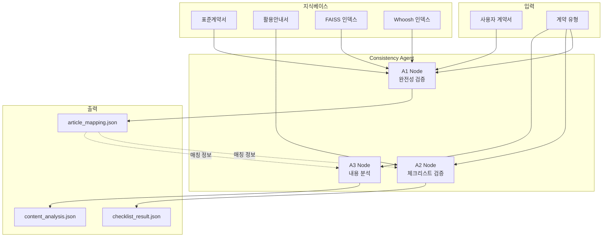
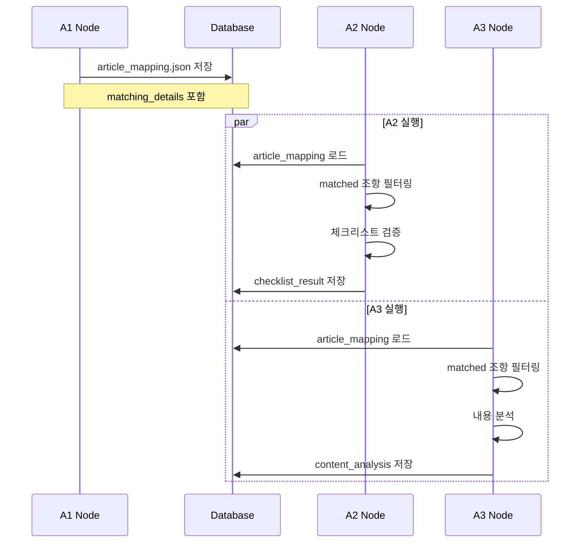
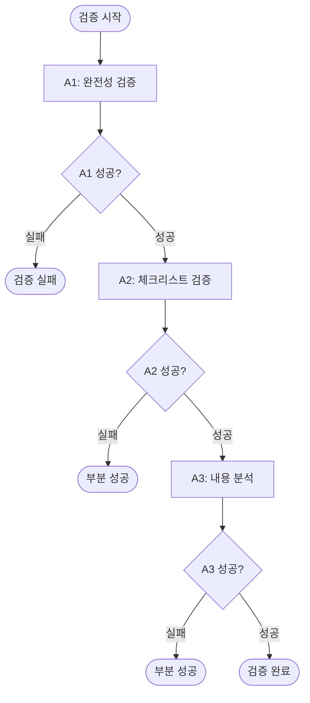
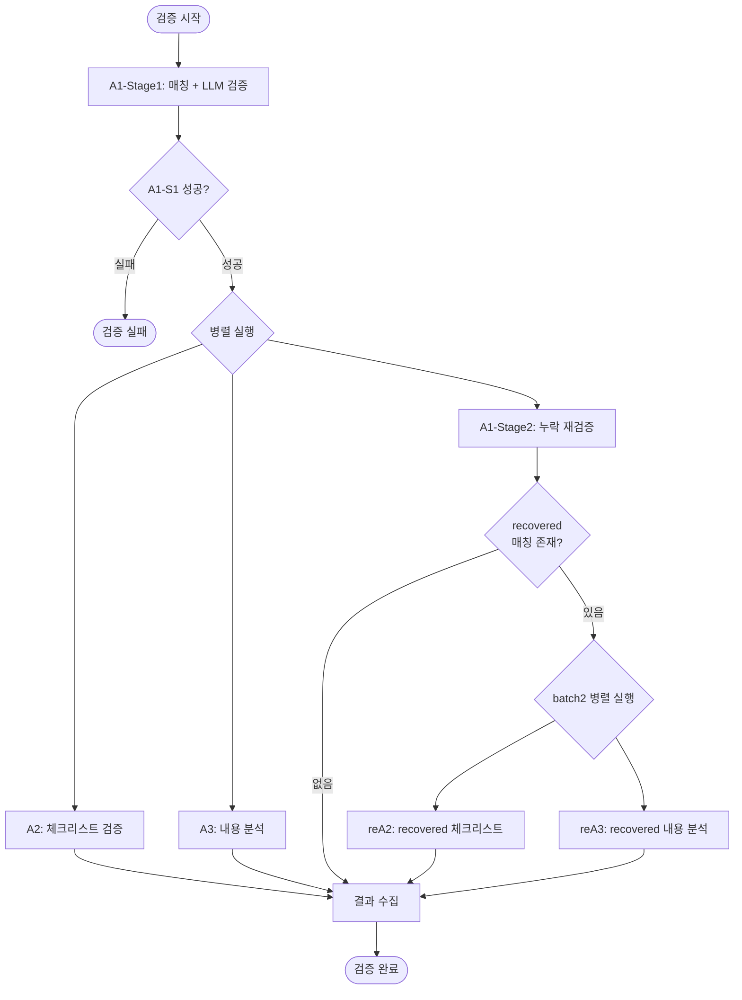

# Consistency Agent

## 개요

Consistency Agent는 사용자 계약서와 표준계약서 간의 정합성을 검증하는 AI 에이전트. 3개의 독립적인 검증 노드(A1, A2, A3)로 구성되며, 병렬 처리 아키텍처를 통해 효율적인 검증 수행.

### 주요 기능

- **완전성 검증 (A1)**: 조항 매칭 및 누락 조항 식별
- **체크리스트 검증 (A2)**: 활용안내서 기반 필수 요구사항 확인
- **내용 분석 (A3)**: 조항별 충실도 평가 및 개선 제안
- **병렬 처리**: A1-Stage1 → [A1-Stage2 || A2 || A3] 아키텍처
- **오탐지 복구**: 누락으로 판단된 조항의 재검증 및 복구

### 검증 범위

- 사용자 계약서의 모든 조항 분석
- 표준계약서 대비 누락/추가 조항 식별
- 활용안내서 체크리스트 준수 여부 확인
- 조항별 내용 충실도 평가

## 아키텍처

### 전체 구조



### 컴포넌트 구성

```
backend/consistency_agent/
├── agent.py                    # 통합 워크플로우 및 Celery 태스크
├── models.py                   # 데이터 모델 (A3 결과 구조)
├── hybrid_searcher.py          # 하이브리드 검색 (FAISS + Whoosh)
├── a1_node/                    # 완전성 검증 노드
│   ├── a1_node.py             # A1 메인 로직
│   ├── article_matcher.py     # 조항 매칭
│   └── matching_verifier.py   # LLM 매칭 검증
├── a2_node/                    # 체크리스트 검증 노드
│   ├── a2_node.py             # A2 메인 로직
│   ├── checklist_loader.py    # 체크리스트 로드
│   └── checklist_verifier.py  # LLM 체크리스트 검증
└── a3_node/                    # 내용 분석 노드
    ├── a3_node.py             # A3 메인 로직
    └── content_comparator.py  # 내용 비교
```

## 3개 노드 개요

### A1 Node: 완전성 검증

**역할**: 사용자 계약서 조항과 표준계약서 조항 간 매칭 및 누락 조항 식별

**주요 기능**:
- 하이브리드 검색 기반 조항 매칭 (FAISS + Whoosh)
- LLM 기반 매칭 검증 (오탐지 제거)
- 누락 조항 식별 및 재검증
- 오탐지 복구 (recovered matching)

**처리 방식**:
- Stage 1: 매칭 + LLM 검증 (순차 실행)
- Stage 2: 누락 조항 재검증 (병렬 실행)

**출력**: `article_mapping.json`
- `matching_details`: 매칭된 조항 상세 정보 (A2/A3 입력)
- `recovered_matching_details`: 복구된 매칭 정보 (batch2 트리거)
- `missing_standard_articles`: 누락된 표준 조항 목록
- `extra_user_articles`: 추가된 사용자 조항 목록

### A2 Node: 체크리스트 검증

**역할**: 활용안내서 기반 체크리스트 요구사항 충족 여부 검증

**주요 기능**:
- A1 매칭 결과 참조 (matched 조항만 처리)
- 계약 유형별 체크리스트 로드
- LLM 기반 체크리스트 항목 검증
- YES/NO/UNCLEAR 판정 및 통계 집계

**처리 방식**:
- A1-Stage1 완료 후 병렬 실행
- matched 조항만 처리 (missing/extra 무시)
- 표준 조항 기준으로 검증

**출력**: `checklist_validation.json`
- `std_article_results`: 표준 조항별 체크리스트 검증 결과
- `statistics`: 전체 통계 (통과/미충족/불명확)

### A3 Node: 내용 분석

**역할**: 매칭된 조항 간 내용 충실도 평가 및 개선 제안 생성

**주요 기능**:
- A1 매칭 결과 참조 (matched 조항만 처리)
- 조항별 내용 비교 (사용자 ↔ 표준)
- 충실도 점수 계산
- 개선 제안 생성

**처리 방식**:
- A1-Stage1 완료 후 병렬 실행
- matched 조항만 처리 (missing/extra 무시)
- 사용자 조항 기준으로 분석

**출력**: `content_analysis.json`
- `article_analysis`: 조항별 분석 결과
- `total_articles`: 전체 조항 수
- `analyzed_articles`: 분석된 조항 수

## 노드 간 데이터 전달

### article_mapping.json 구조

A1 노드가 생성하는 매칭 결과는 A2, A3 노드의 입력으로 사용됨.

```json
{
  "matching_details": [
    {
      "user_article_no": 5,
      "user_article_title": "개인정보의 제공",
      "matched_articles": ["제5조"],
      "matched_articles_global_ids": ["provide_std_contract_제5조"],
      "similarity": 0.92,
      "verification_status": "verified",
      "sub_item_results": [...]
    }
  ],
  "recovered_matching_details": [
    {
      "user_article_no": 12,
      "user_article_title": "손해배상",
      "matched_articles": ["제12조"],
      "matched_articles_global_ids": ["provide_std_contract_제12조"],
      "similarity": 0.75,
      "verification_status": "recovered"
    }
  ],
  "missing_standard_articles": [
    {
      "article_id": "제15조",
      "article_title": "분쟁 해결",
      "verification_status": "confirmed_missing"
    }
  ],
  "extra_user_articles": [
    {
      "article_no": 20,
      "article_title": "특약 사항"
    }
  ],
  "matched_user_articles": 18,
  "total_user_articles": 20,
  "matched_standard_articles": 18,
  "total_standard_articles": 19
}
```

### 데이터 흐름



### 매칭 유형 (matching_types)

A2, A3 노드는 처리할 매칭 유형을 지정할 수 있음:

- `["primary"]`: 초기 매칭 결과만 처리 (기본값)
- `["recovered"]`: 복구된 매칭 결과만 처리 (batch2)
- `["primary", "recovered"]`: 모든 매칭 결과 처리

## 순차 실행 vs 병렬 처리

### 순차 실행 모드



**특징**:
- A1 → A2 → A3 순차 실행
- 각 단계 실패 시 다음 단계 중단
- 처리 시간: 약 60-90초

**사용 시나리오**:
- 디버깅 및 개발
- 단순한 워크플로우 필요 시

### 병렬 처리 모드 (권장)



**특징**:
- A1-Stage1 완료 후 A1-Stage2, A2, A3 동시 실행
- recovered 매칭 발견 시 batch2 자동 실행
- 처리 시간: 약 30-45초 (50% 단축)

**병렬 실행 구현**:
```python
from concurrent.futures import ThreadPoolExecutor

# batch1: A1-Stage2, A2, A3 병렬 실행
with ThreadPoolExecutor(max_workers=3) as executor:
    future_a1_stage2 = executor.submit(check_missing_articles_task, ...)
    future_a2 = executor.submit(check_checklist_task, ..., ["primary"])
    future_a3 = executor.submit(analyze_content_task, ..., ["primary"])
    
    a1_stage2_result = future_a1_stage2.result()
    a2_result = future_a2.result()
    a3_result = future_a3.result()

# batch2: recovered 매칭 처리 (조건부)
if a1_stage2_result.get('has_batch2'):
    with ThreadPoolExecutor(max_workers=2) as executor:
        future_batch2_a2 = executor.submit(check_checklist_task, ..., ["recovered"])
        future_batch2_a3 = executor.submit(analyze_content_task, ..., ["recovered"])
        
        batch2_a2_result = future_batch2_a2.result()
        batch2_a3_result = future_batch2_a3.result()
```

### 성능 비교

| 모드 | 처리 시간 | 장점 | 단점 |
|------|----------|------|------|
| 순차 실행 | 60-90초 | 단순한 구조, 디버깅 용이 | 느린 처리 속도 |
| 병렬 처리 | 30-45초 | 빠른 처리 속도, 효율적 | 복잡한 구조, 동시성 관리 필요 |

## 에러 처리 및 최적화

### 재시도 로직

**DB 업데이트 재시도**:
```python
def update_validation_field_with_retry(
    contract_id: str,
    field_name: str,
    value: Any,
    max_retries: int = 5,
    retry_delay: float = 0.1
) -> bool:
    """
    SQLite 트랜잭션 격리 문제 해결을 위한 재시도 로직
    
    병렬 실행 시 여러 노드가 동시에 DB를 업데이트하면
    "database is locked" 오류 발생 가능
    """
    for attempt in range(max_retries):
        try:
            db = next(get_db())
            result = db.query(ValidationResult).filter(
                ValidationResult.contract_id == contract_id
            ).first()
            
            if result:
                setattr(result, field_name, value)
                flag_modified(result, field_name)
                db.commit()
                return True
                
        except Exception as e:
            if attempt < max_retries - 1:
                time.sleep(retry_delay * (2 ** attempt))  # 지수 백오프
                continue
            else:
                logger.error(f"DB 업데이트 실패: {e}")
                return False
        finally:
            db.close()
    
    return False
```

### 부분 성공 메커니즘

**개념**: 일부 노드 실패 시에도 성공한 노드의 결과 보존

**구현**:
```python
# 각 노드 결과 확인
all_success = all(
    r.get('status') == 'completed'
    for r in [a1_stage2_result, a2_result, a3_result]
)

status = "completed" if all_success else "partial"

if not all_success:
    logger.warning(
        f"일부 노드 실패: "
        f"A1-Stage2={a1_stage2_result.get('status')}, "
        f"A2={a2_result.get('status')}, "
        f"A3={a3_result.get('status')}"
    )
```

**결과**:
- `status: "completed"`: 모든 노드 성공
- `status: "partial"`: 일부 노드 성공
- `status: "failed"`: 모든 노드 실패

### SQLite 트랜잭션 격리 문제 해결

**문제**: 병렬 실행 시 여러 노드가 동시에 DB 업데이트 → "database is locked" 오류

**해결 방법**:

1. **재시도 로직 적용** (위 참조)
2. **부분 업데이트 함수 사용**:
```python
def update_completeness_check_partial_with_retry(
    contract_id: str,
    partial_data: Dict[str, Any],
    max_retries: int = 5
) -> bool:
    """
    completeness_check 필드의 일부만 업데이트
    
    예: missing_article_analysis 추가
    """
    for attempt in range(max_retries):
        try:
            db = next(get_db())
            result = db.query(ValidationResult).filter(
                ValidationResult.contract_id == contract_id
            ).first()
            
            if result and result.completeness_check:
                # 기존 데이터에 병합
                result.completeness_check.update(partial_data)
                flag_modified(result, 'completeness_check')
                db.commit()
                return True
                
        except Exception as e:
            if attempt < max_retries - 1:
                time.sleep(0.1 * (2 ** attempt))
                continue
            else:
                return False
        finally:
            db.close()
    
    return False
```

3. **필드 분리 저장**:
   - A2: `checklist_validation`, `checklist_validation_recovered`
   - A3: `content_analysis`, `content_analysis_recovered`
   - 각 노드가 독립적인 필드에 저장하여 충돌 최소화

### 성능 최적화

**1. 임베딩 캐싱**:
```python
# EmbeddingService에서 자동 캐싱
embedding = get_embedding_service().get_embedding(
    text=query,
    contract_id=contract_id,
    component="consistency_agent"
)
```

**2. 배치 처리**:
```python
# A2: 체크리스트 항목을 배치로 검증
batch_size = 10
for i in range(0, len(checklist_items), batch_size):
    batch = checklist_items[i:i+batch_size]
    results = verifier.verify_batch(batch)
```

**3. 인덱스 메모리 캐싱**:
```python
# KnowledgeBaseLoader에서 인덱스 캐싱
faiss_index_text, faiss_index_title = kb_loader.load_faiss_indexes(contract_type)
whoosh_indexer = kb_loader.load_whoosh_index(contract_type)
```

## API 사용 예시

### 순차 실행

```python
# Celery 태스크 호출
from backend.consistency_agent.agent import validate_contract_task

result = validate_contract_task.apply_async(
    args=["contract_123"],
    kwargs={
        "text_weight": 0.7,
        "title_weight": 0.3,
        "dense_weight": 0.85
    },
    queue="consistency_validation"
)

# 결과 확인
task_result = result.get(timeout=120)
print(task_result)
# {
#     "status": "completed",
#     "contract_id": "contract_123",
#     "a1_summary": {...},
#     "a2_summary": {...},
#     "a3_summary": {...}
# }
```

### 병렬 실행 (권장)

```python
from backend.consistency_agent.agent import validate_contract_parallel_task

result = validate_contract_parallel_task.apply_async(
    args=["contract_123"],
    kwargs={
        "text_weight": 0.7,
        "title_weight": 0.3,
        "dense_weight": 0.85
    },
    queue="consistency_validation"
)

# 결과 확인
task_result = result.get(timeout=90)
print(task_result)
# {
#     "status": "completed",
#     "contract_id": "contract_123",
#     "a1_stage1_summary": {...},
#     "a1_stage2_summary": {...},
#     "a2_summary": {...},
#     "a3_summary": {...}
# }
```

### FastAPI 엔드포인트

```python
# POST /api/validation/{contract_id}/start
@app.post("/api/validation/{contract_id}/start")
async def start_validation(
    contract_id: str,
    text_weight: float = 0.7,
    title_weight: float = 0.3,
    dense_weight: float = 0.85,
    parallel: bool = True  # 병렬 실행 여부
):
    """정합성 검증 시작"""
    if parallel:
        task = validate_contract_parallel_task.apply_async(
            args=[contract_id],
            kwargs={
                "text_weight": text_weight,
                "title_weight": title_weight,
                "dense_weight": dense_weight
            },
            queue="consistency_validation"
        )
    else:
        task = validate_contract_task.apply_async(
            args=[contract_id],
            kwargs={
                "text_weight": text_weight,
                "title_weight": title_weight,
                "dense_weight": dense_weight
            },
            queue="consistency_validation"
        )
    
    return {
        "task_id": task.id,
        "status": "processing",
        "mode": "parallel" if parallel else "sequential"
    }

# GET /api/validation/{contract_id}
@app.get("/api/validation/{contract_id}")
async def get_validation_result(contract_id: str):
    """검증 결과 조회"""
    db = next(get_db())
    result = db.query(ValidationResult).filter(
        ValidationResult.contract_id == contract_id
    ).first()
    
    if not result:
        raise HTTPException(status_code=404, detail="검증 결과 없음")
    
    return {
        "contract_id": contract_id,
        "contract_type": result.contract_type,
        "completeness_check": result.completeness_check,
        "checklist_validation": result.checklist_validation,
        "content_analysis": result.content_analysis,
        "overall_score": result.overall_score
    }
```

## 관련 문서

- [A1 하이브리드 검색](CONSISTENCY_A1_HYBRID_SEARCH.md): FAISS + Whoosh 검색 메커니즘
- [A1 누락 검증](CONSISTENCY_A1_MISSING_VERIFICATION.md): 누락 조항 재검증 로직
- [A2 Node](CONSISTENCY_A2_NODE.md): 체크리스트 검증 상세
- [A3 Node](CONSISTENCY_A3_NODE.md): 내용 분석 상세
- [출력 스키마](CONSISTENCY_OUTPUT_SCHEMAS.md): A1/A2/A3 출력 구조
