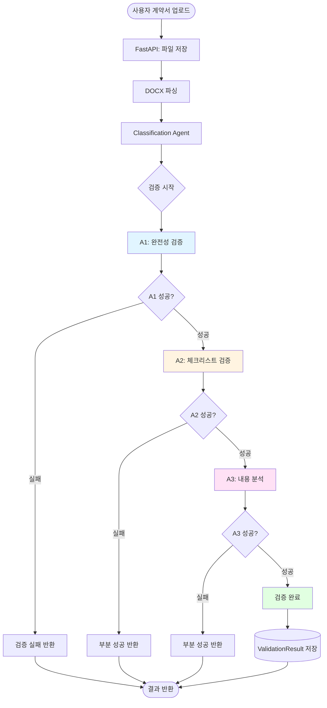
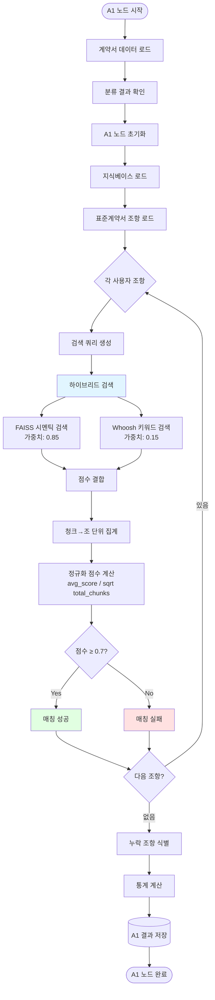
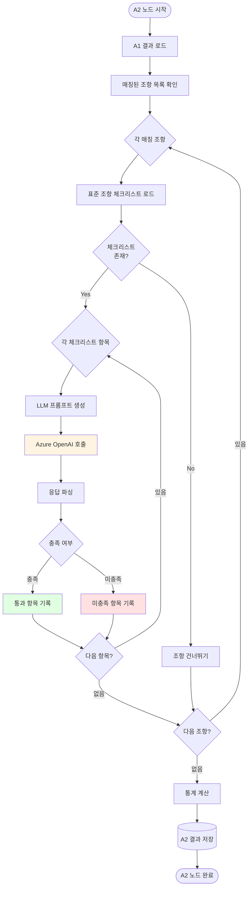
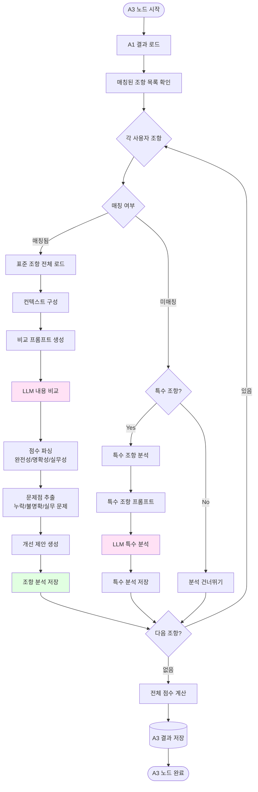
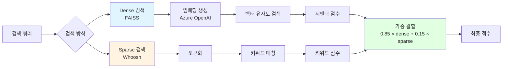
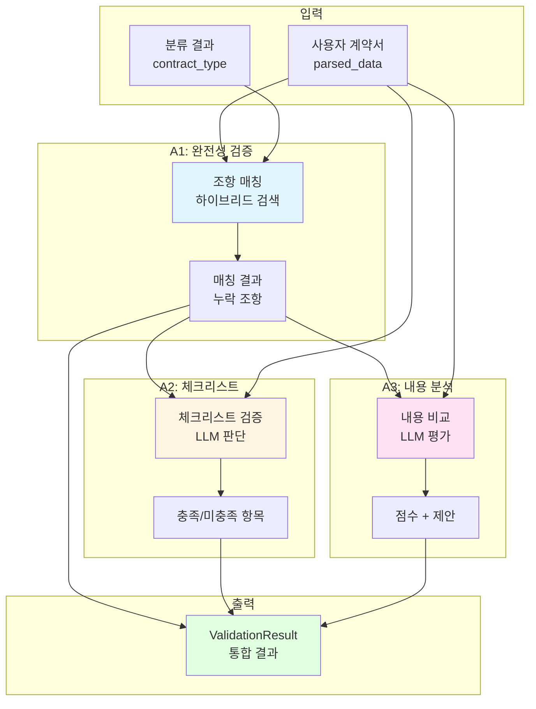
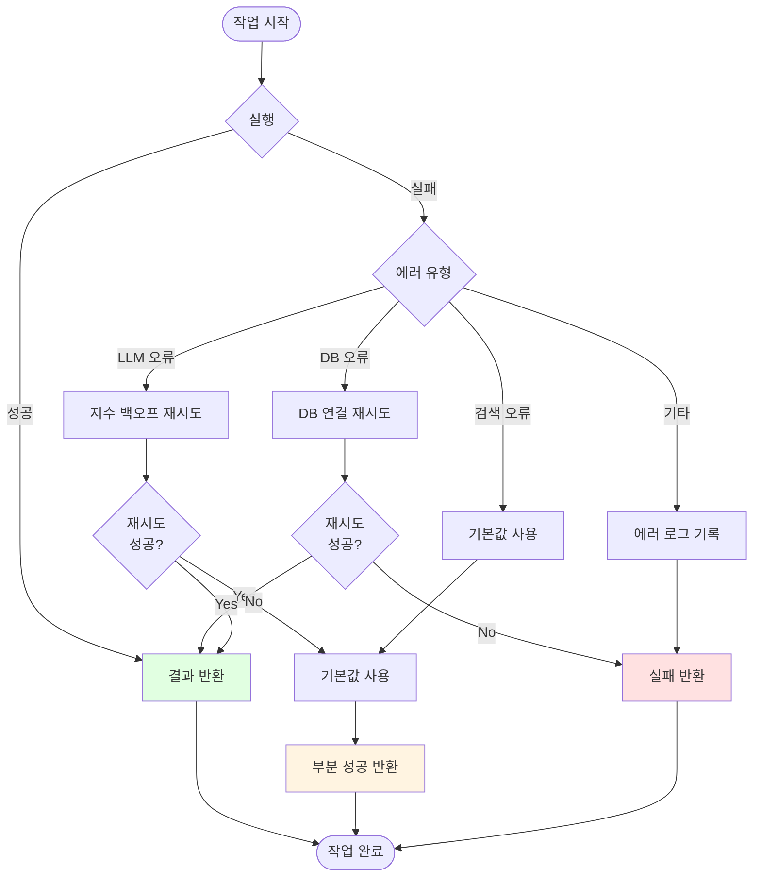
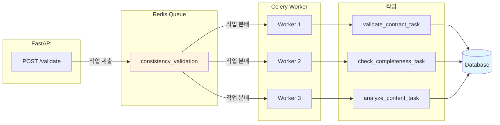
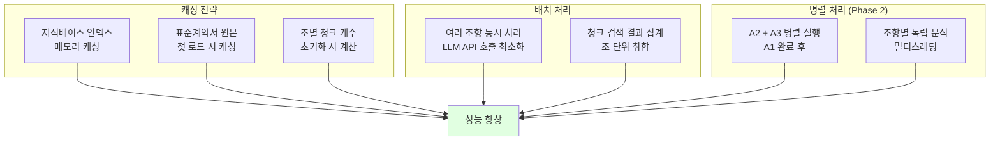

# Consistency Agent Flow Diagram

## 전체 검증 프로세스

## A1 노드: 완전성 검증 (Completeness Check)

## A2 노드: 체크리스트 검증 (Checklist Validation)

## A3 노드: 내용 분석 (Content Analysis)

## 하이브리드 검색 상세 (A1 노드)

## 데이터 흐름

## 에러 처리 흐름

## Celery 작업 큐 구조

## 성능 최적화 포인트

## 주요 특징

### 1. 순차 실행 구조
- A1 → A2 → A3 순차 실행
- 각 노드는 이전 노드 결과 참조
- 실패 시 부분 성공 반환 가능

### 2. 하이브리드 검색 (A1)
- FAISS 시멘틱 검색 (85%) + Whoosh 키워드 검색 (15%)
- 멀티벡터 방식: 각 하위항목으로 개별 검색
- 정규화 점수로 조 단위 집계

### 3. LLM 기반 평가 (A2, A3)
- Azure OpenAI GPT-4 사용
- 맥락 기반 유연한 판단
- 구조화된 JSON 응답

### 4. 에러 복원력
- 지수 백오프 재시도
- 기본값 사용으로 부분 성공
- 상세한 에러 로깅

### 5. 확장 가능성
- Phase 2: A2 + A3 병렬 실행
- 활용안내서 통합
- 조항별 병렬 분석

## 관련 문서
- [A1 노드 상세 플로우](./A1_FLOW_DIAGRAMS.md)
- [A1 하이브리드 검색](./CONSISTENCY_A1_HYBRID_SEARCH.md)
- [시스템 아키텍처](./SYSTEM_ARCHITECTURE.md)
- [Consistency Agent 요약](./CONSISTENCY_A1_SUMMARY.md)
