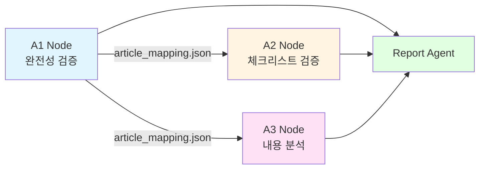
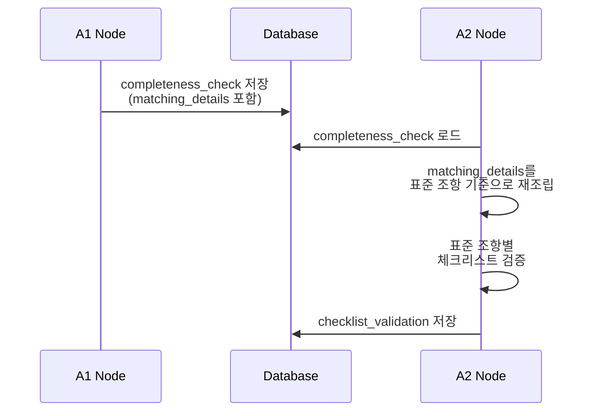
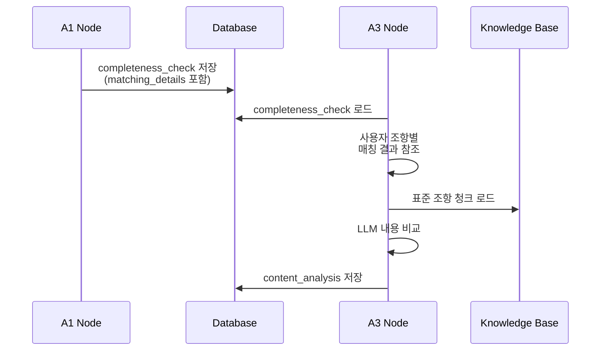
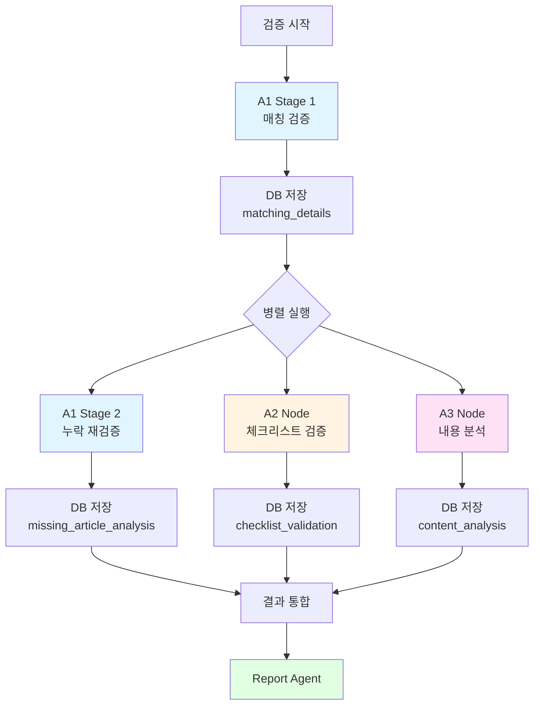

# Consistency Agent 출력 스키마

## 개요

Consistency Agent의 3개 노드(A1, A2, A3)는 각각 독립적인 출력 스키마를 가지며, 이들은 서로 연계되어 최종 검증 결과를 구성함.

### 스키마 간 관계



### 데이터 흐름

1. **A1 Stage 1**: 사용자 조항과 표준 조항 매칭 → `matching_details` 생성
2. **A1 Stage 2**: 누락 조항 재검증 → `missing_article_analysis` 생성
3. **A2 Node**: A1의 `matching_details`를 참조하여 체크리스트 검증
4. **A3 Node**: A1의 `matching_details`를 참조하여 내용 비교
5. **Report Agent**: A1, A2, A3 결과를 통합하여 최종 보고서 생성

### 저장 위치

모든 출력은 `ValidationResult` 테이블의 JSON 필드에 저장됨:
- A1 결과: `completeness_check` 필드
- A2 결과: `checklist_validation` 필드
- A3 결과: `content_analysis` 필드


## A1 출력 스키마 (article_mapping.json)

### 개요

A1 노드는 사용자 계약서의 각 조항을 표준계약서 조항과 매칭하고, 누락된 조항을 식별함. 출력은 두 단계로 구성됨:
- **Stage 1**: 매칭 결과 (`matching_details`)
- **Stage 2**: 누락 조문 재검증 (`missing_article_analysis`)

### 최상위 구조

```json
{
  "contract_id": "string",
  "contract_type": "string",
  "total_user_articles": "integer",
  "matched_user_articles": "integer",
  "unmatched_user_articles_count": "integer",
  "total_standard_articles": "integer",
  "matched_standard_articles": "integer",
  "missing_standard_articles": "array",
  "unmatched_user_articles": "array",
  "matching_details": "array",
  "missing_article_analysis": "array",
  "processing_time": "float",
  "verification_date": "string (ISO 8601)"
}
```

### 필드 설명

| 필드 | 타입 | 설명 |
|------|------|------|
| `contract_id` | string | 계약서 고유 ID |
| `contract_type` | string | 계약 유형 (provide, process, create, brokerage_user, brokerage_provider) |
| `total_user_articles` | integer | 사용자 계약서 전체 조항 수 |
| `matched_user_articles` | integer | 매칭 성공한 사용자 조항 수 |
| `unmatched_user_articles_count` | integer | 매칭 실패한 사용자 조항 수 |
| `total_standard_articles` | integer | 표준계약서 전체 조항 수 |
| `matched_standard_articles` | integer | 매칭된 표준 조항 수 |
| `missing_standard_articles` | array | 누락된 표준 조항 리스트 (Stage 1에서 식별) |
| `unmatched_user_articles` | array | 매칭 안된 사용자 조항 분석 결과 |
| `matching_details` | array | 사용자 조항별 매칭 상세 정보 (A2/A3 필수) |
| `missing_article_analysis` | array | 누락 조항 재검증 결과 (Stage 2) |
| `processing_time` | float | 전체 처리 시간 (초) |
| `verification_date` | string | 검증 일시 (ISO 8601 형식) |


### matching_details 구조

A2/A3 노드가 참조하는 핵심 데이터. 각 사용자 조항의 매칭 결과를 포함함.

```json
{
  "user_article_no": "integer",
  "user_article_id": "string",
  "user_article_title": "string",
  "matched": "boolean",
  "matched_articles": "array[string]",
  "matched_articles_global_ids": "array[string]",
  "matched_articles_details": "array[object]",
  "sub_item_results": "array[object]",
  "verification_details": "array[object]"
}
```

| 필드 | 타입 | 설명 |
|------|------|------|
| `user_article_no` | integer | 사용자 조항 번호 (예: 3) |
| `user_article_id` | string | 사용자 조항 ID (예: "user_article_003") |
| `user_article_title` | string | 사용자 조항 제목 |
| `matched` | boolean | 매칭 성공 여부 |
| `matched_articles` | array[string] | 매칭된 표준 조항 parent_id 리스트 (예: ["제3조"]) |
| `matched_articles_global_ids` | array[string] | 매칭된 표준 조항 global_id 리스트 (예: ["urn:std:provide:art:003"]) |
| `matched_articles_details` | array[object] | 매칭된 조항별 상세 점수 정보 |
| `sub_item_results` | array[object] | 하위항목별 멀티매칭 결과 |
| `verification_details` | array[object] | LLM 검증 상세 정보 |

#### matched_articles_details 구조

```json
{
  "parent_id": "string",
  "global_id": "string",
  "title": "string",
  "combined_score": "float",
  "num_sub_items": "integer",
  "matched_sub_items": "array[integer]",
  "avg_dense_score": "float",
  "avg_dense_score_raw": "float",
  "avg_sparse_score": "float",
  "avg_sparse_score_raw": "float",
  "sub_items_scores": "array[object]"
}
```

| 필드 | 타입 | 설명 |
|------|------|------|
| `parent_id` | string | 표준 조항 parent_id (예: "제3조") |
| `global_id` | string | 표준 조항 global_id (예: "urn:std:provide:art:003") |
| `title` | string | 표준 조항 제목 |
| `combined_score` | float | 조 전체 종합 점수 (0.0~1.0) |
| `num_sub_items` | integer | 표준 조항의 하위항목 개수 |
| `matched_sub_items` | array[integer] | 매칭된 하위항목 인덱스 리스트 |
| `avg_dense_score` | float | 평균 시멘틱 점수 (정규화) |
| `avg_dense_score_raw` | float | 평균 시멘틱 점수 (원본) |
| `avg_sparse_score` | float | 평균 키워드 점수 (정규화) |
| `avg_sparse_score_raw` | float | 평균 키워드 점수 (원본) |
| `sub_items_scores` | array[object] | 하위항목별 상세 점수 |


### missing_article_analysis 구조

Stage 2에서 생성되는 누락 조항 재검증 결과.

```json
{
  "standard_article_id": "string",
  "standard_article_title": "string",
  "is_truly_missing": "boolean",
  "confidence": "float",
  "matched_user_article": "object | null",
  "reasoning": "string",
  "recommendation": "string",
  "evidence": "string",
  "risk_assessment": "string",
  "top_candidates": "array[object]",
  "candidates_analysis": "array[object]"
}
```

| 필드 | 타입 | 설명 |
|------|------|------|
| `standard_article_id` | string | 표준 조항 global_id (예: "urn:std:provide:art:005") |
| `standard_article_title` | string | 표준 조항 제목 |
| `is_truly_missing` | boolean | 실제 누락 여부 (true: 누락, false: 오탐지) |
| `confidence` | float | 판단 신뢰도 (0.0~1.0) |
| `matched_user_article` | object \| null | 재검증 시 발견된 사용자 조항 (오탐지인 경우) |
| `reasoning` | string | 판단 근거 |
| `recommendation` | string | 권장 조치 |
| `evidence` | string | 증거 텍스트 |
| `risk_assessment` | string | 위험도 평가 |
| `top_candidates` | array[object] | 역방향 검색 후보 조항 |
| `candidates_analysis` | array[object] | 후보 조항별 LLM 분석 |

### unmatched_user_articles 구조

매칭 실패한 사용자 조항 분석 결과.

```json
{
  "user_article_no": "integer",
  "user_article_title": "string",
  "user_article_text": "string",
  "category": "string",
  "confidence": "float",
  "reasoning": "string",
  "recommendation": "string",
  "risk_level": "string"
}
```

| 필드 | 타입 | 설명 |
|------|------|------|
| `user_article_no` | integer | 사용자 조항 번호 |
| `user_article_title` | string | 사용자 조항 제목 |
| `user_article_text` | string | 사용자 조항 전문 |
| `category` | string | 분류 (additional, modified, irrelevant, unknown) |
| `confidence` | float | 분류 신뢰도 (0.0~1.0) |
| `reasoning` | string | 분류 근거 |
| `recommendation` | string | 권장 조치 |
| `risk_level` | string | 위험도 (low, medium, high) |


### A1 출력 예시

```json
{
  "contract_id": "contract_20240115_001",
  "contract_type": "provide",
  "total_user_articles": 15,
  "matched_user_articles": 12,
  "unmatched_user_articles_count": 3,
  "total_standard_articles": 20,
  "matched_standard_articles": 12,
  "missing_standard_articles": [
    {
      "parent_id": "제5조",
      "title": "데이터 보유 기간",
      "chunks": [...]
    }
  ],
  "unmatched_user_articles": [
    {
      "user_article_no": 14,
      "user_article_title": "데이터 품질 보증",
      "user_article_text": "...",
      "category": "additional",
      "confidence": 0.85,
      "reasoning": "표준계약서에 없는 추가 조항",
      "recommendation": "계약 이행에 도움이 되는 조항으로 유지 권장",
      "risk_level": "low"
    }
  ],
  "matching_details": [
    {
      "user_article_no": 3,
      "user_article_id": "user_article_003",
      "user_article_title": "데이터 제공 목적",
      "matched": true,
      "matched_articles": ["제3조"],
      "matched_articles_global_ids": ["urn:std:provide:art:003"],
      "matched_articles_details": [
        {
          "parent_id": "제3조",
          "global_id": "urn:std:provide:art:003",
          "title": "데이터 제공 목적 및 범위",
          "combined_score": 0.85,
          "num_sub_items": 3,
          "matched_sub_items": [0, 1, 2],
          "avg_dense_score": 0.82,
          "avg_sparse_score": 0.75,
          "sub_items_scores": [
            {
              "chunk_id": "provide_std_003_001",
              "global_id": "urn:std:provide:art:003:att:001",
              "text": "제공자는 다음 각 호의 목적으로 데이터를 제공한다.",
              "dense_score": 0.85,
              "sparse_score": 0.78,
              "combined_score": 0.83
            }
          ]
        }
      ],
      "verification_details": [...]
    }
  ],
  "missing_article_analysis": [
    {
      "standard_article_id": "urn:std:provide:art:005",
      "standard_article_title": "데이터 보유 기간",
      "is_truly_missing": true,
      "confidence": 0.9,
      "matched_user_article": null,
      "reasoning": "사용자 계약서에 보유 기간 관련 조항이 없음",
      "recommendation": "데이터 보유 기간 조항 추가 필요",
      "evidence": "역방향 검색 결과 유사 조항 없음",
      "risk_assessment": "법적 리스크 높음 - 개인정보보호법 위반 가능성",
      "top_candidates": [],
      "candidates_analysis": []
    }
  ],
  "processing_time": 45.2,
  "verification_date": "2024-01-15T10:30:00Z"
}
```


## A2 출력 스키마 (checklist_result.json)

### 개요

A2 노드는 A1의 매칭 결과를 참조하여 표준 조항별로 체크리스트를 검증함. 출력은 표준 조항 기준으로 구성됨.

### 최상위 구조

```json
{
  "std_article_results": "array[object]",
  "statistics": "object",
  "processing_time": "float",
  "verification_date": "string (ISO 8601)"
}
```

| 필드 | 타입 | 설명 |
|------|------|------|
| `std_article_results` | array[object] | 표준 조항별 체크리스트 검증 결과 |
| `statistics` | object | 전체 통계 |
| `processing_time` | float | 처리 시간 (초) |
| `verification_date` | string | 검증 일시 (ISO 8601 형식) |

### std_article_results 구조

```json
{
  "std_article_id": "string",
  "std_article_title": "string",
  "std_article_number": "string",
  "matched_user_articles": "array[object]",
  "checklist_results": "array[object]",
  "statistics": "object"
}
```

| 필드 | 타입 | 설명 |
|------|------|------|
| `std_article_id` | string | 표준 조항 global_id (예: "urn:std:provide:art:003") |
| `std_article_title` | string | 표준 조항 제목 |
| `std_article_number` | string | 표준 조항 번호 (예: "제3조") |
| `matched_user_articles` | array[object] | 매칭된 사용자 조항 리스트 (A1 참조) |
| `checklist_results` | array[object] | 체크리스트 검증 결과 |
| `statistics` | object | 조항별 통계 |

#### matched_user_articles 구조

A1의 매칭 결과를 참조하여 구성됨.

```json
{
  "user_article_no": "integer",
  "user_article_id": "string",
  "user_article_title": "string"
}
```


#### checklist_results 구조

```json
{
  "check_text": "string",
  "reference": "string",
  "global_id": "string",
  "result": "string",
  "confidence": "float",
  "reasoning": "string",
  "evidence": "string",
  "user_articles": "array[object]"
}
```

| 필드 | 타입 | 설명 |
|------|------|------|
| `check_text` | string | 체크리스트 항목 텍스트 |
| `reference` | string | 참조 조항 (예: "제3조") |
| `global_id` | string | 체크리스트 항목 global_id |
| `result` | string | 검증 결과 (YES, NO, UNCLEAR, MANUAL_CHECK_REQUIRED) |
| `confidence` | float | 판단 신뢰도 (0.0~1.0) |
| `reasoning` | string | 판단 근거 |
| `evidence` | string | 증거 텍스트 (사용자 조항에서 발췌) |
| `user_articles` | array[object] | 관련 사용자 조항 정보 |

#### statistics 구조 (조항별)

```json
{
  "total_items": "integer",
  "passed_items": "integer",
  "failed_items": "integer",
  "unclear_items": "integer",
  "manual_check_items": "integer",
  "pass_rate": "float"
}
```

| 필드 | 타입 | 설명 |
|------|------|------|
| `total_items` | integer | 전체 체크리스트 항목 수 |
| `passed_items` | integer | 통과 항목 수 (YES) |
| `failed_items` | integer | 실패 항목 수 (NO) |
| `unclear_items` | integer | 불명확 항목 수 (UNCLEAR) |
| `manual_check_items` | integer | 수동 확인 필요 항목 수 |
| `pass_rate` | float | 통과율 (0.0~1.0) |

### statistics 구조 (전체)

```json
{
  "matched_std_articles": "integer",
  "total_checklist_items": "integer",
  "passed_items": "integer",
  "failed_items": "integer",
  "unclear_items": "integer",
  "manual_check_items": "integer",
  "overall_pass_rate": "float"
}
```

| 필드 | 타입 | 설명 |
|------|------|------|
| `matched_std_articles` | integer | 매칭된 표준 조항 수 |
| `total_checklist_items` | integer | 전체 체크리스트 항목 수 |
| `passed_items` | integer | 전체 통과 항목 수 |
| `failed_items` | integer | 전체 실패 항목 수 |
| `unclear_items` | integer | 전체 불명확 항목 수 |
| `manual_check_items` | integer | 전체 수동 확인 필요 항목 수 |
| `overall_pass_rate` | float | 전체 통과율 (0.0~1.0) |


### A2 출력 예시

```json
{
  "std_article_results": [
    {
      "std_article_id": "urn:std:provide:art:003",
      "std_article_title": "데이터 제공 목적 및 범위",
      "std_article_number": "제3조",
      "matched_user_articles": [
        {
          "user_article_no": 3,
          "user_article_id": "user_article_003",
          "user_article_title": "데이터 제공 목적"
        }
      ],
      "checklist_results": [
        {
          "check_text": "데이터 제공 목적이 명확하게 기재되어 있는가?",
          "reference": "제3조",
          "global_id": "urn:gud:provide:check:003:001",
          "result": "YES",
          "confidence": 0.95,
          "reasoning": "사용자 조항에 제공 목적이 명확히 기재됨",
          "evidence": "제공자는 다음 각 호의 목적으로 데이터를 제공한다.",
          "user_articles": [
            {
              "user_article_no": 3,
              "user_article_id": "user_article_003",
              "user_article_title": "데이터 제공 목적"
            }
          ]
        },
        {
          "check_text": "제공 범위가 구체적으로 명시되어 있는가?",
          "reference": "제3조",
          "global_id": "urn:gud:provide:check:003:002",
          "result": "NO",
          "confidence": 0.85,
          "reasoning": "제공 범위가 추상적으로 기재됨",
          "evidence": "필요한 데이터를 제공한다.",
          "user_articles": [
            {
              "user_article_no": 3,
              "user_article_id": "user_article_003",
              "user_article_title": "데이터 제공 목적"
            }
          ]
        }
      ],
      "statistics": {
        "total_items": 5,
        "passed_items": 3,
        "failed_items": 2,
        "unclear_items": 0,
        "manual_check_items": 0,
        "pass_rate": 0.6
      }
    }
  ],
  "statistics": {
    "matched_std_articles": 12,
    "total_checklist_items": 48,
    "passed_items": 35,
    "failed_items": 10,
    "unclear_items": 2,
    "manual_check_items": 1,
    "overall_pass_rate": 0.73
  },
  "processing_time": 28.5,
  "verification_date": "2024-01-15T10:31:00Z"
}
```


## A3 출력 스키마 (content_comparison.json)

### 개요

A3 노드는 A1의 매칭 결과를 참조하여 사용자 조항과 표준 조항의 내용을 비교하고 개선 제안을 생성함. 출력은 사용자 조항 기준으로 구성됨.

### 최상위 구조

```json
{
  "contract_id": "string",
  "contract_type": "string",
  "article_analysis": "array[object]",
  "total_articles": "integer",
  "analyzed_articles": "integer",
  "special_articles": "integer",
  "analysis_timestamp": "string (ISO 8601)",
  "processing_time": "float"
}
```

| 필드 | 타입 | 설명 |
|------|------|------|
| `contract_id` | string | 계약서 고유 ID |
| `contract_type` | string | 계약 유형 |
| `article_analysis` | array[object] | 조항별 분석 결과 |
| `total_articles` | integer | 전체 조항 수 |
| `analyzed_articles` | integer | 분석 완료 조항 수 |
| `special_articles` | integer | 특수 조항 수 |
| `analysis_timestamp` | string | 분석 일시 (ISO 8601 형식) |
| `processing_time` | float | 처리 시간 (초) |

### article_analysis 구조

```json
{
  "user_article_no": "integer",
  "user_article_title": "string",
  "matched": "boolean",
  "similarity": "float",
  "std_article_id": "string | null",
  "std_article_title": "string | null",
  "is_special": "boolean",
  "matched_articles": "array[object]",
  "matched_articles_details": "array[object]",
  "sub_item_results": "array[object]",
  "suggestions": "array[object]",
  "reasoning": "string",
  "analysis_timestamp": "string (ISO 8601)"
}
```

| 필드 | 타입 | 설명 |
|------|------|------|
| `user_article_no` | integer | 사용자 조항 번호 |
| `user_article_title` | string | 사용자 조항 제목 |
| `matched` | boolean | 매칭 성공 여부 (A1 참조) |
| `similarity` | float | 첫 번째 매칭 조의 유사도 (UI 표시용) |
| `std_article_id` | string \| null | 첫 번째 매칭 조 parent_id (UI 표시용) |
| `std_article_title` | string \| null | 첫 번째 매칭 조 제목 (UI 표시용) |
| `is_special` | boolean | 특수 조항 여부 |
| `matched_articles` | array[object] | 매칭된 모든 조 (정렬됨) |
| `matched_articles_details` | array[object] | A1의 상세 매칭 정보 (하위항목별 점수 포함) |
| `sub_item_results` | array[object] | 하위항목별 검색 결과 |
| `suggestions` | array[object] | 개선 제안 |
| `reasoning` | string | 분석 근거 |
| `analysis_timestamp` | string | 분석 일시 (ISO 8601 형식) |


#### matched_articles 구조

```json
{
  "parent_id": "string",
  "global_id": "string",
  "title": "string",
  "score": "float",
  "num_sub_items": "integer",
  "matched_sub_items": "array[integer]",
  "matched_chunks": "array[object]"
}
```

| 필드 | 타입 | 설명 |
|------|------|------|
| `parent_id` | string | 표준 조항 parent_id (예: "제3조") |
| `global_id` | string | 표준 조항 global_id (예: "urn:std:provide:art:003") |
| `title` | string | 표준 조항 제목 |
| `score` | float | A1의 종합 점수 (0.0~1.0) |
| `num_sub_items` | integer | 표준 조항의 하위항목 개수 |
| `matched_sub_items` | array[integer] | 매칭된 하위항목 인덱스 리스트 |
| `matched_chunks` | array[object] | 표준 조항의 청크 리스트 |

#### suggestions 구조

```json
{
  "selected_standard_articles": "array[string]",
  "issue_type": "string",
  "missing_items": "array[string]",
  "insufficient_items": "array[string]",
  "analysis": "string",
  "severity": "string"
}
```

| 필드 | 타입 | 설명 |
|------|------|------|
| `selected_standard_articles` | array[string] | LLM이 선택한 비교 대상 조항 global_id 리스트 |
| `issue_type` | string | 문제 유형 (content) |
| `missing_items` | array[string] | 누락된 항목 리스트 |
| `insufficient_items` | array[string] | 불충분한 항목 리스트 |
| `analysis` | string | LLM 분석 텍스트 |
| `severity` | string | 심각도 (high, medium, low, info) |

**severity 판단 기준**:
- `high`: 누락 항목 3개 이상 또는 (누락 + 불충분) 5개 이상
- `medium`: 누락 항목 2개 이상 또는 불충분 항목 2개 이상
- `low`: 그 외 문제 있는 경우
- `info`: 문제 없음 (긍정적 분석)


### A3 출력 예시

```json
{
  "contract_id": "contract_20240115_001",
  "contract_type": "provide",
  "article_analysis": [
    {
      "user_article_no": 3,
      "user_article_title": "데이터 제공 목적",
      "matched": true,
      "similarity": 0.85,
      "std_article_id": "제3조",
      "std_article_title": "데이터 제공 목적 및 범위",
      "is_special": false,
      "matched_articles": [
        {
          "parent_id": "제3조",
          "global_id": "urn:std:provide:art:003",
          "title": "데이터 제공 목적 및 범위",
          "score": 0.85,
          "num_sub_items": 3,
          "matched_sub_items": [0, 1, 2],
          "matched_chunks": [...]
        }
      ],
      "matched_articles_details": [
        {
          "parent_id": "제3조",
          "global_id": "urn:std:provide:art:003",
          "title": "데이터 제공 목적 및 범위",
          "combined_score": 0.85,
          "num_sub_items": 3,
          "matched_sub_items": [0, 1, 2],
          "avg_dense_score": 0.82,
          "avg_sparse_score": 0.75,
          "sub_items_scores": [...]
        }
      ],
      "sub_item_results": [],
      "suggestions": [
        {
          "selected_standard_articles": ["urn:std:provide:art:003"],
          "issue_type": "content",
          "missing_items": [
            "제공 범위의 구체적 명시",
            "데이터 형식 및 포맷 정의"
          ],
          "insufficient_items": [
            "제공 목적의 상세 설명"
          ],
          "analysis": "사용자 조항은 제공 목적을 기재하고 있으나, 표준계약서에 비해 제공 범위가 추상적으로 기재되어 있습니다. 데이터 형식 및 포맷에 대한 명시가 없어 향후 분쟁 소지가 있습니다.",
          "severity": "medium"
        }
      ],
      "reasoning": "표준계약서 제3조와 매칭됨",
      "analysis_timestamp": "2024-01-15T10:32:00Z"
    },
    {
      "user_article_no": 7,
      "user_article_title": "데이터 보안",
      "matched": true,
      "similarity": 0.92,
      "std_article_id": "제7조",
      "std_article_title": "데이터 보안 및 관리",
      "is_special": false,
      "matched_articles": [
        {
          "parent_id": "제7조",
          "global_id": "urn:std:provide:art:007",
          "title": "데이터 보안 및 관리",
          "score": 0.92,
          "num_sub_items": 4,
          "matched_sub_items": [0, 1, 2, 3],
          "matched_chunks": [...]
        }
      ],
      "matched_articles_details": [...],
      "sub_item_results": [],
      "suggestions": [
        {
          "selected_standard_articles": ["urn:std:provide:art:007"],
          "issue_type": "content",
          "missing_items": [],
          "insufficient_items": [],
          "analysis": "사용자 조항은 표준계약서의 모든 요구사항을 충족하고 있으며, 보안 조치가 구체적으로 명시되어 있습니다. 추가 개선사항 없음.",
          "severity": "info"
        }
      ],
      "reasoning": "표준계약서 제7조와 매칭됨",
      "analysis_timestamp": "2024-01-15T10:32:05Z"
    }
  ],
  "total_articles": 15,
  "analyzed_articles": 12,
  "special_articles": 0,
  "analysis_timestamp": "2024-01-15T10:32:00Z",
  "processing_time": 32.8
}
```


## 스키마 간 관계 상세

### A1 → A2 데이터 전달

A2 노드는 A1의 `matching_details`를 참조하여 표준 조항별로 매칭된 사용자 조항을 식별함.



**매핑 변환 과정**:

1. A1의 `matching_details`는 사용자 조항 기준:
```json
{
  "user_article_no": 3,
  "matched_articles_global_ids": ["urn:std:provide:art:003"]
}
```

2. A2는 이를 표준 조항 기준으로 재조립:
```json
{
  "urn:std:provide:art:003": [
    {
      "user_article_no": 3,
      "user_article_id": "user_article_003",
      "user_article_title": "데이터 제공 목적"
    }
  ]
}
```

3. 표준 조항별로 체크리스트 검증 수행

### A1 → A3 데이터 전달

A3 노드는 A1의 `matching_details`를 참조하여 사용자 조항별로 매칭된 표준 조항을 로드하고 내용을 비교함.



**데이터 활용 과정**:

1. A1의 `matching_details`에서 매칭 정보 추출:
```json
{
  "user_article_no": 3,
  "matched_articles_global_ids": ["urn:std:provide:art:003"],
  "matched_articles_details": [...]
}
```

2. A3는 `matched_articles_global_ids`를 사용하여 표준 조항 청크 로드

3. A3는 `matched_articles_details`를 그대로 복사하여 프론트엔드 하위항목 드랍다운에 활용

4. LLM으로 내용 비교 후 개선 제안 생성


### 병렬 처리 아키텍처

A1 Stage 1 완료 후, A1 Stage 2, A2, A3가 병렬로 실행됨.



**병렬 처리 이점**:
- A1 Stage 1 완료 후 즉시 A2, A3 시작 가능
- A1 Stage 2는 누락 조항만 처리하므로 독립적 실행 가능
- 전체 처리 시간 단축 (순차 대비 약 40% 감소)

### 데이터 일관성 보장

**문제**: SQLite는 동시 쓰기를 지원하지 않아 병렬 처리 시 충돌 가능

**해결책**:
1. 각 노드는 독립적인 JSON 필드에 저장
   - A1: `completeness_check`
   - A2: `checklist_validation`
   - A3: `content_analysis`

2. A1 Stage 1과 Stage 2는 동일 필드를 업데이트하므로 순차 처리 또는 병합 로직 사용

3. 트랜잭션 격리 수준 조정 및 재시도 로직 구현


## 스키마 버전 관리

### 현재 버전

- A1 스키마: v1.2 (2024-01-15)
  - v1.2: `unmatched_user_articles` 추가
  - v1.1: `matched_articles_details` 구조 개선
  - v1.0: 초기 버전

- A2 스키마: v1.1 (2024-01-15)
  - v1.1: 표준 조항 기준으로 재설계
  - v1.0: 초기 버전 (사용자 조항 기준)

- A3 스키마: v1.1 (2024-01-15)
  - v1.1: `matched_articles_details` 추가 (A1 참조)
  - v1.0: 초기 버전

### 하위 호환성

- 기존 스키마로 저장된 데이터는 자동 마이그레이션 없이 읽기 가능
- 누락된 필드는 기본값으로 처리
- 프론트엔드는 필드 존재 여부를 확인 후 렌더링

### 스키마 확장 가이드

새로운 필드 추가 시:
1. 기존 필드는 유지 (삭제 금지)
2. 새 필드는 선택적(optional)으로 설계
3. 기본값 정의
4. 버전 번호 증가
5. 문서 업데이트

## 참고 자료

- [A1 하이브리드 검색 문서](./CONSISTENCY_A1_HYBRID_SEARCH.md)
- [A1 누락 검증 문서](./CONSISTENCY_A1_MISSING_VERIFICATION.md)
- [A2 체크리스트 검증 문서](./CONSISTENCY_A2_NODE.md)
- [A3 내용 분석 문서](./CONSISTENCY_A3_NODE.md)
- [Consistency Agent 전체 문서](./CONSISTENCY_AGENT.md)

