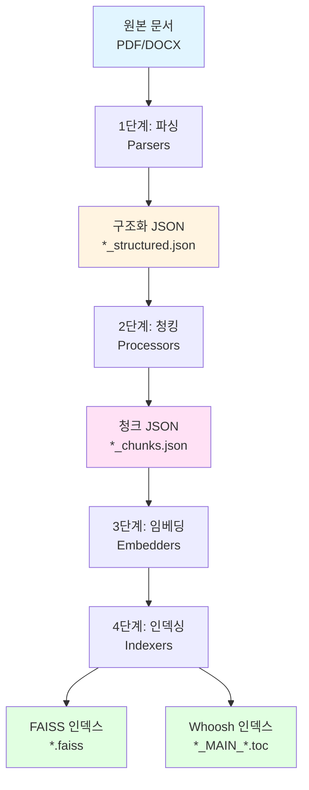
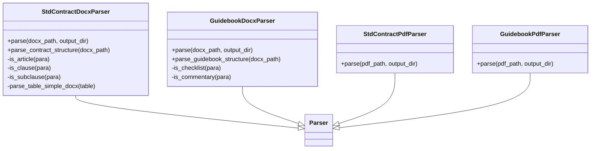
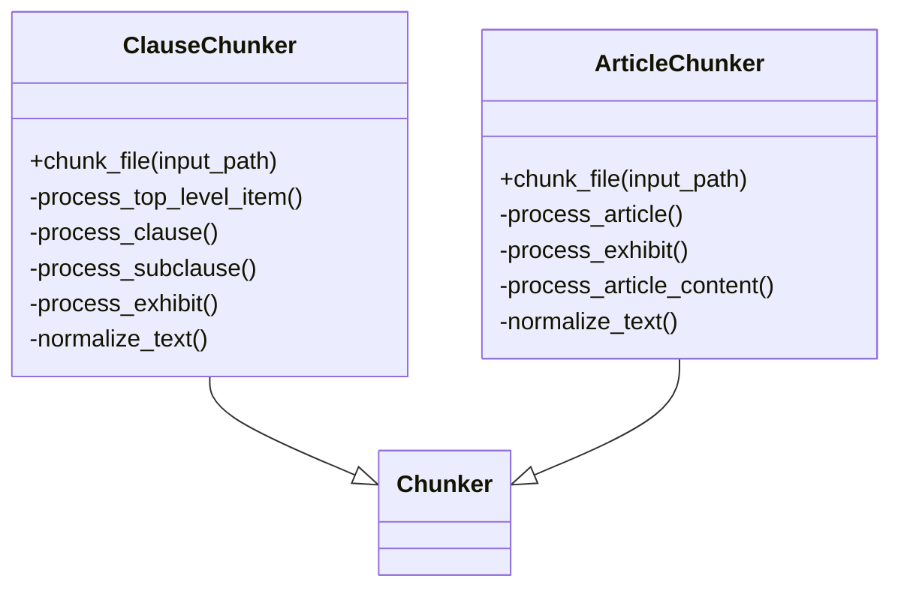
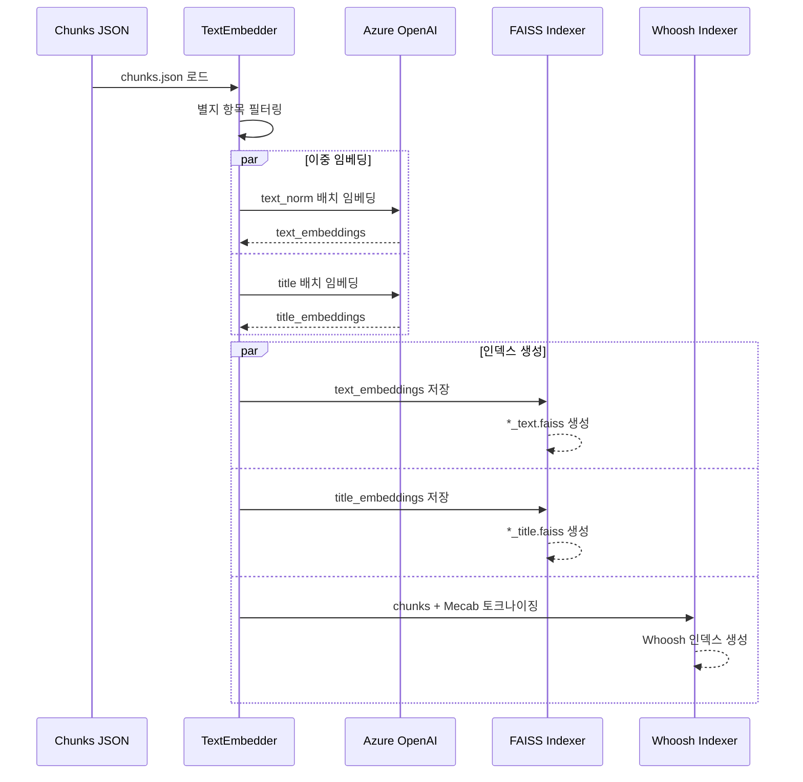

# Ingestion Pipeline

## 개요

Ingestion Pipeline은 표준계약서와 활용안내서를 처리하여 검색 가능한 지식베이스로 구축하는 문서 처리 파이프라인. 4단계(파싱 → 청킹 → 임베딩 → 인덱싱)로 구성되며, CLI 기반 인터페이스를 통해 실행.

### 주요 기능

- **문서 파싱**: PDF/DOCX 파일을 구조화된 JSON으로 변환
- **청킹**: 조/항/호 단위로 텍스트 분할
- **임베딩**: Azure OpenAI를 통한 벡터 임베딩 생성
- **인덱싱**: FAISS(벡터 검색) + Whoosh(키워드 검색) 하이브리드 인덱스 구축

### 지원 문서

- **표준계약서 5종**: 제공형, 창출형, 가공형, 중개거래형(제공자용), 중개거래형(이용자용)
- **활용안내서**: 체크리스트 및 해설 (현재 파싱만 지원)

## 4단계 파이프라인

### 전체 흐름



### 1단계: 파싱 (Parsers)

원본 문서를 구조화된 JSON으로 변환.

**입력**:
- `data/source_documents/*.pdf`
- `data/source_documents/*.docx`

**출력**:
- `data/extracted_documents/*_structured.json`

**파서 종류**:

| 파서 | 대상 문서 | 확장자 | 구조 |
|------|----------|--------|------|
| `StdContractDocxParser` | 표준계약서 | .docx | 조/항/호/목/별지 |
| `StdContractPdfParser` | 표준계약서 | .pdf | 조/항/호/목/별지 |
| `GuidebookDocxParser` | 활용안내서 | .docx | 체크리스트/해설 |
| `GuidebookPdfParser` | 활용안내서 | .pdf | 체크리스트/해설 |

**구조화 JSON 형식**:

```json
{
  "articles": [
    {
      "type": "조",
      "number": 1,
      "text": "제1조(목적)",
      "content": [
        {
          "type": "조 본문",
          "text": "이 계약은..."
        },
        {
          "type": "항",
          "number": 1,
          "text": "  ① 데이터 제공자는...",
          "content": [
            {
              "type": "호",
              "number": 1,
              "text": "    1. 데이터의 정확성",
              "content": []
            }
          ]
        }
      ]
    }
  ],
  "exhibits": [
    {
      "type": "별지",
      "number": 1,
      "title": "[별지1] 대상데이터",
      "content": [
        {
          "type": "별지 본문",
          "text": "..."
        },
        {
          "type": "표",
          "orientation": "row",
          "headers": ["항목", "내용"],
          "data": [...]
        }
      ]
    }
  ]
}
```

### 2단계: 청킹 (Processors)

구조화된 JSON을 검색 가능한 청크 단위로 분할.

**입력**:
- `data/extracted_documents/*_structured.json`

**출력**:
- `data/chunked_documents/*_chunks.json` (항/호 단위)
- `data/chunked_documents/*_art_chunks.json` (조 단위)

**청킹 전략**:

| 청커 | 청킹 단위 | 용도 |
|------|----------|------|
| `ClauseChunker` | 항/호 단위 | 세밀한 검색 (기본) |
| `ArticleChunker` | 조 단위 | 간이 검색 |

**청크 JSON 형식**:

```json
[
  {
    "id": "제1조 제1항",
    "global_id": "urn:std:provide:art:001:cla:001",
    "unit_type": "clause",
    "parent_id": "제1조",
    "title": "목적",
    "order_index": 1,
    "text_raw": "  ① 데이터 제공자는...\n    1. 데이터의 정확성\n    2. 데이터의 완전성",
    "text_norm": "데이터 제공자는...//데이터의 정확성//데이터의 완전성",
    "anchors": [
      {
        "unit_type": "subClause",
        "offset_raw": 25,
        "offset_norm": 15,
        "breadcrumb": "제1조 제1항 제1호"
      }
    ],
    "source_file": "provide_std_contract_structured.json"
  }
]
```

**필드 설명**:
- `text_raw`: 원본 텍스트 (개행 보존, 표시용)
- `text_norm`: 정규화 텍스트 (인덱스 제거, `//`로 구분, 검색용)
- `anchors`: 하위 항목의 위치 정보

### 3단계: 임베딩 (Embedders)

Azure OpenAI를 통해 텍스트를 벡터로 변환.

**입력**:
- `data/chunked_documents/*_chunks.json`

**출력**:
- 임베딩 벡터 (메모리 내 처리, 4단계로 전달)

**임베딩 모델**:
- `text-embedding-3-large` (Azure OpenAI)
- 차원: 3072
- 배치 크기: 100개

**이중 임베딩**:
- `text_norm` 임베딩: 본문 검색용
- `title` 임베딩: 제목 검색용

**별지 제외**:
- 별지(exhibit) 항목은 임베딩에서 제외
- `global_id`에 `:ex:` 패턴이 있으면 필터링

### 4단계: 인덱싱 (Indexers)

임베딩 벡터와 키워드를 검색 인덱스로 저장.

**출력**:
- `data/search_indexes/faiss/*_text.faiss` (본문 벡터 인덱스)
- `data/search_indexes/faiss/*_title.faiss` (제목 벡터 인덱스)
- `data/search_indexes/whoosh/*/` (키워드 인덱스)

**FAISS 인덱스**:
- 알고리즘: IndexFlatL2 (L2 거리 기반)
- 정확도: 100% (전수 검색)
- 파일 형식: `.faiss` 바이너리

**Whoosh 인덱스**:
- 알고리즘: BM25 (키워드 랭킹)
- 형태소 분석: KoNLPy Mecab
- 검색 필드: `text_norm`, `title`

## 파서 모듈

### 표준계약서 파서 vs 활용안내서 파서

| 구분 | 표준계약서 | 활용안내서 |
|------|-----------|-----------|
| **구조** | 조/항/호/목/별지 계층 | 체크리스트/해설 평면 |
| **패턴** | "제n조", "①", "1.", "가." | "[체크리스트]", "해설:" |
| **표 처리** | 병합 무시, 중복 허용 | 동일 |
| **출력** | 계층 구조 JSON | 평면 구조 JSON |
| **청킹 지원** | O | X (미구현) |

### 표준계약서 파서 상세

**패턴 매칭 규칙**:

| 요소 | 패턴 | Bold | Size | 예시 |
|------|------|------|------|------|
| 장 | `제n장` | True | 12.0pt | 제1장 총칙 |
| 조 | `제n조` | True | 11.0pt | 제1조(목적) |
| 항 | `  ①` | True/Null | 11.0pt | ① 데이터 제공자는... |
| 호 | `  n.` | Null | 11.0pt | 1. 데이터의 정확성 |
| 목 | `    가.` | Null | 11.0pt | 가. 세부 사항 |
| 별지 | `[별지n]` | True | 11.0pt | [별지1] 대상데이터 |

**특수 처리**:
- 장(Chapter)은 무시하고 조를 최상위로 처리
- 제0조(서문) 자동 생성: 제1조의 조본문을 복사
- 표의 주석 행 자동 분리: 우측 정렬 + 전체 병합 셀

## 청킹 전략

### 조 단위 청킹 vs 항/호 단위 청킹

| 구분 | 조 단위 (ArticleChunker) | 항/호 단위 (ClauseChunker) |
|------|-------------------------|--------------------------|
| **청크 크기** | 큼 (조 전체) | 작음 (항/호 개별) |
| **검색 정밀도** | 낮음 | 높음 |
| **컨텍스트** | 풍부 | 제한적 |
| **용도** | 간이 검색, 전체 맥락 | 정밀 검색, 특정 조항 |
| **인덱스 크기** | 작음 (~30개/계약서) | 큼 (~200개/계약서) |

### 항/호 단위 청킹 로직

**최상위 하위항목 기준**:
- 조 본문 → 1개 청크
- 각 항 → 1개 청크 (하위 호/목 포함)
- 조 직속 호 → 1개 청크 (항 없이 호가 바로 나오는 경우)

**예시**:

```
제1조(목적)
  이 계약은... [조본문 → 청크1]
  ① 데이터 제공자는... [항1 → 청크2]
    1. 데이터의 정확성 [호1 - 항1에 포함]
    2. 데이터의 완전성 [호2 - 항1에 포함]
  ② 데이터 이용자는... [항2 → 청크3]
```

**별지 청킹**:
- 인덱스 있음 ("1.", "2." 등): 인덱스 단위로 분할
- 인덱스 없음: 별지 전체를 1개 청크로

### 텍스트 정규화

**인덱스 제거**:
- 항: `  ① ` → 제거
- 호: `  1. ` → 제거
- 목: `    가. ` → 제거

**구분자**:
- `text_raw`: 개행(`\n`)으로 구분
- `text_norm`: `//`로 구분

**표 처리**:
- 각 row를 "항목n:" 형식으로 그룹화
- key-value 쌍을 "- key: value" 형식으로 변환
- 빈 값은 "..."로 표시

## CLI 명령어

### 기본 사용법

```bash
# Docker 환경
docker-compose -f docker/docker-compose.yml --profile ingestion run --rm ingestion

# 로컬 환경
python -m ingestion.ingest
```

### 대화형 모드

```
ingestion> run --mode full --file all
ingestion> search --index provide_std_contract --query "계약 해지"
ingestion> status
ingestion> exit
```

### 실행 모드

| 모드 | 설명 | 입력 | 출력 |
|------|------|------|------|
| `full` | 전체 파이프라인 | PDF/DOCX | FAISS + Whoosh |
| `parsing` | 파싱만 | PDF/DOCX | structured.json |
| `art_chunking` | 조 단위 청킹 | structured.json | art_chunks.json |
| `chunking` | 항/호 단위 청킹 | structured.json | chunks.json |
| `embedding` | 임베딩 + 인덱싱 | chunks.json | FAISS + Whoosh |
| `s_embedding` | 간이 임베딩 | structured.json | FAISS (조 단위) |

### 명령어 예시

**전체 파이프라인 실행**:
```bash
run --mode full --file all
```

**특정 파일만 파싱**:
```bash
run --mode parsing --file provide_std_contract.docx
```

**청킹만 실행**:
```bash
run --mode chunking --file provide_std_contract_structured.json
```

**하이브리드 검색**:
```bash
search --index provide_std_contract --query "데이터 제공 범위" --top 10 --weight 0.7
```

**간이 검색 (FAISS만)**:
```bash
s_search --index provide_std_contract --query "계약 해지" --top 5
```

**상태 확인**:
```bash
status
status --detail
```

**파일 삭제**:
```bash
delete --type chunks
delete --type indexes
```

## 디렉토리 구조

```
data/
├── source_documents/              # 원본 문서
│   ├── provide_std_contract.docx
│   ├── create_std_contract.docx
│   ├── process_std_contract.docx
│   ├── brokerage_provider_std_contract.docx
│   ├── brokerage_user_std_contract.docx
│   └── guidebook.pdf
│
├── extracted_documents/           # 파싱 결과
│   ├── provide_std_contract_structured.json
│   ├── create_std_contract_structured.json
│   └── ...
│
├── chunked_documents/             # 청킹 결과
│   ├── provide_std_contract_chunks.json
│   ├── provide_std_contract_art_chunks.json
│   └── ...
│
└── search_indexes/                # 검색 인덱스
    ├── faiss/
    │   ├── provide_std_contract_text.faiss
    │   ├── provide_std_contract_title.faiss
    │   └── ...
    └── whoosh/
        ├── provide_std_contract/
        │   ├── _MAIN_1.toc
        │   └── ...
        └── ...
```

## 아키텍처 다이어그램

### 파서 모듈 구조



### 청커 모듈 구조



### 인덱싱 프로세스



## 환경 변수

```bash
# Azure OpenAI (필수)
AZURE_OPENAI_API_KEY=your_api_key
AZURE_OPENAI_ENDPOINT=https://your-resource.openai.azure.com/
AZURE_EMBEDDING_DEPLOYMENT=text-embedding-3-large

# 경로 설정 (선택, Docker 자동 설정)
DATA_PATH=/app/data
INDEX_PATH=/app/search_indexes
```

## 성능 고려사항

### 처리 시간

| 단계 | 표준계약서 1종 | 전체 5종 |
|------|--------------|---------|
| 파싱 | ~1초 | ~5초 |
| 청킹 | ~0.5초 | ~2초 |
| 임베딩 | ~30초 | ~150초 |
| 인덱싱 | ~5초 | ~25초 |
| **전체** | **~37초** | **~182초** |

### 인덱스 크기

| 인덱스 | 표준계약서 1종 | 전체 5종 |
|--------|--------------|---------|
| FAISS (text) | ~2.5MB | ~12MB |
| FAISS (title) | ~0.5MB | ~2MB |
| Whoosh | ~1MB | ~5MB |
| **전체** | **~4MB** | **~19MB** |

### 최적화 팁

**배치 처리**:
- 임베딩 API 호출을 100개 단위로 배치
- 실패 시 개별 처리로 폴백

**메모리 관리**:
- 청크 단위로 스트리밍 처리
- 대용량 PDF는 페이지별 분할 파싱

**캐싱**:
- 파싱 결과 재사용 (structured.json)
- 청킹 결과 재사용 (chunks.json)

## 문제 해결

### Mecab 설치 오류

```bash
# Windows
pip install mecab-python3
pip install mecab-ko-dic-msvc

# Linux/Mac
pip install mecab-python3
# 시스템 패키지 매니저로 mecab-ko-dic 설치
```

### Azure OpenAI 연결 실패

```bash
# 환경 변수 확인
echo $AZURE_OPENAI_API_KEY
echo $AZURE_OPENAI_ENDPOINT

# .env 파일 확인
cat .env
```

### 인덱스 손상

```bash
# 인덱스 삭제 후 재생성
ingestion> delete --type indexes
ingestion> run --mode embedding --file all
```

### 메모리 부족

```bash
# 파일별로 개별 처리
ingestion> run --mode full --file provide_std_contract.docx
ingestion> run --mode full --file create_std_contract.docx
```

## 확장 가능성

### 활용안내서 지원

현재 파싱만 지원, 청킹 및 검색 기능 추가 예정:
- 체크리스트 항목별 청킹
- 해설 문단별 청킹
- A2 Node와 통합

### 다국어 지원

영어 계약서 처리를 위한 확장:
- 영어 형태소 분석기 (NLTK, spaCy)
- 다국어 임베딩 모델
- 언어별 인덱스 분리

### VLM 기반 파싱

비정형 계약서 처리:
- GPT-4 Vision을 통한 구조 인식
- 이미지 기반 표 추출
- 레이아웃 분석
