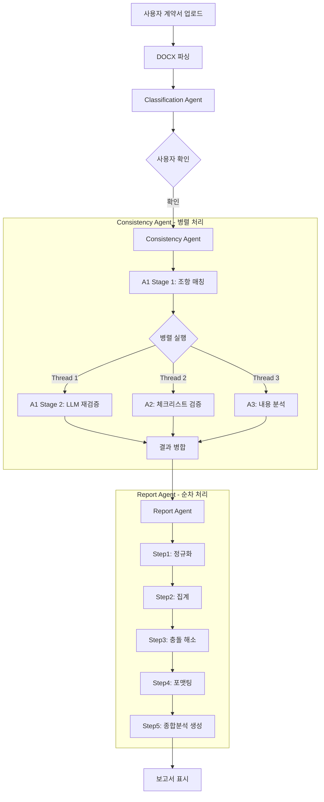
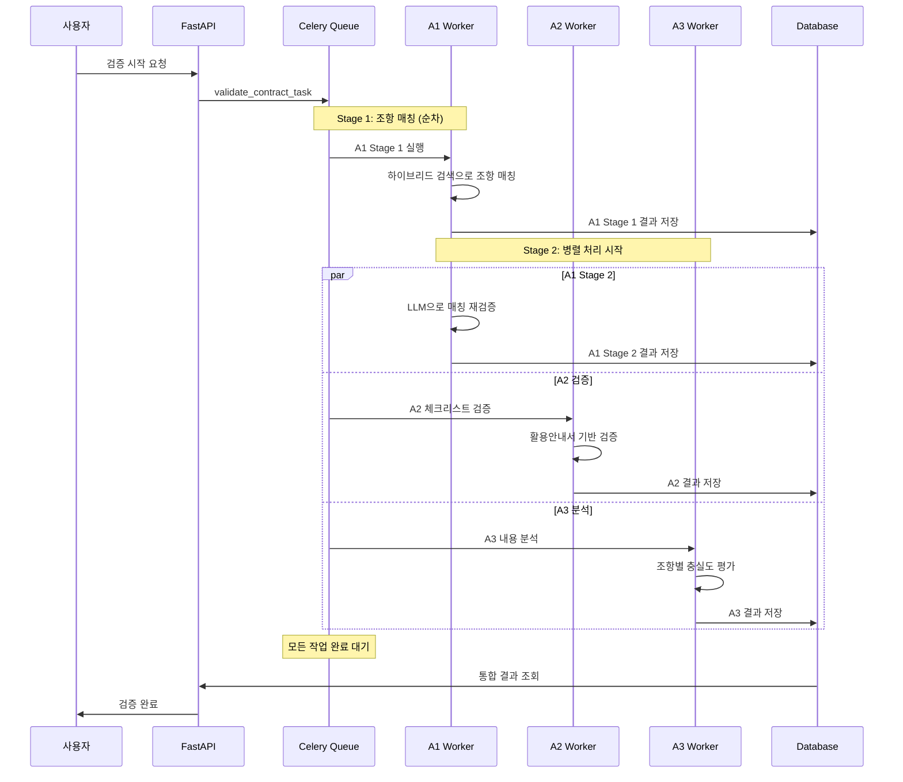
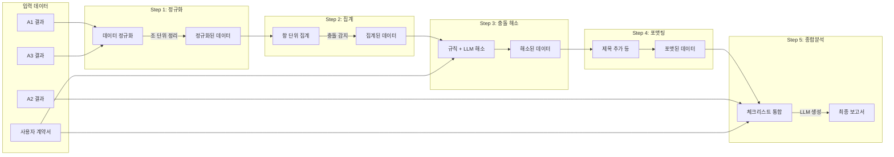

# 병렬 처리 아키텍처

## 전체 시스템 플로우

## Consistency Agent 상세 병렬 구조

## Report Agent 데이터 처리 플로우

## 병렬 처리 성능 비교

```mermaid
gantt
    title 순차 처리 vs 병렬 처리 시간 비교
    dateFormat X
    axisFormat %s초
    
    section 순차 처리
    A1 Stage 1 (30초)    :0, 30
    A1 Stage 2 (60초)    :30, 90
    A2 검증 (45초)       :90, 135
    A3 분석 (50초)       :135, 185
    
    section 병렬 처리
    A1 Stage 1 (30초)    :0, 30
    A1 Stage 2 (60초)    :30, 90
    A2 검증 (45초)       :30, 75
    A3 분석 (50초)       :30, 80
```

### 성능 개선

- **순차 처리**: 약 185초 (3분 5초)
- **병렬 처리**: 약 90초 (1분 30초)
- **개선율**: 51% 시간 단축

## 주요 특징

### 1. Celery 기반 비동기 처리
- Redis를 메시지 브로커로 사용
- 각 Agent는 독립적인 Worker로 실행
- 작업 큐를 통한 느슨한 결합

### 2. 병렬 처리 전략
- A1 Stage 1 완료 후 Stage 2, A2, A3 동시 실행
- 각 작업은 독립적으로 DB에 결과 저장
- Report Agent에서 통합 처리

### 3. 에러 처리
- 각 작업은 독립적으로 실패 가능
- 일부 실패해도 다른 작업 계속 진행
- 최종 보고서에서 누락된 데이터 표시

### 4. 확장성
- Worker 수 증가로 처리량 향상 가능
- 각 Agent별 독립적인 스케일링
- Docker Compose로 간편한 배포
