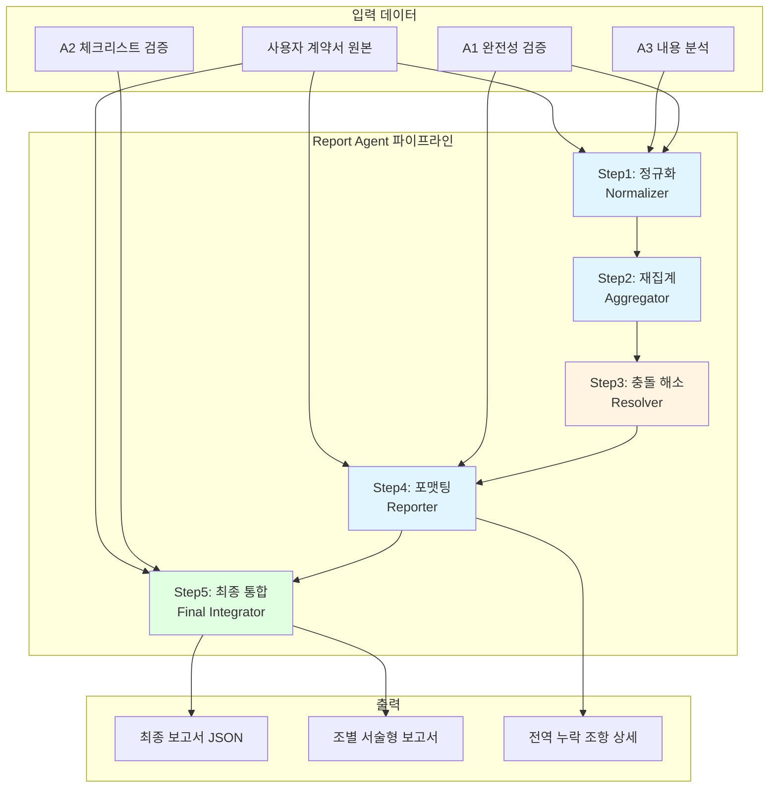
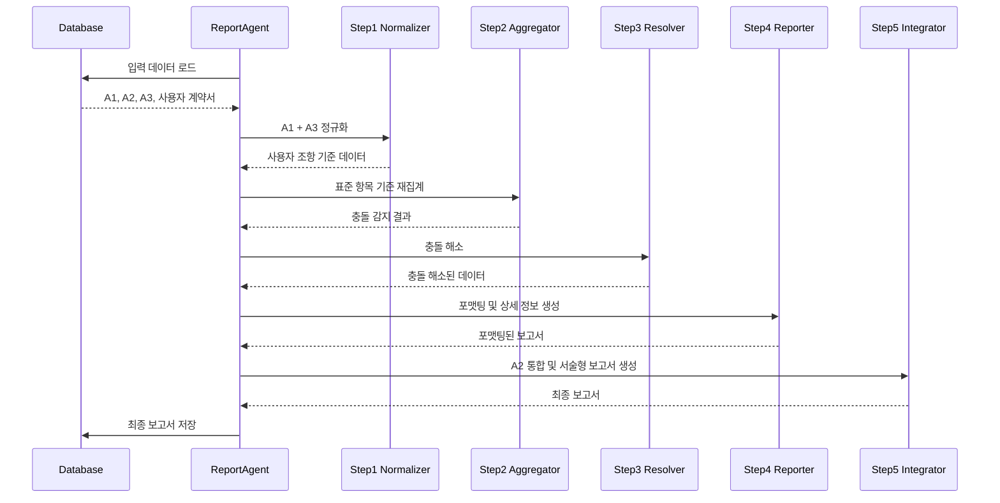
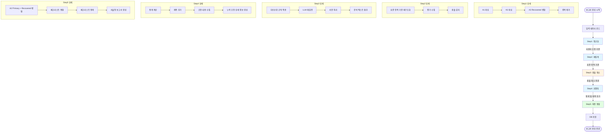
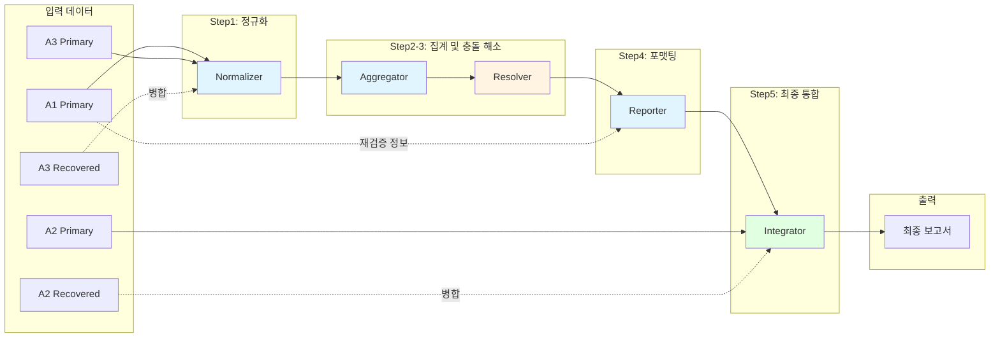
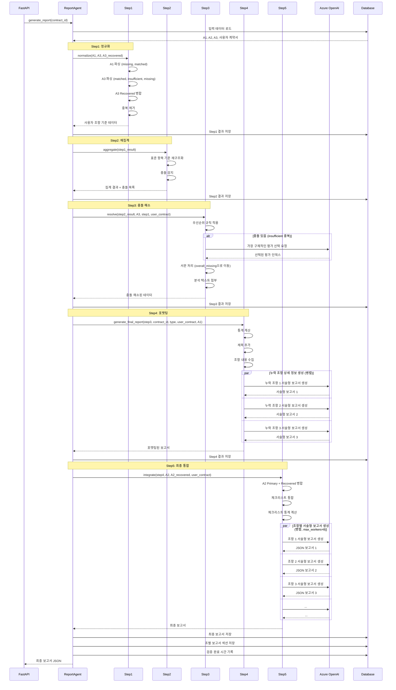

# Report Agent

## 개요

Report Agent는 Consistency Agent의 3개 노드(A1, A2, A3) 검증 결과를 통합하여 최종 보고서를 생성하는 에이전트. 5단계 파이프라인을 통해 데이터를 정규화, 집계, 충돌 해소, 포맷팅, 통합하여 사용자 친화적인 서술형 보고서 제공.

### 주요 기능

- **5단계 보고서 생성 파이프라인**: Step1(정규화) → Step2(집계) → Step3(충돌 해소) → Step4(포맷팅) → Step5(최종 통합)
- **데이터 통합**: A1(완전성), A2(체크리스트), A3(내용 분석) 결과 병합
- **충돌 해소**: 우선순위 규칙 및 LLM 재검증을 통한 자동 충돌 해소
- **서술형 보고서**: LLM 기반 자연어 보고서 생성 (조항별 7개 섹션)
- **조별 상세 분석**: 각 조항에 대한 종합 판단 및 개선 권고사항 제공

### 입력 및 출력

**입력**:
- A1 완전성 검증 결과 (article_mapping.json)
- A2 체크리스트 검증 결과 (checklist_result.json)
- A3 내용 분석 결과 (content_comparison.json)
- 사용자 계약서 원본 데이터

**출력**:
- 최종 통합 보고서 JSON (final_report.json)
- 조별 서술형 보고서 (article_reports)
- 전역 누락 조항 상세 정보 (overall_missing_clauses_detailed)

## 아키텍처




### 컴포넌트 구조


| 컴포넌트 | 파일 | 역할 |
|---------|------|------|
| ReportAgent | agent.py | 메인 오케스트레이터, 5단계 파이프라인 실행 |
| Step1Normalizer | step1_normalizer.py | A1/A3 결과 파싱 및 사용자 조항 기준 정규화 |
| Step2Aggregator | step2_aggregator.py | 표준 항목 기준 재집계 및 충돌 감지 |
| Step3Resolver | step3_resolver.py | 우선순위 규칙 및 LLM 기반 충돌 해소 |
| Step4Reporter | step4_reporter.py | 통계 계산, 포맷팅, 누락 조항 상세 정보 생성 |
| Step5FinalIntegrator | step5_final_integrator.py | A2 체크리스트 통합 및 서술형 보고서 생성 |
| ReportFormatter | report_formatter.py | JSON 보고서를 마크다운 등 다양한 형식으로 변환 |
| ReportSectionSaver | report_section_saver.py | 조별 보고서 섹션 DB 저장 |

## 5단계 보고서 생성 프로세스

### Step 1: 정규화 (Normalizer)

**목적**: A1과 A3 결과를 사용자 조항 기준으로 정규화

**주요 작업**:
1. A1 파싱
   - `is_truly_missing: true` 항목 추출 → `overall_missing_clauses`
   - `matched` 조항 추출 → `user_articles` 초기화
   
2. A3 파싱
   - `matched_articles` 파싱 → 항 단위로 분해하여 `matched`에 추가
   - `insufficient_items` 파싱 → `insufficient`에 추가
   - `missing_items` 파싱 → `missing`에 추가
   
3. A3 Recovered 병합 (있는 경우)
   - A1 재검증 후 매칭된 조항 기반 A3 결과 병합
   - Primary에 없는 `insufficient`/`missing` 항목 추가

4. 중복 제거
   - A3에서 언급된 항목을 `overall_missing`에서 제거

**입력**:
```python
{
    "a1_result": {...},
    "a3_result": {...},
    "a3_recovered_result": {...},  # 선택적
    "contract_type": "provide"
}
```

**출력**:
```python
{
    "overall_missing_clauses": [
        "urn:std:provide:art:013:cla:001",
        ...
    ],
    "user_articles": {
        "user_article_5": {
            "matched": ["urn:std:provide:art:005:cla:001", ...],
            "insufficient": ["urn:std:provide:art:005:cla:002", ...],
            "missing": ["urn:std:provide:art:005:cla:003", ...]
        },
        ...
    }
}
```


### Step 2: 재집계 (Aggregator)

**목적**: 표준 항목 기준으로 재구조화하여 충돌 감지

**주요 작업**:
1. 표준 항목 ID를 키로 재구조화
2. 각 표준 항목에 대한 모든 평가 수집
3. 충돌 감지 (동일 표준 항목에 대해 `sufficient`, `insufficient`, `missing`이 혼재)

**입력**: Step1 결과

**출력**:
```python
{
    "aggregated": {
        "urn:std:provide:art:005:cla:001": {
            "evaluations": [
                {
                    "user_article": "user_article_5",
                    "status": "sufficient",
                    "analysis": "..."
                },
                {
                    "user_article": "user_article_7",
                    "status": "insufficient",
                    "analysis": "..."
                }
            ],
            "has_conflict": true
        },
        ...
    },
    "conflict_count": 15
}
```

### Step 3: 충돌 해소 (Resolver)

**목적**: 우선순위 규칙과 LLM 재검증을 통한 충돌 해소

**충돌 해소 규칙**:

1. **같은 조항 충돌 → 무시**
   - A1 조 단위 vs A3 항 단위 계층 문제
   - 첫 번째 평가만 사용

2. **다른 조항 + sufficient 있음 → sufficient 우선**
   - 문제 없는 것으로 판단

3. **다른 조항 + insufficient vs missing → insufficient 우선**
   - 불충분이 누락보다 우선

4. **다른 조항 + insufficient 중복 → LLM 선택**
   - 중복 제거 후 가장 구체적인 평가 선택

5. **다른 조항 + missing 중복 → 첫 번째만 유지**

**서문(제0조) 처리**:
- 충돌 해소 후 남은 `insufficient`/`missing` 항목을 `overall_missing`으로 이동
- 서문은 계약 전체에 영향을 미치므로 전역 누락으로 처리

**입력**: Step2 결과, A3 원본, Step1 결과, 사용자 계약서 데이터

**출력**:
```python
{
    "overall_missing_clauses": [
        {
            "std_clause_id": "urn:std:provide:art:013:cla:001",
            "analysis": "..."
        },
        ...
    ],
    "user_articles": {
        "user_article_5": {
            "matched": [
                {
                    "std_clause_id": "urn:std:provide:art:005:cla:001",
                    "analysis": "..."
                }
            ],
            "insufficient": [...],
            "missing": [...]
        },
        ...
    }
}
```


### Step 4: 포맷팅 (Reporter)

**목적**: 통계 계산, 제목 추가, 누락 조항 상세 정보 생성

**주요 작업**:

1. **요약 통계 계산**
   - 전체 항목 수, 충족/불충분/누락 개수
   
2. **제목 추가**
   - 표준 조항 global_id → 읽기 쉬운 제목 변환
   - 예: `urn:std:provide:art:005:cla:001` → "제5조 제1항"
   
3. **조항 내용 수집**
   - 사용자 조항 원문 로드
   - 표준계약서 조항 내용 로드 (text_raw, text_norm, commentary_summary)
   
4. **누락 조항 상세 정보 생성** (병렬 처리)
   - 조 단위로 그룹핑
   - A1 재검증 결과에서 가장 유사한 후보 추출
   - LLM 기반 서술형 보고서 생성 (위험성 평가, 권고사항 포함)

**입력**: Step3 결과, contract_id, contract_type, 사용자 계약서 데이터, A1 결과

**출력**:
```python
{
    "contract_id": "...",
    "contract_type": "provide",
    "generated_at": "2024-01-15T10:30:00",
    "summary": {
        "total": 150,
        "sufficient": 120,
        "insufficient": 20,
        "missing": 10
    },
    "overall_missing_clauses": [
        {
            "std_clause_id": "urn:std:provide:art:013:cla:001",
            "std_clause_title": "제13조 제1항",
            "analysis": "..."
        }
    ],
    "overall_missing_clauses_detailed": [
        {
            "std_article_id": "제13조",
            "std_article_title": "이용현황 보고 등",
            "std_article_content": {...},
            "missing_clause_ids": ["urn:std:provide:art:013:cla:001", ...],
            "best_candidate": {
                "user_article_no": 9,
                "user_article_title": "제9조 (위약 및 손해배상)",
                "confidence": 0.40,
                "match_type": "부분 일치(표현 차이)",
                "reasoning": "..."
            },
            "risk_assessment": "...",
            "recommendation": "...",
            "narrative_report": "..."
        }
    ],
    "user_articles": [
        {
            "user_article_no": 5,
            "user_article_title": "제5조 (데이터 제공)",
            "matched": [...],
            "insufficient": [...],
            "missing": [...]
        }
    ],
    "all_clause_contents": {...}
}
```


### Step 5: 최종 통합 (Final Integrator)

**목적**: A2 체크리스트 통합 및 조항별 서술형 보고서 생성

**주요 작업**:

1. **A2 Primary + Recovered 병합**
   - Primary에 없는 체크리스트 항목 추가
   - Recovered는 A1 재검증 후 매칭 결과 기반

2. **체크리스트 결과 통합**
   - 표준 조항 기준 → 사용자 조항 기준으로 변환
   - `source_article_no` 추출 (evidence, recommendation에서 조항 번호 파싱)
   
3. **체크리스트 통계 계산**
   - 전체/통과/실패/불명확/수동확인 항목 수
   - 통과율 계산

4. **조항별 서술형 보고서 생성** (병렬 처리, max_workers=8)
   - LLM 기반 자연어 보고서 생성
   - 7개 섹션 구조 (검토 개요, 충족된 기준, 불충분한 요소, 누락된 핵심 요소, 실무적 리스크, 개선 권고사항, 종합 판단)
   - JSON 형식으로 출력 (영어 키 사용)
   - Rate Limit 재시도 로직 (최대 3회)

**입력**: Step4 결과, A2 Primary, A2 Recovered, 사용자 계약서 데이터

**출력**:
```python
{
    # Step4 결과 + 추가 필드
    "checklist_summary": {
        "total_items": 50,
        "passed_items": 40,
        "failed_items": 8,
        "unclear_items": 2,
        "manual_check_items": 0,
        "pass_rate": 0.80
    },
    "user_articles": [
        {
            "user_article_no": 5,
            "user_article_title": "제5조 (데이터 제공)",
            "matched_standard_articles": [...],
            "insufficient_items": [...],
            "missing_items": [...],
            "checklist_results": [
                {
                    "checklist_id": "...",
                    "result": "YES",
                    "evidence": "...",
                    "source_article_no": 5
                }
            ],
            "narrative_report": "{\"sections\": {...}}"  # JSON 문자열
        }
    ],
    "final_generated_at": "2024-01-15T10:35:00"
}
```

## 데이터 통합

### A1, A2, A3 결과 병합 흐름




### Primary vs Recovered 병합 전략

Report Agent는 A2와 A3의 Primary 및 Recovered 결과를 모두 활용:

**A3 병합 (Step1)**:
- Primary: 초기 매칭 결과 기반 분석
- Recovered: A1 재검증 후 매칭 결과 기반 분석 (더 정확)
- 병합 전략: Recovered의 `insufficient`/`missing` 항목을 Primary에 추가 (중복 제거)

**A2 병합 (Step5)**:
- Primary: 초기 매칭 조항 기반 체크리스트 검증
- Recovered: A1 재검증 후 매칭 조항 기반 체크리스트 검증
- 병합 전략: Recovered의 표준 조항을 Primary에 추가 (중복 제거)

## 보고서 구조

### 최종 보고서 JSON 구조

```json
{
  "contract_id": "contract_123",
  "contract_type": "provide",
  "generated_at": "2024-01-15T10:30:00",
  "final_generated_at": "2024-01-15T10:35:00",
  
  "summary": {
    "total": 150,
    "sufficient": 120,
    "insufficient": 20,
    "missing": 10
  },
  
  "checklist_summary": {
    "total_items": 50,
    "passed_items": 40,
    "failed_items": 8,
    "unclear_items": 2,
    "manual_check_items": 0,
    "pass_rate": 0.80
  },
  
  "overall_missing_clauses": [
    {
      "std_clause_id": "urn:std:provide:art:013:cla:001",
      "std_clause_title": "제13조 제1항",
      "analysis": "사용자 계약서 전체에서 해당 조항을 찾을 수 없습니다..."
    }
  ],
  
  "overall_missing_clauses_detailed": [
    {
      "std_article_id": "제13조",
      "std_article_title": "이용현황 보고 등",
      "std_article_content": {
        "title": "이용현황 보고 등",
        "clauses": [...]
      },
      "missing_clause_ids": ["urn:std:provide:art:013:cla:001", ...],
      "best_candidate": {
        "user_article_no": 9,
        "user_article_title": "제9조 (위약 및 손해배상)",
        "confidence": 0.40,
        "match_type": "부분 일치(표현 차이)",
        "reasoning": "..."
      },
      "risk_assessment": "이용현황 보고 조항이 없으면...",
      "recommendation": "제13조를 추가하거나...",
      "narrative_report": "귀하의 계약서에는..."
    }
  ],
  
  "user_articles": [
    {
      "user_article_no": 5,
      "user_article_title": "제5조 (데이터 제공)",
      
      "matched_standard_articles": [
        {
          "std_clause_id": "urn:std:provide:art:005:cla:001",
          "std_clause_title": "제5조 제1항",
          "analysis": "A3 상세 분석에서 매칭됨"
        }
      ],
      
      "insufficient_items": [
        {
          "std_clause_id": "urn:std:provide:art:005:cla:002",
          "std_clause_title": "제5조 제2항",
          "analysis": "데이터 품질 기준이 명확하지 않음..."
        }
      ],
      
      "missing_items": [
        {
          "std_clause_id": "urn:std:provide:art:005:cla:003",
          "std_clause_title": "제5조 제3항",
          "analysis": "데이터 제공 일정이 누락됨..."
        }
      ],
      
      "checklist_results": [
        {
          "checklist_id": "check_001",
          "checklist_title": "데이터 제공 범위 명시",
          "result": "YES",
          "evidence": "제5조에서 데이터 범위를 명확히 규정함",
          "source_article_no": 5
        },
        {
          "checklist_id": "check_002",
          "checklist_title": "품질 기준 포함",
          "result": "NO",
          "recommendation": "제5조에 품질 기준을 추가할 것",
          "source_article_no": 5
        }
      ],
      
      "narrative_report": "{\"sections\": {\"section_1_overview\": \"...\", ...}}"
    }
  ],
  
  "all_clause_contents": {
    "user_articles": {...},
    "overall_missing_std_clauses": [...]
  }
}
```


### 조별 서술형 보고서 구조

각 조항에 대해 7개 섹션으로 구성된 서술형 보고서 생성:

```json
{
  "article_title": "제5조 (데이터 제공)",
  "sections": {
    "section_1_overview": "본 조항은 데이터 제공의 범위와 방법을 규정하고 있습니다...",
    "section_2_fulfilled_criteria": "데이터 제공 범위가 명확히 규정되어 있으며...",
    "section_3_insufficient_elements": "데이터 품질 기준이 명확하지 않아...",
    "section_4_missing_core_elements": "데이터 제공 일정이 누락되어...",
    "section_5_practical_risks": "품질 기준 부재로 인해 분쟁 가능성이...",
    "section_6_improvement_recommendations": "제5조에 품질 기준 및 제공 일정을 추가할 것을 권장합니다...",
    "section_7_comprehensive_judgment": "기본 구조는 적절하나 일부 절차적 요소는 보완이 필요합니다..."
  }
}
```

**섹션별 설명**:

1. **검토 개요**: 조항의 역할 및 전체적인 평가
2. **충족된 기준**: 표준계약서 기준을 충족한 항목
3. **불충분한 요소**: 내용이 불명확하거나 불충분한 항목
4. **누락된 핵심 요소**: 표준계약서에는 있으나 사용자 계약서에 없는 항목
5. **실무적 리스크**: 불충분/누락 항목으로 인한 실무상 위험
6. **개선 권고사항**: 구체적인 보완 방법 제시
7. **종합 판단**: 전체 충족도 및 안정성에 대한 결론

## 출력 스키마

### Step1 출력 스키마

```typescript
interface Step1Output {
  overall_missing_clauses: string[];  // 전역 누락 조항 ID 목록
  user_articles: {
    [key: string]: {  // "user_article_5" 형식
      matched: string[];      // 매칭된 표준 조항 ID
      insufficient: string[]; // 불충분한 표준 조항 ID
      missing: string[];      // 누락된 표준 조항 ID
    }
  }
}
```

### Step2 출력 스키마

```typescript
interface Step2Output {
  aggregated: {
    [std_clause_id: string]: {
      evaluations: Array<{
        user_article: string;  // "user_article_5"
        status: "sufficient" | "insufficient" | "missing";
        analysis: string;
      }>;
      has_conflict: boolean;
    }
  };
  conflict_count: number;
}
```

### Step3 출력 스키마

```typescript
interface Step3Output {
  overall_missing_clauses: Array<{
    std_clause_id: string;
    analysis: string;
  }>;
  user_articles: {
    [key: string]: {
      matched: Array<{
        std_clause_id: string;
        analysis: string;
      }>;
      insufficient: Array<{
        std_clause_id: string;
        analysis: string;
      }>;
      missing: Array<{
        std_clause_id: string;
        analysis: string;
      }>;
    }
  }
}
```


### Step4 출력 스키마

```typescript
interface Step4Output {
  contract_id: string;
  contract_type: string;
  generated_at: string;  // ISO 8601
  
  summary: {
    total: number;
    sufficient: number;
    insufficient: number;
    missing: number;
  };
  
  overall_missing_clauses: Array<{
    std_clause_id: string;
    std_clause_title: string;
    analysis: string;
  }>;
  
  overall_missing_clauses_detailed: Array<{
    std_article_id: string;  // "제13조"
    std_article_title: string;
    std_article_content: {
      title: string;
      clauses: Array<{
        global_id: string;
        text_raw: string;
        text_norm: string;
        commentary_summary: string;
      }>;
    };
    missing_clause_ids: string[];
    best_candidate: {
      user_article_no: number;
      user_article_title: string;
      user_article_content: object;
      confidence: number;
      match_type: string;
      reasoning: string;
      risk: string;
      recommendation: string;
    } | null;
    risk_assessment: string;
    recommendation: string;
    evidence: string;
    narrative_report: string;  // 서술형 보고서
  }>;
  
  user_articles: Array<{
    user_article_no: number;
    user_article_title: string;
    matched: Array<{
      std_clause_id: string;
      std_clause_title: string;
      analysis: string;
    }>;
    insufficient: Array<{
      std_clause_id: string;
      std_clause_title: string;
      analysis: string;
    }>;
    missing: Array<{
      std_clause_id: string;
      std_clause_title: string;
      analysis: string;
    }>;
  }>;
  
  all_clause_contents: {
    user_articles: object;
    overall_missing_std_clauses: object[];
  };
}
```

### Step5 출력 스키마 (최종 보고서)

```typescript
interface Step5Output extends Step4Output {
  checklist_summary: {
    total_items: number;
    passed_items: number;
    failed_items: number;
    unclear_items: number;
    manual_check_items: number;
    pass_rate: number;
  };
  
  user_articles: Array<{
    user_article_no: number;
    user_article_title: string;
    
    matched_standard_articles: Array<{
      std_clause_id: string;
      std_clause_title: string;
      analysis: string;
    }>;
    
    insufficient_items: Array<{
      std_clause_id: string;
      std_clause_title: string;
      analysis: string;
    }>;
    
    missing_items: Array<{
      std_clause_id: string;
      std_clause_title: string;
      analysis: string;
    }>;
    
    checklist_results: Array<{
      checklist_id: string;
      checklist_title: string;
      result: "YES" | "NO" | "UNCLEAR" | "MANUAL_CHECK_REQUIRED";
      evidence?: string;
      recommendation?: string;
      missing_explanation?: string;
      manual_check_reason?: string;
      source_article_no: number;
    }>;
    
    narrative_report: string;  // JSON 문자열 형식
  }>;
  
  final_generated_at: string;  // ISO 8601
}
```


## 다이어그램

### 5단계 파이프라인 플로우차트



### 데이터 통합 다이어그램




### 보고서 생성 시퀀스 다이어그램




## JSON 예시

### 최종 보고서 JSON 예시

```json
{
  "contract_id": "contract_20240115_001",
  "contract_type": "provide",
  "generated_at": "2024-01-15T10:30:00.123456",
  "final_generated_at": "2024-01-15T10:35:45.789012",
  
  "summary": {
    "total": 150,
    "sufficient": 120,
    "insufficient": 20,
    "missing": 10
  },
  
  "checklist_summary": {
    "total_items": 50,
    "passed_items": 40,
    "failed_items": 8,
    "unclear_items": 2,
    "manual_check_items": 0,
    "pass_rate": 0.80
  },
  
  "overall_missing_clauses": [
    {
      "std_clause_id": "urn:std:provide:art:013:cla:001",
      "std_clause_title": "제13조 제1항",
      "analysis": "사용자 계약서 전체에서 해당 조항을 찾을 수 없습니다. 표준계약서에서는 이 조항이 필수적으로 포함되어야 합니다."
    },
    {
      "std_clause_id": "urn:std:provide:art:013:cla:002",
      "std_clause_title": "제13조 제2항",
      "analysis": "사용자 계약서 전체에서 해당 조항을 찾을 수 없습니다. 표준계약서에서는 이 조항이 필수적으로 포함되어야 합니다."
    }
  ],
  
  "overall_missing_clauses_detailed": [
    {
      "std_article_id": "제13조",
      "std_article_title": "이용현황 보고 등",
      "std_article_content": {
        "title": "이용현황 보고 등",
        "clauses": [
          {
            "global_id": "urn:std:provide:art:013:cla:001",
            "text_raw": "데이터제공자는 데이터이용자에게 데이터의 이용현황을 정기적으로 보고하여야 한다.",
            "text_norm": "데이터제공자는 데이터이용자에게 데이터의 이용현황을 정기적으로 보고하여야 한다.",
            "commentary_summary": "데이터 이용 현황을 정기적으로 보고하도록 규정하여 투명성을 확보합니다."
          },
          {
            "global_id": "urn:std:provide:art:013:cla:002",
            "text_raw": "보고 주기 및 방법은 별도 협의로 정한다.",
            "text_norm": "보고 주기 및 방법은 별도 협의로 정한다.",
            "commentary_summary": "보고 주기와 방법을 당사자 간 협의로 유연하게 정할 수 있도록 합니다."
          }
        ]
      },
      "missing_clause_ids": [
        "urn:std:provide:art:013:cla:001",
        "urn:std:provide:art:013:cla:002"
      ],
      "best_candidate": {
        "user_article_no": 9,
        "user_article_title": "제9조 (위약 및 손해배상)",
        "user_article_content": {
          "number": 9,
          "title": "위약 및 손해배상",
          "content": "당사자 일방이 본 계약을 위반한 경우..."
        },
        "confidence": 0.40,
        "match_type": "부분 일치(표현 차이)",
        "reasoning": "제9조에서 계약 위반 시 책임을 규정하고 있으나, 이용현황 보고와는 직접적인 관련이 없습니다.",
        "risk": "이용현황 보고 조항이 없으면 데이터 이용에 대한 투명성이 부족하여 분쟁 발생 시 입증이 어려울 수 있습니다.",
        "recommendation": "제13조를 추가하거나 기존 조항에 이용현황 보고 의무를 명시할 것을 권장합니다."
      },
      "risk_assessment": "이용현황 보고 조항이 없으면 데이터 이용에 대한 투명성이 부족하여 분쟁 발생 시 입증이 어려울 수 있습니다.",
      "recommendation": "제13조를 추가하거나 기존 조항에 이용현황 보고 의무를 명시할 것을 권장합니다.",
      "evidence": "사용자 조항 제9조와 매칭되었으나 신뢰도가 낮아 누락으로 처리됨",
      "narrative_report": "귀하의 계약서에는 표준계약서 제13조 (이용현황 보고 등)의 내용이 포함되지 않았습니다.\n\n제13조는 데이터 제공자가 데이터 이용자에게 데이터의 이용현황을 정기적으로 보고하도록 규정하여 투명성을 확보하는 역할을 합니다...(생략)"
    }
  ],
  
  "user_articles": [
    {
      "user_article_no": 5,
      "user_article_title": "제5조 (데이터 제공)",
      
      "matched_standard_articles": [
        {
          "std_clause_id": "urn:std:provide:art:005:cla:001",
          "std_clause_title": "제5조 제1항",
          "analysis": "데이터 제공 범위가 명확히 규정되어 있음"
        }
      ],
      
      "insufficient_items": [
        {
          "std_clause_id": "urn:std:provide:art:005:cla:002",
          "std_clause_title": "제5조 제2항",
          "analysis": "데이터 품질 기준이 명확하지 않아 해석의 여지가 있음"
        }
      ],
      
      "missing_items": [
        {
          "std_clause_id": "urn:std:provide:art:005:cla:003",
          "std_clause_title": "제5조 제3항",
          "analysis": "데이터 제공 일정이 누락되어 있음"
        }
      ],
      
      "checklist_results": [
        {
          "checklist_id": "check_provide_001",
          "checklist_title": "데이터 제공 범위 명시",
          "result": "YES",
          "evidence": "제5조에서 데이터 범위를 명확히 규정함",
          "source_article_no": 5
        },
        {
          "checklist_id": "check_provide_002",
          "checklist_title": "품질 기준 포함",
          "result": "NO",
          "recommendation": "제5조에 품질 기준을 추가할 것",
          "source_article_no": 5
        },
        {
          "checklist_id": "check_provide_003",
          "checklist_title": "제공 일정 명시",
          "result": "NO",
          "missing_explanation": "제5조에 제공 일정이 명시되지 않음",
          "source_article_no": 5
        }
      ],
      
      "narrative_report": "{\"article_title\": \"제5조 (데이터 제공)\", \"sections\": {\"section_1_overview\": \"본 조항은 데이터 제공의 범위와 방법을 규정하고 있습니다. 전체적으로 기본 구조는 적절하나 일부 세부 사항에서 보완이 필요합니다.\", \"section_2_fulfilled_criteria\": \"데이터 제공 범위가 명확히 규정되어 있으며, 제공 방법도 구체적으로 명시되어 있습니다. 체크리스트 항목 중 '데이터 제공 범위 명시'를 충족하고 있습니다.\", \"section_3_insufficient_elements\": \"데이터 품질 기준이 명확하지 않아 해석의 여지가 있습니다. 품질 기준이 모호하면 실무상 분쟁이 발생할 수 있습니다.\", \"section_4_missing_core_elements\": \"데이터 제공 일정이 누락되어 있습니다. 제공 일정이 없으면 이행 시기를 둘러싼 분쟁이 발생할 수 있습니다.\", \"section_5_practical_risks\": \"품질 기준 부재로 인해 데이터 품질에 대한 분쟁 가능성이 있으며, 제공 일정 누락으로 인해 이행 시기를 둘러싼 분쟁이 발생할 수 있습니다.\", \"section_6_improvement_recommendations\": \"제5조에 품질 기준 및 제공 일정을 추가할 것을 권장합니다. 품질 기준은 정확성, 완전성, 최신성 등의 항목으로 구체화하고, 제공 일정은 계약 체결 후 구체적인 날짜 또는 기간으로 명시하는 것이 바람직합니다.\", \"section_7_comprehensive_judgment\": \"기본 구조는 적절하나 품질 기준과 제공 일정 등 일부 절차적 요소는 보완이 필요합니다. 이러한 보완이 이루어지면 실무상 안정적으로 운영될 수 있을 것으로 판단됩니다.\"}}"
    }
  ],
  
  "all_clause_contents": {
    "user_articles": {
      "user_article_5": {
        "content": {
          "number": 5,
          "title": "데이터 제공",
          "content": "데이터제공자는 데이터이용자에게 다음 각 호의 데이터를 제공한다.\n1. 고객 거래 데이터\n2. 상품 정보 데이터"
        },
        "matched_std_clauses": [...],
        "insufficient_std_clauses": [...],
        "missing_std_clauses": [...]
      }
    },
    "overall_missing_std_clauses": [...]
  }
}
```


### 조별 보고서 JSON 예시

```json
{
  "article_title": "제5조 (데이터 제공)",
  "sections": {
    "section_1_overview": "본 조항은 데이터 제공의 범위와 방법을 규정하고 있습니다. 전체적으로 기본 구조는 적절하나 일부 세부 사항에서 보완이 필요합니다.",
    
    "section_2_fulfilled_criteria": "데이터 제공 범위가 명확히 규정되어 있으며, 제공 방법도 구체적으로 명시되어 있습니다. 체크리스트 항목 중 '데이터 제공 범위 명시'를 충족하고 있습니다. 제공 대상 데이터가 고객 거래 데이터와 상품 정보 데이터로 명확히 구분되어 있어 실무상 혼란이 없을 것으로 판단됩니다.",
    
    "section_3_insufficient_elements": "데이터 품질 기준이 명확하지 않아 해석의 여지가 있습니다. 품질 기준이 모호하면 실무상 분쟁이 발생할 수 있습니다. 예를 들어, 데이터의 정확성, 완전성, 최신성 등에 대한 구체적인 기준이 없어 데이터 품질에 대한 이견이 발생할 수 있습니다.",
    
    "section_4_missing_core_elements": "데이터 제공 일정이 누락되어 있습니다. 제공 일정이 없으면 이행 시기를 둘러싼 분쟁이 발생할 수 있습니다. 일반적으로 데이터 제공 계약에서는 계약 체결 후 구체적인 날짜 또는 기간을 명시하여 이행 시기를 명확히 하는 것이 필요합니다.",
    
    "section_5_practical_risks": "품질 기준 부재로 인해 데이터 품질에 대한 분쟁 가능성이 있으며, 제공 일정 누락으로 인해 이행 시기를 둘러싼 분쟁이 발생할 수 있습니다. 특히 데이터 품질이 기대에 미치지 못할 경우 계약 해지나 손해배상 청구로 이어질 수 있으며, 제공 일정이 불명확하면 계약 이행 여부를 판단하기 어려워 법적 분쟁으로 확대될 수 있습니다.",
    
    "section_6_improvement_recommendations": "제5조에 품질 기준 및 제공 일정을 추가할 것을 권장합니다. 품질 기준은 정확성, 완전성, 최신성 등의 항목으로 구체화하고, 각 항목별로 측정 가능한 기준을 제시하는 것이 바람직합니다. 제공 일정은 계약 체결 후 구체적인 날짜 또는 기간으로 명시하되, 불가피한 사유로 지연될 경우의 통지 절차도 함께 규정하는 것이 좋습니다.",
    
    "section_7_comprehensive_judgment": "기본 구조는 적절하나 품질 기준과 제공 일정 등 일부 절차적 요소는 보완이 필요합니다. 이러한 보완이 이루어지면 실무상 안정적으로 운영될 수 있을 것으로 판단됩니다. 다만, 현재 상태로도 데이터 제공의 기본 틀은 갖추고 있으므로, 추가 협의를 통해 세부 사항을 보완하는 방식으로 진행할 수 있습니다."
  }
}
```

## 에러 처리

### 예외 클래스

| 예외 클래스 | 설명 | 발생 시점 |
|------------|------|----------|
| ReportAgentError | Report Agent 기본 예외 | 보고서 생성 실패 |
| ParsingError | A1/A3 결과 파싱 실패 | Step1 정규화 중 |
| ClauseReferenceError | 표준 조항 참조 추출 실패 | Step1 정규화 중 |
| LLMVerificationError | LLM 재검증 실패 | Step3 충돌 해소 중 |
| DatabaseSaveError | DB 저장 실패 | 결과 저장 중 |

### 재시도 로직

**LLM 호출 재시도**:
- Rate Limit 에러 발생 시 최대 3회 재시도
- 대기 시간: 5초, 10초, 15초 (지수 백오프)
- 재시도 실패 시 폴백 보고서 생성

**병렬 처리 에러 핸들링**:
- 개별 조항 처리 실패 시 해당 조항만 폴백 처리
- 전체 파이프라인은 계속 진행
- 실패한 조항은 로그에 기록

### 폴백 메커니즘

**서술형 보고서 생성 실패 시**:
```python
{
  "article_title": "제5조 (데이터 제공)",
  "sections": {
    "section_1_overview": "본 조항에 대한 검토를 수행했습니다. 3개의 표준 조항과 매칭되었으며, 체크리스트 2개 항목을 충족하고 있습니다.",
    "section_2_fulfilled_criteria": "체크리스트 2개 항목이 충족되었습니다.",
    "section_3_insufficient_elements": "1개의 불충분한 항목이 확인되었습니다.",
    "section_4_missing_core_elements": "1개의 누락된 항목이 확인되었습니다.",
    "section_5_practical_risks": "1개의 미충족 체크리스트가 확인되었습니다.",
    "section_6_improvement_recommendations": "상세 내용은 구조화된 데이터를 참조하시기 바랍니다.",
    "section_7_comprehensive_judgment": "LLM 호출 실패로 인해 기본 폴백 보고서가 생성되었습니다. 상세 분석을 위해 재시도를 권장합니다."
  }
}
```

## 성능 최적화

### 병렬 처리

**누락 조항 상세 정보 생성** (Step4):
- ThreadPoolExecutor 사용 (max_workers=3)
- 누락 조항은 보통 적으므로 동시 처리 수 제한
- 각 조항별 LLM 호출 독립적으로 처리

**조항별 서술형 보고서 생성** (Step5):
- ThreadPoolExecutor 사용 (max_workers=8)
- 사용자 조항 수가 많으므로 동시 처리 수 증가
- Rate Limit 고려하여 재시도 로직 포함

### 캐싱

**표준계약서 청크 캐싱**:
- 계약 유형별로 한 번만 로드
- 메모리 캐시 사용 (딕셔너리)
- 조항 내용 조회 시 캐시 우선 확인

### 소요 시간

일반적인 보고서 생성 소요 시간 (사용자 조항 20개 기준):

| 단계 | 소요 시간 | 비고 |
|-----|---------|------|
| Step0: 입력 데이터 로드 | 0.5초 | DB 조회 |
| Step1: 정규화 | 1.0초 | 파싱 및 병합 |
| Step2: 재집계 | 0.3초 | 재구조화 |
| Step3: 충돌 해소 | 2.0초 | LLM 호출 포함 |
| Step4: 포맷팅 | 5.0초 | 누락 조항 LLM 호출 포함 |
| Step5: 최종 통합 | 15.0초 | 조항별 LLM 호출 (병렬) |
| 저장 | 1.0초 | DB 저장 |
| **전체** | **약 25초** | |


## 사용 예시

### 보고서 생성

```python
from backend.report_agent.agent import ReportAgent
from backend.shared.services.knowledge_base_loader import KnowledgeBaseLoader
from openai import AzureOpenAI
import os

# 초기화
kb_loader = KnowledgeBaseLoader()
azure_client = AzureOpenAI(
    api_key=os.getenv("AZURE_OPENAI_API_KEY"),
    azure_endpoint=os.getenv("AZURE_OPENAI_ENDPOINT"),
    api_version="2024-02-01"
)

report_agent = ReportAgent(kb_loader=kb_loader, azure_client=azure_client)

# 보고서 생성
contract_id = "contract_20240115_001"
final_report = report_agent.generate_report(contract_id)

# 결과 확인
print(f"전체 항목: {final_report['summary']['total']}")
print(f"충족: {final_report['summary']['sufficient']}")
print(f"불충분: {final_report['summary']['insufficient']}")
print(f"누락: {final_report['summary']['missing']}")
print(f"체크리스트 통과율: {final_report['checklist_summary']['pass_rate']:.1%}")
```

### 조별 보고서 조회

```python
from backend.report_agent.report_section_saver import get_article_report_sections

contract_id = "contract_20240115_001"
article_number = 5

# 특정 조의 7개 섹션 조회
sections = get_article_report_sections(contract_id, article_number)

print(f"제{article_number}조 보고서:")
print(f"1. 검토 개요: {sections.get('section_1_overview', 'N/A')}")
print(f"2. 충족된 기준: {sections.get('section_2_fulfilled_criteria', 'N/A')}")
# ... (나머지 섹션)
```

### 마크다운 변환

```python
from backend.report_agent.report_formatter import ReportFormatter

formatter = ReportFormatter()

# JSON 보고서를 마크다운으로 변환
markdown_report = formatter.to_markdown(final_report)

# 파일로 저장
with open("report.md", "w", encoding="utf-8") as f:
    f.write(markdown_report)
```

## 참고 사항

### 서문(제0조) 특별 처리

서문은 계약의 서두에 위치하여 당사자 정보를 정리하고 계약의 기본 목적과 방향성을 소개하는 역할. Report Agent는 서문을 다음과 같이 특별 처리:

1. **Step3 충돌 해소 후**: 서문의 `insufficient`/`missing` 항목을 `overall_missing`으로 이동
2. **Step5 서술형 보고서**: 서문용 프롬프트 사용 (긍정적 평가 중심)
3. **이유**: 서문의 항목은 다른 조항에서 충족될 수 있으므로 전역 누락으로 처리

### LLM 프롬프트 설계

**조항별 서술형 보고서 프롬프트 특징**:
- 7개 섹션 구조 강제 (숫자. 제목 형식)
- 기술적 용어 사용 금지 ("표준계약서", "매칭", "유사도" 등)
- 법무팀 보고서 문체 사용
- JSON 형식 직접 출력 (영어 키 사용)
- 각 섹션은 3~5문장으로 구성

**누락 조항 서술형 보고서 프롬프트 특징**:
- 누락 사실 설명 → 내용 요약 → 위험성 설명 → 실질적 권고
- 자연스러운 단락 중심 (제목 없음)
- 입력 텍스트 그대로 복붙 금지

### 데이터베이스 저장

Report Agent는 각 단계의 결과를 `ValidationResult` 테이블에 저장:

| 필드 | 저장 시점 | 내용 |
|-----|---------|------|
| report_step1_normalized | Step1 완료 | 정규화된 데이터 |
| report_step2_aggregated | Step2 완료 | 집계 결과 |
| report_step3_resolved | Step3 완료 | 충돌 해소 결과 |
| report_step4_formatted | Step4 완료 | 포맷팅된 보고서 |
| final_report | Step5 완료 | 최종 보고서 |
| article_reports | Step5 완료 | 조별 보고서 섹션 |
| validation_timing | 전체 완료 | 검증 소요 시간 |

### 확장 가능성

**추가 가능한 기능**:
- PDF/DOCX 보고서 다운로드
- 보고서 템플릿 커스터마이징
- 다국어 보고서 생성 (영어 등)
- 보고서 버전 관리
- 보고서 비교 기능 (수정 전후)

