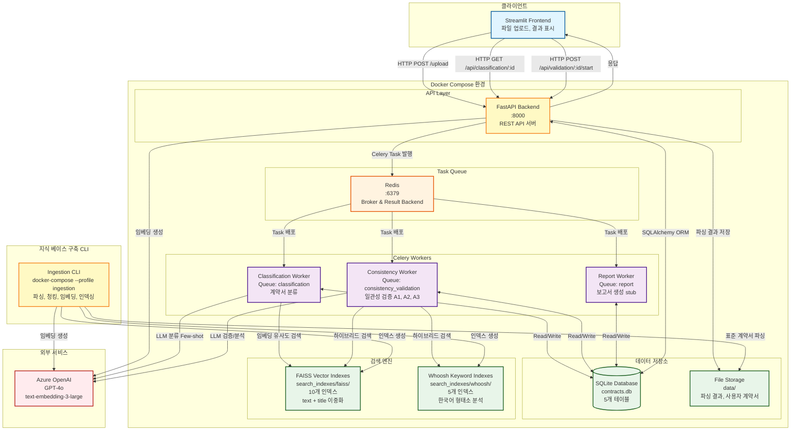
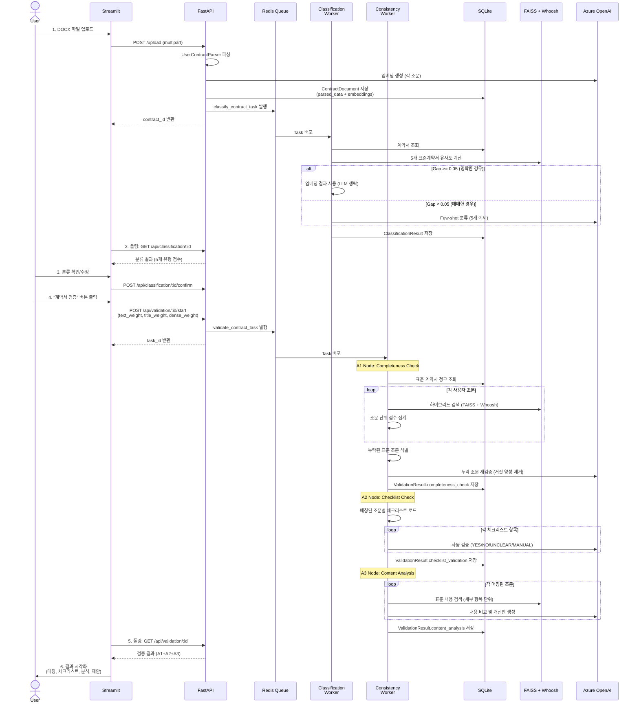
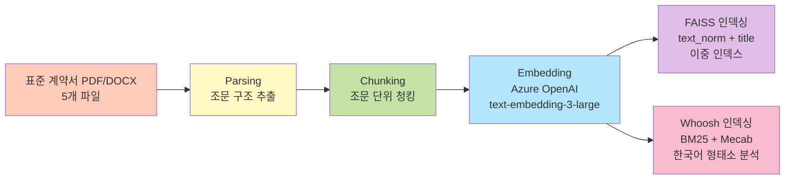
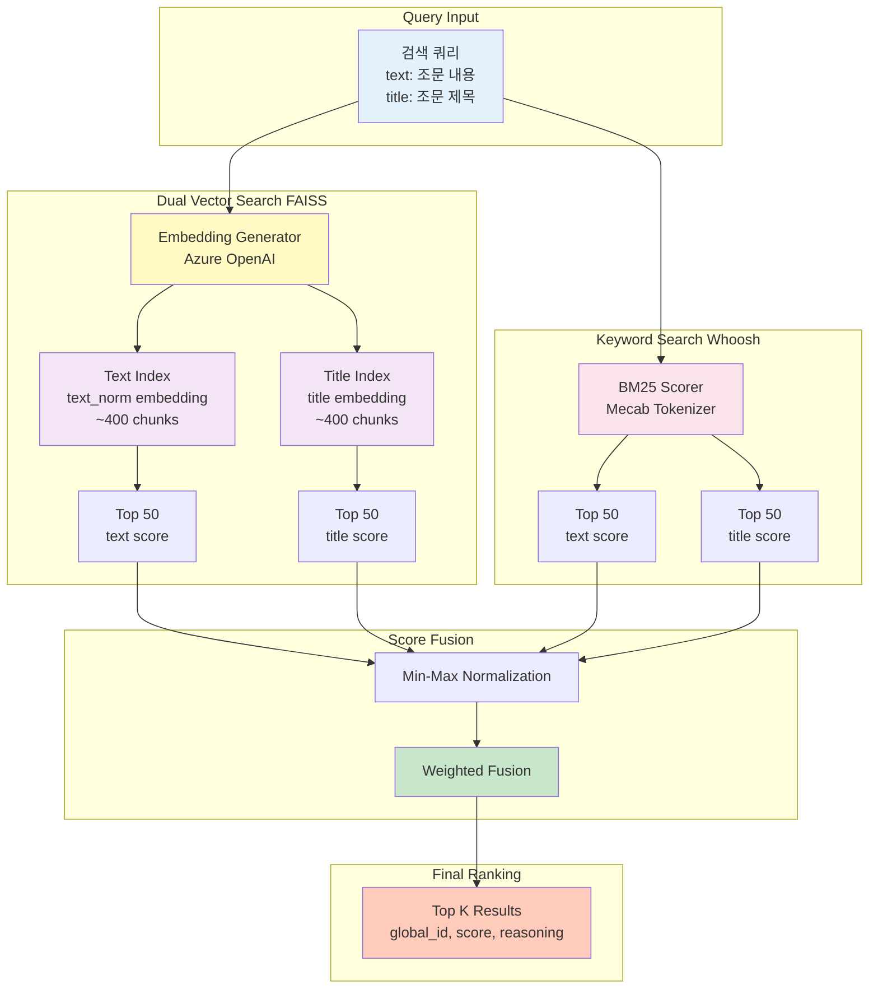
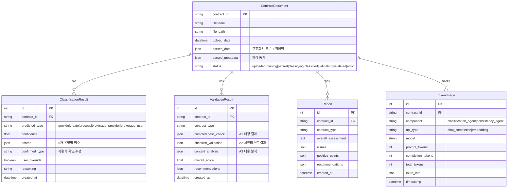
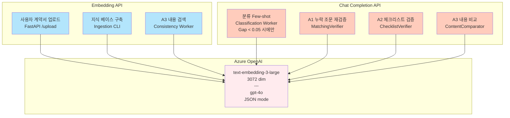

# 시스템 아키텍처

> **최종 업데이트**: 2025-11-03
> **분석 기준**: 실제 코드베이스 검증 (문서 아님)

본 문서는 데이터 계약서 검증 시스템의 전체 아키텍처를 설명합니다.

## 목차
1. [시스템 개요](#시스템-개요)
2. [전체 아키텍처](#전체-아키텍처)
3. [컨테이너 구성](#컨테이너-구성)
4. [데이터 흐름](#데이터-흐름)
5. [검색 아키텍처](#검색-아키텍처)
6. [데이터 저장소](#데이터-저장소)
7. [AI/ML 통합](#aiml-통합)

---

## 시스템 개요

**프로젝트명**: 데이터 계약서 검증 플랫폼
**목적**: 사용자 계약서를 5개 표준 계약서 유형으로 자동 분류하고, RAG 기반 하이브리드 검색으로 일관성을 검증
**기술 스택**: FastAPI, Streamlit, Celery, Redis, SQLite, FAISS, Whoosh, Azure OpenAI
**아키텍처 패턴**: 마이크로서비스 + 비동기 태스크 처리 + RAG (Retrieval-Augmented Generation)

---

## 전체 아키텍처



---

## 컨테이너 구성

### Docker Compose Services

| 서비스명 | 이미지 | 포트 | 역할 | 의존성 | 상태 |
|---------|-------|-----|-----|--------|------|
| **fast-api** | Dockerfile.backend | 8000 | FastAPI REST API 서버 | redis | ✅ 실행 중 |
| **classification-worker** | Dockerfile.classification | - | 계약서 분류 Celery Worker | redis | ✅ 실행 중 |
| **consistency-validation-worker** | Dockerfile.consistency | - | 일관성 검증 Celery Worker | redis | ✅ 실행 중 |
| **report-worker** | Dockerfile.report | - | 보고서 생성 Celery Worker | redis | ⚠️ Stub |
| **redis** | redis:7-alpine | 6379 | Celery Broker/Backend | - | ✅ 실행 중 |
| **ingestion** | Dockerfile.ingestion | - | 지식 베이스 구축 CLI | - | 🔧 Profile 서비스 |

**참고**:
- Streamlit Frontend는 Docker Compose에 포함되지 않음 (별도 실행)
- Ingestion은 `--profile ingestion` 플래그로 수동 실행

### 볼륨 공유

```yaml
volumes:
  - ./data:/app/data                          # 파싱 결과, DB, 사용자 계약서
  - ./search_indexes:/app/search_indexes      # FAISS, Whoosh 인덱스
  - ./backend:/app/backend                    # 코드 핫 리로드 (개발)
  - ./ingestion:/app/ingestion                # 지식 베이스 구축 코드
  - redis_data:/data                          # Redis 영속화
```

---

## 데이터 흐름

### 1. 사용자 계약서 처리 플로우



### 2. 지식 베이스 구축 플로우



**실행 명령**:
```bash
docker-compose --profile ingestion run --rm ingestion run --mode full --file all
```

---

## 검색 아키텍처

### 하이브리드 검색 구조



### 가중치 구조

| 레벨 | 파라미터 | 기본값 | 설명 |
|-----|----------|--------|------|
| **필드 가중치** | text_weight | 0.7 | 조문 내용 중요도 |
| | title_weight | 0.3 | 조문 제목 중요도 |
| **검색 방식 가중치** | dense_weight | 0.85 | 벡터 검색 비중 |
| | sparse_weight | 0.15 | 키워드 검색 비중 |

**수식**:
```
final_score = (text_score * 0.7 + title_score * 0.3) * 0.85(dense) +
              (text_score * 0.7 + title_score * 0.3) * 0.15(sparse)
```

**적응형 가중치**:
- Sparse 검색 결과가 없으면 → Dense 가중치 1.0으로 자동 조정 (0.85 제한 해제)

---

## 데이터 저장소

### 1. SQLite Database 스키마



### 2. 파일 시스템 구조

```
c:\Python Projects\data-contract-project\
├── data/
│   ├── database/
│   │   └── contracts.db                              # SQLite DB
│   ├── source_documents/                             # 표준 계약서 원본 (5개)
│   │   ├── provide_std_contract.pdf
│   │   ├── create_std_contract.pdf
│   │   ├── process_std_contract.pdf
│   │   ├── brokerage_provider_std_contract.pdf
│   │   └── brokerage_user_std_contract.pdf
│   ├── extracted_documents/                          # 파싱된 JSON (5개)
│   │   └── {type}_std_contract_structured.json      # 조문 구조
│   ├── chunked_documents/                            # 청크 JSON (5개)
│   │   └── {type}_std_contract_chunks.json          # ~80-100 조문/청크
│   ├── parsed_user_contracts/                        # 사용자 계약서 (디버깅용)
│   │   └── {filename}_{contract_id}.json
│   └── sample_user_contracts/                        # 테스트 파일
│
└── search_indexes/
    ├── faiss/                                        # 벡터 인덱스 (10개)
    │   ├── provide_std_contract_text.faiss          # 내용 인덱스
    │   ├── provide_std_contract_title.faiss         # 제목 인덱스
    │   ├── create_std_contract_text.faiss
    │   ├── create_std_contract_title.faiss
    │   ├── process_std_contract_text.faiss
    │   ├── process_std_contract_title.faiss
    │   ├── brokerage_provider_std_contract_text.faiss
    │   ├── brokerage_provider_std_contract_title.faiss
    │   ├── brokerage_user_std_contract_text.faiss
    │   └── brokerage_user_std_contract_title.faiss
    │
    └── whoosh/                                       # 키워드 인덱스 (5개)
        ├── provide_std_contract/
        │   ├── _MAIN_*.toc
        │   └── _MAIN_*.seg
        ├── create_std_contract/
        ├── process_std_contract/
        ├── brokerage_provider_std_contract/
        └── brokerage_user_std_contract/
```

### 3. 청크 데이터 구조

```json
{
  "id": "chunk_001",
  "global_id": "urn:contract:provide:article:1",
  "unit_type": "article",
  "parent_id": null,
  "title": "제1조(목적)",
  "text_raw": "이 계약은 데이터 제공에 관한...",
  "text_norm": "계약 데이터 제공 ...",
  "source_file": "provide_std_contract",
  "order_index": 1,
  "embeddings": {
    "title": [0.012, -0.045, ...],      // 3072 dim
    "text_norm": [0.023, -0.012, ...]   // 3072 dim
  }
}
```

---

## AI/ML 통합

### Azure OpenAI 사용 현황



### LLM 호출 최적화

| 단계 | 최적화 기법 | 효과 |
|-----|-----------|------|
| **분류** | Hybrid Gating | LLM 호출 ~60% 감소 |
| **업로드** | 임베딩 캐싱 | 재업로드 시 임베딩 재사용 |
| **검증** | Sparse 실패 시 Dense 100% | Whoosh 오류 시 벡터 검색만 사용 |
| **토큰 추적** | TokenUsage 테이블 | 비용 모니터링 및 분석 |

### 토큰 사용량 추적

```python
# backend/shared/services/embedding_generator.py
def log_token_usage(contract_id, component, api_type, model, tokens):
    """
    component: classification_agent | consistency_agent
    api_type: chat_completion | embedding
    """
    TokenUsage.create(
        contract_id=contract_id,
        component=component,
        api_type=api_type,
        model=model,
        prompt_tokens=tokens["prompt_tokens"],
        completion_tokens=tokens["completion_tokens"],
        total_tokens=tokens["total_tokens"]
    )
```

**재시도 로직**: SQLite 락 발생 시 3회 재시도 (지수 백오프)

---

## 주요 기술적 특징

### 1. 이중 벡터 인덱스 (Dual Vector Index)

- **기존 문제**: 제목과 내용을 하나의 임베딩으로 합치면 정보 손실
- **해결책**: 제목과 내용을 별도 인덱스로 분리
- **효과**: 제목 기반 매칭 정확도 향상 (특히 짧은 조문)

### 2. Hybrid Gating (분류 에이전트)

- **기존 문제**: 모든 분류에 LLM 사용 시 비용 과다
- **해결책**:
  - Gap >= 0.05: 임베딩 결과만 사용 (빠름, 저렴)
  - Gap < 0.05: LLM Few-shot 호출 (정확, 비쌈)
- **효과**: 비용 60% 절감, 응답 속도 향상

### 3. 적응형 하이브리드 검색

- **기존 문제**: Whoosh 인덱스 오류 시 전체 검색 실패
- **해결책**: Sparse 결과 없으면 Dense 가중치 1.0으로 자동 전환
- **효과**: 시스템 안정성 향상

### 4. 한국어 형태소 분석 (Mecab)

- **기존 문제**: 영어 토크나이저로는 한국어 의미 추출 불가
- **해결책**: Mecab 형태소 분석기 + 품사 필터링 (명사, 동사, 형용사)
- **효과**: BM25 키워드 검색 정확도 향상

---

## 구현 상태

| 컴포넌트 | 상태 | 비고 |
|---------|------|------|
| FastAPI Backend | ✅ 완료 | 10개 엔드포인트 |
| Streamlit Frontend | ✅ 완료 | 단일 페이지, Docker 미포함 |
| Classification Worker | ✅ 완료 | Hybrid Gating 적용 |
| Consistency Worker | ✅ 완료 | A1, A2, A3 노드 |
| Report Worker | ⚠️ Stub | `{"status": "ok"}` 반환만 |
| 지식 베이스 구축 | ✅ 완료 | 5개 표준 계약서 인덱싱 |
| 하이브리드 검색 | ✅ 완료 | FAISS + Whoosh 이중 인덱스 |
| 토큰 추적 | ✅ 완료 | DB 저장 및 API 조회 |
| 인증/권한 | ❌ 미구현 | 보안 없음 |
| CORS 설정 | ❌ 미구현 | 프론트엔드 통신 제한 가능 |
| Docker Streamlit | ❌ 미구현 | 수동 실행 필요 |

---

## 환경 설정

### 필수 환경 변수

```bash
# Azure OpenAI
AZURE_OPENAI_API_KEY=your_api_key
AZURE_OPENAI_ENDPOINT=https://your-resource.openai.azure.com/
AZURE_GPT_DEPLOYMENT=gpt-4o
AZURE_EMBEDDING_DEPLOYMENT=text-embedding-3-large

# Redis
REDIS_URL=redis://redis:6379

# Database
DATABASE_URL=sqlite:///./data/database/contracts.db
```

### 포트 매핑

- **8000**: FastAPI (http://localhost:8000)
- **6379**: Redis (내부 네트워크만)
- **Streamlit**: Docker Compose에 없음 (별도 실행)

### 실행 명령어

```bash
# 전체 시스템 시작
docker-compose up -d

# 지식 베이스 구축 (최초 1회)
docker-compose --profile ingestion run --rm ingestion run -m full -f all

# Streamlit 실행 (별도 터미널)
cd frontend
streamlit run app.py

# 로그 확인
docker-compose logs -f fast-api
docker-compose logs -f classification-worker
docker-compose logs -f consistency-validation-worker
```

---

## 성능 지표

| 항목 | 값 |
|-----|---|
| 표준 계약서 청크 수 | ~400 (5개 계약서 합계) |
| 검색 응답 시간 | < 500ms |
| 분류 시간 (임베딩만) | ~2초 |
| 분류 시간 (LLM 포함) | ~5초 |
| A1 노드 실행 시간 | ~30초 (50개 조문 가정) |
| A2 노드 실행 시간 | ~20초 (20개 체크리스트 가정) |
| A3 노드 실행 시간 | ~60초 (50개 조문 가정) |
| 전체 검증 시간 | ~2분 |

---

## 참고 문서

- [하이브리드 검색 로직](./HYBRID_SEARCH_LOGIC.md)
- [A1 노드 매칭 플로우](./A1_SEARCH_MATCHING_FLOW.md)
- [프로젝트 상태](../PROJECT_STATUS.md)
- [기술 스택](./.kiro/steering/tech.md)
- [제품 개요](./.kiro/steering/product.md)

---

## 변경 이력

- **2025-11-03**: 초기 작성 (실제 코드베이스 분석 기반)
  - 이중 벡터 인덱스 구조 반영
  - Hybrid Gating 최적화 반영
  - A1/A2/A3 노드 실제 구현 상태 반영
  - Report Worker stub 상태 명시
