<<<<<<< HEAD
# 시스템 아키텍처 다이어그램

## 전체 시스템 구조

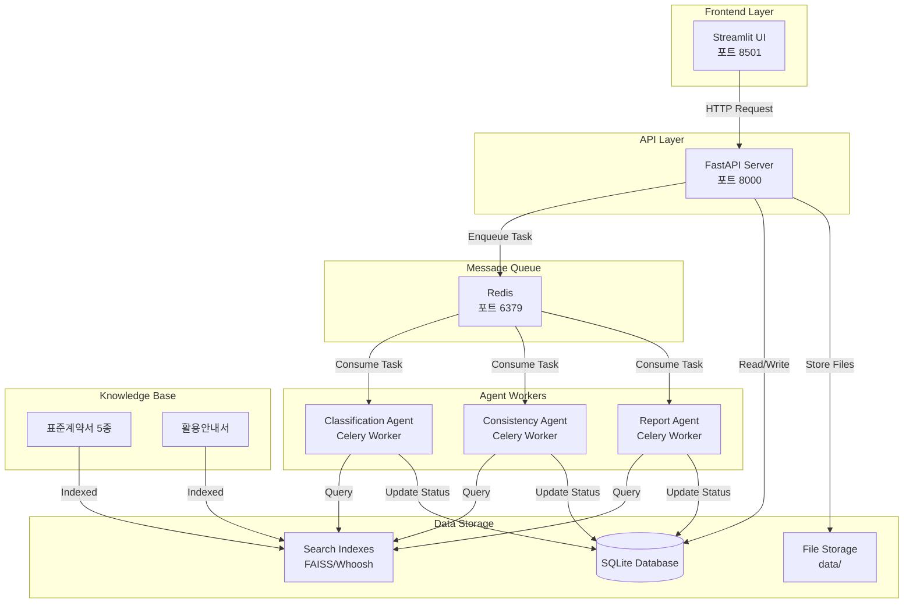
```mermaid
graph TB
    subgraph "Frontend Layer"
        UI[Streamlit UI<br/>포트 8501]
    end

    subgraph "API Layer"
        API[FastAPI Server<br/>포트 8000]
    end

    subgraph "Message Queue"
        REDIS[Redis<br/>포트 6379]
    end

    subgraph "Agent Workers"
        CLS[Classification Agent<br/>Celery Worker]
        CONS[Consistency Agent<br/>Celery Worker]
        RPT[Report Agent<br/>Celery Worker]
    end

    subgraph "Data Storage"
        DB[(SQLite Database)]
        FILES[File Storage<br/>data/]
        INDEXES[Search Indexes<br/>FAISS/Whoosh]
    end

    subgraph "Knowledge Base"
        STD[표준계약서 5종]
        GUIDE[활용안내서]
    end

    UI -->|HTTP Request| API
    API -->|Enqueue Task| REDIS
    REDIS -->|Consume Task| CLS
    REDIS -->|Consume Task| CONS
    REDIS -->|Consume Task| RPT
    
    CLS -->|Query| INDEXES
    CONS -->|Query| INDEXES
    RPT -->|Query| INDEXES
    
    CLS -->|Update Status| DB
    CONS -->|Update Status| DB
    RPT -->|Update Status| DB
    
    API -->|Read/Write| DB
    API -->|Store Files| FILES
    
    STD -->|Indexed| INDEXES
    GUIDE -->|Indexed| INDEXES
```

## 문서 처리 파이프라인

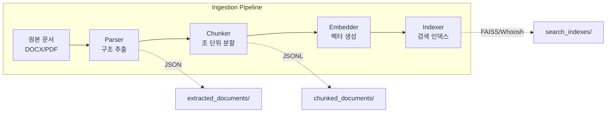
```mermaid
flowchart LR
    subgraph "Ingestion Pipeline"
        SRC[원본 문서<br/>DOCX/PDF]
        PARSE[Parser<br/>구조 추출]
        CHUNK[Chunker<br/>조 단위 분할]
        EMBED[Embedder<br/>벡터 생성]
        INDEX[Indexer<br/>검색 인덱스]
    end

    SRC --> PARSE
    PARSE --> CHUNK
    CHUNK --> EMBED
    EMBED --> INDEX

    PARSE -.->|JSON| EXT[extracted_documents/]
    CHUNK -.->|JSONL| CHK[chunked_documents/]
    INDEX -.->|FAISS/Whoosh| IDX[search_indexes/]
```

## 사용자 계약서 분석 플로우
=======
# 시스템 아키텍처

> **최종 업데이트**: 2025-11-03
> **분석 기준**: 실제 코드베이스 검증 (문서 아님)

본 문서는 데이터 계약서 검증 시스템의 전체 아키텍처를 설명합니다.

## 목차
1. [시스템 개요](#시스템-개요)
2. [전체 아키텍처](#전체-아키텍처)
3. [컨테이너 구성](#컨테이너-구성)
4. [데이터 흐름](#데이터-흐름)
5. [검색 아키텍처](#검색-아키텍처)
6. [데이터 저장소](#데이터-저장소)
7. [AI/ML 통합](#aiml-통합)

---

## 시스템 개요

**프로젝트명**: 데이터 계약서 검증 플랫폼
**목적**: 사용자 계약서를 5개 표준 계약서 유형으로 자동 분류하고, RAG 기반 하이브리드 검색으로 일관성을 검증
**기술 스택**: FastAPI, Streamlit, Celery, Redis, SQLite, FAISS, Whoosh, Azure OpenAI
**아키텍처 패턴**: 마이크로서비스 + 비동기 태스크 처리 + RAG (Retrieval-Augmented Generation)

---

## 전체 아키텍처

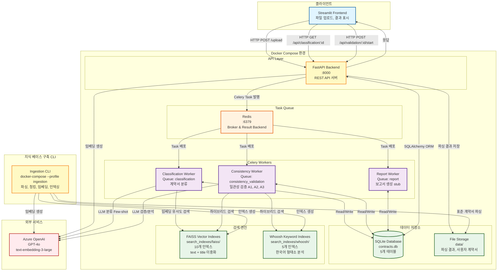
```mermaid
graph TB
    subgraph "클라이언트"
        UI[Streamlit Frontend<br/>파일 업로드, 결과 표시]
    end

    subgraph "Docker Compose 환경"
        subgraph "API Layer"
            API[FastAPI Backend<br/>:8000<br/>REST API 서버]
        end

        subgraph "Task Queue"
            Redis[Redis<br/>:6379<br/>Broker & Result Backend]
        end

        subgraph "Celery Workers"
            CW1[Classification Worker<br/>Queue: classification<br/>계약서 분류]
            CW2[Consistency Worker<br/>Queue: consistency_validation<br/>일관성 검증 A1, A2, A3]
            CW3[Report Worker<br/>Queue: report<br/>보고서 생성 stub]
        end

        subgraph "데이터 저장소"
            DB[(SQLite Database<br/>contracts.db<br/>5개 테이블)]
            FS[File Storage<br/>data/<br/>파싱 결과, 사용자 계약서]
        end

        subgraph "검색 엔진"
            FAISS[FAISS Vector Indexes<br/>search_indexes/faiss/<br/>10개 인덱스<br/>text + title 이중화]
            Whoosh[Whoosh Keyword Indexes<br/>search_indexes/whoosh/<br/>5개 인덱스<br/>한국어 형태소 분석]
        end
    end

    subgraph "외부 서비스"
        Azure[Azure OpenAI<br/>GPT-4o<br/>text-embedding-3-large]
    end

    subgraph "지식 베이스 구축 CLI"
        Ingestion[Ingestion CLI<br/>docker-compose --profile ingestion<br/>파싱, 청킹, 임베딩, 인덱싱]
    end

    %% 사용자 플로우
    UI -->|HTTP POST /upload| API
    UI -->|HTTP GET /api/classification/:id| API
    UI -->|HTTP POST /api/validation/:id/start| API
    API -->|응답| UI

    %% 백엔드 → 큐
    API -->|Celery Task 발행| Redis
    Redis -->|Task 배포| CW1
    Redis -->|Task 배포| CW2
    Redis -->|Task 배포| CW3

    %% 워커 → DB/파일
    CW1 <-->|Read/Write| DB
    CW2 <-->|Read/Write| DB
    CW3 <-->|Read/Write| DB
    API <-->|SQLAlchemy ORM| DB
    API -->|파싱 결과 저장| FS

    %% 워커 → 검색
    CW1 -->|임베딩 유사도 검색| FAISS
    CW2 -->|하이브리드 검색| FAISS
    CW2 -->|하이브리드 검색| Whoosh

    %% AI 서비스 호출
    API -->|임베딩 생성| Azure
    CW1 -->|LLM 분류 Few-shot| Azure
    CW2 -->|LLM 검증/분석| Azure

    %% 지식 베이스 구축
    Ingestion -->|표준 계약서 파싱| FS
    Ingestion -->|임베딩 생성| Azure
    Ingestion -->|인덱스 생성| FAISS
    Ingestion -->|인덱스 생성| Whoosh

    %% 스타일링
    classDef frontend fill:#e1f5ff,stroke:#01579b,stroke-width:2px
    classDef backend fill:#fff9c4,stroke:#f57f17,stroke-width:2px
    classDef worker fill:#f3e5f5,stroke:#4a148c,stroke-width:2px
    classDef storage fill:#e8f5e9,stroke:#1b5e20,stroke-width:2px
    classDef external fill:#ffebee,stroke:#b71c1c,stroke-width:2px
    classDef queue fill:#fff3e0,stroke:#e65100,stroke-width:2px

    class UI frontend
    class API backend
    class CW1,CW2,CW3 worker
    class DB,FS,FAISS,Whoosh storage
    class Azure external
    class Redis queue
    class Ingestion backend
```

---

## 컨테이너 구성

### Docker Compose Services

| 서비스명 | 이미지 | 포트 | 역할 | 의존성 | 상태 |
|---------|-------|-----|-----|--------|------|
| **fast-api** | Dockerfile.backend | 8000 | FastAPI REST API 서버 | redis | ✅ 실행 중 |
| **classification-worker** | Dockerfile.classification | - | 계약서 분류 Celery Worker | redis | ✅ 실행 중 |
| **consistency-validation-worker** | Dockerfile.consistency | - | 일관성 검증 Celery Worker | redis | ✅ 실행 중 |
| **report-worker** | Dockerfile.report | - | 보고서 생성 Celery Worker | redis | ⚠️ Stub |
| **redis** | redis:7-alpine | 6379 | Celery Broker/Backend | - | ✅ 실행 중 |
| **ingestion** | Dockerfile.ingestion | - | 지식 베이스 구축 CLI | - | 🔧 Profile 서비스 |

**참고**:
- Streamlit Frontend는 Docker Compose에 포함되지 않음 (별도 실행)
- Ingestion은 `--profile ingestion` 플래그로 수동 실행

### 볼륨 공유

```yaml
volumes:
  - ./data:/app/data                          # 파싱 결과, DB, 사용자 계약서
  - ./search_indexes:/app/search_indexes      # FAISS, Whoosh 인덱스
  - ./backend:/app/backend                    # 코드 핫 리로드 (개발)
  - ./ingestion:/app/ingestion                # 지식 베이스 구축 코드
  - redis_data:/data                          # Redis 영속화
```

---

## 데이터 흐름

### 1. 사용자 계약서 처리 플로우
>>>>>>> c7c7d8f082d58f15a66cf160f5d601f1ab908b93

```mermaid
sequenceDiagram
    actor User
<<<<<<< HEAD
    participant UI as Streamlit UI
    participant API as FastAPI
    participant Redis
    participant CLS as Classification<br/>Agent
    participant CONS as Consistency<br/>Agent
    participant RPT as Report<br/>Agent
    participant DB as Database
    participant KB as Knowledge Base

    User->>UI: 계약서 업로드
    UI->>API: POST /upload
    API->>DB: 계약서 저장
    API->>Redis: Enqueue 분류 작업
    API-->>UI: task_id 반환
    
    Redis->>CLS: 작업 할당
    CLS->>KB: 하이브리드 검색
    KB-->>CLS: 유사 조항 반환
    CLS->>CLS: LLM 분류 판단
    CLS->>DB: 분류 결과 저장
    CLS->>Redis: Enqueue 검증 작업
    
    Redis->>CONS: 작업 할당
    CONS->>CONS: A1: 조항 매칭
    CONS->>KB: 표준계약서 조회
    CONS->>CONS: A2: 체크리스트 검증
    CONS->>KB: 체크리스트 조회
    CONS->>CONS: A3: 내용 비교
    CONS->>KB: 의미 유사도 검색
    CONS->>DB: 검증 결과 저장
    CONS->>Redis: Enqueue 보고서 작업
    
    Redis->>RPT: 작업 할당
    RPT->>DB: 분석 결과 조회
    RPT->>RPT: 보고서 생성
    RPT->>DB: 보고서 저장
    
    UI->>API: GET /status/{task_id}
    API->>DB: 상태 조회
    API-->>UI: 결과 반환
    UI-->>User: 분석 보고서 표시
```

## Classification Agent 내부 구조

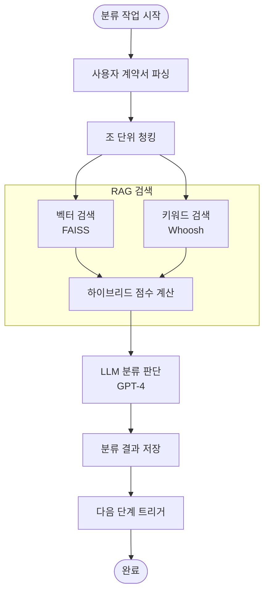
```mermaid
flowchart TD
    START([분류 작업 시작])
    PARSE[사용자 계약서 파싱]
    CHUNK[조 단위 청킹]
    
    subgraph "RAG 검색"
        VSEARCH[벡터 검색<br/>FAISS]
        KSEARCH[키워드 검색<br/>Whoosh]
        HYBRID[하이브리드 점수 계산]
    end
    
    LLM[LLM 분류 판단<br/>GPT-4]
    SAVE[분류 결과 저장]
    NEXT[다음 단계 트리거]
    END([완료])

    START --> PARSE
    PARSE --> CHUNK
    CHUNK --> VSEARCH
    CHUNK --> KSEARCH
    VSEARCH --> HYBRID
    KSEARCH --> HYBRID
    HYBRID --> LLM
    LLM --> SAVE
    SAVE --> NEXT
    NEXT --> END
```

## Consistency Agent 내부 구조

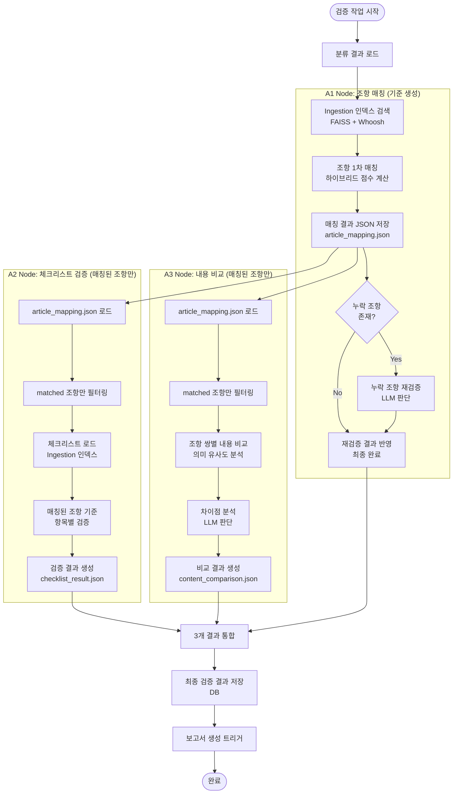
```mermaid
flowchart TD
    START([검증 작업 시작])
    LOAD[분류 결과 로드]
    
    subgraph "A1 Node: 조항 매칭 (기준 생성)"
        A1_QUERY[Ingestion 인덱스 검색<br/>FAISS + Whoosh]
        A1_MATCH[조항 1차 매칭<br/>하이브리드 점수 계산]
        A1_SAVE[매칭 결과 JSON 저장<br/>article_mapping.json]
        A1_CHECK{누락 조항<br/>존재?}
        A1_REVERIFY[누락 조항 재검증<br/>LLM 판단]
        A1_FINAL[재검증 결과 반영<br/>최종 완료]
    end
    
    subgraph "A2 Node: 체크리스트 검증 (매칭된 조항만)"
        A2_LOAD_MAP[article_mapping.json 로드]
        A2_FILTER[matched 조항만 필터링]
        A2_LOAD_CHECK[체크리스트 로드<br/>Ingestion 인덱스]
        A2_VERIFY[매칭된 조항 기준<br/>항목별 검증]
        A2_RESULT[검증 결과 생성<br/>checklist_result.json]
    end
    
    subgraph "A3 Node: 내용 비교 (매칭된 조항만)"
        A3_LOAD_MAP[article_mapping.json 로드]
        A3_FILTER[matched 조항만 필터링]
        A3_COMPARE[조항 쌍별 내용 비교<br/>의미 유사도 분석]
        A3_ANALYZE[차이점 분석<br/>LLM 판단]
        A3_RESULT[비교 결과 생성<br/>content_comparison.json]
    end
    
    MERGE[3개 결과 통합]
    SAVE[최종 검증 결과 저장<br/>DB]
    NEXT[보고서 생성 트리거]
    END([완료])

    START --> LOAD
    LOAD --> A1_QUERY
    A1_QUERY --> A1_MATCH
    A1_MATCH --> A1_SAVE
    
    A1_SAVE --> A2_LOAD_MAP
    A1_SAVE --> A3_LOAD_MAP
    A1_SAVE --> A1_CHECK
    
    A1_CHECK -->|Yes| A1_REVERIFY
    A1_CHECK -->|No| A1_FINAL
    A1_REVERIFY --> A1_FINAL
    
    A2_LOAD_MAP --> A2_FILTER
    A2_FILTER --> A2_LOAD_CHECK
    A2_LOAD_CHECK --> A2_VERIFY
    A2_VERIFY --> A2_RESULT
    
    A3_LOAD_MAP --> A3_FILTER
    A3_FILTER --> A3_COMPARE
    A3_COMPARE --> A3_ANALYZE
    A3_ANALYZE --> A3_RESULT
    
    A2_RESULT --> MERGE
    A3_RESULT --> MERGE
    A1_FINAL --> MERGE
    
    MERGE --> SAVE
    SAVE --> NEXT
    NEXT --> END
```

## 데이터 플로우

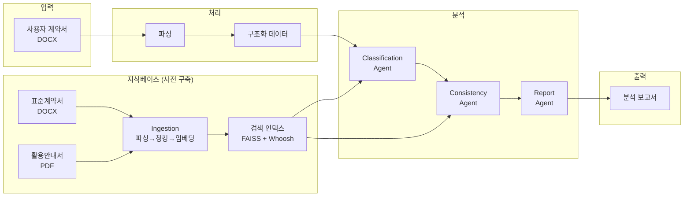
```mermaid
flowchart LR
    subgraph "입력"
        USER_DOC[사용자 계약서<br/>DOCX]
    end
    
    subgraph "지식베이스 (사전 구축)"
        STD_DOC[표준계약서<br/>DOCX]
        GUIDE_DOC[활용안내서<br/>PDF]
        KB_PROCESS[Ingestion<br/>파싱→청킹→임베딩]
        KB_INDEX[검색 인덱스<br/>FAISS + Whoosh]
        
        STD_DOC --> KB_PROCESS
        GUIDE_DOC --> KB_PROCESS
        KB_PROCESS --> KB_INDEX
    end

    subgraph "처리"
        USER_PARSE[파싱]
        USER_JSON[구조화 데이터]
    end

    subgraph "분석"
        CLS_AGENT[Classification<br/>Agent]
        CONS_AGENT[Consistency<br/>Agent]
        RPT_AGENT[Report<br/>Agent]
    end

    subgraph "출력"
        RESULT[분석 보고서]
    end

    USER_DOC --> USER_PARSE
    USER_PARSE --> USER_JSON
    
    USER_JSON --> CLS_AGENT
    KB_INDEX --> CLS_AGENT
    
    CLS_AGENT --> CONS_AGENT
    KB_INDEX --> CONS_AGENT
    
    CONS_AGENT --> RPT_AGENT
    RPT_AGENT --> RESULT
```

## Docker 컨테이너 구조

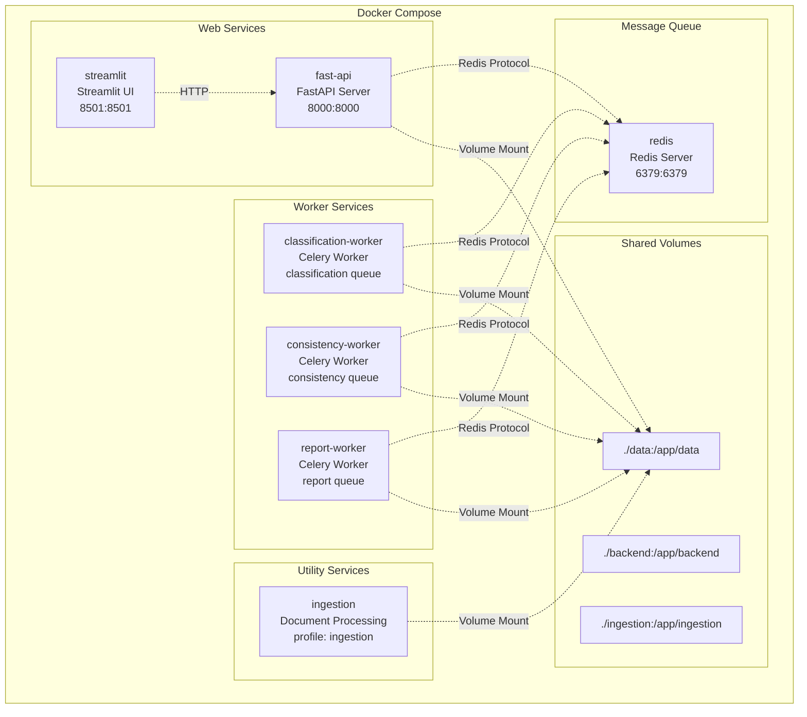
```mermaid
graph TB
    subgraph "Docker Compose"
        subgraph "Web Services"
            FAST[fast-api<br/>FastAPI Server<br/>8000:8000]
            STREAM[streamlit<br/>Streamlit UI<br/>8501:8501]
        end

        subgraph "Message Queue"
            REDIS_C[redis<br/>Redis Server<br/>6379:6379]
        end

        subgraph "Worker Services"
            CLS_W[classification-worker<br/>Celery Worker<br/>classification queue]
            CONS_W[consistency-worker<br/>Celery Worker<br/>consistency queue]
            RPT_W[report-worker<br/>Celery Worker<br/>report queue]
        end

        subgraph "Utility Services"
            ING[ingestion<br/>Document Processing<br/>profile: ingestion]
        end

        subgraph "Shared Volumes"
            VOL_DATA[./data:/app/data]
            VOL_BACKEND[./backend:/app/backend]
            VOL_INGESTION[./ingestion:/app/ingestion]
        end
    end

    STREAM -.->|HTTP| FAST
    FAST -.->|Redis Protocol| REDIS_C
    CLS_W -.->|Redis Protocol| REDIS_C
    CONS_W -.->|Redis Protocol| REDIS_C
    RPT_W -.->|Redis Protocol| REDIS_C

    FAST -.->|Volume Mount| VOL_DATA
    CLS_W -.->|Volume Mount| VOL_DATA
    CONS_W -.->|Volume Mount| VOL_DATA
    RPT_W -.->|Volume Mount| VOL_DATA
    ING -.->|Volume Mount| VOL_DATA
```

## 기술 스택 레이어

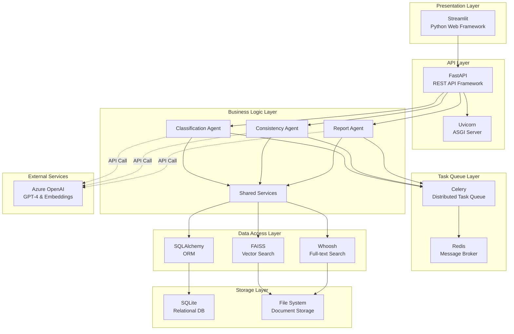
```mermaid
graph TB
    subgraph "Presentation Layer"
        ST[Streamlit<br/>Python Web Framework]
    end

    subgraph "API Layer"
        FA[FastAPI<br/>REST API Framework]
        UV[Uvicorn<br/>ASGI Server]
    end

    subgraph "Business Logic Layer"
        CLS_A[Classification Agent]
        CONS_A[Consistency Agent]
        RPT_A[Report Agent]
        SHARED[Shared Services]
    end

    subgraph "Task Queue Layer"
        CELERY[Celery<br/>Distributed Task Queue]
        REDIS_Q[Redis<br/>Message Broker]
    end

    subgraph "Data Access Layer"
        SQLA[SQLAlchemy<br/>ORM]
        FAISS_L[FAISS<br/>Vector Search]
        WHOOSH_L[Whoosh<br/>Full-text Search]
    end

    subgraph "Storage Layer"
        SQLITE[SQLite<br/>Relational DB]
        FS[File System<br/>Document Storage]
    end

    subgraph "External Services"
        AZURE[Azure OpenAI<br/>GPT-4 & Embeddings]
    end

    ST --> FA
    FA --> UV
    FA --> CLS_A
    FA --> CONS_A
    FA --> RPT_A
    
    CLS_A --> CELERY
    CONS_A --> CELERY
    RPT_A --> CELERY
    CLS_A --> SHARED
    CONS_A --> SHARED
    RPT_A --> SHARED
    
    CELERY --> REDIS_Q
    
    SHARED --> SQLA
    SHARED --> FAISS_L
    SHARED --> WHOOSH_L
    
    SQLA --> SQLITE
    FAISS_L --> FS
    WHOOSH_L --> FS
    
    CLS_A -.->|API Call| AZURE
    CONS_A -.->|API Call| AZURE
    RPT_A -.->|API Call| AZURE
```


## A1 Node 상세 플로우 (조항 매칭)

```mermaid
flowchart TD
    START([A1 Node 시작])
    
    subgraph "입력 데이터 준비"
        LOAD_USER[사용자 계약서 로드<br/>parsed JSON]
        LOAD_INDEX[Ingestion 인덱스 로드<br/>분류된 유형의 표준계약서]
        PREP[매칭 대상 조항 준비]
    end
    
    subgraph "1차 매칭: 하이브리드 검색"
        LOOP_START{모든 사용자<br/>조항 처리?}
        GET_ARTICLE[다음 조항 가져오기]
        VECTOR[벡터 검색<br/>FAISS 인덱스 쿼리]
        KEYWORD[키워드 검색<br/>Whoosh 인덱스 쿼리]
        HYBRID[하이브리드 점수 계산<br/>가중 평균]
        THRESHOLD{유사도 ≥<br/>임계값?}
        MATCH_FOUND[매칭 성공<br/>표준 조항 연결]
        NO_MATCH[매칭 실패<br/>누락 목록 추가]
    end
    
    SAVE_JSON[article_mapping.json 저장<br/>matched + missing + extra]
    
    subgraph "출력 데이터 구조"
        OUTPUT["
        {
          matched: [
            {user_article, std_article, score}
          ],
          missing: [
            {user_article, reason}
          ],
          extra: [
            {std_article, reason}
          ]
        }
        "]
    end
    
    TRIGGER_A2A3[A2/A3 Node 트리거<br/>article_mapping.json 기반]
    
    subgraph "누락 조항 재검증 (병렬)"
        CHECK_MISSING{누락 조항<br/>존재?}
        LOOP_MISSING{모든 누락<br/>조항 처리?}
        GET_MISSING[다음 누락 조항]
        LLM_VERIFY[LLM 재검증<br/>맥락 기반 판단]
        LLM_DECISION{LLM 판단<br/>결과}
        REMAP[표준 조항 재매칭]
        CONFIRM_MISSING[누락 확정]
        REVERIFY_DONE[재검증 완료]
    end
    
    NOTE[A2/A3는 matched만 사용<br/>missing/extra는 A1에서만 처리]
    
    END([A1 Node 완료])

    START --> LOAD_USER
    LOAD_USER --> LOAD_INDEX
    LOAD_INDEX --> PREP
    PREP --> LOOP_START
    
    LOOP_START -->|No| GET_ARTICLE
    GET_ARTICLE --> VECTOR
    GET_ARTICLE --> KEYWORD
    VECTOR --> HYBRID
    KEYWORD --> HYBRID
    HYBRID --> THRESHOLD
    
    THRESHOLD -->|Yes| MATCH_FOUND
    THRESHOLD -->|No| NO_MATCH
    
    MATCH_FOUND --> LOOP_START
    NO_MATCH --> LOOP_START
    
    LOOP_START -->|Yes| SAVE_JSON
    SAVE_JSON --> OUTPUT
    OUTPUT --> TRIGGER_A2A3
    TRIGGER_A2A3 --> NOTE
    
    SAVE_JSON --> CHECK_MISSING
    
    CHECK_MISSING -->|Yes| LOOP_MISSING
    CHECK_MISSING -->|No| END
    
    LOOP_MISSING -->|No| GET_MISSING
    GET_MISSING --> LLM_VERIFY
    LLM_VERIFY --> LLM_DECISION
    
    LLM_DECISION -->|매칭 가능| REMAP
    LLM_DECISION -->|누락 확정| CONFIRM_MISSING
    
    REMAP --> LOOP_MISSING
    CONFIRM_MISSING --> LOOP_MISSING
    
    LOOP_MISSING -->|Yes| REVERIFY_DONE
    REVERIFY_DONE --> END
    
    NOTE --> EN

## A2/A3 Node의 A1 결과 활용

```mermaid
flowchart LR
    subgraph "A1 출력"
        A1_OUT[article_mapping.json<br/>matched + missing + extra]
    end
    
    subgraph "A2 Node: 매칭된 조항만 처리"
        A2_READ[매칭 결과 읽기]
        A2_FILTER[matched 조항만 필터링<br/>missing/extra 무시]
        A2_LOAD[체크리스트 로드<br/>Ingestion 인덱스]
        A2_CHECK[매칭된 조항 기준<br/>체크리스트 검증]
    end
    
    subgraph "A3 Node: 매칭된 조항만 처리"
        A3_READ[매칭 결과 읽기]
        A3_FILTER[matched 조항만 필터링<br/>missing/extra 무시]
        A3_PAIR[조항 쌍 생성<br/>user ↔ standard]
        A3_COMPARE[쌍별 내용 비교<br/>의미 차이 분석]
    end
    
    A1_OUT --> A2_READ
    A1_OUT --> A3_READ
    
    A2_READ --> A2_FILTER
    A2_FILTER --> A2_LOAD
    A2_LOAD --> A2_CHECK
    
    A3_READ --> A3_FILTER
    A3_FILTER --> A3_PAIR
    A3_PAIR --> A3_COMPARE
    
    style A2_FILTER fill:#e1f5ff
    style A3_FILTER fill:#e1f5ff
```

## 데이터 흐름: A1 → A2/A3

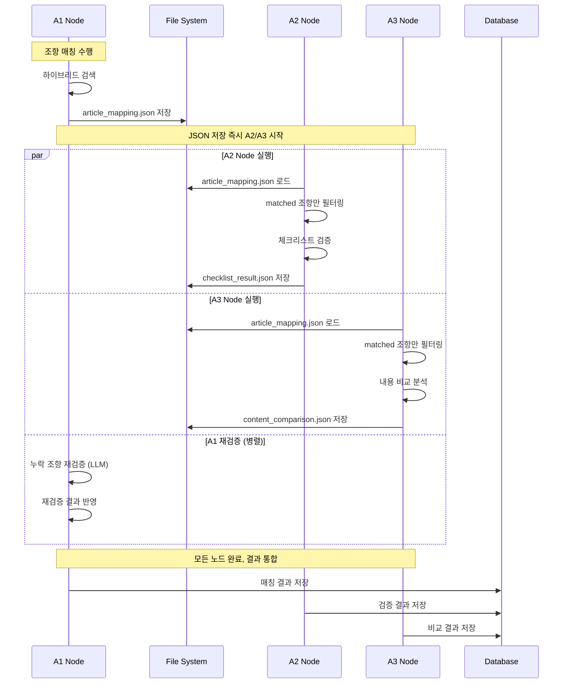
```mermaid
sequenceDiagram
    participant A1 as A1 Node
    participant FS as File System
    participant A2 as A2 Node
    participant A3 as A3 Node
    participant DB as Database

    Note over A1: 조항 매칭 수행
    A1->>A1: 하이브리드 검색
    A1->>FS: article_mapping.json 저장
    
    Note over A1,A3: JSON 저장 즉시 A2/A3 시작
    
    par A2 Node 실행
        A2->>FS: article_mapping.json 로드
        A2->>A2: matched 조항만 필터링
        A2->>A2: 체크리스트 검증
        A2->>FS: checklist_result.json 저장
    and A3 Node 실행
        A3->>FS: article_mapping.json 로드
        A3->>A3: matched 조항만 필터링
        A3->>A3: 내용 비교 분석
        A3->>FS: content_comparison.json 저장
    and A1 재검증 (병렬)
        A1->>A1: 누락 조항 재검증 (LLM)
        A1->>A1: 재검증 결과 반영
    end
    
    Note over A1,A3: 모든 노드 완료, 결과 통합
    
    A1->>DB: 매칭 결과 저장
    A2->>DB: 검증 결과 저장
    A3->>DB: 비교 결과 저장
```


## Ingestion Pipeline 상세 아키텍처

### Ingestion 전체 구조

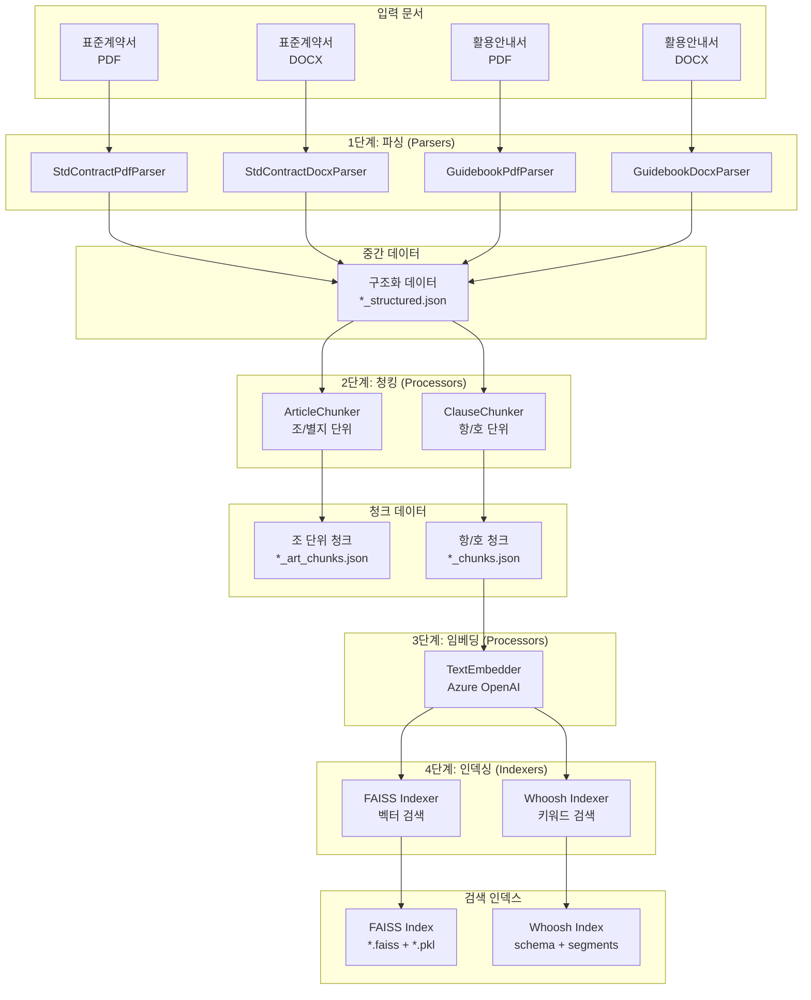
```mermaid
flowchart TB
    subgraph "입력 문서"
        STD_PDF[표준계약서<br/>PDF]
        STD_DOCX[표준계약서<br/>DOCX]
        GUIDE_PDF[활용안내서<br/>PDF]
        GUIDE_DOCX[활용안내서<br/>DOCX]
    end

    subgraph "1단계: 파싱 (Parsers)"
        STD_PDF_PARSER[StdContractPdfParser]
        STD_DOCX_PARSER[StdContractDocxParser]
        GUIDE_PDF_PARSER[GuidebookPdfParser]
        GUIDE_DOCX_PARSER[GuidebookDocxParser]
    end

    subgraph "중간 데이터"
        STRUCTURED[구조화 데이터<br/>*_structured.json]
    end

    subgraph "2단계: 청킹 (Processors)"
        ART_CHUNKER[ArticleChunker<br/>조/별지 단위]
        CLAUSE_CHUNKER[ClauseChunker<br/>항/호 단위]
    end

    subgraph "청크 데이터"
        ART_CHUNKS[조 단위 청크<br/>*_art_chunks.json]
        CLAUSE_CHUNKS[항/호 청크<br/>*_chunks.json]
    end

    subgraph "3단계: 임베딩 (Processors)"
        EMBEDDER[TextEmbedder<br/>Azure OpenAI]
    end

    subgraph "4단계: 인덱싱 (Indexers)"
        FAISS_IDX[FAISS Indexer<br/>벡터 검색]
        WHOOSH_IDX[Whoosh Indexer<br/>키워드 검색]
    end

    subgraph "검색 인덱스"
        FAISS_INDEX[FAISS Index<br/>*.faiss + *.pkl]
        WHOOSH_INDEX[Whoosh Index<br/>schema + segments]
    end

    STD_PDF --> STD_PDF_PARSER
    STD_DOCX --> STD_DOCX_PARSER
    GUIDE_PDF --> GUIDE_PDF_PARSER
    GUIDE_DOCX --> GUIDE_DOCX_PARSER

    STD_PDF_PARSER --> STRUCTURED
    STD_DOCX_PARSER --> STRUCTURED
    GUIDE_PDF_PARSER --> STRUCTURED
    GUIDE_DOCX_PARSER --> STRUCTURED

    STRUCTURED --> ART_CHUNKER
    STRUCTURED --> CLAUSE_CHUNKER

    ART_CHUNKER --> ART_CHUNKS
    CLAUSE_CHUNKER --> CLAUSE_CHUNKS

    CLAUSE_CHUNKS --> EMBEDDER

    EMBEDDER --> FAISS_IDX
    EMBEDDER --> WHOOSH_IDX

    FAISS_IDX --> FAISS_INDEX
    WHOOSH_IDX --> WHOOSH_INDEX
```

### Ingestion 파이프라인 플로우

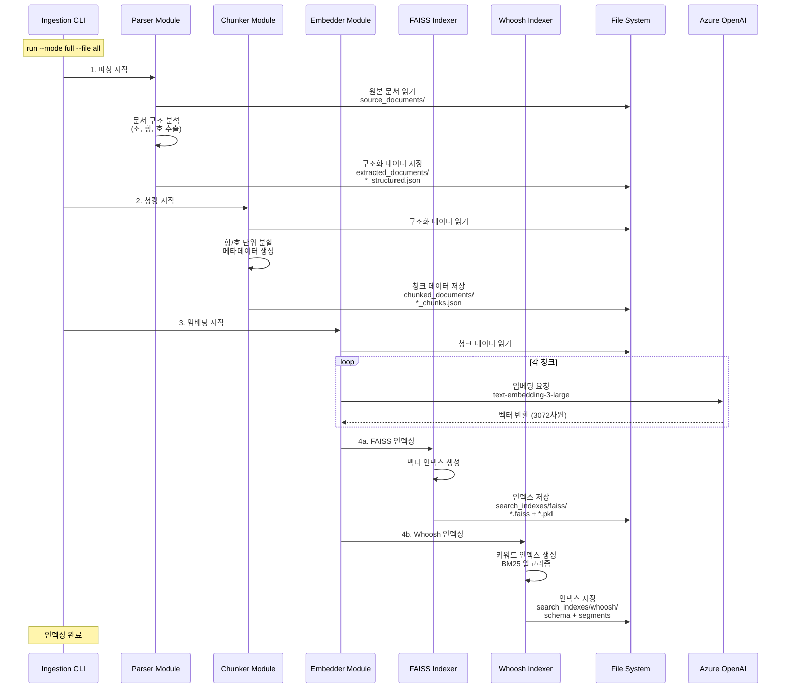
```mermaid
sequenceDiagram
    participant CLI as Ingestion CLI
    participant Parser as Parser Module
    participant Chunker as Chunker Module
    participant Embedder as Embedder Module
    participant FAISS as FAISS Indexer
    participant Whoosh as Whoosh Indexer
    participant FS as File System
    participant Azure as Azure OpenAI

    Note over CLI: run --mode full --file all

    CLI->>Parser: 1. 파싱 시작
    Parser->>FS: 원본 문서 읽기<br/>source_documents/
    Parser->>Parser: 문서 구조 분석<br/>(조, 항, 호 추출)
    Parser->>FS: 구조화 데이터 저장<br/>extracted_documents/<br/>*_structured.json

    CLI->>Chunker: 2. 청킹 시작
    Chunker->>FS: 구조화 데이터 읽기
    Chunker->>Chunker: 항/호 단위 분할<br/>메타데이터 생성
    Chunker->>FS: 청크 데이터 저장<br/>chunked_documents/<br/>*_chunks.json

    CLI->>Embedder: 3. 임베딩 시작
    Embedder->>FS: 청크 데이터 읽기
    
    loop 각 청크
        Embedder->>Azure: 임베딩 요청<br/>text-embedding-3-large
        Azure-->>Embedder: 벡터 반환 (3072차원)
    end

    Embedder->>FAISS: 4a. FAISS 인덱싱
    FAISS->>FAISS: 벡터 인덱스 생성
    FAISS->>FS: 인덱스 저장<br/>search_indexes/faiss/<br/>*.faiss + *.pkl

    Embedder->>Whoosh: 4b. Whoosh 인덱싱
    Whoosh->>Whoosh: 키워드 인덱스 생성<br/>BM25 알고리즘
    Whoosh->>FS: 인덱스 저장<br/>search_indexes/whoosh/<br/>schema + segments

    Note over CLI: 인덱싱 완료
```

### 파서 모듈 구조

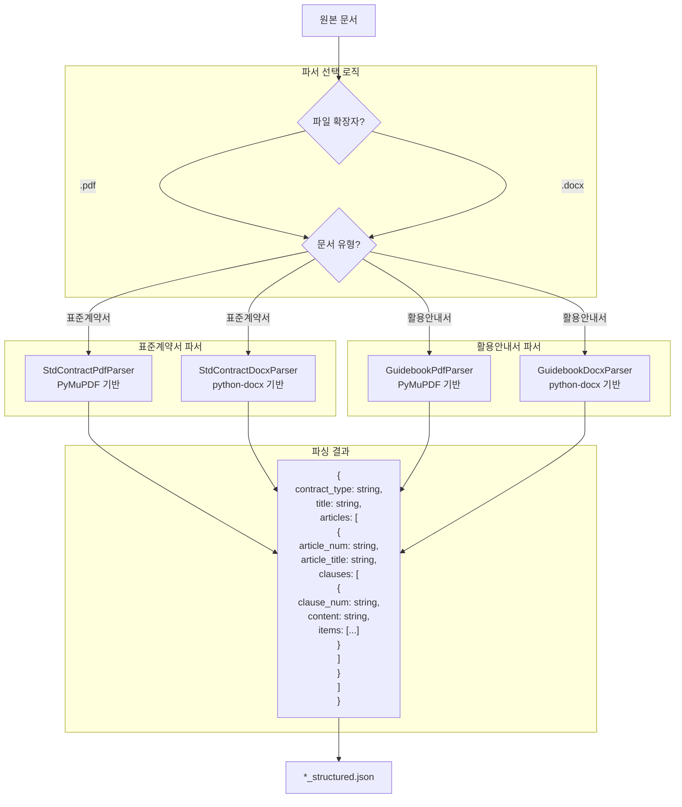
```mermaid
flowchart TD
    INPUT[원본 문서]
    
    subgraph "파서 선택 로직"
        CHECK_EXT{파일 확장자?}
        CHECK_TYPE{문서 유형?}
    end
    
    subgraph "표준계약서 파서"
        STD_PDF[StdContractPdfParser<br/>PyMuPDF 기반]
        STD_DOCX[StdContractDocxParser<br/>python-docx 기반]
    end
    
    subgraph "활용안내서 파서"
        GUIDE_PDF[GuidebookPdfParser<br/>PyMuPDF 기반]
        GUIDE_DOCX[GuidebookDocxParser<br/>python-docx 기반]
    end
    
    subgraph "파싱 결과"
        STRUCTURE["
        {
          contract_type: string,
          title: string,
          articles: [
            {
              article_num: string,
              article_title: string,
              clauses: [
                {
                  clause_num: string,
                  content: string,
                  items: [...]
                }
              ]
            }
          ]
        }
        "]
    end
    
    OUTPUT[*_structured.json]

    INPUT --> CHECK_EXT
    CHECK_EXT -->|.pdf| CHECK_TYPE
    CHECK_EXT -->|.docx| CHECK_TYPE
    
    CHECK_TYPE -->|표준계약서| STD_PDF
    CHECK_TYPE -->|표준계약서| STD_DOCX
    CHECK_TYPE -->|활용안내서| GUIDE_PDF
    CHECK_TYPE -->|활용안내서| GUIDE_DOCX
    
    STD_PDF --> STRUCTURE
    STD_DOCX --> STRUCTURE
    GUIDE_PDF --> STRUCTURE
    GUIDE_DOCX --> STRUCTURE
    
    STRUCTURE --> OUTPUT
```

### 청커 모듈 구조

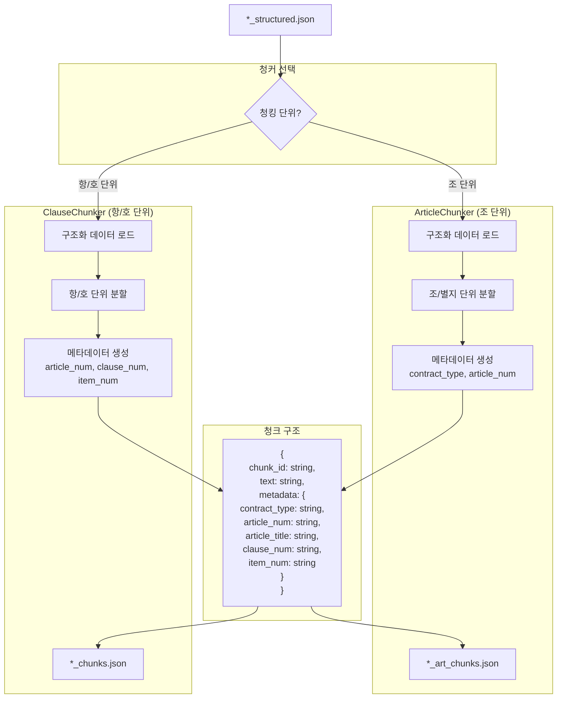
```mermaid
flowchart TD
    INPUT[*_structured.json]
    
    subgraph "청커 선택"
        CHOICE{청킹 단위?}
    end
    
    subgraph "ArticleChunker (조 단위)"
        ART_LOAD[구조화 데이터 로드]
        ART_SPLIT[조/별지 단위 분할]
        ART_META[메타데이터 생성<br/>contract_type, article_num]
        ART_OUT[*_art_chunks.json]
    end
    
    subgraph "ClauseChunker (항/호 단위)"
        CLS_LOAD[구조화 데이터 로드]
        CLS_SPLIT[항/호 단위 분할]
        CLS_META[메타데이터 생성<br/>article_num, clause_num, item_num]
        CLS_OUT[*_chunks.json]
    end
    
    subgraph "청크 구조"
        CHUNK["
        {
          chunk_id: string,
          text: string,
          metadata: {
            contract_type: string,
            article_num: string,
            article_title: string,
            clause_num: string,
            item_num: string
          }
        }
        "]
    end

    INPUT --> CHOICE
    
    CHOICE -->|조 단위| ART_LOAD
    ART_LOAD --> ART_SPLIT
    ART_SPLIT --> ART_META
    ART_META --> CHUNK
    CHUNK --> ART_OUT
    
    CHOICE -->|항/호 단위| CLS_LOAD
    CLS_LOAD --> CLS_SPLIT
    CLS_SPLIT --> CLS_META
    CLS_META --> CHUNK
    CHUNK --> CLS_OUT
```

### 임베딩 및 인덱싱 플로우

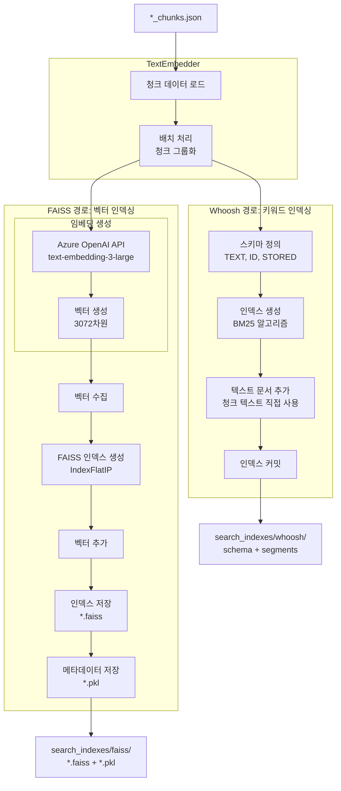
```mermaid
flowchart TD
    INPUT[*_chunks.json]
    
    subgraph "TextEmbedder"
        LOAD[청크 데이터 로드]
        BATCH[배치 처리<br/>청크 그룹화]
    end
    
    subgraph "FAISS 경로: 벡터 인덱싱"
        subgraph "임베딩 생성"
            AZURE[Azure OpenAI API<br/>text-embedding-3-large]
            VECTOR[벡터 생성<br/>3072차원]
        end
        
        COLLECT[벡터 수집]
        
        FAISS_BUILD[FAISS 인덱스 생성<br/>IndexFlatIP]
        FAISS_ADD[벡터 추가]
        FAISS_SAVE[인덱스 저장<br/>*.faiss]
        FAISS_META[메타데이터 저장<br/>*.pkl]
    end
    
    subgraph "Whoosh 경로: 키워드 인덱싱"
        WHOOSH_SCHEMA[스키마 정의<br/>TEXT, ID, STORED]
        WHOOSH_BUILD[인덱스 생성<br/>BM25 알고리즘]
        WHOOSH_ADD[텍스트 문서 추가<br/>청크 텍스트 직접 사용]
        WHOOSH_COMMIT[인덱스 커밋]
    end
    
    OUTPUT_FAISS[search_indexes/faiss/<br/>*.faiss + *.pkl]
    OUTPUT_WHOOSH[search_indexes/whoosh/<br/>schema + segments]

    INPUT --> LOAD
    LOAD --> BATCH
    
    BATCH --> AZURE
    AZURE --> VECTOR
    VECTOR --> COLLECT
    COLLECT --> FAISS_BUILD
    FAISS_BUILD --> FAISS_ADD
    FAISS_ADD --> FAISS_SAVE
    FAISS_SAVE --> FAISS_META
    FAISS_META --> OUTPUT_FAISS
    
    BATCH --> WHOOSH_SCHEMA
    WHOOSH_SCHEMA --> WHOOSH_BUILD
    WHOOSH_BUILD --> WHOOSH_ADD
    WHOOSH_ADD --> WHOOSH_COMMIT
    WHOOSH_COMMIT --> OUTPUT_WHOOSH
```
=======
    participant UI as Streamlit
    participant API as FastAPI
    participant Redis as Redis Queue
    participant CW1 as Classification<br/>Worker
    participant CW2 as Consistency<br/>Worker
    participant DB as SQLite
    participant Search as FAISS + Whoosh
    participant LLM as Azure OpenAI

    %% 업로드 단계
    User->>UI: 1. DOCX 파일 업로드
    UI->>API: POST /upload (multipart)
    API->>API: UserContractParser 파싱
    API->>LLM: 임베딩 생성 (각 조문)
    API->>DB: ContractDocument 저장<br/>(parsed_data + embeddings)
    API->>Redis: classify_contract_task 발행
    API-->>UI: contract_id 반환

    %% 분류 단계
    Redis->>CW1: Task 배포
    CW1->>DB: 계약서 조회
    CW1->>Search: 5개 표준계약서 유사도 계산
    alt Gap >= 0.05 (명확한 경우)
        CW1->>CW1: 임베딩 결과 사용 (LLM 생략)
    else Gap < 0.05 (애매한 경우)
        CW1->>LLM: Few-shot 분류 (5개 예제)
    end
    CW1->>DB: ClassificationResult 저장

    UI->>API: 2. 폴링: GET /api/classification/:id
    API-->>UI: 분류 결과 (5개 유형 점수)

    User->>UI: 3. 분류 확인/수정
    UI->>API: POST /api/classification/:id/confirm

    %% 검증 단계
    User->>UI: 4. "계약서 검증" 버튼 클릭
    UI->>API: POST /api/validation/:id/start<br/>(text_weight, title_weight, dense_weight)
    API->>Redis: validate_contract_task 발행
    API-->>UI: task_id 반환

    %% A1: 완전성 검사
    Redis->>CW2: Task 배포
    Note over CW2: A1 Node: Completeness Check
    CW2->>DB: 표준 계약서 청크 조회
    loop 각 사용자 조문
        CW2->>Search: 하이브리드 검색 (FAISS + Whoosh)
        CW2->>CW2: 조문 단위 점수 집계
    end
    CW2->>CW2: 누락된 표준 조문 식별
    CW2->>LLM: 누락 조문 재검증 (거짓 양성 제거)
    CW2->>DB: ValidationResult.completeness_check 저장

    %% A2: 체크리스트 검증
    Note over CW2: A2 Node: Checklist Check
    CW2->>CW2: 매칭된 조문별 체크리스트 로드
    loop 각 체크리스트 항목
        CW2->>LLM: 자동 검증 (YES/NO/UNCLEAR/MANUAL)
    end
    CW2->>DB: ValidationResult.checklist_validation 저장

    %% A3: 내용 분석
    Note over CW2: A3 Node: Content Analysis
    loop 각 매칭된 조문
        CW2->>Search: 표준 내용 검색 (세부 항목 단위)
        CW2->>LLM: 내용 비교 및 개선안 생성
    end
    CW2->>DB: ValidationResult.content_analysis 저장

    UI->>API: 5. 폴링: GET /api/validation/:id
    API-->>UI: 검증 결과 (A1+A2+A3)
    UI->>User: 6. 결과 시각화<br/>(매칭, 체크리스트, 분석, 제안)
```

### 2. 지식 베이스 구축 플로우

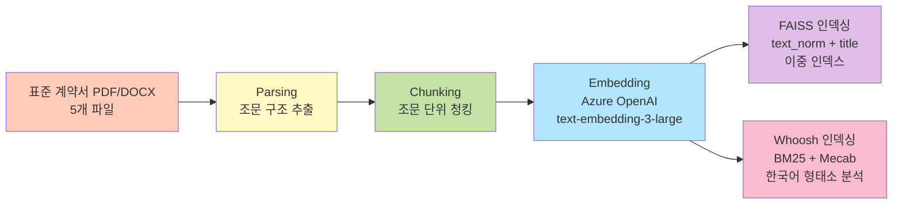
```mermaid
graph LR
    A[표준 계약서 PDF/DOCX<br/>5개 파일] --> B[Parsing<br/>조문 구조 추출]
    B --> C[Chunking<br/>조문 단위 청킹]
    C --> D[Embedding<br/>Azure OpenAI<br/>text-embedding-3-large]
    D --> E1[FAISS 인덱싱<br/>text_norm + title<br/>이중 인덱스]
    D --> E2[Whoosh 인덱싱<br/>BM25 + Mecab<br/>한국어 형태소 분석]

    style A fill:#ffccbc
    style B fill:#fff9c4
    style C fill:#c5e1a5
    style D fill:#b3e5fc
    style E1 fill:#e1bee7
    style E2 fill:#f8bbd0
```

**실행 명령**:
```bash
docker-compose --profile ingestion run --rm ingestion run --mode full --file all
```

---

## 검색 아키텍처
>>>>>>> c7c7d8f082d58f15a66cf160f5d601f1ab908b93

### 하이브리드 검색 구조

```mermaid
<<<<<<< HEAD
flowchart TD
    QUERY[사용자 쿼리]
    
    subgraph "HybridSearcher"
        LOAD_IDX[인덱스 로드<br/>FAISS + Whoosh]
        
        subgraph "Dense 검색 (FAISS)"
            EMBED_Q[쿼리 임베딩<br/>Azure OpenAI]
            FAISS_SEARCH[벡터 유사도 검색<br/>코사인 유사도]
            DENSE_RESULTS[Dense 결과<br/>+ 점수]
        end
        
        subgraph "Sparse 검색 (Whoosh)"
            WHOOSH_SEARCH[키워드 검색<br/>BM25 알고리즘]
            SPARSE_RESULTS[Sparse 결과<br/>+ 점수]
        end
        
        subgraph "점수 통합"
            NORMALIZE[점수 정규화<br/>0~1 범위]
            WEIGHTED[가중 평균<br/>dense_weight * dense_score<br/>+ sparse_weight * sparse_score]
            RERANK[재순위화<br/>통합 점수 기준]
        end
        
        TOP_K[Top-K 결과 반환]
    end
    
    OUTPUT[검색 결과<br/>+ 메타데이터]

    QUERY --> LOAD_IDX
    LOAD_IDX --> EMBED_Q
    LOAD_IDX --> WHOOSH_SEARCH
    
    EMBED_Q --> FAISS_SEARCH
    FAISS_SEARCH --> DENSE_RESULTS
    
    WHOOSH_SEARCH --> SPARSE_RESULTS
    
    DENSE_RESULTS --> NORMALIZE
    SPARSE_RESULTS --> NORMALIZE
    
    NORMALIZE --> WEIGHTED
    WEIGHTED --> RERANK
    RERANK --> TOP_K
    TOP_K --> OUTPUT
```

### Ingestion 디렉토리 구조

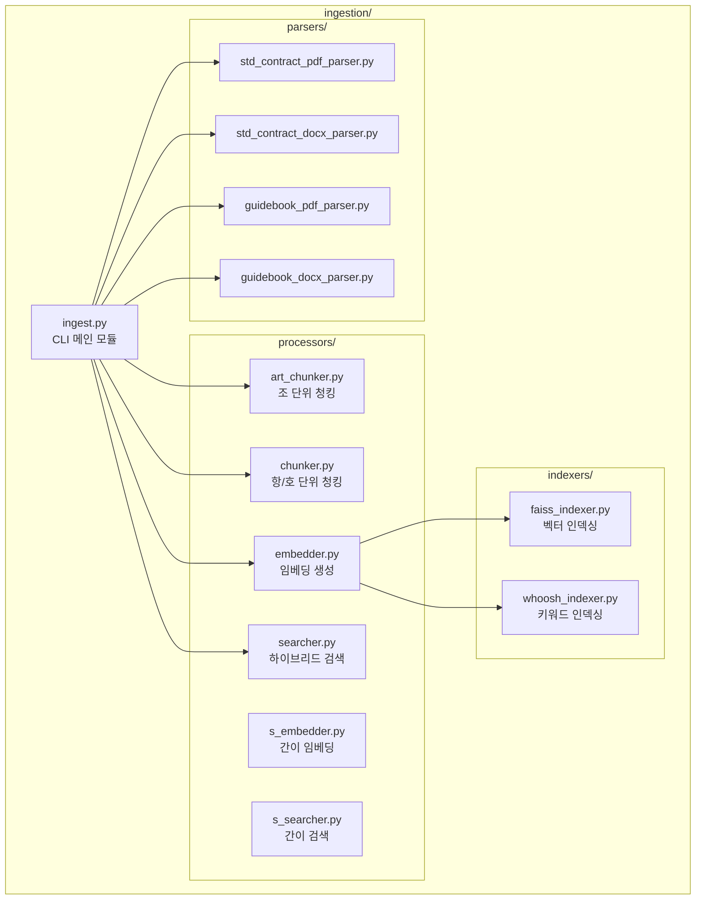
```mermaid
graph TB
    subgraph "ingestion/"
        INGEST[ingest.py<br/>CLI 메인 모듈]
        
        subgraph "parsers/"
            STD_PDF_P[std_contract_pdf_parser.py]
            STD_DOCX_P[std_contract_docx_parser.py]
            GUIDE_PDF_P[guidebook_pdf_parser.py]
            GUIDE_DOCX_P[guidebook_docx_parser.py]
        end
        
        subgraph "processors/"
            ART_C[art_chunker.py<br/>조 단위 청킹]
            CLAUSE_C[chunker.py<br/>항/호 단위 청킹]
            EMBED[embedder.py<br/>임베딩 생성]
            SEARCH[searcher.py<br/>하이브리드 검색]
            S_EMBED[s_embedder.py<br/>간이 임베딩]
            S_SEARCH[s_searcher.py<br/>간이 검색]
        end
        
        subgraph "indexers/"
            FAISS_I[faiss_indexer.py<br/>벡터 인덱싱]
            WHOOSH_I[whoosh_indexer.py<br/>키워드 인덱싱]
        end
    end
    
    INGEST --> STD_PDF_P
    INGEST --> STD_DOCX_P
    INGEST --> GUIDE_PDF_P
    INGEST --> GUIDE_DOCX_P
    
    INGEST --> ART_C
    INGEST --> CLAUSE_C
    INGEST --> EMBED
    INGEST --> SEARCH
    
    EMBED --> FAISS_I
    EMBED --> WHOOSH_I
```

### Ingestion 실행 모드

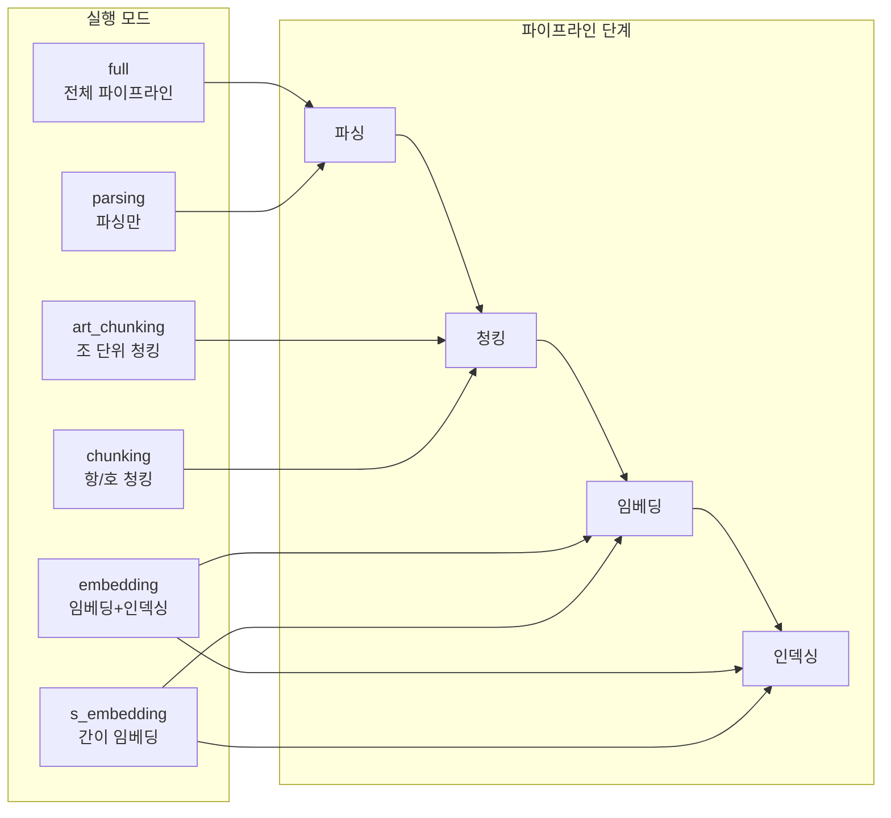
```mermaid
flowchart LR
    subgraph "실행 모드"
        FULL[full<br/>전체 파이프라인]
        PARSING[parsing<br/>파싱만]
        ART_CHUNK[art_chunking<br/>조 단위 청킹]
        CHUNK[chunking<br/>항/호 청킹]
        EMBED[embedding<br/>임베딩+인덱싱]
        S_EMBED[s_embedding<br/>간이 임베딩]
    end
    
    subgraph "파이프라인 단계"
        P[파싱]
        C[청킹]
        E[임베딩]
        I[인덱싱]
    end
    
    FULL --> P
    P --> C
    C --> E
    E --> I
    
    PARSING --> P
    ART_CHUNK --> C
    CHUNK --> C
    EMBED --> E
    EMBED --> I
    S_EMBED --> E
    S_EMBED --> I
```

### 데이터 흐름: Ingestion → Agents

```mermaid
flowchart LR
    subgraph "Ingestion 출력"
        FAISS[FAISS Index<br/>벡터 검색]
        WHOOSH[Whoosh Index<br/>키워드 검색]
        CHUNKS[Chunk Metadata<br/>*.pkl]
    end
    
    subgraph "Agent 사용"
        CLS[Classification Agent<br/>하이브리드 검색]
        A1[Consistency A1 Node<br/>조항 매칭]
        A2[Consistency A2 Node<br/>체크리스트 검증]
    end
    
    FAISS --> CLS
    WHOOSH --> CLS
    CHUNKS --> CLS
    
    FAISS --> A1
    WHOOSH --> A1
    CHUNKS --> A1
    
    FAISS --> A2
    WHOOSH --> A2
    CHUNKS --> A2
```
=======
graph TB
    subgraph "Query Input"
        Q[검색 쿼리<br/>text: 조문 내용<br/>title: 조문 제목]
    end

    subgraph "Dual Vector Search FAISS"
        E[Embedding Generator<br/>Azure OpenAI]
        F1[Text Index<br/>text_norm embedding<br/>~400 chunks]
        F2[Title Index<br/>title embedding<br/>~400 chunks]
        E --> F1
        E --> F2
        F1 --> DS1[Top 50<br/>text score]
        F2 --> DS2[Top 50<br/>title score]
    end

    subgraph "Keyword Search Whoosh"
        W1[BM25 Scorer<br/>Mecab Tokenizer]
        W1 --> WS1[Top 50<br/>text score]
        W1 --> WS2[Top 50<br/>title score]
    end

    subgraph "Score Fusion"
        N1[Min-Max Normalization]
        N2[Weighted Fusion]
        DS1 --> N1
        DS2 --> N1
        WS1 --> N1
        WS2 --> N1
        N1 --> N2
    end

    subgraph "Final Ranking"
        R[Top K Results<br/>global_id, score, reasoning]
    end

    Q --> E
    Q --> W1
    N2 --> R

    style Q fill:#e3f2fd
    style E fill:#fff9c4
    style F1 fill:#f3e5f5
    style F2 fill:#f3e5f5
    style W1 fill:#fce4ec
    style N2 fill:#c8e6c9
    style R fill:#ffccbc
```

### 가중치 구조

| 레벨 | 파라미터 | 기본값 | 설명 |
|-----|----------|--------|------|
| **필드 가중치** | text_weight | 0.7 | 조문 내용 중요도 |
| | title_weight | 0.3 | 조문 제목 중요도 |
| **검색 방식 가중치** | dense_weight | 0.85 | 벡터 검색 비중 |
| | sparse_weight | 0.15 | 키워드 검색 비중 |

**수식**:
```
final_score = (text_score * 0.7 + title_score * 0.3) * 0.85(dense) +
              (text_score * 0.7 + title_score * 0.3) * 0.15(sparse)
```

**적응형 가중치**:
- Sparse 검색 결과가 없으면 → Dense 가중치 1.0으로 자동 조정 (0.85 제한 해제)

---

## 데이터 저장소

### 1. SQLite Database 스키마

```mermaid
erDiagram
    ContractDocument ||--o{ ClassificationResult : "has"
    ContractDocument ||--o{ ValidationResult : "has"
    ContractDocument ||--o{ Report : "has"
    ContractDocument ||--o{ TokenUsage : "tracks"

    ContractDocument {
        string contract_id PK
        string filename
        string file_path
        datetime upload_date
        json parsed_data "구조화된 조문 + 임베딩"
        json parsed_metadata "파싱 통계"
        string status "uploaded|parsing|parsed|classifying|classified|validating|validated|error"
    }

    ClassificationResult {
        int id PK
        string contract_id FK
        string predicted_type "provide|create|process|brokerage_provider|brokerage_user"
        float confidence
        json scores "5개 유형별 점수"
        string confirmed_type "사용자 확인/수정"
        boolean user_override
        string reasoning
        datetime created_at
    }

    ValidationResult {
        int id PK
        string contract_id FK
        string contract_type
        json completeness_check "A1 매칭 결과"
        json checklist_validation "A2 체크리스트 결과"
        json content_analysis "A3 내용 분석"
        float overall_score
        json recommendations
        datetime created_at
    }

    Report {
        int id PK
        string contract_id FK
        string contract_type
        text overall_assessment
        json issues
        json positive_points
        json recommendations
        datetime created_at
    }

    TokenUsage {
        int id PK
        string contract_id FK
        string component "classification_agent|consistency_agent"
        string api_type "chat_completion|embedding"
        string model
        int prompt_tokens
        int completion_tokens
        int total_tokens
        json extra_info
        datetime timestamp
    }
```

### 2. 파일 시스템 구조

```
c:\Python Projects\data-contract-project\
├── data/
│   ├── database/
│   │   └── contracts.db                              # SQLite DB
│   ├── source_documents/                             # 표준 계약서 원본 (5개)
│   │   ├── provide_std_contract.pdf
│   │   ├── create_std_contract.pdf
│   │   ├── process_std_contract.pdf
│   │   ├── brokerage_provider_std_contract.pdf
│   │   └── brokerage_user_std_contract.pdf
│   ├── extracted_documents/                          # 파싱된 JSON (5개)
│   │   └── {type}_std_contract_structured.json      # 조문 구조
│   ├── chunked_documents/                            # 청크 JSON (5개)
│   │   └── {type}_std_contract_chunks.json          # ~80-100 조문/청크
│   ├── parsed_user_contracts/                        # 사용자 계약서 (디버깅용)
│   │   └── {filename}_{contract_id}.json
│   └── sample_user_contracts/                        # 테스트 파일
│
└── search_indexes/
    ├── faiss/                                        # 벡터 인덱스 (10개)
    │   ├── provide_std_contract_text.faiss          # 내용 인덱스
    │   ├── provide_std_contract_title.faiss         # 제목 인덱스
    │   ├── create_std_contract_text.faiss
    │   ├── create_std_contract_title.faiss
    │   ├── process_std_contract_text.faiss
    │   ├── process_std_contract_title.faiss
    │   ├── brokerage_provider_std_contract_text.faiss
    │   ├── brokerage_provider_std_contract_title.faiss
    │   ├── brokerage_user_std_contract_text.faiss
    │   └── brokerage_user_std_contract_title.faiss
    │
    └── whoosh/                                       # 키워드 인덱스 (5개)
        ├── provide_std_contract/
        │   ├── _MAIN_*.toc
        │   └── _MAIN_*.seg
        ├── create_std_contract/
        ├── process_std_contract/
        ├── brokerage_provider_std_contract/
        └── brokerage_user_std_contract/
```

### 3. 청크 데이터 구조

```json
{
  "id": "chunk_001",
  "global_id": "urn:contract:provide:article:1",
  "unit_type": "article",
  "parent_id": null,
  "title": "제1조(목적)",
  "text_raw": "이 계약은 데이터 제공에 관한...",
  "text_norm": "계약 데이터 제공 ...",
  "source_file": "provide_std_contract",
  "order_index": 1,
  "embeddings": {
    "title": [0.012, -0.045, ...],      // 3072 dim
    "text_norm": [0.023, -0.012, ...]   // 3072 dim
  }
}
```

---

## AI/ML 통합

### Azure OpenAI 사용 현황

```mermaid
graph TB
    subgraph "Embedding API"
        E1[사용자 계약서 업로드<br/>FastAPI /upload]
        E2[지식 베이스 구축<br/>Ingestion CLI]
        E3[A3 내용 검색<br/>Consistency Worker]
    end

    subgraph "Chat Completion API"
        C1[분류 Few-shot<br/>Classification Worker<br/>Gap < 0.05 시에만]
        C2[A1 누락 조문 재검증<br/>MatchingVerifier]
        C3[A2 체크리스트 검증<br/>ChecklistVerifier]
        C4[A3 내용 비교<br/>ContentComparator]
    end

    subgraph "Azure OpenAI"
        Azure[text-embedding-3-large<br/>3072 dim<br/>---<br/>gpt-4o<br/>JSON mode]
    end

    E1 --> Azure
    E2 --> Azure
    E3 --> Azure
    C1 --> Azure
    C2 --> Azure
    C3 --> Azure
    C4 --> Azure

    style E1 fill:#b3e5fc
    style E2 fill:#b3e5fc
    style E3 fill:#b3e5fc
    style C1 fill:#ffccbc
    style C2 fill:#ffccbc
    style C3 fill:#ffccbc
    style C4 fill:#ffccbc
    style Azure fill:#ffebee
```

### LLM 호출 최적화

| 단계 | 최적화 기법 | 효과 |
|-----|-----------|------|
| **분류** | Hybrid Gating | LLM 호출 ~60% 감소 |
| **업로드** | 임베딩 캐싱 | 재업로드 시 임베딩 재사용 |
| **검증** | Sparse 실패 시 Dense 100% | Whoosh 오류 시 벡터 검색만 사용 |
| **토큰 추적** | TokenUsage 테이블 | 비용 모니터링 및 분석 |

### 토큰 사용량 추적

```python
# backend/shared/services/embedding_generator.py
def log_token_usage(contract_id, component, api_type, model, tokens):
    """
    component: classification_agent | consistency_agent
    api_type: chat_completion | embedding
    """
    TokenUsage.create(
        contract_id=contract_id,
        component=component,
        api_type=api_type,
        model=model,
        prompt_tokens=tokens["prompt_tokens"],
        completion_tokens=tokens["completion_tokens"],
        total_tokens=tokens["total_tokens"]
    )
```

**재시도 로직**: SQLite 락 발생 시 3회 재시도 (지수 백오프)

---

## 주요 기술적 특징

### 1. 이중 벡터 인덱스 (Dual Vector Index)

- **기존 문제**: 제목과 내용을 하나의 임베딩으로 합치면 정보 손실
- **해결책**: 제목과 내용을 별도 인덱스로 분리
- **효과**: 제목 기반 매칭 정확도 향상 (특히 짧은 조문)

### 2. Hybrid Gating (분류 에이전트)

- **기존 문제**: 모든 분류에 LLM 사용 시 비용 과다
- **해결책**:
  - Gap >= 0.05: 임베딩 결과만 사용 (빠름, 저렴)
  - Gap < 0.05: LLM Few-shot 호출 (정확, 비쌈)
- **효과**: 비용 60% 절감, 응답 속도 향상

### 3. 적응형 하이브리드 검색

- **기존 문제**: Whoosh 인덱스 오류 시 전체 검색 실패
- **해결책**: Sparse 결과 없으면 Dense 가중치 1.0으로 자동 전환
- **효과**: 시스템 안정성 향상

### 4. 한국어 형태소 분석 (Mecab)

- **기존 문제**: 영어 토크나이저로는 한국어 의미 추출 불가
- **해결책**: Mecab 형태소 분석기 + 품사 필터링 (명사, 동사, 형용사)
- **효과**: BM25 키워드 검색 정확도 향상

---

## 구현 상태

| 컴포넌트 | 상태 | 비고 |
|---------|------|------|
| FastAPI Backend | ✅ 완료 | 10개 엔드포인트 |
| Streamlit Frontend | ✅ 완료 | 단일 페이지, Docker 미포함 |
| Classification Worker | ✅ 완료 | Hybrid Gating 적용 |
| Consistency Worker | ✅ 완료 | A1, A2, A3 노드 |
| Report Worker | ⚠️ Stub | `{"status": "ok"}` 반환만 |
| 지식 베이스 구축 | ✅ 완료 | 5개 표준 계약서 인덱싱 |
| 하이브리드 검색 | ✅ 완료 | FAISS + Whoosh 이중 인덱스 |
| 토큰 추적 | ✅ 완료 | DB 저장 및 API 조회 |
| 인증/권한 | ❌ 미구현 | 보안 없음 |
| CORS 설정 | ❌ 미구현 | 프론트엔드 통신 제한 가능 |
| Docker Streamlit | ❌ 미구현 | 수동 실행 필요 |

---

## 환경 설정

### 필수 환경 변수

```bash
# Azure OpenAI
AZURE_OPENAI_API_KEY=your_api_key
AZURE_OPENAI_ENDPOINT=https://your-resource.openai.azure.com/
AZURE_GPT_DEPLOYMENT=gpt-4o
AZURE_EMBEDDING_DEPLOYMENT=text-embedding-3-large

# Redis
REDIS_URL=redis://redis:6379

# Database
DATABASE_URL=sqlite:///./data/database/contracts.db
```

### 포트 매핑

- **8000**: FastAPI (http://localhost:8000)
- **6379**: Redis (내부 네트워크만)
- **Streamlit**: Docker Compose에 없음 (별도 실행)

### 실행 명령어

```bash
# 전체 시스템 시작
docker-compose up -d

# 지식 베이스 구축 (최초 1회)
docker-compose --profile ingestion run --rm ingestion run -m full -f all

# Streamlit 실행 (별도 터미널)
cd frontend
streamlit run app.py

# 로그 확인
docker-compose logs -f fast-api
docker-compose logs -f classification-worker
docker-compose logs -f consistency-validation-worker
```

---

## 성능 지표

| 항목 | 값 |
|-----|---|
| 표준 계약서 청크 수 | ~400 (5개 계약서 합계) |
| 검색 응답 시간 | < 500ms |
| 분류 시간 (임베딩만) | ~2초 |
| 분류 시간 (LLM 포함) | ~5초 |
| A1 노드 실행 시간 | ~30초 (50개 조문 가정) |
| A2 노드 실행 시간 | ~20초 (20개 체크리스트 가정) |
| A3 노드 실행 시간 | ~60초 (50개 조문 가정) |
| 전체 검증 시간 | ~2분 |

---

## 참고 문서

- [하이브리드 검색 로직](./HYBRID_SEARCH_LOGIC.md)
- [A1 노드 매칭 플로우](./A1_SEARCH_MATCHING_FLOW.md)
- [프로젝트 상태](../PROJECT_STATUS.md)
- [기술 스택](./.kiro/steering/tech.md)
- [제품 개요](./.kiro/steering/product.md)

---

## 변경 이력

- **2025-11-03**: 초기 작성 (실제 코드베이스 분석 기반)
  - 이중 벡터 인덱스 구조 반영
  - Hybrid Gating 최적화 반영
  - A1/A2/A3 노드 실제 구현 상태 반영
  - Report Worker stub 상태 명시
>>>>>>> c7c7d8f082d58f15a66cf160f5d601f1ab908b93
