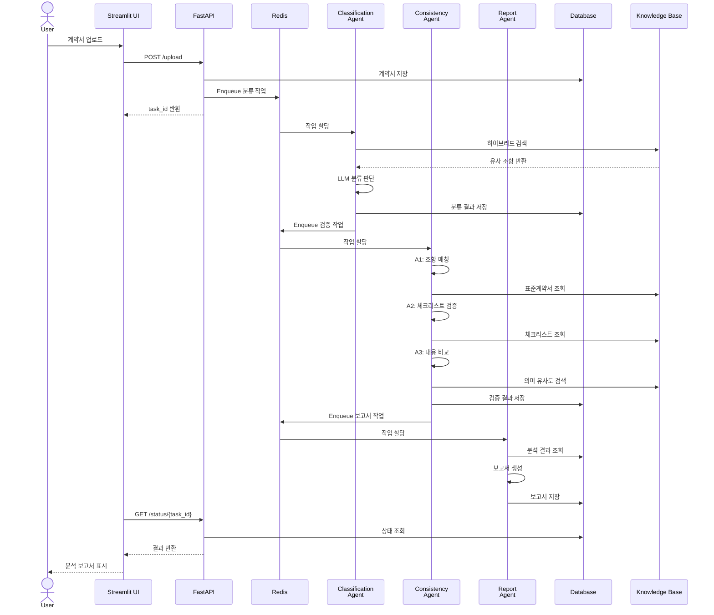
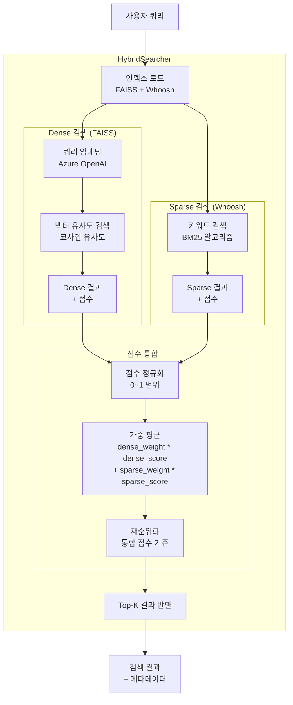
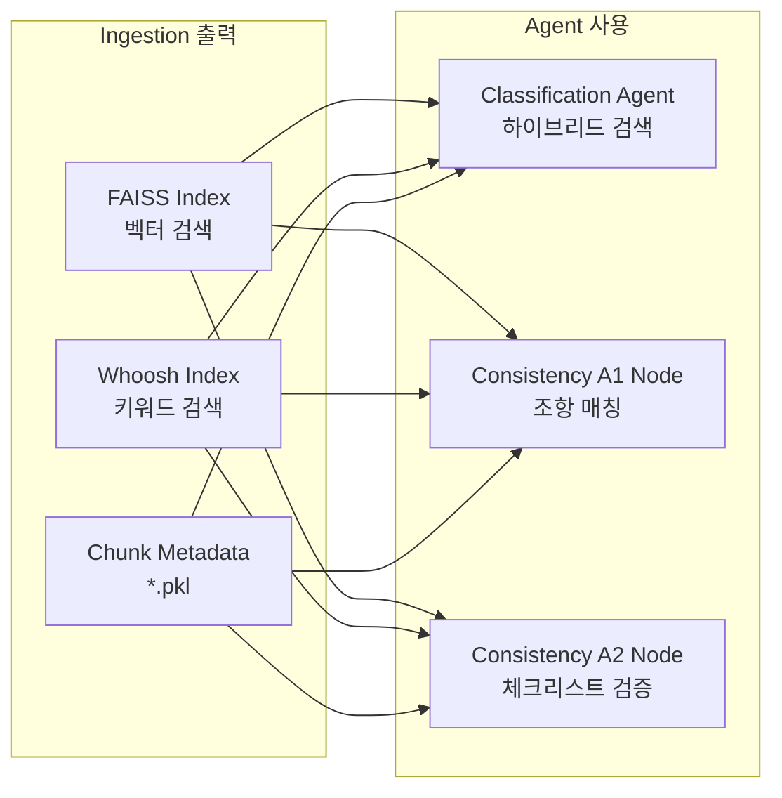

# 시스템 아키텍처 다이어그램

## 전체 시스템 구조


## 문서 처리 파이프라인


## 사용자 계약서 분석 플로우



## Classification Agent 내부 구조


## Consistency Agent 내부 구조


## 데이터 플로우


## Docker 컨테이너 구조


## 기술 스택 레이어


## A1 Node 상세 플로우 (조항 매칭)

```mermaid
flowchart TD
    START([A1 Node 시작])
    
    subgraph "입력 데이터 준비"
        LOAD_USER[사용자 계약서 로드<br/>parsed JSON]
        LOAD_INDEX[Ingestion 인덱스 로드<br/>분류된 유형의 표준계약서]
        PREP[매칭 대상 조항 준비]
    end
    
    subgraph "1차 매칭: 하이브리드 검색"
        LOOP_START{모든 사용자<br/>조항 처리?}
        GET_ARTICLE[다음 조항 가져오기]
        VECTOR[벡터 검색<br/>FAISS 인덱스 쿼리]
        KEYWORD[키워드 검색<br/>Whoosh 인덱스 쿼리]
        HYBRID[하이브리드 점수 계산<br/>가중 평균]
        THRESHOLD{유사도 ≥<br/>임계값?}
        MATCH_FOUND[매칭 성공<br/>표준 조항 연결]
        NO_MATCH[매칭 실패<br/>누락 목록 추가]
    end
    
    SAVE_JSON[article_mapping.json 저장<br/>matched + missing + extra]
    
    subgraph "출력 데이터 구조"
        OUTPUT["
        {
          matched: [
            {user_article, std_article, score}
          ],
          missing: [
            {user_article, reason}
          ],
          extra: [
            {std_article, reason}
          ]
        }
        "]
    end
    
    TRIGGER_A2A3[A2/A3 Node 트리거<br/>article_mapping.json 기반]
    
    subgraph "누락 조항 재검증 (병렬)"
        CHECK_MISSING{누락 조항<br/>존재?}
        LOOP_MISSING{모든 누락<br/>조항 처리?}
        GET_MISSING[다음 누락 조항]
        LLM_VERIFY[LLM 재검증<br/>맥락 기반 판단]
        LLM_DECISION{LLM 판단<br/>결과}
        REMAP[표준 조항 재매칭]
        CONFIRM_MISSING[누락 확정]
        REVERIFY_DONE[재검증 완료]
    end
    
    NOTE[A2/A3는 matched만 사용<br/>missing/extra는 A1에서만 처리]
    
    END([A1 Node 완료])

    START --> LOAD_USER
    LOAD_USER --> LOAD_INDEX
    LOAD_INDEX --> PREP
    PREP --> LOOP_START
    
    LOOP_START -->|No| GET_ARTICLE
    GET_ARTICLE --> VECTOR
    GET_ARTICLE --> KEYWORD
    VECTOR --> HYBRID
    KEYWORD --> HYBRID
    HYBRID --> THRESHOLD
    
    THRESHOLD -->|Yes| MATCH_FOUND
    THRESHOLD -->|No| NO_MATCH
    
    MATCH_FOUND --> LOOP_START
    NO_MATCH --> LOOP_START
    
    LOOP_START -->|Yes| SAVE_JSON
    SAVE_JSON --> OUTPUT
    OUTPUT --> TRIGGER_A2A3
    TRIGGER_A2A3 --> NOTE
    
    SAVE_JSON --> CHECK_MISSING
    
    CHECK_MISSING -->|Yes| LOOP_MISSING
    CHECK_MISSING -->|No| END
    
    LOOP_MISSING -->|No| GET_MISSING
    GET_MISSING --> LLM_VERIFY
    LLM_VERIFY --> LLM_DECISION
    
    LLM_DECISION -->|매칭 가능| REMAP
    LLM_DECISION -->|누락 확정| CONFIRM_MISSING
    
    REMAP --> LOOP_MISSING
    CONFIRM_MISSING --> LOOP_MISSING
    
    LOOP_MISSING -->|Yes| REVERIFY_DONE
    REVERIFY_DONE --> END
    
    NOTE --> EN

## A2/A3 Node의 A1 결과 활용

```mermaid
flowchart LR
    subgraph "A1 출력"
        A1_OUT[article_mapping.json<br/>matched + missing + extra]
    end
    
    subgraph "A2 Node: 매칭된 조항만 처리"
        A2_READ[매칭 결과 읽기]
        A2_FILTER[matched 조항만 필터링<br/>missing/extra 무시]
        A2_LOAD[체크리스트 로드<br/>Ingestion 인덱스]
        A2_CHECK[매칭된 조항 기준<br/>체크리스트 검증]
    end
    
    subgraph "A3 Node: 매칭된 조항만 처리"
        A3_READ[매칭 결과 읽기]
        A3_FILTER[matched 조항만 필터링<br/>missing/extra 무시]
        A3_PAIR[조항 쌍 생성<br/>user ↔ standard]
        A3_COMPARE[쌍별 내용 비교<br/>의미 차이 분석]
    end
    
    A1_OUT --> A2_READ
    A1_OUT --> A3_READ
    
    A2_READ --> A2_FILTER
    A2_FILTER --> A2_LOAD
    A2_LOAD --> A2_CHECK
    
    A3_READ --> A3_FILTER
    A3_FILTER --> A3_PAIR
    A3_PAIR --> A3_COMPARE
    
    style A2_FILTER fill:#e1f5ff
    style A3_FILTER fill:#e1f5ff
```

## 데이터 흐름: A1 → A2/A3


## Ingestion Pipeline 상세 아키텍처

### Ingestion 전체 구조


### Ingestion 파이프라인 플로우


### 파서 모듈 구조


### 청커 모듈 구조


### 임베딩 및 인덱싱 플로우


### 하이브리드 검색 구조



### Ingestion 디렉토리 구조


### Ingestion 실행 모드


### 데이터 흐름: Ingestion → Agents


