# 시스템 아키텍처 다이어그램

## 전체 시스템 아키텍처

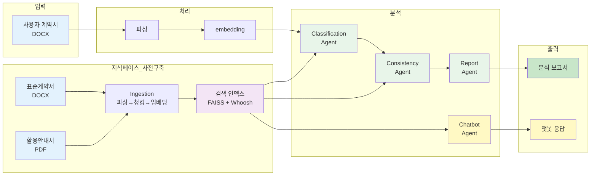

## 데이터 처리 파이프라인

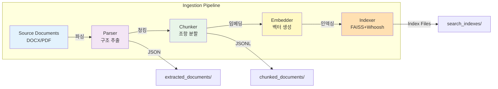

## 사용자 계약서 처리 플로우

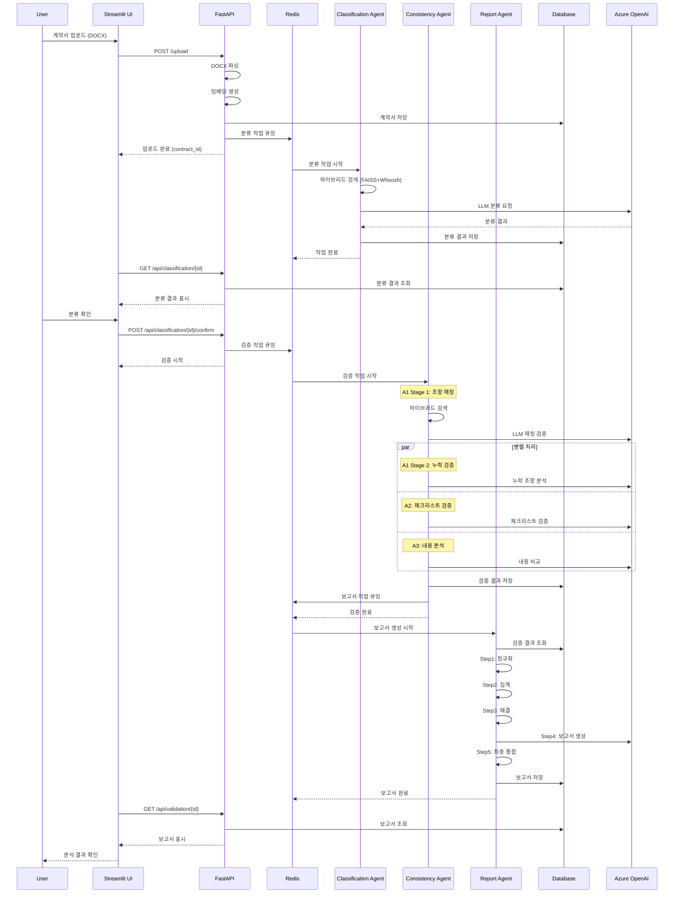

## Consistency Agent 상세 아키텍처

### 전체 플로우

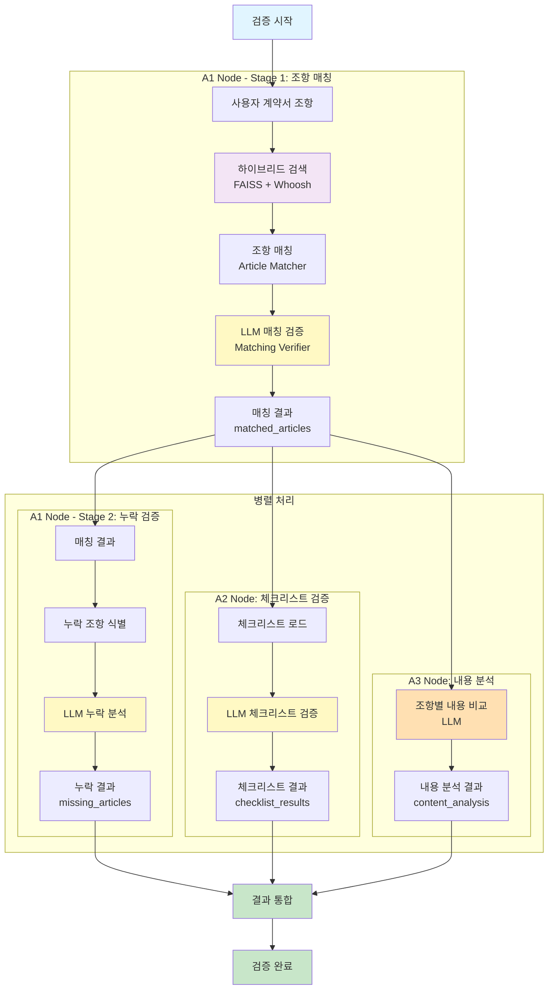

### A1 Node 상세 구조

```mermaid
graph LR
    subgraph "A1 Stage 1: 조항 매칭"
        INPUT1[사용자 조항]
        
        subgraph "Article Matcher"
            EMBED1[조항 임베딩]
            HYBRID1[하이브리드 검색<br/>Top-K 후보]
            SCORE1[유사도 점수 계산]
        end
        
        subgraph "Matching Verifier"
            LLM1[LLM 매칭 검증<br/>GPT-4]
            FILTER1[신뢰도 필터링]
        end
        
        OUTPUT1[매칭된 조항 쌍]
    end
    
    subgraph "A1 Stage 2: 누락 검증"
        INPUT2[표준계약서 조항 목록]
        COMPARE2[매칭 결과와 비교]
        MISSING2[누락 조항 추출]
        LLM2[LLM 누락 분석<br/>GPT-4]
        OUTPUT2[누락 조항 + 이유]
    end
    
    INPUT1 --> EMBED1
    EMBED1 --> HYBRID1
    HYBRID1 --> SCORE1
    SCORE1 --> LLM1
    LLM1 --> FILTER1
    FILTER1 --> OUTPUT1
    
    OUTPUT1 --> INPUT2
    INPUT2 --> COMPARE2
    COMPARE2 --> MISSING2
    MISSING2 --> LLM2
    LLM2 --> OUTPUT2

    style HYBRID1 fill:#f3e5f5
    style LLM1 fill:#fff9c4
    style LLM2 fill:#fff9c4
    style OUTPUT1 fill:#e8f5e9
    style OUTPUT2 fill:#e8f5e9
```

### A2 Node 상세 구조

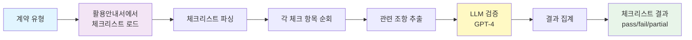

### A3 Node 상세 구조

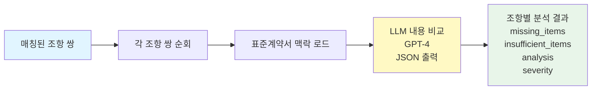

### 하이브리드 검색 구조

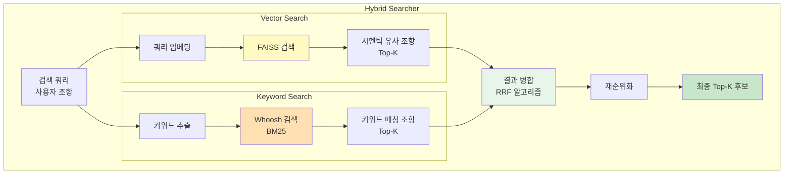

## Report Agent 처리 단계

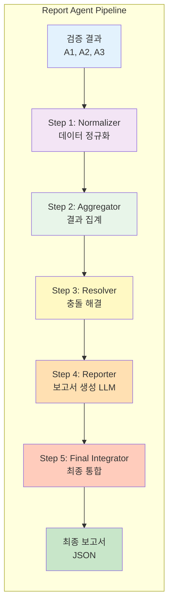

## 지식베이스 구조

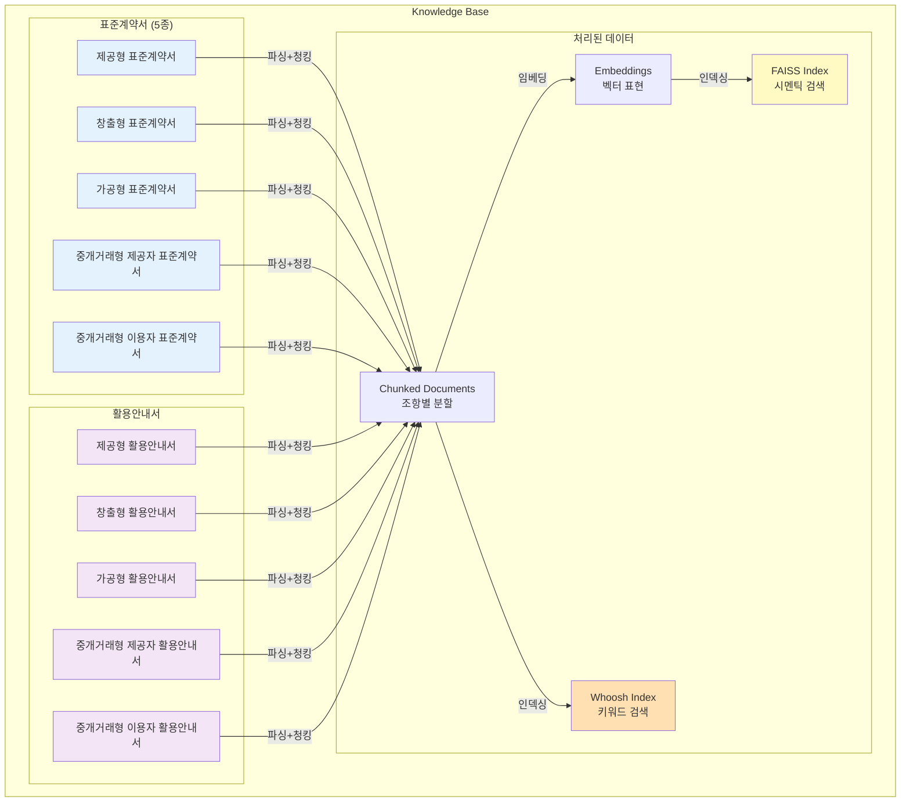

## Docker 컨테이너 구성

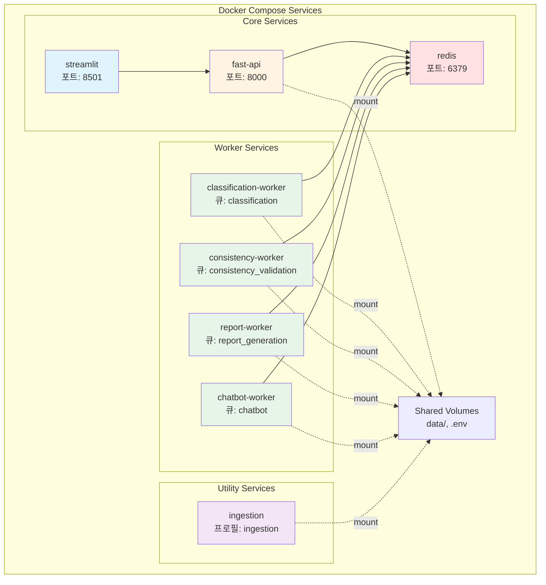

## 기술 스택 레이어

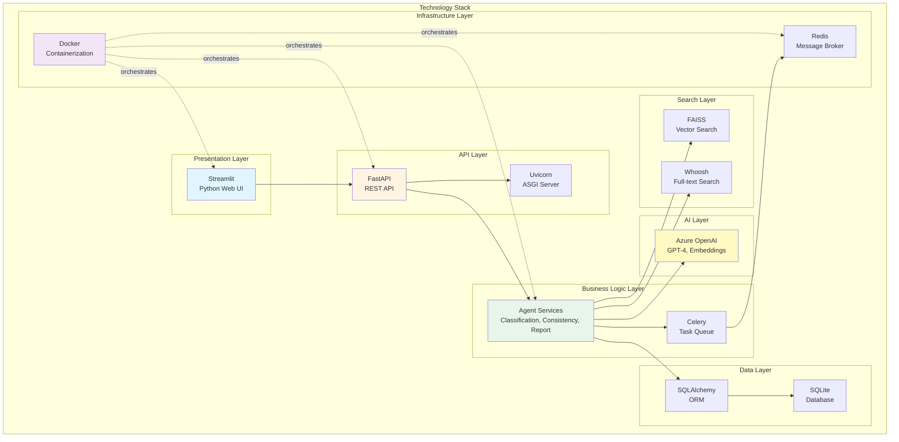
